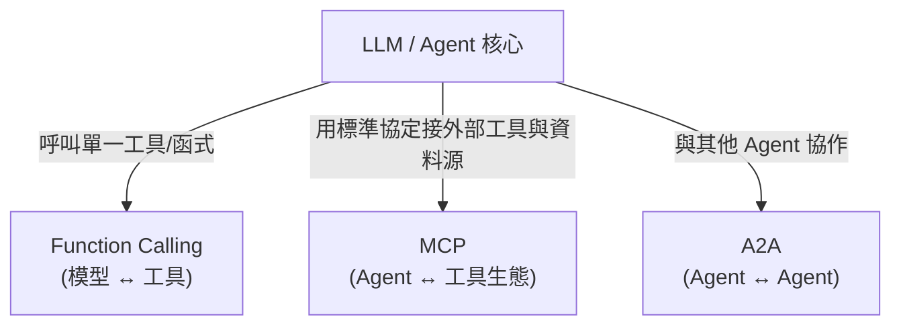

# AI Agent 三大核心技:Function Calling、MCP、A2A

**主題分類:** AI / Agentic Engineering(代理工程)
**來源:** YouTube 影片〈AI Agent 三大核心技:Function Calling、MCP、A2A〉(2026-03-11,約 16 分)
**整理日期:** 2026-05-25

> ⚠️ **非逐字稿說明:** 此影片未提供任何字幕/自動字幕(已用 node JS runtime + youtube-transcript-api + yt-dlp 雙重確認)。以下內容依 **影片標題主軸 + 業界既有知識** 還原這三項技術的核心概念,非影片逐字內容。

---

## 1. 三者的定位:Agent 對外連接的三個層次

可以理解成由內而外的三圈:**Function Calling**(讓模型會用一個工具)→ **MCP**(讓模型用統一協定接上一整個工具/資料生態)→ **A2A**(讓多個 Agent 彼此溝通協作)。

---

## 2. Function Calling(函式呼叫)

- **是什麼:** 模型依使用者意圖,輸出 **結構化的函式呼叫**(函式名 + JSON 參數),由外部程式實際執行後把結果回饋給模型。
- **重點:** 本質是「要模型以特定 schema 輸出資料」,不是模型自己去執行——呼應 [[12-factor-agents]] 的 Factor 1/4「工具只是結構化輸出」。
- **流程:** 開發者定義工具 schema → 模型判斷要不要呼叫、帶什麼參數 → 程式執行 → 結果回傳上下文 → 模型據此產生最終回應。

## 3. MCP(Model Context Protocol)

- **是什麼:** 一套 **開放標準協定**,把「模型 ↔ 外部工具/資料源」的接法標準化,讓任何相容的工具(MCP server)都能即插即用,免去每個工具都客製整合。
- **解決的問題:** Function Calling 是「點對點」綁定;MCP 把它升級成「**有共同協定的生態**」——一次接好,多個 Agent / 客戶端都能重用同一批 server。
- **組成:** MCP host/client(如 Claude Code、各種 IDE)透過協定連到 MCP server(檔案系統、資料庫、API、瀏覽器…),server 對外暴露 tools / resources / prompts。
- 與 [[awesome-agentic-ai-zh-roadmap]] 提到的「62 個 MCP/Skill 目錄」、Stage 8「Agent Interfaces」直接相關。

## 4. A2A(Agent-to-Agent)

- **是什麼:** **Agent 之間互相溝通與協作** 的協定/模式。讓不同來源、不同能力的 Agent 能互相發現、委派任務、交換結果。
- **解決的問題:** 單一全能 Agent 不可靠;改用多個 **小型聚焦 Agent**(呼應 [[12-factor-agents]] Factor 10、[[nexus-time-series]] 的四代理分工)分工協作,需要一套跨 Agent 的對話/任務交付標準。
- **典型場景:** 一個「協調者」Agent 把子任務分派給專職 Agent(檢索、編碼、審查…),再彙整結果。

---

## 5. 一句話總結

> **Function Calling** 讓模型「會用工具」、**MCP** 讓工具「即插即用成生態」、**A2A** 讓多個 Agent「彼此協作」——三者疊起來就是現代 Agent 從「單體」走向「系統」的骨幹。

---

## 6. 應用案例:同一個「查天氣的旅遊助理」,三種層次

- **只有 Function Calling:** 你自己定義一個 `get_weather(city)` 函式給模型;使用者問「東京天氣?」→ 模型輸出 `get_weather("Tokyo")`,你的程式呼叫氣象 API、把結果餵回 → 模型回答。**綁死你寫的那一個工具。**
- **升級到 MCP:** 改接一個現成的「天氣 MCP server」+「行事曆 MCP server」+「檔案 MCP server」;同一個助理(MCP host,如 Claude Code)即插即用這三個 server,不必為每個服務各寫整合。換一個相容 client 也能重用同一批 server。
- **再到 A2A:** 規劃一趟旅行時,「協調者 agent」把任務拆給 **專職 agent**——查機票的、查天氣的、排行程的——各自完成再彙整。對應 [[nexus-time-series]] 的四代理分工與 [[12-factor-agents]] F10「小型聚焦代理」。

> 一句話:**先讓模型會用一個工具(FC)→ 讓工具變成即插即用生態(MCP)→ 讓多個 agent 互相協作(A2A)**,正是 [[zero-person-ai-company]] 那種「AI 公司」能運作的底層協定。

---

## 來源

- [YouTube:AI Agent 三大核心技:Function Calling、MCP、A2A](https://youtu.be/PyctX9GQjXs)(非逐字稿,僅標題與既有知識還原)
