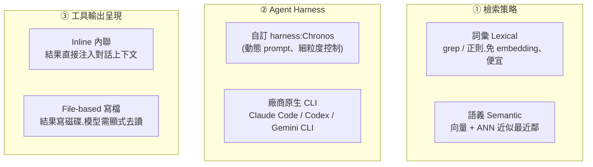

# Grep 就夠了嗎?Agent Harness 如何左右「代理式檢索」

**主題分類:** AI / Agentic Engineering(代理工程)× 檢索(RAG)
**研究對象:** 論文〈Is Grep All You Need? How Agent Harnesses Reshape Agentic Search〉(arXiv:2605.15184v1,2026-05-14;作者皆來自 PwC US:Sahil Sen、Akhil Kasturi、Elias Lumer、Anmol Gulati、Vamse Kumar Subbiah)
**整理日期:** 2026-05-26

---

## 1. 核心問題與一句話結論

大家都在 agent 裡用 RAG,但很少有人系統性地比較:**詞彙檢索(grep)vs 語義檢索(向量)** 的優劣,會怎麼被 **「哪種 agent harness」** 與 **「工具輸出怎麼呈現給模型」** 影響。

> **一句話結論:檢索策略的好壞不是孤立決策。** grep 與向量各自優化 **不同的失敗模式**,而它們的相對表現 **強烈取決於** ① agent 編排層(prompt、工具定義、結果格式)② 工具輸出的傳遞路徑(inline vs 寫檔)。**即使語料完全相同,換一個 CLI harness 造成的差異可達 16 個百分點——跟「換檢索器」一樣大。**

---

## 2. 三個被交叉測試的維度

---

## 3. 實驗設定

- **基準:** LongMemEval 的 **116 題子集**(長記憶對話 QA),六類問題:知識更新、多會話、單會話助手/偏好/使用者、時間推理。
- **前處理:** 用 Chronos pipeline 抽出「時間結構化事件」(對話逐字稿 + 時間資訊配對)。
- **評分:** 用 **GPT-4o 當裁判** 做二元判斷,固定裁判/模板/解碼設定。
- **受測模型:** Claude Opus 4.6、Claude Haiku 4.5、GPT-5.4、Gemini 3.1 Pro、Gemini 3.1 Flash-Lite。

---

## 4. 主要結果

### 實驗一:檢索 × harness × 工具呼叫方式

- **Inline 模式下,grep(詞彙)明顯佔優:**
  - Chronos + Claude Opus 4.6:inline grep **93.1%** vs inline 向量 83.6%。
  - Chronos + Gemini 3.1 Flash-Lite:grep **86.2%** vs 向量 62.9%(差距最大)。
- **改成 File-based(寫檔)會逆轉結論:** 向量在 5 個 harness-model 組合中反超 grep。
  - Codex + GPT-5.4:grep 從 inline 的 93.1% **暴跌到 file-based 55.2%**,向量 file-based 67.2%。
- **換 harness 的影響 ≈ 換檢索器:** 同一個 Claude Opus 4.6,在 Chronos vs Claude Code 之間差約 **16 個百分點**。

### 實驗二:語料變大、雜訊增加(s5 → s10 → s20 → s30 → full)

- **非單調:** 表現不隨會話數單調下降。例 Chronos Opus(詞彙):s5 89.3% → s20 **90.5%** → s30 85.3% → full 89.7%;Claude Code Opus 在 s20 達峰 **95.7%**。
- **檢索優勢不一致:** Claude Code 上詞彙持續領先;但 **Gemini CLI + Gemini 3.1 Pro 反而向量一路領先**(full:向量 89.7% vs grep 78.5%);Chronos 則出現交叉。
- **雜訊反應不同:** **詞彙=精準但對措辭敏感**(換個說法就漏);**向量=寬鬆但易被「語義相關的分心項」誤導**。

---

## 5. 三大貢獻 / 限制

**貢獻:** ① 證明「檢索-harness-呈現」三者交互(inline grep 在 LongMemEval 一致佔優,但 file-based 會翻盤)② 刻畫「雜訊-規模」的 **非單調** 行為(取決於 harness 與主幹模型,而非單純語料大小)③ 量化「即使語料相同,跨 CLI 堆疊差異可達 16pp」。

**限制:** 結論限於 **長記憶對話 QA**(科學合成、視覺文件、程式語義等領域 grep 未必佔優);只用 116 題子集;Codex 向量的中間會話設定數據待補;只觀察行為、未在查詢/檢索集層級隔離因果。

---

## 6. 應用案例:替一個「長記憶聊天助理」選檢索方案

**情境:** 你在做一個記得使用者長期偏好的 AI 助理,煩惱「上 grep 還是上向量資料庫」。這篇論文的可落地建議:

- **若你用 Claude Code / 自訂 harness,且能把檢索結果 inline 注入上下文** → **先用 grep**:免 embedding、便宜、在這類對話 QA 上反而更準(93.1% vs 83.6%)。呼應 [[markdown-agent-memory]]「<1000 檔先用 grep/ripgrep」與 [[ai-harness-explained]]「harness 決定一切」。
- **若你的 harness 把工具輸出寫檔再讓模型去讀(file-based)** → 別預設 grep 還是贏,**要實測**;這種模式下向量常反超,且 Codex 上 grep 會崩到 55%。
- **若你綁定 Gemini 生態** → 向量可能才是對的(Gemini CLI 上向量一路領先)。
- **務必在「你自己的 harness + 模型 + 呈現方式」上跑基準**,不要照搬別人的「grep vs 向量」結論——換堆疊的影響跟換檢索器一樣大。
- **想更穩** → 走 **混合檢索**(grep 補向量的措辭敏感、向量補 grep 的語義漏接),正是論文呼籲的方向(對照 [[markdown-agent-memory]] 的「向量 + BM25 混合」)。

> 一句話:**「該用 grep 還是向量」沒有通用答案;先確定你的 harness 與輸出呈現方式,再用自己的資料量測。**

---

## 來源

- [arXiv:2605.15184v1 — Is Grep All You Need? How Agent Harnesses Reshape Agentic Search](https://arxiv.org/html/2605.15184v1)
