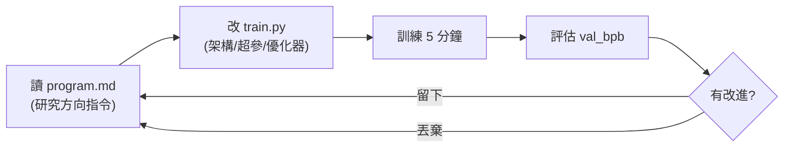

# Karpathy 的 autoresearch:讓 AI agent 自主做 ML 研究的最小 harness

**主題分類:** AI / Agentic Engineering(代理工程)
**研究對象:** [karpathy/autoresearch](https://github.com/karpathy/autoresearch)(Andrej Karpathy)
**內容性質:** 已 `git clone` 讀完整原始碼(`program.md` / `prepare.py` / `train.py`)後整理
**整理日期:** 2026-05-25

---

## 1. 是什麼

一個實驗性專案,目標是 **「給 AI agent 一個真實但小規模的 LLM 訓練設置,讓它自主做實驗」**。願景:讓 agent 在 **無人監督** 下自動研究——改程式、訓練模型、評估改進、**留下或丟棄** 實驗,如此循環往復。

> 它本質上是一個 **autonomous research agent 的 harness**:人類設好框架與約束,agent 在裡面跑科學研究循環,而非傳統的人工逐次調參。(可對照 [[ai-harness-explained]] 對 harness 的定義。)

---

## 2. 三個關鍵檔案

| 檔案 | 角色 | 可否被改 |
|---|---|---|
| **`prepare.py`** | 固定常數、一次性資料準備(下載資料、訓練 BPE 分詞器)、執行期工具(data loader、評估) | **不被修改** |
| **`train.py`** | 完整 GPT 模型、優化器(**Muon + AdamW**)、訓練迴圈——架構/超參/優化器/batch size 全可改 | **唯一被 agent 編輯的檔案** |
| **`program.md`** | 給 agent 的指令文件(人類撰寫並迭代),指導研究方向;agent 當成「超輕量 skill」讀取 | 人類維護 |

其餘:`pyproject.toml`(依賴)、`analysis.ipynb`(分析)。授權 **MIT**。

### `program.md` 其實是「自主研究迴圈規格」(讀原始碼後修正)
影片把 `program.md` 講成「研究方向指令」,但讀原始碼後發現它更像 **一份給 agent 的完整 SOP**,明確規定:
- **每次跑在獨立分支**:`git checkout -b autoresearch/<tag>`,第一次一定先跑 baseline。
- **結果記到 `results.tsv`**(Tab 分隔,5 欄:`commit / val_bpb / memory_gb / status / description`,status = `keep`/`discard`/`crash`),且 **不要 commit 這個檔**。
- **保留/丟棄規則**:`val_bpb` 變低就 **保留並推進分支**;持平或變差就 `git reset` 回去。
- **簡潔優先**:同等效果下,刪程式換到相同或更好結果是「簡化勝利」;為了 0.001 改進加 20 行醜程式不值得。
- **NEVER STOP**:設定完成後 **不准停下來問人類「要不要繼續」**——人類可能在睡覺,agent 要一直跑到被手動中斷;沒點子就「想得更努力」(讀程式裡引用的論文、重讀檔案、組合過去的近似成功、嘗試更激進的架構)。

---

## 3. 設計約束(精髓)

- **固定時間預算:** 每次訓練 **正好 5 分鐘**(不含啟動/編譯),確保實驗 **可直接比較**。預期約 **12 次實驗/小時、一個晚上睡覺約 100 次**。
- **單一指標:** `val_bpb`(驗證集 bits per byte),**越低越好**,且 **獨立於詞表大小**。
- **自給自足:** 只依賴 PyTorch 與少數小套件;**單 GPU、單檔案、單指標**,避開分散式訓練的複雜度。
- **單檔修改:** 只改 `train.py`,讓作用域可控、diff 可審查。



---

## 4. 使用流程

需求:NVIDIA GPU、Python 3.10+、`uv` 套件管理器。

```bash
curl -LsSf https://astral.sh/uv/install.sh | sh   # 裝 uv
uv sync                                            # 裝依賴
uv run prepare.py                                  # 資料準備(約 2 分鐘)
uv run train.py                                    # 單次實驗(約 5 分鐘)
```

**跑 agent:** 把 Claude 或 Codex 指向這個 repo,提示如「看一下 `program.md` 並啟動新實驗」,agent 便自主執行實驗循環。

---

## 4.5 `train.py` 原始碼深入(agent 可動的全部)

這支是從 Karpathy 的 **nanochat** 精簡來的單檔訓練腳本(約 630 行),agent 能改的就是這裡。重點實作:

- **模型(`GPT`/`Block`/`CausalSelfAttention`/`MLP`):** 帶 **RoPE 旋轉位置編碼**、**RMSNorm**、**GQA**(`n_kv_head`)、**Value Embedding**(`has_ve()`:奇偶交替、最後一層必有)、**滑動窗注意力**(`WINDOW_PATTERN="SSSL"`:S=半個 context、L=全 context),注意力走 **FlashAttention-3**(Hopper 用 `varunneal/flash-attention-3`,否則 `kernels-community/flash-attn3`)。
- **優化器 `MuonAdamW`(混合):** 矩陣參數用 **Muon**(`MATRIX_LR=0.04`、cautious weight decay),embedding/unembedding/scalar 用 **AdamW**(`EMBEDDING_LR=0.6`、`UNEMBEDDING_LR=0.004`、`SCALAR_LR=0.5`、`betas=(0.8,0.95)`);step 用 `@torch.compile` 融合。
- **以「時間」而非「步數」為終點的訓練迴圈:**

```python
while True:
    for micro_step in range(grad_accum_steps):      # 梯度累積
        with autocast_ctx: loss = model(x, y)
        (loss / grad_accum_steps).backward()
        x, y, epoch = next(train_loader)
    progress = min(total_training_time / TIME_BUDGET, 1.0)  # 0→1
    # 依 progress 調 LR(warmdown 0.5)、Muon momentum、weight decay …
    optimizer.step(); model.zero_grad(set_to_none=True)
    if math.isnan(train_loss_f) or train_loss_f > 100:  # 爆掉就快速失敗
        print("FAIL"); exit(1)
    if step > 10: total_training_time += dt   # 前 10 步不計(扣掉編譯時間)
    if step > 10 and total_training_time >= TIME_BUDGET: break  # 滿 5 分鐘收工
```

- **關鍵超參(都在 `train.py` 頂部,agent 隨意改):** `DEPTH=8`、`ASPECT_RATIO=64`(`model_dim = depth*64`)、`HEAD_DIM=128`、`TOTAL_BATCH_SIZE=2**19`(約 524K tokens/步)、`DEVICE_BATCH_SIZE=128`(OOM 就降)。
- **評估(在唯讀的 `prepare.py`,是「真理」):** `evaluate_bpb()` 回傳 `total_nats / (math.log(2) * total_bytes)` —— 即 **bits per byte**,因為分母是「位元組數」而非 token 數,所以 **跨不同詞表大小仍可公平比較**。
- 還有兩個務實小技巧:`step==0` 後 `gc.disable()`(Python GC 會造成約 500ms 卡頓)、用 `\r` 單行刷新 log 避免洗版。

---

## 4.6 應用案例:一次完整的實驗迭代長怎樣

假設 agent 想驗證「**把 Muon 的 matrix LR 從 0.04 調到 0.05**」:

1. 確認在分支 `autoresearch/may26`,當前 baseline `val_bpb=0.9979`。
2. 直接改 `train.py`:`MATRIX_LR = 0.05`。
3. `git commit -m "raise matrix LR to 0.05"`。
4. 跑 `uv run train.py > run.log 2>&1`(輸出導到檔案,**不洗進 agent 的 context**)。
5. `grep "^val_bpb:\|^peak_vram_mb:" run.log` → 例如 `val_bpb: 0.9942`。
6. 變低了 → **保留**,在 `results.tsv` 記一行 `<hash>  0.994200  44.1  keep  raise matrix LR to 0.05`,分支推進。
7. 若 grep 是空的代表 crash → `tail -n 50 run.log` 看 stack trace;笨錯(typo/缺 import)就修好重跑,想法本身壞掉就記 `crash` 跳過。
8. 回到步驟 2,換下一個點子(例如改激活函數、加層、調 batch size)——**永不主動停**。

> 這就是「**人類睡覺、agent 整夜跑約 100 次實驗,早上起來看成果**」的具體運作方式。

---

## 5. 小算力調校(Macbook 等)

Karpathy 建議:用低熵資料集(如 TinyStories)、降 `vocab_size`(8192→1024 或 256)、降 `MAX_SEQ_LEN`(→256)、降 `EVAL_TOKENS`、減 `DEPTH`、把 `WINDOW_PATTERN` 從 `SSSL` 改成 `L`、大幅降 `TOTAL_BATCH_SIZE`(維持 2 的次方)。

> 平台:主要支援 NVIDIA 單 GPU(H100 測試);社群有 MacOS / Windows / AMD 的 fork。

---

## 6. 概念意義

這是「**自主 AI 研究代理**」這個前沿概念的先驅實作:展示 AI 如何在 **人類設定的框架與約束** 下進行自動化科學研究。與 [[12-factor-agents]]「小型聚焦代理 + 明確控制流」、[[markdown-agent-memory]]「program.md 當輕量 skill / 指令文件」的理念一致。

---

## 來源

- [karpathy/autoresearch (GitHub)](https://github.com/karpathy/autoresearch)
