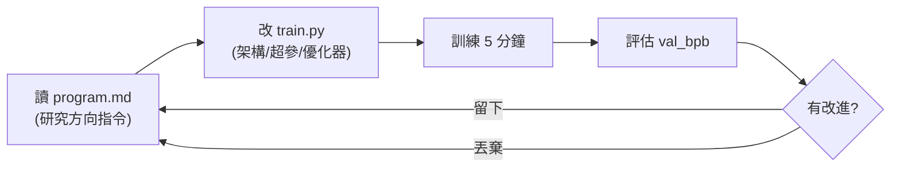

# Karpathy 的 autoresearch:讓 AI agent 自主做 ML 研究的最小 harness

**主題分類:** AI / Agentic Engineering(代理工程)
**研究對象:** [karpathy/autoresearch](https://github.com/karpathy/autoresearch)(Andrej Karpathy)
**整理日期:** 2026-05-25

---

## 1. 是什麼

一個實驗性專案,目標是 **「給 AI agent 一個真實但小規模的 LLM 訓練設置,讓它自主做實驗」**。願景:讓 agent 在 **無人監督** 下自動研究——改程式、訓練模型、評估改進、**留下或丟棄** 實驗,如此循環往復。

> 它本質上是一個 **autonomous research agent 的 harness**:人類設好框架與約束,agent 在裡面跑科學研究循環,而非傳統的人工逐次調參。(可對照 [[ai-harness-explained]] 對 harness 的定義。)

---

## 2. 三個關鍵檔案

| 檔案 | 角色 | 可否被改 |
|---|---|---|
| **`prepare.py`** | 固定常數、一次性資料準備(下載資料、訓練 BPE 分詞器)、執行期工具(data loader、評估) | **不被修改** |
| **`train.py`** | 完整 GPT 模型、優化器(**Muon + AdamW**)、訓練迴圈——架構/超參/優化器/batch size 全可改 | **唯一被 agent 編輯的檔案** |
| **`program.md`** | 給 agent 的指令文件(人類撰寫並迭代),指導研究方向;agent 當成「超輕量 skill」讀取 | 人類維護 |

其餘:`pyproject.toml`(依賴)、`analysis.ipynb`(分析)。授權 **MIT**。

---

## 3. 設計約束(精髓)

- **固定時間預算:** 每次訓練 **正好 5 分鐘**(不含啟動/編譯),確保實驗 **可直接比較**。預期約 **12 次實驗/小時、一個晚上睡覺約 100 次**。
- **單一指標:** `val_bpb`(驗證集 bits per byte),**越低越好**,且 **獨立於詞表大小**。
- **自給自足:** 只依賴 PyTorch 與少數小套件;**單 GPU、單檔案、單指標**,避開分散式訓練的複雜度。
- **單檔修改:** 只改 `train.py`,讓作用域可控、diff 可審查。



---

## 4. 使用流程

需求:NVIDIA GPU、Python 3.10+、`uv` 套件管理器。

```bash
curl -LsSf https://astral.sh/uv/install.sh | sh   # 裝 uv
uv sync                                            # 裝依賴
uv run prepare.py                                  # 資料準備(約 2 分鐘)
uv run train.py                                    # 單次實驗(約 5 分鐘)
```

**跑 agent:** 把 Claude 或 Codex 指向這個 repo,提示如「看一下 `program.md` 並啟動新實驗」,agent 便自主執行實驗循環。

---

## 5. 小算力調校(Macbook 等)

Karpathy 建議:用低熵資料集(如 TinyStories)、降 `vocab_size`(8192→1024 或 256)、降 `MAX_SEQ_LEN`(→256)、降 `EVAL_TOKENS`、減 `DEPTH`、把 `WINDOW_PATTERN` 從 `SSSL` 改成 `L`、大幅降 `TOTAL_BATCH_SIZE`(維持 2 的次方)。

> 平台:主要支援 NVIDIA 單 GPU(H100 測試);社群有 MacOS / Windows / AMD 的 fork。

---

## 6. 概念意義

這是「**自主 AI 研究代理**」這個前沿概念的先驅實作:展示 AI 如何在 **人類設定的框架與約束** 下進行自動化科學研究。與 [[12-factor-agents]]「小型聚焦代理 + 明確控制流」、[[markdown-agent-memory]]「program.md 當輕量 skill / 指令文件」的理念一致。

---

## 來源

- [karpathy/autoresearch (GitHub)](https://github.com/karpathy/autoresearch)
