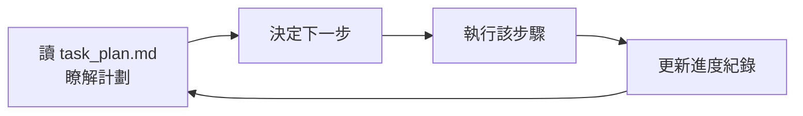

# AI Agent 記憶管理:有時候 Markdown 檔案就夠了

**主題分類:** AI / Agentic Engineering(代理工程)
**來源對象:** dev.to 文章〈AI Agent Memory Management: When Markdown Files Are All You Need〉(imaginex)
**整理日期:** 2026-05-25

---

## 1. 核心論點

Manus、OpenClaw、Claude Code 三個知名專案 **各自獨立收斂到同一個解法**:用 **單純的 Markdown 檔案** 當 agent 的記憶,而不是一開始就上向量資料庫。暗示「**記憶即文件(memory as documents)**」這個抽象,可能比業界假設的複雜基礎設施更務實——尤其在 **透明、可攜、使用者可控** 越來越重要的時代。

定位是「**務實的中庸之道**」:比複雜基礎設施簡單,又比純暫存記憶更有能力。

---

## 2. Agent 記憶的四種類型

| 類型 | 時長 | 實現方式 | 用途 |
|---|---|---|---|
| 短期 | 數分鐘 | 上下文窗口 | 追蹤對話線程 |
| 長期 | 無限期 | 向量 DB / SQL / **檔案** | 保留偏好與決策 |
| 程序 | 永久 | 動作食譜 | 習得的工作流程 |
| 工作 | 秒到分鐘 | 暫存板 | 思維鏈推理步驟 |

---

## 3. 檔案結構慣例

### 記憶層(Remembrance Layer)

- **`MEMORY.md`** — 長期精選知識:使用者偏好、關鍵決策與理由、習得教訓、標準程序。**每次對話都載入**,並在上下文壓縮前觸發「記憶刷新」。
- **`memory/YYYY-MM-DD.md`** — 時間戳日誌:按時間記錄活動/觀察。**最近(今天、昨天)自動載入**,舊的按需搜尋。
- **`task_plan.md`** — 工作記憶:追蹤當前任務目標、進度、上下文,防止長任務「目標漂移」。Manus 的三檔模式:`task_plan.md` + `notes.md` + 可交付成果。

### 個性化層(Personalization Layer)

- **`SOUL.md`** — 核心價值、決策原則、行為準則。
- **`IDENTITY.md`** — agent 公開身份、名稱、溝通風格。
- **`USER.md`** — 使用者檔案、技術背景、偏好。
- **模組化技能檔** — 按需載入特定能力文檔。

> 📌 **與本 repo 的關聯:** 這正是本 Knowledge 倉庫所用記憶機制的思想源頭——`MEMORY.md` 索引 + `memory/` 單一事實檔 + frontmatter 分類,對應這裡的「記憶層」。

---

## 4. 讀-決-行-更新循環(Manus)

---

## 5. 為什麼用 Markdown(優點)

- **持久性:** 記憶獨立於行程生命週期,崩潰不丟資料。
- **透明性:** 任何文字編輯器可讀可改,零摩擦的「人在迴路」。
- **版本控制:** 用 Git 管理,可提交、回滾、分支記憶。
- **整體上下文:** 精選總結 **優於 RAG 的片段檢索**。
- **可攜 / 可搜 / 便宜:** 標準 Markdown 無鎖定;grep/ripgrep 即用;本地磁碟約 $0.02/GB/月 vs 向量 DB $50–200/GB/月。

**局限:** 檔案超過約 5MB 難管理;線性讀取、無語義搜尋;大檔 I/O 可能成瓶頸。

---

## 6. 隨規模演進的搜尋策略

| 階段 | 適用規模 | 方法 |
|---|---|---|
| grep / ripgrep | < 1,000 檔 | 精確關鍵字、快速、免費、確定性 |
| BM25 全文搜尋 | 1,000–10,000 檔 | SQLite 內建 FTS,支援 AND/OR/NOT |
| 混合 向量 + BM25 | > 10,000 檔或需概念查詢 | OpenClaw:70:30(向量:BM25)、最低分數 0.35;召回率 89%(vs 純向量 76% / 純 BM25 68%) |

---

## 7. 與框架方案對比

| 方案 | 策略 | 持久化 | 最適用 |
|---|---|---|---|
| LangChain | 模組化組件 | 需手動接 DB | 多樣 RAG 工作流 |
| LangGraph | 圖持久化 | 內建線程級 | 複雜循環任務 |
| Google ADK | 記憶庫 | 完全託管 | GCP 上長期使用者上下文 |
| CrewAI | 統一多層 | 內建 SQLite/Chroma | 多 agent 協作 |
| OpenAI SDK | Threads API | 完全託管(黑箱) | 快速原型 |
| **Markdown** | 文件即記憶 | 本地/版本控制 | 本地 agent、高透明度需求 |

---

## 8. 實作建議(5 步驟)

1. 建 `MEMORY.md` 並給 agent 讀寫權。
2. 加上時間戳日誌(`memory/YYYY-MM-DD.md`)。
3. 加入基礎 grep/ripgrep 搜尋。
4. 定義 `SOUL.md` 確立人格與價值觀。
5. 為多步驟專案加任務規劃檔。

**進階:** Git 管理記憶、不同 agent 分目錄、共享知識庫、敏感資訊加密、**漸進式上下文披露**(只載入與當前任務相關的記憶,如 Claude Code 的技能系統)。

---

## 9. 戰略權衡

- **Markdown 最優:** 本地 agent、記憶有限且結構化。
- **資料庫最優:** 企業級、數百萬使用者檔案與歷史、需動態語義檢索(如客服 agent 在 RAG 管線中自動撈相關記憶注入系統提示,支援「這位使用者過去抱怨過類似問題嗎?」)。

> 呼應 [[12-factor-agents]](掌握上下文窗口)與 [[ai-harness-explained]](上下文工程是 harness 的核心組件)。

---

## 10. 應用案例:本 Knowledge 倉庫自己就是範例

這套「Markdown 即記憶」最貼身的應用案例,**就是你正在讀的這個 repo + 它的記憶系統**:

- `MEMORY.md`(本機 `~/.claude/.../memory/`)= 文中的 **長期精選層**,每次 session 啟動載入;一行一則指標。
- `memory/<slug>.md` 單一事實檔(含 frontmatter `type: user/feedback/project/reference`)= **精選知識** 的具體載體;例如本專案就用它記住了「每週日 06:30 整理 GitHub Weekly 的排程」「中文 commit 用無 BOM UTF-8」等。
- **Git 版本控制**(本 repo 直接 push 到 `main`)= 文中「可提交、回滾、分支記憶」的實踐。
- **grep/ripgrep 搜尋**(規模還小,<1000 檔)= 文中第一階段搜尋策略,完全夠用,還沒到要上 BM25/向量的規模。
- `CLAUDE.md` 的寫作慣例 = 文中「漸進式上下文披露 / 規則文件」,等同 agent 每次都讀的「程序記憶」。

> 換句話說:這篇筆記描述的架構,正是維護這份知識庫的 agent 每天在跑的東西——**先試 Markdown,真的撞到規模牆(>5MB、需語意搜尋)再考慮資料庫**。

---

## 來源

- [dev.to:AI Agent Memory Management — When Markdown Files Are All You Need](https://dev.to/imaginex/ai-agent-memory-management-when-markdown-files-are-all-you-need-5ekk)
