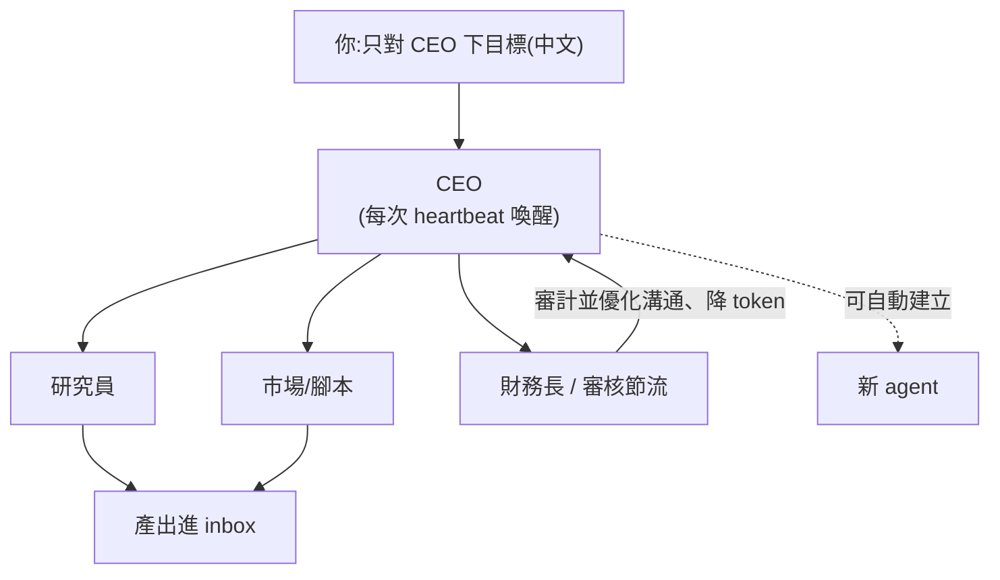

# 打造「0 人 AI 公司」:用 Hermes Agent + Paperclip 讓 AI 互相協作

**主題分類:** AI / Agentic Engineering(代理工程)
**來源:** YouTube 影片〈0人AI公司!你不能錯過的全自動創業?超點單上手!〉(酷可實驗室 Coocolab,2026-05-24,約 15 分;本筆記依繁中逐字稿整理)
**整理日期:** 2026-05-25

---

## 1. 概念

把「公司」做成一群會 **互相溝通協作的 AI agent**:你只對 **CEO** 下達目標,CEO 依職位把工作分派下去,還能 **自行招募(建立)新 agent**。整套可 **自動化、可自我提升、有記憶**(犯錯下次會改進)。可玩成你的「交易團隊」「無人廣告公司」等任意形狀。

兩個核心工具:

| 工具 | 角色 |
|---|---|
| **Hermes Agent** | 底層執行 agent,具 **自我升級** 能力、可 **遠端操作**(Telegram/Discord)、會自己找出更有效率的做事方式。 |
| **Paperclip** | 「公司介面平臺」,讓不同 agent 互相協作;你跟 CEO 講要做什麼,他安排職位、產出進 inbox。 |

> 與本 repo 關聯:這是 [[function-calling-mcp-a2a]] 講的 **A2A(agent 間協作)** 的具體消費級實作;省 token 的「財務長」角色則呼應 [[ai-token-saving]] 的 RTK 與 [[kv-cache]] 的成本觀。

---

## 2. 安裝流程

### Step 1 — 安裝 Hermes Agent
1. 開終端機(Terminal),貼上官網提供的安裝指令、按 Enter。
2. 它自動檢查環境(過程約 3–5 分鐘),中途問是否安裝相依套件就選「是」。
3. 選語言模型:**建議選第 4 個 Anthropic Claude**(也可用 ChatGPT 等)。
4. 提供 Anthropic **API Key**:可用 Claude Pro/Max 登入,或到 `platform.claude.com` 取一組 API key 貼上(貼上時不顯示)。
   - 模型建議用 **4.6**(相對便宜又不會太弱);越新越貴但效能越好。
5. 設定通訊方式(Telegram/Discord,可跳過)——用於在外面遠端發指令(如查 GitHub 代碼有沒有上傳/修正)。
6. 完成後在 Terminal 打 `Hermes` 啟動,**直接打中文** 下指令。
   - 範例:「截取 YouTube 酷可實驗室九張影片的圖片,合成一張 JPEG」→ 它自動做完並回傳檔案位置。

### Step 2 — 安裝 Paperclip
1. 從官網複製安裝指令(或 `npx` 那條)貼進 Terminal,問版本就按 `Y`。
2. 安裝後自動開網頁:設定 **公司名稱** 與 **目標(可打中文)**。
3. 連接 agent:預設是 Claude Code → 選 **More Agent Type** → 選剛裝的 **Hermes** → 選模型(較貴用 4.7)。
4. 生成你的 **CEO**。
5. 之後重開:Terminal 打 `npx paperclip ai run`。

---

## 3. 操作要點

- **組織架構:** CEO 之下可有研究員、風險控管、財務、市場調研、腳本/寫作等職位。對 CEO 說「我要招聘」,他會分析需要什麼組織架構並去找人。
- **語言:** 預設英文;點 CEO → **Assign Task** 告訴他「交流與最終報告用中文」,之後就會用中文回覆。
- **目標(Goals):** 新增目標後,agents 會朝目標推進。
- **心跳(Heartbeat):** 關著時 agent **不會動**,要「給他心跳」才動。
  - 到 **Configuration → Run Policy → `heartbeat on interval`**:設每隔幾分/幾秒觸動一次。例如每 30 分鐘 CEO「活起來」一次,去和組員溝通、檢查是否朝目標實作。
  - **`can create new agents` 一定要開:** CEO 才能依流程需要自動建立新職位的 agent 並排進組織圖。
  - **Set budget:** 可限制花費上限(例如 $30)。
- **暫停:** 按 `pause`(暫停 CEO 後它不再下指令,底下在跑的任務跑完回報即止)。
- **產出:** 最後成果進 **inbox**(像收信)。

---

## 4. 省錢與實務建議(重要)

- **多數 agent 不需要用最新模型**——用最新的 token 會燒很快。
- **先想清楚任務量:** 重任務(如回測某策略「過去一年 BTC 一分鐘 K 棒」)資料量巨大、極燒 token;生成腳本/文案、前段搜尋則還好。
- **務必招一位「審核節流人員(像財務長)」:** 審計 agent 之間的溝通並優化——若 CEO 與某 CMO 頻繁重複貼同一段文本,他會自動讓溝通更簡短不重複以省成本(影片示例:把冗長段落優化後總共 **減少 6,000 多行**)。
  - 招法:跟 CEO 說「招一位能優化團隊、減少 token 消耗的職位」,再讓他 **定期審核**(工作量大可每 3 小時一次)。
- **它不是聊天機器人:** 想聊天直接用 Claude/ChatGPT 更便宜;它的價值在 **AI 與 AI 協作的編排**,且你能看到事情如何被執行。
- **指令要明確、思路要清晰:** 錯誤指令來回修改會花很多代幣。

> 一句總結:很像在玩《模擬市民》,只是它 **會燒你的錢、同時產出有價值的產值**,團隊還會自己成長。

---

## 來源

- [YouTube:0人AI公司!你不能錯過的全自動創業?超點單上手!(酷可實驗室 Coocolab)](https://youtu.be/yLOtgJwjhZ8)
