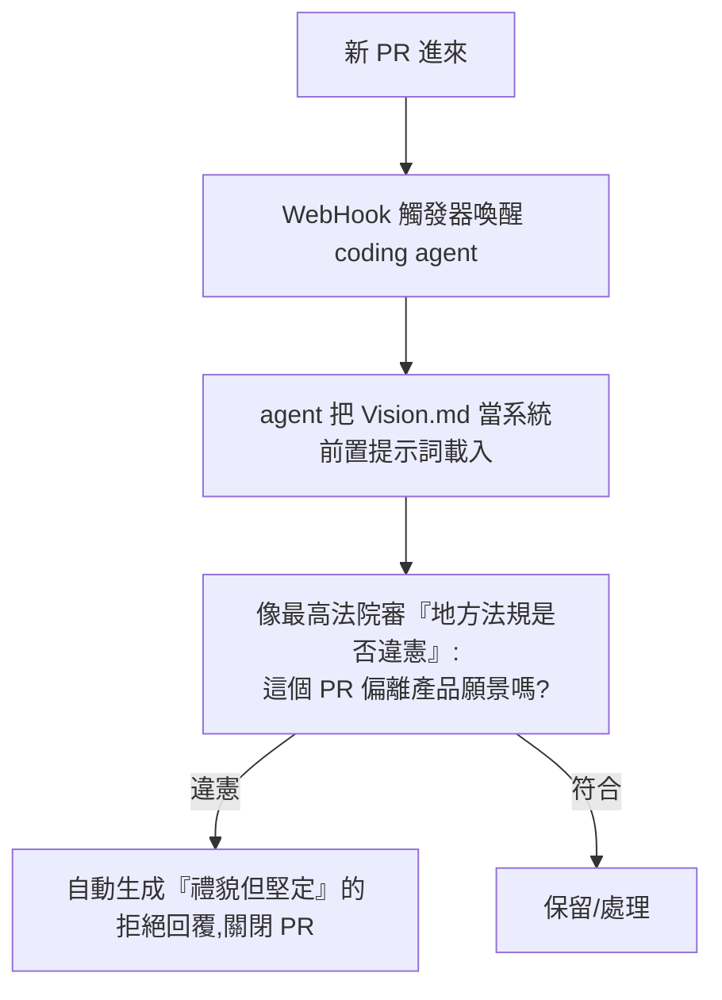

# 當 PR 變成 Prompt Request:Peter Steinberger 用 Agent 自製工具維護開源項目

> 來源:「wow」頻道拆解 Peter Steinberger 演講〈building the things that build the things〉(「構建那些用於構建事物的機器」)+ 2026 微軟 Build。**注意:搬運頻道的旁白是 AI 生成的浮誇風格(「光速野獸/物理燒毀處理器」等),且工具名是中文旁白的音譯、可能與實際不符;本筆記只保留 Steinberger 的核心理念,濾掉誇張修辭。** 核心問題:當全世界的人都用 AI 批量生成代碼丟進你的開源項目,一個維護者該如何用 AI「以子之矛攻子之盾」地治理?

> ⚠️ 部分手法(如繞過平台 API 速率限制)屬**灰色地帶**,僅作觀念參考,實作需自行確認平台條款與合規。

---

## 一句話總結

AI 讓「提交代碼」的成本趨近於零,於是 Steinberger 維護的開源項目湧入 **5000→15000 個** 用戶讓 AI 批量生成、自己看都沒看就丟來的 PR(「AI Slop / AI 泥漿」)。他的破局思維:**人類別再親自審代碼,而是寫一份自然語言的「最高憲法」(Vision.md)當 agent 的價值觀,讓 AI 自動審查、拒絕、排優先級**;並且**把任何讓自己「煩躁」的摩擦點都變成「為 AI 造一個工具」的契機**——因為**為 AI 造工具的收益是複利/指數級**(AI 會複用千萬次),而人類手寫代碼是線性的。

---

## 問題:AI Slop —— PR 變成「Prompt Request」

- 過去提 PR 是「我嘔心瀝血研究你的代碼、寫了優化請你 review」的人類社交行為;現在變成「有人對你的軟體不滿 → 對自己的 AI 丟一句模糊意圖(『加個暗黑模式』)→ AI 狂吐一堆又長又臭的代碼 → 用戶看都沒看就打包丟給你」。
- Steinberger 的重新定義:**Pull Request → Prompt Request**——這些代碼不是代碼,是一種**「意圖信號」**。
- **反直覺的態度**:收到一堆 AI 生成爛代碼**更抓狂**,因為「我的 AI 還得反向工程去讀懂你的 AI 當初想幹嘛、再幫你重構」=雙重浪費算力。**「你還不如直接丟一句話的原始需求給我,剩下讓我的 AI 來做。」**

---

## 解法一:Vision.md = Agent 的「最高憲法」

- 核心控制中樞不是複雜代碼,而是**一份純文本 Markdown(Vision.md)**,用**清晰的人類自然語言**寫下:項目絕對邊界、哪些功能絕不妥協(例:保持極簡輕量、絕不加區塊鏈噱頭、絕不讓軟體臃腫)、核心美學與哲學。
- 它是「**agent 的靈魂基底 / 最高行為準則**」。每次有新 PR,agent 帶著這本「憲法」審視——偏離願景的(如硬塞一個龐大本地資料庫進主打輕量的工具)就**自動生成禮貌但堅定的拒絕**並關閉,全程無人參與。靠這套自動分類維護了約 **15000 個** 請求。
- **人類角色的躍遷**:從「流水線上的工人」→「**整條流水線的設計師**」。Vision.md 是你在數位世界的**意志延伸**;**你提供戰略,AI 提供戰術執行**。

---

## 解法二:煩躁驅動開發(Frustration-Driven Development)

- **核心原則**:在未來的工作流裡,**任何讓你感到一絲摩擦/不夠喜歡的瞬間,就是你該停下來為 AI 構建新工具的地方**。「煩躁」成了系統級的報警信號——當**人類的高級注意力是唯一稀缺資源**時,任何打破深度心流的操作都不可容忍。
- **複利效應(關鍵心智)**:你解決一個看似微不足道的小痛點(如教系統穩定解析某種冷門混亂的日期格式),自己做只省幾秒;但**你的 AI 會在未來無數次生產/審查中複用這個方案千萬次**——
  > **人類手寫代碼的收益是線性的;為 AI 打造工具的收益是指數級爆炸的。** 今天花 5 小時「磨刀」,換來的是未來一年無數個 AI 分身毫無摩擦地全自動狂奔。
- **為 AI 造「專用接口」而非讓 AI 適應人類界面**:讓 AI 直接操作 Gmail/日曆效率極低,因為網頁是「為討好人類視覺」設計的、HTML 套疊極複雜,AI 會迷失。解法:造一個**純命令行、專為 AI 設計的後門接口**——AI 不需要好看的界面,只需要**純粹的結構化數據**。(同理還有「選中任意格式文本→自動解析出項目編號→直接開對應頁面」這種消除複製貼上摩擦的小工具。)

---

## 解法三:情緒感知的優先級排序

- 1 萬個真實需求裡,AI 怎麼知道哪個最緊急?只看 repo 客觀數據(關鍵詞次數)有滯後性。
- Steinberger 寫了個 **Discord 爬蟲**,讓 AI **閱讀社區海量聊天記錄、分析字裡行間的情緒張力**——當兩個資深用戶因某功能缺失激烈爭論(情緒激動到快吵起來),AI 瞬間理解這種**迫切性**,再與 Vision.md 邏輯匹配確認「這確實是該解決的核心問題」,把最痛的 5 個任務推送到桌面儀表盤。
- 等於擁有一個「**不知疲倦、情商極高的超級產品經理**」,每天早上把排好優先級的任務單靜靜放在桌上。

---

## 解法四:突破速率限制(⚠️ 灰色地帶)與沙盒隔離

- **速率限制問題**:AI 排查深層 bug 時瞬間交叉讀取數百檔案 + 5 年歷史提交,幾分鐘就耗盡 GitHub 給普通用戶的 **5000 次/小時 API 額度**,連接被切、自動化停擺。
- **他的繞法(灰色)**:在 **Cloudflare 邊緣節點**部署一個攔截器,讀取類請求動態把個人 token 換成「GitHub App 身份」(額度 **15000 次**)轉發,只有真正涉及**寫入/修改**的高敏感操作才切回個人真實身份。→ 突破平台速率限制讓 AI 盡情狂奔。(屬鑽規則縫隙,實作需評估條款風險。)
- **沙盒隔離(安全的必要)**:AI 一小時寫幾萬行,可能因幻覺寫出摧毀系統的代碼,無人核對不敢部署;而 AI 高並發測試曾把**本地 CPU 燒到觸發主板熔斷保護**、把租用的雲服務器請求到當機。解法是自建**雲端沙盒**:
  - 對一段邏輯**瞬間在雲端並發拉起 Windows / Linux / RedHat 三個獨立系統**同時測試,極限壓縮反饋循環。
  - 對最難自動化的**前端 UI**:接入 **WebVNC**,讓 AI 用**多模態視覺**像人類一樣「看畫面、移鼠標、點按鈕、打字」,在端到端環境裡真的體驗網頁好不好用——而非苦哈哈解析底層代碼。

---

## 應用案例 / 啟示

- **開源維護者面對 AI Slop**:別用血肉之軀對抗 AI 代碼洪流。寫一份 `Vision.md`(項目憲法)+ 一個 webhook agent 自動審 PR 是否「違憲」並禮貌關閉——把人類精力留給「定義願景」。
- **任何重度用 AI 的人**:把「煩躁/摩擦」當訊號,**值得做錯重來貴的、會反覆發生的事,就為 AI 造一個工具**(複利);呼應本庫 [[defining-tasks-not-prompts]](定義任務=管理)、[[claude-dynamic-workflows]](把任務交給編排)。
- **給 AI 結構化接口而非人類界面**:要 agent 操作某服務,與其讓它解析複雜網頁,不如做一層 CLI/API「給 AI 走的後門」。
- **自主 agent 必須配沙盒**:速度越快、權限越高,越需要隔離的測試容器(多系統並發 + 視覺測 UI)——這與 [[self-harness]](外部驗證守住品質)、[[pddl-instruct-llm-planning]](外部驗證對抗幻覺)同一原則:**自動化越猛,越要有 ground-truth 的閘門。**
- **微軟 Build 對照**:同期微軟 Build 把 OpenClaw 原生帶上 Windows、強調企業級數據安全與沙盒——一邊是開源極客的「野路子」、一邊是大廠的「嚴謹官方」,兩者其實在拼同一張「人類退位為設計師、agent 執行戰術」的範式拼圖。

---

## 來源

- 「wow」頻道,〈OpenClaw 這頭光速野獸…〉(拆解 Peter Steinberger〈building the things that build the things〉演講 + 2026 微軟 Build),YouTube:<https://youtu.be/x3QOpcGit4Q>(2026-06-12)
- **該片無字幕,逐字稿以 CPU 版 Whisper 轉錄;搬運旁白為 AI 生成的誇張風格,工具名(Vision.md / Clawsweeper / Cloudflare token 路由 / 雲端沙盒 / WebVNC 等)為音譯可能與實際不符,理念以 Peter Steinberger 原演講為準。**
