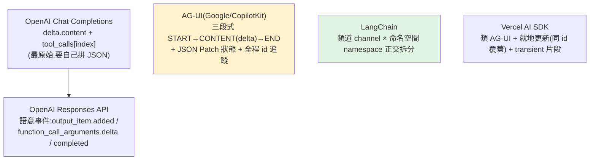

# Agent Streaming 格式設計:串流是要「設計」的應用層介面

> AI agent 的串流已經從「一個個 token 增量」演進成「複雜的事件系統」。核心論點:
> **串流格式已經是應用層介面,要主動設計,而不是被動把上游 API 透傳出去。**
> 「能不能顯示 token 早就不是重點了」——重點變成:畫出 agent 工作樹、選擇性訂閱、斷線重連、過程回放。
>
> 整理自 blog.aihao.tw,比較 OpenAI、LangChain、AG-UI、Vercel AI SDK 四方設計。

---

## 為什麼基準 API 不夠:agent 打破三個隱含假設

| 基準 API 的假設 | Agent 應用的現實 |
|---|---|
| 只有**一次**模型呼叫 | 展開成**樹狀**(主 agent 分派多個子代理) |
| **一條**串流全包 | 前端被迫下載**所有子代理**的 token,付不該付的頻寬 |
| 連線**短暫** | Agent 跑十幾分鐘,重整就斷、難回放 |

所以應用層真正要解的是:**即時繪出 agent 工作樹、只訂閱當前代理、把「等人核准」當一級事件、斷線後接續而非重播。**

---

## 四方設計



### OpenAI(基準)
- Chat Completions:`choices[0].delta.content` 傳純文字;工具呼叫用 `tool_calls[].function.arguments` 加 `index` 標位,**要自己拼接 JSON**。
- Responses API(進階):引入**語意事件**——`response.output_item.added`、`response.function_call_arguments.delta`、`response.completed`。

### LangChain:頻道 × 命名空間(最重要的創新)
把串流**正交拆成兩維**:
- **頻道(channel)**:`messages`(對話)、`values`/`updates`(完整快照/差異更新)、`tools`(工具起訖)、`lifecycle`(生死週期)、`custom:*`(自訂)。
- **命名空間(namespace)**:標記在執行樹的位置(`root`、`subagent:research-1`…)。
```json
{"channel":"messages","namespace":["root"],"block":"text","delta":"嗨"}
{"channel":"tools","namespace":["subagent:research-1"],"name":"search","status":"started"}
{"channel":"values","namespace":["root"],"patch":[{"op":"add","path":"/findings/-"}]}
```
前端 SDK 用投影 API 只訂閱需要的部分:`useMessages()` / `useToolCalls()` / `useValues()`——**後端只傳該頻道/該命名空間**,不必下載整棵樹。

### AG-UI(Google / CopilotKit)
約 10 多種基礎事件,特色:
- 統一**三段式**:`TEXT_MESSAGE_START → TEXT_MESSAGE_CONTENT(delta) → TEXT_MESSAGE_END`;工具同理 `TOOL_CALL_START → ARGS(delta) → END → RESULT`。
- 狀態用 **`STATE_SNAPSHOT`(完整)或 `STATE_DELTA`(JSON Patch / RFC 6902)**。
- 全程帶 `threadId`/`runId`/`messageId`/`toolCallId` 追蹤;支援 **SSE / WebSocket / webhook**。

### Vercel AI SDK
類 AG-UI 形狀,額外:
- **就地更新**:同 `id` 再送即覆蓋(`data-weather` 從 loading → done)。
- **暫時性片段**:`"transient":true` 不入歷史(臨時通知)。

---

## 儲存:存整段事件序列,不是只存終態

> 「**一段執行是一串事件,不是一筆不可變的資料列**」(SmithDB 設計原則)。

- 資料庫應存**完整事件序列**,才能支援回放與斷線重連,而非只存最終答案。
- **快照/增量(snapshot/delta)** 模式:降頻寬與儲存、支援重連、精確回放。
- LangGraph 的儲存最佳化:預設每步存完整歷史是 **O(N²)**;改用 `DeltaChannel` 只存增量是 **O(N)**——實測 **500 輪、10 萬 token 對話從 252 MB 降到 712 KB**。
```python
messages: Annotated[list[AnyMessage], add_messages]               # 預設 O(N²)
messages: Annotated[list[AnyMessage], DeltaChannel(add_messages)] # 優化 O(N)
```

> **儲存與傳輸同構**:格式既是傳輸協定、也是儲存格式,設計好一次受用多次。

---

## 最佳實踐

1. **隔層轉換**:別直接透傳上游 API 格式,設計自己的應用層協定 → 換模型/多模型不必改前端。
2. **存整段串流而非終態**:支援回放與斷線重連。
3. **採快照/增量**:用結構化的 **JSON Patch** 而非字串拼接做狀態同步。
4. **頻道 × 命名空間分離**(LangChain 模式):前端只訂閱需要的頻道與樹位置,撐得起複雜樹狀 agent。
5. **選對傳輸層**:SSE(簡單、好快取)/ WebSocket(雙向、人在迴路)/ 考慮保活與可重連。
6. **A2UI(宣告式 UI)只在「前端不屬於你」的遠端代理場景用**;自家應用直接驅動前端較佳。

---

## 應用案例

- **多子代理 agent 的前端:** 用 channel×namespace 即時畫出工作樹,讓使用者**只訂閱當前在看的子代理**,不必下載其他子代理的 token——對照 [[hermes-main-agent-orchestration]] 的主 agent 調度多子代理(那篇也提到 cron 結果要另建 Web 站渲染,正是「終態渲染不夠」的同一痛點)。
- **長時間任務(跑十幾分鐘):** 把執行存成事件序列,使用者重整或斷線後**接續而非重播**;這對 [[long-running-agents-goal-evaluation]] 的長時 agent 是必備基礎設施。
- **「等人核准」流程:** 把 human-in-the-loop 當一級串流事件(用 WebSocket 雙向),對照 [[task-decomposition-agentic-workflow]] 的 checkpoint。
- **省成本:** DeltaChannel/快照增量把 252MB→712KB,直接改變長對話的儲存與頻寬帳單。

---

## 一句話總結

> 「**串流是一個應該設計的應用層介面**」「**寫應用程式,而非讀日誌**」——
> agent 時代的串流要支援樹狀結構、選擇性訂閱、斷線重連、過程回放,所以別被動透傳上游,
> 用**頻道×命名空間 + 快照/增量(JSON Patch) + 存整段事件序列**主動設計;
> 且讓**儲存格式 = 傳輸協定**,一次設計多處受用。

---

## 來源

- 部落格:[Agent Streaming 格式設計(blog.aihao.tw, 2026-06-02)](https://blog.aihao.tw/2026/06/02/agent-streaming-chunk-format/)
- 涉及:OpenAI Responses API、LangChain(channel×namespace、DeltaChannel)、AG-UI(JSON Patch/RFC 6902)、Vercel AI SDK、A2UI、SmithDB。
- 延伸:本庫 [[hermes-main-agent-orchestration]]、[[long-running-agents-goal-evaluation]]、[[task-decomposition-agentic-workflow]]、[[function-calling-mcp-a2a]]。
