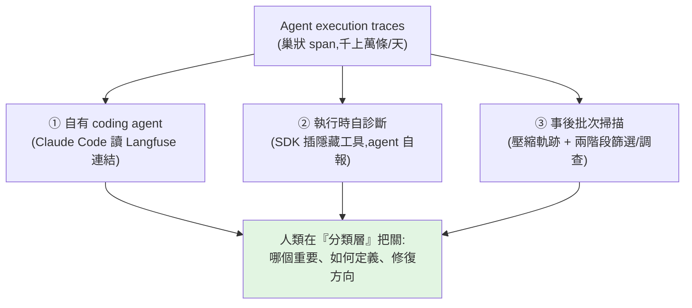

# 用 AI 分析 Agent Traces:讓 agent 讀 trace,但人類把持品味

> 生產環境的 agent 每天產出**幾千上萬條 execution trace**;「讀 trace、判斷哪裡出錯」這種耗時的質性分析,
> 應該**交給 agent**做。但核心主張是:**「Agent 是規模的放大器,不是品味的替代品」**——
> agent 能篩出值得看的問題,但「哪個重要、如何定義、怎麼修」的方向盤仍握在人手上。
>
> 整理自 blog.aihao.tw,涵蓋 trace 結構、三種實作方案,與 Shreya Shankar 的實驗教訓。

---

## Trace 結構與為何難手工處理

- **一條 trace = 一次 agent run = 對應一個使用者請求**的完整紀錄,採**巢狀 span**:根 span(整個 run)底下掛子 span;每個 span 記錄**輸入 / 輸出 / 執行時間 / token 消耗 / 錯誤狀態**。
- 例(問「台積電 vs 聯發科」):root span 整段 8.2s → LLM 推理層(推理/決策)→ 工具呼叫層(`search_stock`、`get_financials`…)。複雜 trace 常「幾十上百輪」、好幾 MB。

**為何難手工**:① 規模(一天千上萬條)② 非確定性(除錯從「讀程式碼找邏輯錯」變成「**分析 trace 找推理缺陷**」)③ 資訊量龐大。而 trace 分析正是「先出 v1 → 打開 tracing → 讀懂 trace → 做實驗 → 循環」這個改進主迴圈的基礎。

---

## 三種實作方案

### ① 自有 Coding Agent(FutureSearch / ihower)
- **FutureSearch**:用自訂 skill 讓 Claude Code 讀 trace(直接貼 **Langfuse** 連結)。失敗分類:**scaffolding bug / 工具失效 / prompt 問題 / 推理失敗**。Opus 4.6 能在單一 session 讀完整條 trace,並自行「**形成假設 → 模擬修改後 prompt → 驗證**」。
- **ihower 生產規模**:**加權取樣**(全部 error/guardrail 都看、高互動輪數隨機抽 75%、基準流量抽 15%);**固定報告骨架**(整體讀評、立即動作、問題編號、推薦人工追查的對話、滿意度信號、使用者模式);規則「**事實與推論分開標**」。

### ② 執行時自診斷(Raindrop)
- SDK 在 agent 的工具清單裡**插入一個隱藏工具 `__raindrop_report`**;agent 運行時自行判斷並**靜默呼叫**,回報四類信號:`missing_context` / `tool_failure` / `capability_gap` / `task_failure`。平台負責跨執行聚合、分群、告警。

### ③ 事後批次掃描(LangSmith Engine)
- **壓縮軌跡**:先把每條 trace 壓成「骨架」(角色、工具名、延遲、字數),再依形狀撈細節。
- **兩階段分離**:Haiku 篩選員(掃 20 條判 clean/suspicious)→ 調查員(深入)。
- **固定分類清單**(非自由發明):`pii_leak` / `agent_looping` / `incorrect_tool_args` / `missing_tool`。
- **評估器先驗證**:產生評估器前用 `test_evaluator` 實測;維護類似 **AGENTS.md 的活文件**做跨次記憶。

---

## 實作原則(結合 Shreya Shankar 的實驗教訓)

1. **別邊讀邊即興生分類**:分開「**開放編碼(open coding)**」與「**歸類(axial coding)**」兩階段,讓 agent **只提議**分類、不擅自定案。
2. **流程控制用程式碼寫死**:別讓 agent 自己決定「讀完沒」——實驗中有組只讀了 **5.5%** 就自認讀完。
3. **用簡單標準檢驗**:每個失敗模式要能轉成清楚的「**納入/排除**」準則 + 自動檢查。
4. **分類體系版本化**:人在「**分類層**」把關(合併、刪除、加權),而**不是**在「逐條標註層」陪 agent 標。

---

## 應用案例

- **產品持續改進迴圈:** v1 上線 → 打開 tracing → 讓 agent 加權取樣讀 trace、產失敗分類報告 → 你在分類層決定先修哪個 → 改 prompt/工具 → 再讀 trace 驗證。**人只在關卡決策,苦工交給 agent。**
- **線上即時抓問題:** 用 Raindrop 式隱藏工具讓 agent 執行中自報 `tool_failure`/`capability_gap`,平台聚合告警,不必事後翻日誌。
- **大規模便宜掃描:** 用 LangSmith 式「壓縮骨架 + Haiku 篩選 → 深入調查」兩階段,把千上萬條 trace 的成本壓下來,只對 suspicious 的深入。
- **避免 agent 亂分類:** 給**固定分類清單**(pii_leak/looping/incorrect_tool_args/missing_tool)而非讓它自由發明,並用 `test_evaluator` 先驗證評估器。

---

## 一句話總結

> 「讀 trace 找推理缺陷」這件耗時質性工作交給 agent(它是**規模的放大器**),但**品味與決策留給人**:
> 分開「開放編碼 / 歸類」、流程用程式碼寫死、分類體系版本化、人在分類層把關。
> 2026 的趨勢是「**trace 分析 → 問題定義 → 修復 → 驗證**」整個迴圈被 agent 接管,但**每一環都保留人類審核關卡**——
> 成功關鍵不是選哪個工具,而是「**明確保留人類品味的位置**」。

---

## 來源

- 部落格:[用 AI 分析 Agent Traces 持續改進產品(blog.aihao.tw, 2026-06-02)](https://blog.aihao.tw/2026/06/02/agent-trace-analysis/)
- 涉及:Langfuse、LangSmith Engine、Raindrop Self Diagnostics、FutureSearch、ihower 方案;Shreya Shankar 的 open/axial coding 教訓。
- 延伸:本庫 [[long-running-agents-goal-evaluation]](評測訊號)、[[grpo-vs-gepa]](GEPA 也是「讀完整 trace 反思改進」)、[[harness-engineering-evolution]]、[[agent-streaming-format-design]](存整段事件序列正是 trace 的來源)。
