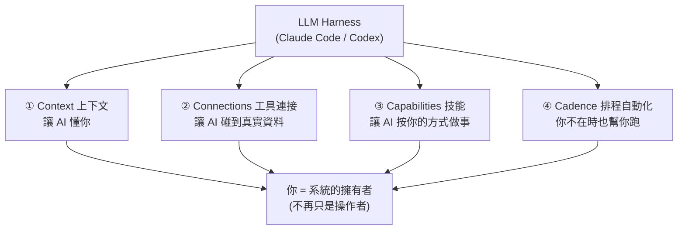

# AI Operating System(AIOS):一套讓 AI 長期懂你、替你工作的系統

> 來源:JayLuxAI〈什麼是 AI Operating System?一套能讓 AI 替你工作的系統〉。每次跟 AI 對話都要重新解釋「你是誰、品牌語氣、目標是什麼」,像不斷聘一個會失憶的實習生。**AIOS(AI 作業系統)** 就是為了解決這個——它不是一個 app,而是一套讓 AI **長期記住你、懂你業務**的架構層。本筆記拆解 AIOS 的四個核心 C(Context / Connections / Capabilities / Cadence)與底層的 LLM Harness。

---

## 一句話總結

AIOS 的核心其實一句話:**如何有效管理、並在最適合的時機,給 AI 最正確的資訊。** 現在的 AI Agent 都能執行事情,難的是讓它「按你要的方式、產出你要的格式」。把四層(懂你→能連→會做→自動跑)疊起來,**你就從一個「操作者」變成「系統的擁有者」**,而且這套系統**越用越聰明**。

---

## 底層:LLM Harness(駕馭模型的介面層)

要讓 AIOS 運作,你需要一個 **LLM Harness**(大型語言模型的工具層)——把上下文、工具、技能都接上去,讓 Agent 在你的系統裡真正動起來。最常見的兩個就是 **Claude Code** 與 **Codex**:它們是你在本地跑 AIOS 的入口,所有 Context / Connections / Capabilities / Cadence 都透過它們跟 AI 溝通。(harness 概念見本庫 [[ai-harness-explained]]。)

---

## 四個核心 C

### ① Context（上下文）= AIOS 的大腦

告訴 AI **你是誰、做什麼業務、目標是什麼**,讓它每次執行前先自動讀取,結果就能遵守你過去的準則。是一套**文件結構**,核心三檔:

| 檔案 | 作用 | 存放 |
|---|---|---|
| **`CLAUDE.md`** | 專案大腦,記錄整個專案在幹嘛(必設) | `.claude/` 下 |
| **`me.md`** | 你的個人資訊、喜好、慣用回答 | 本地,不外傳 |
| **`soul.md`** | 決定 Agent 的人格特質與溝通風格 | 本地 |

**依使用情境設計你的 Context(四選一,Pattern 都一樣,差在內容):**
- **個人品牌** → `brand/` 資料夾:`brand.md` 主檔,再引用 `tone.md`、`brand-voice.md`(品牌口氣)、品牌素材、配色規範等。
- **自己的事業(電商等)** → `business.md`:client、priority(優先事項)、goals-and-milestones(動態更新)。
- **員工(平常工作用)** → `work.md`:my-roles-and-KPIs、內外部溝通規範、公司背景、團隊架構、利害關係人。
- **個人用** → `about-me`:health-and-fitness、personal-project、finance、inbox-rules(未來可讀 email / 幫你理財)。

**記憶與防呆:**
- `memory.md`:Claude/Codex 已內建,不用自己設。
- **`what-not-to-do.md`**:把 AI 做過、你不喜歡的事記下來(例:寫腳本時該出現中文卻跑出韓文),並在 `CLAUDE.md` 叫它每次先讀,避免重犯。
- **Working Style(Bonus)**:你偏好的工作方式(例:作者要 Claude「每次開發前先逐一問我確認需求對不對,回答完才動工」,降低錯誤率)。

> **關鍵設計:Progressive Loading(漸進式載入)。** 不要把所有東西塞進一份檔案——那樣每次讀都會讀進一堆無關內容、撐爆 context。`CLAUDE.md` 用一張**對照表**(load when / file)按需指路:
> | 什麼時候讀 | 讀哪個檔 |
> |---|---|
> | 要了解我的職場 KPI | `my-roles-and-KPIs.md` |
> | 要處理生活開銷 | `finance-and-admin.md` |
> | 要產生 PDF/HTML | `context-generation.md` |
>
> 這呼應本庫 [[markdown-agent-memory]] 的「MEMORY.md + 漸進式上下文披露」——**確保在最適合的時機只給 AI 最正確的資訊**,它才不會一次讀太多而搞不懂你要幹嘛。

### ② Connections（工具連接）= 讓 AI 碰到真實世界資料

Context 讓 AI 懂你,但它還要能連到真實資料才能真正執行。三種方式:**API / MCP / CLI**,連上 Google Drive、信箱、Notion、ClickUp、Slack、Stripe 等任何你在用的工具。

> **沒有 API/MCP/CLI 的服務怎麼辦?** 用 **Playwright** 讓 agent 直接操作網頁頁面(例:某些只有網頁介面的平台)。
>
> **應用案例:** 設定好後跟 AI 說「幫我整理今天信箱所有客戶的 email,列出待處理事項」,按 Enter 它就直接去信箱抓資料自己整理——這一步讓 AI **從聊天機器人變成真正有用的助理**。

### ③ Capabilities（技能）= 把你腦裡的 SOP 變成 Skill

把你大腦裡的 SOP 轉換成 **skill 文件**,就能一致地重複執行。一個 skill 像一張流程圖(start → check → process → yes 繼續 / no 結束)。

> **用 Skill System,不要做 Mega Skill。** 把大流程拆成 step1→step2→step3,**每一步是一個獨立 skill**,做完傳給下一個。例:內容創作 = 確認主題 → 生成腳本 → 生成簡報 → 發到網站,每步一個 skill。
> - 全塞成一個 mega skill 的壞處:① context 一次吃太多、效率差;② 難維護——某一步(如「生成簡報」)出錯,要把整套邏輯全改。拆成 skill system 就只修那一個 skill。
> - skill 寫法見本庫 [[building-claude-skills]]。
>
> **應用案例:** 每次發 IG 貼文都要按特定語氣、格式、hashtag 邏輯——把流程寫成一個 skill,以後只要說「製作 IG 貼文」,AI 就照你的標準產出,不必每次重新解釋。

### ④ Cadence（排程與自動化）= 你不在時也幫你跑

設定後,系統可在你睡覺時透過背景排程(cron)或自動化腳本自動做事,**電腦完全不用開著**。

> **應用案例:** 每天早上 8 點自動從所有工具抓資料、整理成一份情報摘要推送給你;或每週五自動草擬下週內容計畫。

**兩種工具的差別:**
| | 固定流程(cron / 一般排程) | **Claude Routines(agentic 流程)** |
|---|---|---|
| 跑法 | step1→step2→step3 照順序 | 能自適應情況、先讀背景再執行 |
| 出錯時 | step2 出錯 → 整條停掉,要你自己修 | **AI 會自己修復錯誤並確保任務完成** |
| 成本 | 跑簡單流程免費 | Pro 方案一天上限約 5 個 |

---

## 實作:用一份 skill 一鍵搭好 Context

影片示範把一份 `setup-aios` skill 放進專案就能引導完成設定:
1. 新建專案資料夾(用 VS Code 或 Antigravity 開啟)。
2. 建 `.claude/` → 底下建 `skills/` → 把 `setup-aios` skill 放進去。
3. 重開 Claude Code,輸入 `/setup-aios`,它會問你(慣用語言、身份/用途…),約 5–10 分鐘逐題回答。
4. 它就自動建好 `context/` 資料夾(personal、goals、project、me、what-not-to-do、working-style…)這個最小可行(MVP)的 AIOS。
5. 之後叫它「建立第一個 skill」(示範:`daily-meal-plan`),再連工具、設排程即可。

> **示範結果:** 作者以「個人生活管理/增肌」為例,設定後說「幫我規劃增肌飲食」就觸發 `daily-meal-plan` skill,AI 依重訓與否、體重、超商便當等條件產出飲食計畫。

---

## 應用案例:從零搭一套個人 AIOS

假設你是一人經營者:
1. **Context**:建 `business.md`(你的服務、客戶、本季目標)+ `brand-voice.md`(貼文語氣)+ `what-not-to-do.md`(列出 AI 常犯、你討厭的錯)。CLAUDE.md 用對照表按需載入。
2. **Connections**:接上 Gmail(MCP)、Notion(API)、沒 API 的後台用 Playwright。
3. **Capabilities**:把「寫貼文」「回客服」「做週報」各寫成 skill system。
4. **Cadence**:設每早 8 點抓信箱+Notion 產情報摘要、每週五草擬內容計畫。
> 結果:你只下目標,系統自己懂你、連資料、照你的方式做、在你睡覺時跑——這就是 [[zero-person-ai-company]](0 人 AI 公司)的個人版雛形。

---

## 關鍵觀念

- **AIOS 不是 app,是架構層**:重點不在某個工具多強,而在「管理資訊 + 在對的時機給對的 context」。
- **Progressive loading 是省 context 的靈魂**:對照表按需載入,別塞 mega 檔。
- **Skill 要拆小**:skill system 比 mega skill 好維護、好除錯、省 context。
- **agentic 排程 > 固定排程**:能自我修錯才不會一步失敗整條停。
- **越用越聰明**:AIOS 隨著你持續更新 context、修正 what-not-to-do、新增 skill,會變成完全屬於你的個人 AI 助理——這是一個持續維護(月、半年、一年)的長期資產。

相關筆記:[[markdown-agent-memory]]、[[building-claude-skills]]、[[zero-person-ai-company]]、[[hermes-main-agent-orchestration]]、[[claude-md-12-rules]]、[[claude-dynamic-workflows]]。

---

## 來源

- JayLuxAI | AI 自動化,〈什麼是 AI Operating System?一套能讓 AI 替你工作的系統(附免費設定)〉,YouTube:<https://youtu.be/EyZEJPP2JNQ>(2026-06-07)
- **該片無字幕,逐字稿以 CPU 版 faster-whisper 轉錄取得,非官方字幕**;專有名詞(Claude Code、Codex、CLAUDE.md/me.md/soul.md、MCP、Playwright、cron、Skool 等)已校正,可能仍有少量聽寫誤差。
