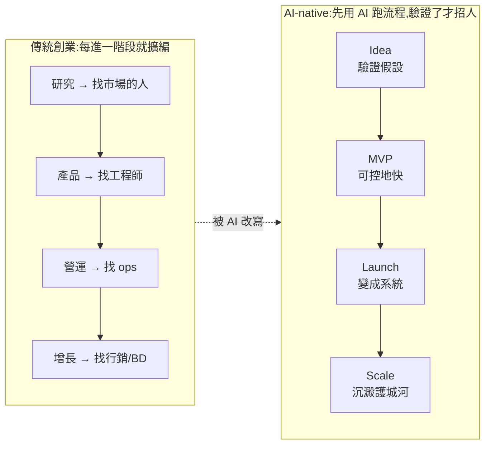
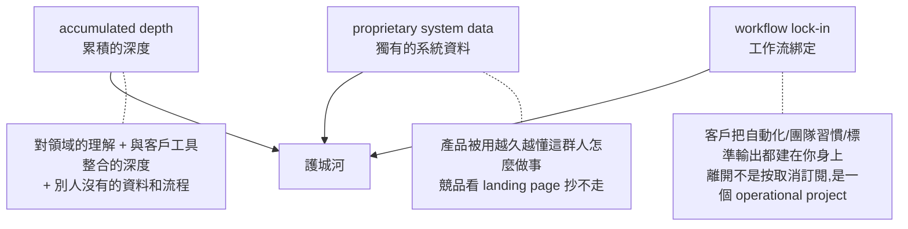

# AI 時代怎麼創業?Anthropic 新創 Playbook 的四階段 workflow

> 來源:Gary Chen(@garytalksstuff)解析 Anthropic 2026 年 5 月發布的「AI 新創 Playbook」。核心概念是 **ten-person unicorn(十人獨角獸)**——不是十個人突然變天才,而是每個人背後都有一套 AI 系統在放大產出。本筆記把這份 Playbook 拆成 Idea / MVP / Launch / Scale 四階段,並對應「該用哪個 Claude 產品、AI 在這條流程裡扮演什麼角色」。

---

## 一句話總結

未來新創的差距,**不是「有沒有用 AI」**(這很快就不再是差異),**而是「誰把 AI 系統化得更好」**——誰能把 AI 放進每個階段的工作流程,讓 research / feedback / metrics / support / scale 不再全部卡在 founder 身上。AI 會同時放大創業者的判斷力,也放大他的愚蠢。

---

## 先搞懂:Claude 三個產品的分工

後面每階段都會指定用哪一個,先記住這條對照(影片給的「最簡單記憶法」):

| 產品 | 定位 | 什麼時候用 |
|---|---|---|
| **Claude Chatbot** | 開著聊天框隨手問 | 問個問題、改一段文字、快速 brainstorm。即開即用、不用設定 |
| **Claude Cowork** | 要花時間、跨多份資料、生出一份成品 | 把一疊客戶訪談整理成 findings、爬十幾個競品網站拼競爭地圖、每週固定丟 KPI brief。能接檔案 / connector / 跑排程 |
| **Claude Code** | 真的在寫程式 | 直接碰 codebase / git / 開發環境,從原型做到上線 |

> 記憶法:**隨手問 → Chatbot;產出非軟體成品 → Cowork;寫程式 → Code。**(也可換成 OpenAI 全家桶或任何工具,概念一樣。)

---

## 核心心智:AI 不是讓創業變簡單,是讓「試錯成本」變低

以前工程成本很高,某種程度是創業者的**煞車**——你真的要花錢、花時間、找人,才能把想法做出來。AI 拿掉了這個煞車:好的想法更快被驗證,但**錯的想法也更快被包裝得有模有樣**。

> 一個沒被驗證的想法,以前頂多寫在 Notion、跟朋友講一講;現在你可以叫 Claude 直接做出 demo、寫 pitch deck、生 landing page、連銷售信都一起生——做出來「有模有樣」,但它可能只是被 AI 包裝過的錯誤假設。

**這就是為什麼判斷力變得更重要:** 當 AI 放大團隊執行力,沒有判斷力的人,錯誤也會用更快的速度被放大。

---

## 四階段逐一拆解

### 階段 1|Idea:重點不是做產品,是做「驗證」

這階段 AI 最大的用途是**市場研究、競品分析、反向挑戰你的假設**,避免做出沒人要的東西。

> 引用 CB Insights 經典數據:**42% 的新創失敗是因為「built something nobody wanted」**(做了沒人要的東西)。AI 不會自動解決這問題,AI 只會讓你**更快**做出一個沒人要的東西。

**Idea stage 要先回答的五個關鍵問題:**
1. 這個痛點是不是真的存在?
2. 誰有這個問題?
3. 這問題發生得夠頻繁嗎?
4. 現在大家怎麼解決?
5. 你的解法到底有沒有打中真正的問題?

**三個 use case(都用 Claude Chatbot / Cowork):**

| use case | 怎麼做 | 關鍵 |
|---|---|---|
| **把 idea 變成可驗證的假設** | 別給「我想做 AI 工具提升效率」這種廢話;給觀察到的痛點、想服務的人、他們現在的流程、你懷疑哪裡有摩擦 → 請 Claude 拆成上面五問 | 講不出受眾/場景/替代方案 → 那不是 idea,是一時興起 |
| **反向驗證(讓 Claude 當反方)** | 不要問「為什麼這市場有機會」(它會像「證明猴子愛喝寶礦力」一樣睜眼說瞎話找支持證據);要請它找這 idea **最可能失敗的原因**:客戶可能沒痛點 / 替代方案已夠好 / 市場太小 / 即使做出來也難賣 | founder 要判斷的是「哪些反對意見會真的讓你改方向」 |
| **customer discovery 訪談設計** | 別問「如果我做一個省時間的工具你會不會用」(大家都說會);**問過去不問未來**:「你上一次遇到這問題是什麼時候?當時怎麼處理?花多久?有沒有花錢?沒有的話為什麼?」請 Claude 設計問題並檢查哪些太誘導/太抽象 | 訪談是蒐集真實行為證據,不是找人認同自己 |

> **Idea stage 的 Claude 不是你的啦啦隊,是你的研究員 + 反方辯論手。** 經不起這一關,改變方向才是正確選擇。

### 階段 2|MVP:讓 AI 寫得快,但用 scope/context/security 管住

AI coding 最大的問題**不是它寫不出來,而是它太願意寫**。以前 scope creep(需求蔓延)會被工程成本擋住(工程師皺眉、PM 排優先級、老闆看 budget);現在沒有這些摩擦,你每個突發奇想都能很快變成產品的一部分 → **無意義的需求蔓延**。

> **Greenfield vs Brownfield:** AI 最擅長 greenfield(從零做 demo)——快、猛、有成就感。但真正麻煩的是 brownfield(已有人用、資料進來、開始累積技術債後還要持續迭代)。這時如果前面沒有 scope / spec / context,AI 不是幫你加速,而是幫你**把混亂放大**。

MVP 階段本質仍是 **evidence-gathering**:證明一群具體使用者真的覺得有價值、會回來用、會付費、會推薦。

**三個 use case:**

| use case | 內容 |
|---|---|
| **MVP scope doc** | 開寫之前先請 Claude 產出 scope doc:核心功能、未來疊加功能的條件(如達到多少 MAU)、最重要的**排除功能(不做哪些)**。AI coding 年代,「不做」比「做」更重要 |
| **給 Claude Code 的 `CLAUDE.md`** | AI-native codebase 是一個 session 接一個 session 跟 AI 協作。沒有 specs/context files,每次開新 session,AI 會重新推導系統長相 → codebase 漂移。`CLAUDE.md` 像校規/員工手冊,是給未來 AI session 看的「工作記憶」,讓 AI 結構上保持一致,而不是每次用局部最佳解硬拼 |
| **上線前 security review** | AI 寫的 code「能跑 ≠ 安全」:功能對不對你一眼看得出,但安全漏洞不報錯、不當機,靜靜躺著等人利用。越不會寫 code 的 founder 這坑越深。請 Claude 掃 authentication / session 處理 / API 是否洩漏機密 / injection 風險——但這是**第一輪檢查,不是唯一防線**,碰到真實使用者資料與金流,該找人看、該上專業工具不能省 |

> 一句話:**速度本身不是優勢,可控的速度才是。**

### 階段 3|Launch:把 founder 的手工操作,變成可重複運轉的系統

Launch 不只是產品上線/發文/打廣告,而是公司開始從「founder 手工操作」變成「一套可重複運轉的系統」。問題不再只是產品能不能用,而是 growth / feedback / metrics / security / ops **能不能不要每件事都卡在 founder 身上**。

> MVP 階段 founder 在每個 loop 裡是**優勢**(貼近使用者、快速判斷);但到 Launch,如果所有事還要你親自記得、整理、判斷、追,你就變成**效率瓶頸**。AI 的價值不在偶爾幫你做一件事,而在**把重複出現的工作流變成固定運轉的系統**。(怎麼把工作流拆成 agent 能跑的 workflow,見本庫 [[task-decomposition-agentic-workflow]]。)

**兩個 use case(Claude 開始變成營運系統的一部分,不只是聊天機器人):**

| use case | 內容 |
|---|---|
| **weekly metrics brief** | Launch 後數據變多(activation / retention / usage / bug count / conversion funnel)。很多 founder 被 **launch spike** 騙到——剛上線朋友支持、社群曝光、好奇心流量讓數字好看,但 6 週、12 週後這些人還在不在、有沒有付費?讓 AI 固定產出每週 brief:本週變化、異常訊號、可能原因、下週該追的問題。**搭配 Sean Ellis test:** 問活躍用戶「如果不能再用這產品你會多失望」,>40% 回答 very disappointed 才是有意義的 PMF 指標 |
| **support / bug triage SOP** | 有使用者後問題會一直來(bug / onboarding 不清 / 產品設計本身有問題)。每個都丟給 founder 或工程師,公司很快被小事淹沒。請 Claude 產出 triage SOP:分類規則、優先級、標準回覆、升級條件。讓你看懂哪些能流程化、哪些代表產品本身要改 |

### 階段 4|Scale:把資料與 workflow 沉澱成護城河

決定一間 AI-native startup 最後有沒有護城河,還是只能曇花一現。founder 角色從「做產品的人」變成「對外經營者」,但真正的優勢仍是那條用 AI 撐起來的 lean 結構。

**Playbook 點出三個關鍵護城河:**

**兩個例子:**
- **user behavior data flywheel(行為數據飛輪):** 從使用者行為找可持續改善產品的訊號(哪些 output 被改掉、哪些流程被重複使用、哪些功能沒人碰)→ 轉成優化 idea(模型/workflow 改善)→ 產品越用越準,越準越多人用,飛輪轉起來。
- **從「單功能」走向「嵌入流程」:** 最容易被替換的狀態就是只有一個功能(你做摘要、別人也做摘要,沒壁壘、換掉沒成本)。但若你的產品接進他的資料來源、進入團隊流程、影響標準輸出,**離開成本就會高到不像話**。
- **Scale use case:** 讓 Claude 做一張 **workflow 盤點**——餵它使用頻率、團隊協作流程、客戶依賴的模板與輸出格式 → 請它整理出不同客戶群把產品用得多深、哪些是最難替換的節點、未來還能從哪加深整合。

---

## 應用案例:一個獨立開發者怎麼套這份 Playbook

假設你想做「給律師事務所的合約審閱小工具」:

1. **Idea:** 別急著做。開 Claude Chatbot,把「律師看合約很花時間」拆成五問;再叫 Claude 當反方列出「為什麼律師其實已經有夠好的範本庫、為什麼這市場太小、為什麼即使做出來也難賣進保守的事務所」。設計訪談問:「你上一份合約審了多久?哪段最煩?有沒有花錢買工具?」——**先驗證,不成立就轉向。**
2. **MVP:** 用 Claude Code 開工前,先讓它寫 scope doc,明確「**不做**多人協作、不做計費系統」;放一份 `CLAUDE.md` 定規則;上線給第一個律師用之前,叫 Claude 掃一輪上傳合約的權限與資料外洩風險(但金流/個資仍找專業的人看)。
3. **Launch:** 設定每週 metrics brief(有幾個律師回來用、改了幾份合約、留存如何);對「為什麼某條款沒抓到」這類問題建一套 triage SOP,分清「是 bug」還是「產品設計要改」。
4. **Scale:** 當事務所把「所有合約都先過你的工具」變成 SOP,你就有了 workflow lock-in;把「哪些條款最常被改」沉澱成你獨有的資料飛輪,讓工具越用越準。

> 全程一個人 + 一套 AI 系統,就跑完了過去要顧問 + 工程師 + PM + ops 的流程——這就是「十人獨角獸」的縮影。

---

## 關鍵 takeaway

> 最重要的 takeaway 不是「Claude 有多強」,而是:**創業者要開始把公司拆成一條條流程**——哪些需要研究、哪些需要建構、哪些需要營運、哪些需要沉澱成護城河——**然後再問 AI 在這條流程裡該扮演什麼角色。**
>
> AI-native startup 不是「用了 AI 工具的公司」,是「把 AI 變成工作系統的公司」。

相關筆記:[[zero-person-ai-company]](0 人 AI 公司)、[[task-decomposition-agentic-workflow]](把 SOP 拆成 agent workflow)、[[claude-md-12-rules]](CLAUDE.md 規則)、[[three-valuable-ai-skills]](AI 調度力/工作流設計力/獨立思考力)。

---

## 來源

- Gary Chen(@garytalksstuff),〈AI 時代怎麼創業?Anthropic Playbook 一次看懂四階段 workflow〉,YouTube:<https://youtu.be/PxPWaP7mXFM>
- Anthropic, "AI Startup Playbook"(2026 年 5 月發布)。
- 引用數據:CB Insights — 新創失敗原因調查(42% 為 "no market need");Sean Ellis test(PMF 衡量法)。
