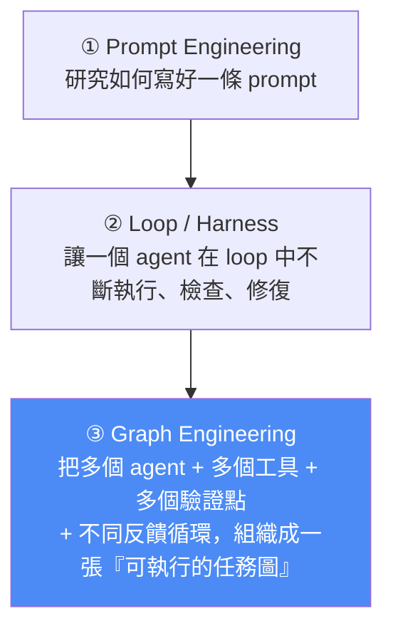
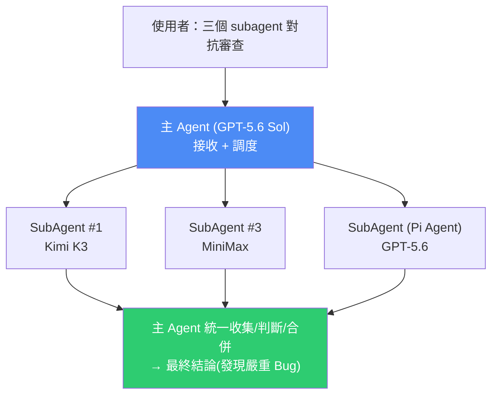

# Codex Multi-agent V2 與 Graph Engineering:主 agent 調度、多模型混用、動態派生 subagent

> AI超元域。OpenAI 為 Codex 最新版(0.145.0)推出穩定的 **Multi-agent V2** 多智能體系統。核心看點:Codex 從「單個超級 agent」升級成一個**真正的 agent 調度系統**——主 agent 拆解任務、分派給不同 subagent 並行執行、再統一收集合併結果;每個 subagent 可**配置不同模型(Kimi K3 / MiniMax / GPT-5.6)、推理層級、工具與 skill**。作者認為它已具備 **Graph Engineering** 的初級特徵,很大程度上可替代 Claude Code 的 Dynamic Workflows。
> 延伸自 [[claude-dynamic-workflows]]、[[hermes-main-agent-orchestration]]、[[five-agent-patterns]]。

---

## 一、先搞懂:什麼是 Graph Engineering?(這篇的框架)

AI 編程的關注層次正在往上爬:

- **Graph Engineering 關注更高一層的問題**:如何把多 agent、多工具、多驗證點、不同反饋循環,組織成一張**可實際執行的任務圖**(條件分支、並行任務、驗證點)。
- **Claude Code 的 Dynamic Workflows 就是 Graph Engineering 的典型實現**(根據使用者目標生成一套工作流,靠多 subagent + 條件分支 + 並行 + 驗證點完成複雜任務)。
- **Codex Multi-agent V2 的定位**:讓使用者更自由地構建/配置不同 subagent。**目前還不完全等同 Dynamic Workflows、也還不是完整的 graph workflow 運行時**,但從「主 agent 調度、角色分工、並行執行、結果匯總」來看,**已具備鮮明的 Graph Engineering 特徵**。

> 🔑 **關鍵區別:它不是簡單啟動幾個 subagent 各做各的,而是一個主 agent 充當整個任務的調度者**——先理解拆解任務,把「代碼探索、方案設計、功能開發、測試驗證、代碼審查」分別交給不同 subagent,完成後**統一收集、判斷、合併**成完整解決方案。

---

## 二、能做什麼:四種能力

| 能力 | 說明 |
|---|---|
| **每個 subagent 獨立模型 + 推理層級** | Kimi K3、MiniMax、GPT-5.6 各自指定;推理級別 high / xhigh 等 |
| **控制並發數量** | 多個 subagent 並行執行,主 agent 統一匯總 |
| **任務恢復保持角色分工** | 任務中斷恢復後,subagent 仍保持原本的角色 |
| **清晰的 agent 導航管理** | 可展開查看每個 subagent 的即時執行狀態與輸出 |

**升級方式極簡:** 命令行執行 `codex update` 升到最新版即可;**桌面版同步支援**。

---

## 三、實戰演示一:多模型「對抗性代碼審查」

作者預先配置了四個 subagent(路徑在 Codex 的 `agents/` 資料夾,每個是一個含 name / description / 具體指令 / model / provider / 推理級別的檔案):

| Subagent | 任務 | 模型 | 備註 |
|---|---|---|---|
| #1 | Code Review | **Kimi K3** | 經 CC Switch 轉換 API 格式 |
| #2 | UI 產品設計與評審 | Kimi K3 | 內嵌 **SuperDesign** skill |
| #3 | 代碼審查 | **MiniMax** | 原生相容 Codex API,免轉換 |
| #4 | 代碼審查 | **GPT-5.6 Sol** | 官方模型 |

**主 agent 用 GPT-5.6 Sol**(給主模型設更強的模型,調度分配 subagent 時更精準高效)。

**流程:** 輸入提示詞「讓這三個 subagent 對代碼進行對抗性審查」→ 主 agent 接收 → 調用三個 subagent 並行(三個審查軌道同時啟動,可點開看各自即時運行)→ 幾分鐘後審查完成、**發現嚴重 bug**,各 subagent 輸出詳細問題 → **主 agent 整理分析、給出最終結論**。

> 🔎 **為什麼「多模型對抗審查」有價值:** 用**異質模型**互相審查同一份代碼,能抓到單一模型的盲點——這正是本庫 [[cross-model-review-claude-codex-harness]] 的核心思路(異質模型互審到共識才放行),Multi-agent V2 讓它變成內建能力。同時把不同任務分給不同模型,還能**節省主模型 GPT-5.6 的 token 消耗**。

---

## 四、關鍵配置細節:第三方模型怎麼接?(CC Switch)

- **subagent 可配置非 OpenAI 官方模型**,但要看 API 格式是否相容:
  - **Kimi K3 的 API 不相容 Codex 格式** → 需透過 **CC Switch** 把 Kimi API 轉成 Codex 支援的格式(在 CC Switch 裡設 provider 名稱、Kimi URL、API key、預設模型 Kimi K3、Prompt Cache=Enable)。subagent 的 provider 就填 `ccswitch`。
  - **MiniMax 的 API 原生相容 Codex** → 免轉換,直接調用。
- **subagent 還能內嵌工具與 skill**:例如某個 subagent 調用 **Pi Agent** 工具([[pi-agent-minimal-harness]] 的極簡 harness)、UI 設計 subagent 調用 **SuperDesign** skill(Codex 插件市場可裝)。

> 🔎 CC Switch 是「把各家模型 API 轉成某個 CLI 認得的格式」的橋接器,呼應 [[llm-api-relay-stations]] 與 [[model-agnostic-ai-workflow]] 的「模型可替換」思路——把 agent 的模型當成可插拔的零件。

---

## 五、實戰演示二:動態派生 subagent(更接近 Graph Engineering)

除了手動建 subagent,**還能讓 Codex 依任務複雜度自動派生**:

1. **讓 Codex 幫你建 subagent**:輸入「創造一個用於漏洞掃描的 subagent,要求它使用『深度安全掃描』skill、模型 GPT-5.6 Slow、思考級別 xhigh」→ Codex 建好並立刻運行、開始分析代碼庫。
2. **執行時動態分配**:輸入「派生 5 個 subagent 對代碼進行對抗審查,分別調用不同的 GPT 系列、Kimi、MiniMax 模型」→ Codex 動態派生多個 subagent 同時執行。
   - **實測細節**:調用 Kimi K3 的那個因**調用次數過多被速率限制(rate limit)**;MiniMax、GPT-5.6 Sol 的正常執行。
3. **支援 subagent 內嵌 subagent**(巢狀)。

> 這幾點——動態派生、條件分支式的角色分配、並行、巢狀——正是讓它「越來越接近 Graph Engineering / Dynamic Workflows」的地方。

---

## 六、應用案例

1. **異質模型對抗式代碼審查(最實用):** 對重要 PR,派 Kimi K3 + MiniMax + GPT-5.6 三個 subagent 各自審一遍,主 agent 匯總——比單模型自審更能抓嚴重 bug。若你已在用 [[cross-model-review-claude-codex-harness]] 的 stop-hook 互審,這是更輕量的內建替代。
2. **省 token 的任務分工:** 把便宜/機械的任務(格式檢查、初步掃描)分給第三方或較弱模型,把調度與關鍵判斷留給 GPT-5.6 主 agent——降低主模型 token 消耗。
3. **角色專職 subagent + skill 綁定:** UI 評審 subagent 綁 SuperDesign skill、安全 subagent 綁深度掃描 skill——每個 subagent 是「模型 + 工具 + skill + 推理級別」的固定配置,呼應 [[building-claude-skills]]。
4. **用它替代 Dynamic Workflows 的入門版:** 想要 Claude Dynamic Workflows 那種「主控 + 並行 subagent + 驗證點」但人在 Codex 生態,Multi-agent V2 已能覆蓋初級需求(但還不是完整 graph 運行時,複雜條件分支/長流程仍有差距)。

---

## 七、限制與注意

- **還不等同 Claude Code Dynamic Workflows**:作者明說它「還不是完整的 graph workflow 運行時」,只是**具備 Graph Engineering 特徵**;複雜的條件分支、長流程編排仍有差距(對照 [[claude-dynamic-workflows]] 的「任務能否切成獨立小塊」判準)。
- **第三方模型有相容性成本**:不相容 Codex API 格式的(如 Kimi)要靠 CC Switch 轉;多了一層依賴。
- **速率限制是現實瓶頸**:動態派生多個同模型 subagent 時,第三方模型容易撞 rate limit(實測 Kimi K3 被限)。
- 「很大程度上可完全替代 Claude Code」是作者的**主觀評價**,取用時保留判斷——多模型混用的穩定性、成本、各家 API 額度都要自己驗證。

---

## 八、重點回顧(TL;DR)

- **Codex Multi-agent V2**(0.145.0,`codex update` 升級,桌面版同步):從單一超級 agent → **主 agent 調度系統**(拆解→分派 subagent 並行→統一收集合併)。
- **Graph Engineering** = 比 prompt/loop 更高一層:把多 agent + 多工具 + 多驗證點組成**可執行任務圖**;Claude Dynamic Workflows 是典型實現,Codex V2 具備其**初級特徵**。
- **四能力**:每 subagent 獨立模型+推理級別、控制並發、恢復保持角色、清晰導航。
- **多模型混用**:Kimi K3(需 CC Switch 轉 API)、MiniMax(原生相容)、GPT-5.6;主 agent 用強模型調度更精準;subagent 可內嵌工具(Pi Agent)與 skill(SuperDesign)。
- **兩種用法**:手動建 subagent / 讓 Codex **動態派生**(支援巢狀);實測多模型**對抗審查抓到嚴重 bug**。
- **注意**:還不等於 Dynamic Workflows、第三方模型有相容與 rate limit 成本、「可替代 Claude Code」是主觀評價。

---

## 來源

- 影片:[Graph Engineering 范式:Codex Multi-agent V2 支持 Kimi、MiniMax、GPT 多模型混用+动态派生 subagent(AI超元域,2026-07-23)](https://youtu.be/RAFQc6zHdXE)
  - 作者筆記:aivi.fyi/llms/codex-multi-agent-v2;開源專案:github.com/win4r
  - ⚠️ 該片無字幕,逐字稿以 **CPU 版 faster-whisper(small)** 轉錄取得、**非官方字幕**,可能有少量聽寫誤差(如版本號、CC Switch、SuperDesign 等專有名詞)。
- 延伸(本庫):[Claude Dynamic Workflows 解析](../foundations/claude-dynamic-workflows.md)、[Cross-Model Review:Claude 跟 Codex 自動互審](./cross-model-review-claude-codex-harness.md)、[把 Hermes 爆改成主 Agent 中樞](./hermes-main-agent-orchestration.md)、[五大 Agent 模式](../foundations/five-agent-patterns.md)、[別跟單一模型結婚:Model Agnostic](../../ai-productivity/model-agnostic-ai-workflow.md)、[Codex 2.0 新功能實戰](../../ai-productivity/codex-2-record-replay-mobile-remote.md)
