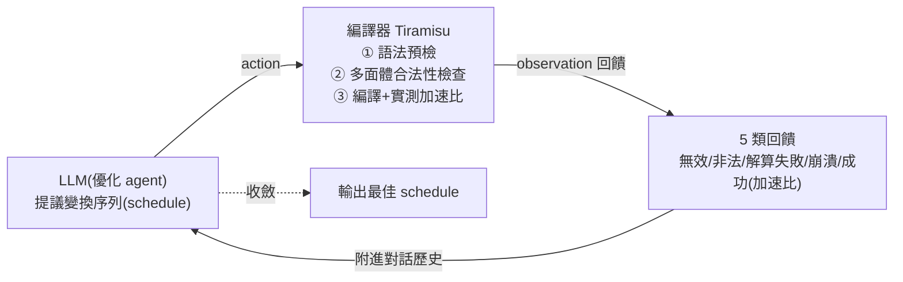

# COMPILOT:讓現成 LLM 當「優化 agent」,在與編譯器的閉環對話中把迴圈優化到 3.5 倍

> 整理自論文〈Agentic Auto-Scheduling: An Experimental Study of LLM-Guided Loop Optimization〉(Massinissa Merouani、Islem Kara Bernou、Riyadh Baghdadi,NYU Abu Dhabi,**PACT 2025**,arXiv:2511.00592)。核心一句話:**不必微調、不讓 LLM 直接生成程式碼——而是把現成 LLM 當成一個「優化 agent」,讓它對編譯器「提議迴圈變換 → 編譯器檢查合法性與實測加速比 → 回饋 → LLM 修正」這樣閉環迭代。** 在 PolyBench 上,這個 zero-shot 方法取得 **單次 2.66×、最佳 5 次取 1 為 3.54×** 的幾何平均加速,並在多數情況**勝過業界頂尖的 Pluto 多面體優化器(2.94×)**。
>
> 這篇對做 agent 的人特別有價值:它是一個乾淨的**「LLM 負責探索策略、可信工具負責保證正確性」**的 agentic 設計範本。

---

## 一句話總結

- **問題**:現代硬體上把複雜「迴圈巢狀(loop nest)」優化到最佳極難;手動調校成本高,編譯器啟發式又難在多樣應用/硬體上穩定。
- **既有 LLM 路線的毛病**:① **直接生成優化程式碼** → 難保證語意正確(要嘛靠脆弱的輸出比對、要嘛靠昂貴的形式驗證);② **只選編譯器 pass/flag** → 缺乏對「高階源碼變換序列」的細粒度控制,且常為了 code size 而非執行速度,還要領域微調。
- **COMPILOT 的解法**:把 LLM 當成**主動決策的 agent**,在「**動作–觀察**」閉環裡和編譯器互動;**LLM 只發變換指令(compiler API call),不寫程式碼**,由編譯器套用變換、用多面體依賴分析**保證合法性**、實測效能。**核心設計原則 = 關注點分離:LLM 做高階策略探索,編譯器做形式正確性與程式碼生成。**

---

## 1. 系統設計:一場「優化對話」

整個互動被組織成一個**優化對話(optimization dialogue)**——它同時是 agent 的**感知/行動介面**,其歷史又是 agent 的**情節記憶(episodic memory)**,讓 agent 能根據過去動作的具體結果調整策略。分兩階段:

### 階段一:Context Initialization(脈絡初始化)

- **Context Prompt(系統指令,所有程式共用)**:定義 LLM 角色為「編譯器優化助手」,說明流程,並列出:
  - **輸入迴圈格式**(標註過的 C/C++)、**輸出格式**(reasoning + `<schedule>...</schedule>` 標籤);
  - **變換清單(9 種原語)**:Loop Fusion、Shifting、Interchange、Parallelization、2D Tiling、3D Tiling、Unrolling、Skewing、Reversal(skewing/shifting 的係數交給 Tiramisu 內建 solver 算,簡化 LLM 任務);
  - **動作空間**:組合變換、撤銷先前變換、修改現有變換;
  - **硬體脈絡**(CPU 型號、核數、快取)、**崩潰處理**指引。
- **呈現目標迴圈**:抽出迴圈巢狀、用 `// comp_ID: comp05` 標註每個計算塊(讓 LLM 能精準指定變換對象),並**匿名化**迭代器與緩衝區名(改成 `a/b/c/buf0`,避免被誤導性命名影響),附上**初始執行時間**當基準。
- **先分析再優化**:要求 LLM 先做一段**程式分析(等同 chain-of-thought)**——拆解結構、推斷用途、找出可平行/可融合/可展開的點——這段分析會引導後續所有決策(RQ10 證實有效)。

### 階段二:Iterative Optimization(迭代優化)

每輪 LLM 基於當前策略與歷史**提議 schedule**(含 reasoning + `<schedule>` 標籤);`Interaction Loop Handler` 執行並回饋:

1. **兩階段正確性檢查**:① 輕量、與編譯器無關的**語法/語意預檢**(過濾畸形提議,省下昂貴的編譯互動);② 通過後交**編譯器做形式合法性檢查**(Tiramisu 嚴格多面體依賴分析,保證保留原語意)。合法的 schedule 才轉成 Tiramisu API 呼叫、編譯、在目標機器實測。
2. **5 類回饋(Feedback Generator)**:**Invalid**(無效)、**Illegal**(違反依賴)、**Solver Failure**(算不出 skewing/shifting 參數)、**Compiler Crash**、**Successful Execution**(回報實測**加速比/減速比**)。
3. 回饋**附進對話歷史** → LLM 靠**在脈絡學習(in-context learning)** 解讀回饋、調整策略,**無需任何梯度更新或微調**。
4. **停止條件**:LLM 發 `no_further_transformations`。但作者觀察到 LLM **常過早停止**(大躍進後保守、或卡在局部最優),所以 handler 會**推它繼續探索**;並用**多次獨立重跑(multi-run)** 逃離局部最優。

---

## 2. 主要結果(PolyBench:30 benchmark × 5 尺寸 = 150 實例)

預設用 `gemini-2.0-flash`,T=30 迭代:

| 場景 | 幾何平均加速 | 分布 |
|---|---|---|
| **單次 COMPILOT@30** | **2.66×**(對原始碼) | 50% 實例 ≥1.24×、25% ≥3.6×、前 10% >23.65× |
| **最佳 5 次 COMPILOT₅@30** | **3.54×** | 50% ≥1.59×、25% ≥4.8×、前 10% >53.65× |
| **vs Pluto 多面體優化器** | **2.94×**(勝 119/150、平 9、負 22) | — |

- **大尺寸常能更大加速**:`correlation_XLARGE` 達 **339×**(積極平行化多層外迴圈 + tiling + unrolling,吃滿 48 執行緒)、`trmm_XLARGE` **183×**(用 interchange 讓外迴圈可平行)。小尺寸則偏好 locality(如 `seidel2d_SMALL` 靠 skewing 2.41×)→ **策略隨輸入規模自適應**。
- **少數無解**:`cholesky`/`durbin`/`ludcmp` 幾乎沒加速(≈1×),因**複雜的 loop-carried 依賴**超出現有原語能力。

---

## 3. 五個對做 agent 最有啟發的發現

### ① 回饋閉環是關鍵(RQ6)——「動態 RAG」

把「合法性 + 實測加速比」回饋給 LLM,作用**類似 RAG**(提供外部事實脈絡 ground 下一步),但脈絡是**從與編譯器/執行環境的互動中動態產生**,而非靜態語料。**有回饋 vs 無回饋**:@30 單次 2.66× vs 2.01×(高約 23%)、best-of-5 高約 28%;用 gpt-4o 差距達約 40%。**沒有回饋 = LLM 做盲目的開環搜尋**,效果差很多。

### ② 把「正確性驗證」外包給可信工具,而非讓 LLM 直接生成程式碼(RQ7)

對照組讓 LLM **直接改寫 C 程式碼**、靠**輸出比對**判斷正確性:
- 加速比**低 14–16%**;
- **17.6–17.9% 被判「暫時合法」的 schedule,在隨機輸入下其實是非法的**(輸出比對的假陽性風險);
- token 多 **5.3×**(生成完整程式碼比發簡潔指令貴)。

> **結論(對 agent 設計的通則)**:**讓 LLM 探索策略、把形式驗證與生成交給可信的 oracle(這裡是編譯器),比讓 LLM 又當策略又當實作更準、更省、更安全。** 這正是把「不可信的生成」用「可信的檢查」夾住的範式。

### ③ 為什麼能贏成熟的 Pluto?——優化「實測值」而非「代理成本模型」(RQ5)

Pluto 用 ILP 解析成本模型當效能的**代理**;COMPILOT 直接優化**實測效能**,帶來兩個優勢:
- **避免效能退化**:靠具體回饋,LLM 很快放棄變慢的路徑(如 `trisolv`),而 Pluto 可能堅持其有害的內部模型。把 Pluto「永不低於原始碼」設成上限後,COMPILOT 對 Pluto 的優勢從 2.94× 降到 **1.78×**——**很大一部分優勢正來自避開 Pluto 的退化**。
- **依脈絡自適應**:Pluto 的「一體適用」啟發式常為大尺寸調校,在小尺寸反而有害;COMPILOT 靠回饋為不同尺寸找專屬 schedule(小尺寸 MINI 對 Pluto 達 16.35×,但 XLARGE 反而 0.82× 略輸,因兩者都已平行化)。

### ④ 模型選擇:通用旗艦 > 程式碼專用模型(RQ4)

8 個模型測試:`gemini-2.0-flash`(2.66)、`gpt-4o`(2.63)、`gpt-o3-mini` 領先且相近。**推理模型未必穩定勝出**(qwq 中段);**程式碼專用模型(qwen2.5-coder、codestral)反而較差**——「會生成程式碼」不等於「會透過結構化 API 提議高階變換」。**可跑率與效能強相關**(o3-mini ~40%、codestral ~15%)。更舊的模型(CodeLlama 等)無法遵守結構化輸出而被排除 → **基本的指令遵循與結構化輸出能力是門檻**。

### ⑤ 結構化推理有用,但硬體脈絡意外沒差(RQ8、RQ10)

- **CoT 有效**:移除「初始程式分析」掉約 8%(gemini)/14%(gpt-4o);移除「每輪 reasoning」gpt-4o 掉約 11%。
- **在 prompt 給硬體規格(CPU/核數/快取)→ 無統計顯著差異**。作者推測:LLM 靠的是訓練得來的**通用優化原則**(大問題就平行化、tiling 改善 locality),而非精讀硬體數值挑 tile size;或**回饋訊號太強,蓋過了初始硬體描述**(反正能靠試錯學會為硬體優化)。

---

## 4. 成本與規模(RQ2、RQ9)

- **成本**:30 迭代平均 **~8.9 分鐘/實例**(XLARGE 16 分、較小 5–6 分)。**瓶頸不是 LLM 通訊(僅 1–3 分),78.5% 時間花在編譯器**(合法性檢查 + 編譯 + 執行實測)。token 隨迭代**非線性成長**(每輪要重送整段歷史)。
- **規模遞減**:單次加速 1.41×(T=1)→2.15×(T=10)→2.68×(T=30)→3.06×(T=75);best-of-K:K=1 2.66→K=5 3.54→K=10 3.75→K=13 3.82。故選 **T=30、K=5** 作主結果(兼顧效益與成本)。
- **可跑率隨對話演化**:整體僅 **36.1% 可跑**(31.4% 無效、32.5% 非法)——約 2/3 是無效嘗試;但**非法比例從 T=1 的近 60% 隨對話下降**,顯示 LLM 從負回饋中學習。

---

## 應用案例 / 怎麼用這套思路

- **「LLM 探索 + 可信 oracle 驗證」是可複用的 agent 範式**:任何「生成空間大、但正確性可被某個工具嚴格判定」的任務,都可套——讓 LLM 提議**抽象動作**(而非最終產物),由可信工具套用並回報**結構化回饋**,再迭代。比讓 LLM 直接產出成品更準、更省 token(本文 RQ7 量化:省 5.3× token、少 17%+ 的假陽性)。
- **一定要把「實測/真實回饋」灌回 agent**:本文 RQ6 證明有回饋比無回饋高 23–40%。對照本庫 [[loop-engineering]]:這正是「設計驅動 agent 的閉環」的具體、可量測案例;也呼應 [[grpo-vs-gepa]]——用**完整 trace 的具體回饋**驅動改進,而非單一純量訊號。
- **優化「實測值」勝過優化「代理指標」**:COMPILOT 贏 Pluto 的關鍵是優化真實 runtime、避免退化。做任何 agent 評估/獎勵時,**能用 ground-truth 就別用 proxy**。
- **挑模型看「指令遵循 + 結構化輸出 + 可跑率」,不只看 benchmark 分數**:程式碼專用模型在此反而輸給通用旗艦;先確認模型能穩定吐合法的結構化動作。
- **預期 agent 會過早停止、會卡局部最優**:本文用「推它繼續 + 多次重跑(best-of-K)」處理——這是通用的探索策略,值得抄。
- **范式與後端無關**:COMPILOT 自己不實作變換(由 Tiramisu 多面體後端做);換成 GCC/Clang 可改選 flag/插 pragma,換 LLVM 可編排 IR pass。**可驅動任何「編譯器暴露的優化介面」**。

> 延伸對照:本庫 [[loop-engineering]](設計閉環驅動 agent——本文是它的硬核實證)、[[mixture-of-agents-moa]](多視角 + 結構化整合提升品質)、[[self-harness]](agent 自我迭代改進)、[[grpo-vs-gepa]](回饋訊號的粒度)、[[prompt-injection-5-techniques-defenses]](把驗證交給可信檢查、別信 LLM 自我宣稱)。共同主題:**用「可信的外部檢查 + 具體回饋」把 LLM 的不可靠生成 ground 住。**

---

## 來源

- Massinissa Merouani, Islem Kara Bernou, Riyadh Baghdadi,〈Agentic Auto-Scheduling: An Experimental Study of LLM-Guided Loop Optimization〉,PACT 2025(arXiv:2511.00592,DOI 10.1109/PACT65351.2025.00027):<https://arxiv.org/abs/2511.00592>
- 關鍵相依:Tiramisu 多面體編譯器(合法性檢查 + solver + 程式碼生成)、PolyBench/C 4.2.1 基準、Pluto 多面體優化器(對照基線);實驗主用 `gemini-2.0-flash`,另比較 gpt-4o / o3-mini / llama3.3 / qwq / qwen2.5-coder / codestral / gemma3。本文依論文全文(§II 系統設計、§III RQ1–8、附錄 RQ9–11)整理。
