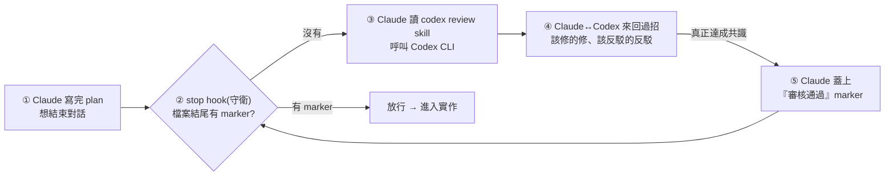

# Cross-Model Review:用 stop hook + skill + marker 讓 Claude 跟 Codex 自動互審(自建 harness)

> 整理自 YouTube「Gary Chen」〈AI 寫的 code 一堆 bug?讓 Claude 跟 Codex 自動互審〉(2026-06-27,約 12.5 分鐘)。這是一套作者用了兩個多月的實戰工作流:**讓 Claude 寫 plan、Codex 當 reviewer 自動互審,直到兩個模型「達成共識」才放行**——而且整套用 Claude Code 的 **stop hook + skill + 一個 marker 暗號**做成系統,不靠人的紀律。
>
> 一句話:**與其祈禱 AI 不出錯,不如建一個「讓它可以出錯、但錯誤會被 harness 接住」的環境。**

---

## 一句話總結

- **痛點**:vibe coding 生出的東西總有盲點——漏 corner case、邊界沒處理、跑起來一堆 bug,來回改的時間全卡在這。
- **解法**:**cross model review**——Claude 跟 Codex 各有脾氣、各有強項,兩個都要、各取所長,讓它們**自動互審**。
- **關鍵設計**:把「找第二個 AI 審稿」這件常會偷懶跳過的事,**做成系統、每次自動發生**,完全不依賴當下想不想做。

---

## 1. 角色分工:主力 vs Reviewer

| 角色 | 模型 | 個性 |
|---|---|---|
| **主力/作者** | **Claude** | 像班上第二名——合作愉快、討論細心、能懂你、偶有驚喜,**但偶爾粗心、細節沒顧到** |
| **Reviewer/審稿** | **Codex** | 很無聊、沒火花,**但就是穩**,尤其後端複雜邏輯可靠,考試常第一名 |

> 職責沒有對錯、純看偏好(Codex 比 Claude 便宜,也可反過來)。但作者的原則:**reviewer 這個位子要找「那個無聊、但永遠不出錯的人」守最後一道關**——把關要的是穩,不是有趣。

**為什麼不讓 Claude 自己再檢查一遍?** 因為一個模型用**同一套腦袋 + 同一套假設**檢查自己,一定有盲點(你自己讀三遍還有錯字,別人一眼就看到)。而且不同模型**訓練側重不同**(Codex 做前端常給吐血設計,Gemini/Claude 較好)——換個第三方視角,更高機率抓到盲點。

---

## 2. 從純手工到系統:為什麼非做成 harness 不可

作者最早是**純手工**:Claude 寫完 plan → 整份複製貼到 Codex 叫它 review → 拿 feedback 貼回 Claude 改 → 再貼回 Codex 複查 → 來回數輪到兩邊共識。體感:**架構更乾淨、技術債變少、後修 bug 頻率大降**。但兩個問題:

1. **自己成了瓶頸**:當那個「複製貼上的人肉橋樑」。單線還好,但多功能並行要用 **worktree**(同時三四條開發線),每條 plan 都手動跑好幾輪 review,光切換上下文就快瘋。
2. **偷懶會出包**:小 plan 瞄一眼想「應該沒事」就跳過 review,**結果出包的偏偏就是這些**;省下的 5 分鐘,後面花一兩小時擦屁股。

> **起點:人的紀律靠不住。** 與其逼自己每次都記得,不如把它做成系統。

---

## 3. 系統兩塊 + 一個暗號(出版社比喻)

比喻:出版社出書——**作者(Claude)寫稿、門口守衛(stop hook)只認「審核通過的章」、審稿人(Codex)跟作者來回討論到蓋章(marker)**;老闆(你)從頭到尾只看最後定稿,中間吵架修改都不用管。

- **① stop hook(守衛)**:Claude Code 的機制,**每次 Claude 想收工、要把控制權交還給你之前會被觸發**。它能「放行」或「擋下來 + 塞一段訊息回去讓 Claude 不結束、把訊息當新指令繼續做」——**這個「能擋下結束並塞提示詞」的能力就是整套系統成立的關鍵**。它做三件事:掃這輪有沒有寫出 implementation plan → 翻檔案結尾看有沒有 marker → **沒有就擋下、塞話叫 Claude 去跑 codex review skill**。只負責攔,不負責審。
- **② skill(審稿方法論)**:Claude 被攔下後讀這份 skill → 依指示調用 **Codex CLI tool** 請它 review → 直到 Codex 放行,再回頭在**檔案結尾蓋上 marker**。
- **③ marker(暗號)**:寫在檔案結尾的一段文字。守衛只認 marker(看到放行、沒看到攔),而 marker 只有 skill 審過才蓋得上。

> **為什麼拆兩塊?解耦**:攔截失敗/行為異常 → 修 stop hook;review 品質不佳 → 改 skill 的方法論。各司其職。

---

## 4. 最重要的兩個實驗心得

### ① 通過標準 = 真正達成共識,不是「滿三輪」

Codex 不能為了趕快結束就放水點頭,Claude 也不能為了過關就裝問題不存在。**每個爭議 Codex 都要明確表態**:要嘛被說服、承認你對,要嘛堅持、講清楚在堅持什麼。**沒達成共識就不准收工。**

> 作者一開始設「最多三輪」上限,結果發現這會逼出很糟的結果——**到第三輪不管解決沒,它都會為了結束而假裝沒問題**,完全違背初衷。所以**拿掉上限,只認共識**。

### ② 收斂關鍵:從頭到尾只開「同一個」Codex 對話

LLM 有 **sycophancy(討好)傾向**——你請它 review,它就會想辦法挑出問題。若**每輪重開新 session**,每次都冷啟動、什麼都不記得,就會一直挑出**新的、不重要的小毛病**,永遠改不完 → over-engineering、沒完沒了。

**但用同一個對話**:它記得上輪講過什麼 → 第一輪把主要問題一次抓出來、你修掉;下一輪它是來**驗收**的,往共識收斂,而不是重新發明一堆新問題。缺點是第一次漏看可能漏掉關鍵 bug,**但這樣已能解決 80% 問題、省大量時間**——「我要的是 Codex 一次抓出真正重要的問題,不是陪我玩到天荒地老」。

**具體例子**:叫 Claude 規劃電商下單功能,plan 漂漂亮亮寫著「必須保證不超賣」,但**整份沒寫具體處理方法**——只剩最後一件時兩人同時下單那一瞬間怎麼辦?(Claude 可能 context 過長遺漏,或處理 corner case 本就易粗心。)換 Codex 用第三方客觀角度審,就有更高機率發現這個盲點。

---

## 5. 往上拉一層:這是在替自己建一套 harness

作者強調:他做的不只是「找第二個 AI 審稿」,而是**根據自己的使用習慣替自己建一套 harness**——harness = 包在 AI 外面的整套工作環境(你給它的限制、流程、跟工具),就像老闆幫員工準備舒服辦公室來提高效率。

- **stop hook = 強制約束**(逼流程走完、不給偷懶空間);
- **skill = 工作方法**(定義怎麼審);
- **marker = 握手暗號**。

> **cross model review 只是這套 harness 裡的一塊**,同樣思路可以拿去包**任何你本來就會做、但常偷懶跳過的事**。Harness 不用複雜——像好產品不用花俏,只要能解決生活中不起眼的小摩擦(如「來回複製貼上」),就足以大幅提高效率。

**對 solo developer 特別重要**:沒有同事幫你 code review、所有洞自己扛 → 反過來**建一套系統當「永遠不累、永遠不偷懶的同事」24 小時幫你守著**。一個人,也可以有一整個團隊的把關。

---

## 應用案例 / 怎麼用這套思路

- **直接複刻這套 cross-model review**:主力(Claude)寫 plan → stop hook 攔截 → skill 呼叫 Codex CLI 互審 → 共識後蓋 marker 放行。適合**用 worktree 多線並行**、又怕偷懶跳過 review 的人。
- **把「你會偷懶跳過的事」都做成 hook**:不只 code review——測試、安全掃描、文件更新、commit 前檢查……凡是「該做但常忘/常懶」的,都可用 stop hook 強制、用 skill 定義方法。**紀律靠系統,不靠意志力**(呼應 [[loop-engineering-when-and-how-gary-chen]] 的 hard stop 與 [[compilot-llm-guided-loop-optimization]] 把驗證交給可信檢查)。
- **審核要「異質模型 + 同一對話 + 共識為準」**:別讓模型自審(同腦袋有盲點);別每輪重開 session(sycophancy 會無限挑毛病);別設固定輪數(會逼出假裝沒問題)。這三點是讓 review 收斂又有效的關鍵——與 [[mixture-of-agents-moa]](獨立多視角聚合)、[[agent-harness-loop-llmops-eval-explained]](產出/檢查分開避免球員兼裁判)同源。
- **從「手動救」升級到「問系統為什麼讓它過關」**:AI 一直產出不夠好的東西時,與其每次自己跳下去救,不如回頭封殺那個讓爛東西過關的系統漏洞,讓它下次不再發生。

> 延伸對照:[[agent-native-tooling-steinberger]](為 AI 造工具/接口是複利)、[[self-harness]](agent 自我改進 harness)、[[building-claude-skills]](Skill 實戰)、[[claude-md-12-rules]](把踩過的坑寫成規則)。作者的 stop hook 設定與 codex review skill 放在其 Patreon。

---

## 來源

- Gary Chen(@garytalksstuff),〈AI 寫的 code 一堆 bug?讓 Claude 跟 Codex 自動互審〉,YouTube:<https://youtu.be/xzrvAERmvRk>(2026-06-27,約 12.5 分鐘)
- 本文依該片**官方 zh-TW 字幕**整理。作者提及:Claude Code 的 stop hook 機制、Codex CLI tool、cross model review skill(完整設定於其 Patreon);sycophancy(模型討好傾向)、worktree 多線並行。
