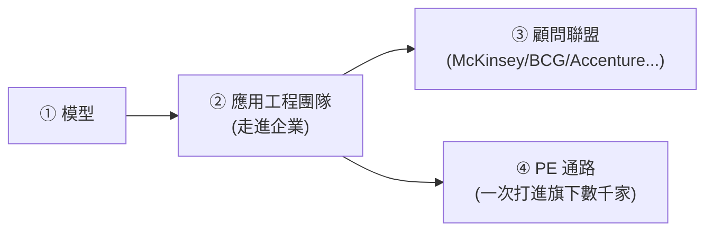

# 落地競賽:OpenAI 與 Anthropic 同日進軍企業導入,承認「只有模型沒用」

**主題分類:** AI / 代理工程 — 企業應用與產業趨勢
**來源:** YouTube〈Anthropic 跟 OpenAI 一起承認了只有模型是沒用的〉(Gary Chen,2026-05-10,約 16 分;依繁中逐字稿整理)
**整理日期:** 2026-05-30

---

## 1. 事件:同一天,兩家都往「顧問業地盤」走

2026-05-04:
- **Anthropic** 與 Blackstone、Hellman & Friedman、Goldman Sachs 合資成立 enterprise AI services 公司,讓 Applied AI engineers 進企業一起找出 Claude 能放進哪些核心流程、做客製方案與長期支援。
- **OpenAI** 成立 **The Deployment Company**,跟 PE / 資產管理公司合作把技術深入部署進企業。

> **核心洞見:企業真正買的不是模型,而是「落地能力」。** 企業缺的不是更聰明的聊天機器人,而是有人能把 AI **安全、穩定、可控、可衡量** 地放進真實工作流程。AI 下一個戰場不是「誰的模型更會回答」,而是 **誰能讓企業真的改變工作方式**。

---

## 2. 為什麼企業導入這麼慢?是「責任問題」

模型費用常只是 AI 導入成本的一小部分(就像買 SAP ≠ ERP 跑得起來、買 Salesforce ≠ 流程被重塑)。真正花錢花人力的是:接資料、權限、資安合規、改流程、訓練員工、串 ERP/CRM/客服/財務/法務、設計 human-in-the-loop、eval/監控/回滾。

**真正的瓶頸是「AI 出錯誰扛責任」:** 個人用錯了自己修;但企業裡 AI 改錯財報 → SEC 上門、發錯客戶信 → 品牌災難、誤拒理賠 → 法律訴訟。

> **企業要的不是更厲害的模型,而是「能在明確 permission 框架內運作的 agent」。** 例:退款 agent 可讀客戶歷史/查訂單/判斷理由,但 **不能直接退錢、超過 $500 一定要人批准**;客服 agent 可草擬、寄出前要人過目。**「信任」不是你信不信 AI 厲害,而是企業的決策結構能不能容納 AI**(能讀?能寫?能寄信?能花錢?何時停下問人?誰批准?出錯怎麼追蹤?)。

**傳統企業是 Brownfield:** 20 年客戶資料散在 8 個 schema、流程文件最後更新在 2017、很多流程只有老員工知道、法務/資安/財務各有紅線。做 demo 簡單,**進入這種混亂又真實的場景才難**。

---

## 3. 兩家的同一套 Playbook(四塊)

- **OpenAI:** Frontier(建/部署/管理能做真實工作的 agents)+ Frontier Alliances(McKinsey/BCG/Accenture/Capgemini)+ The Deployment Company(TPG/Bain 通路)。想當「企業 AI 的預設作業系統 = AI 時代的 Microsoft」。
- **Anthropic:** Goldman 合資公司(點名 community banks、中型製造、區域醫療系統等中型企業)+ Claude Partner Network(McKinsey/BCG/Bain/Accenture/Deloitte/PwC + AWS/Google Cloud)。用 **governance-first** 品牌「打深」,成為「你最願意讓它碰核心業務的夥伴」。
- **差別只是 emphasis:** OpenAI 用 6.5 倍資本打廣;Anthropic 用更小資本 + Goldman 中型通路打深。

**對顧問業是重組不是消滅:** 過去顧問出報告/畫 roadmap;現在還得懂 agent engineering、資料架構、eval、guardrail、demo→production。所以顧問與模型公司互相結盟(Accenture-Anthropic 訓練 3 萬人、Deloitte 認證 1.5 萬人),但 **權力中心正從「顧問方法論」移向「模型公司的平台與部署能力」**。

---

## 4. 應用案例:企業 AI 成熟的樣子是「一套無聊的框架」

不是「它自己完成了一整件事」的炫 demo,而是 **可預測、有邊界、可審核、可修復、可回滾**。企業在乎的是:每次都穩定完成嗎?知道何時不能做嗎?做錯能查嗎?紀錄夠完整嗎?能限制權限嗎?碰高風險會停下嗎?

> 企業不需要「什麼都能做一點」的 agent,而需要「**知道自己在什麼流程裡、有什麼權限、達成什麼標準、遇到什麼狀況要停下來**」的 agent。這正是本 repo [[claude-skills-governance-man-group]](Man Group 用 permission 框架 + skill 治理把 AI 放進系統化交易)的真實範例,也是 [[ai-harness-explained]] 講的 harness 在企業端的形態。

---

## 5. 對企業 / 個人的啟示

- **企業:別再只問「買 ChatGPT 還是 Claude」**(那是最後一步)。要問:哪些流程最值得 AI 化?哪些動作可自動、哪些要主管批准?哪些資料能給 AI?怎麼評估表現、出錯怎麼追蹤/回滾?**AI strategy 是重設工作系統,不是採購決策。**
- **個人:會用 ChatGPT 很快變成像 2010 年會用 Excel 的基本能力。** 真正值錢的是:能理解業務流程、找出斷點、判斷哪裡適合 AI、設計 workflow/權限/審核/guardrail/eval、把 demo 推到 production。**產出變便宜後,稀缺的是 comprehension(理解、判斷、評估)。** 叫他 AI consultant / AI operator / AI workflow architect 都行——這種「懂業務、懂流程、懂 AI、也懂責任邊界」的人會越來越值錢。

> **AI 商業化的兩階段:** 第一階段模型競賽(贏家寫在 leaderboard);第二階段落地競賽(贏家寫在企業的 SOP 裡)。

---

## 來源

- [YouTube:Anthropic 跟 OpenAI 一起承認了只有模型是沒用的(Gary Chen)](https://youtu.be/MlhsoWmyEKE)
