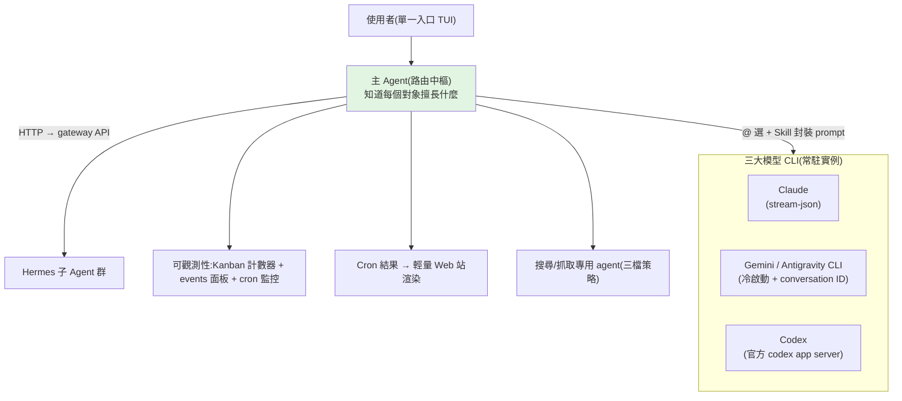

# 把 Hermes 爆改成「主 Agent 中樞」:統一調度 SubAgent 與 Claude / Gemini / Codex

> 一個進階實作案例:把 **Hermes**(一個帶 TUI、看板 Kanban、gateway、plugin、skill、cron 的 AI agent 框架)
> 改造成 **「主 Agent 路由中樞」**——在單一入口裡,主 agent 能識別所有子 agent 與三大模型 CLI(Claude、Gemini、Codex),
> 依任務**自動把工作路由給最合適的對象**,並補上任務監控、cron 結果渲染、分層網路抓取。
>
> 整理自「科技新征程」影片(簡體中文字幕)。**重點是架構思路**(作者改了 Hermes 原始碼,未公開程式碼)。

---

## 為什麼要改:深度使用時的三個痛點

1. **一直切視窗**:要分別開 Claude、Gemini、Codex、Hermes 各自的介面,專注度被打散。
2. **訂閱方案沒有 API key**:三大模型的訂閱套餐通常不給 API key,沒法直接接進 Hermes;而高難度/開發任務又**非用它們不可**。
3. **複雜任務缺調度**:沒有一個「知道誰擅長什麼、能自動分派」的中樞。

解法:**做一個主 agent 當單一入口,把其他 agent 與三個 CLI 都掛在它底下調度。**

---

## 一、主 Agent 作為單一入口(改 TUI)

- 把 Hermes 預設 agent 當**主入口**,在裡面直接和其他 agent 對話(含 Hermes 自己的子 agent,以及 Claude/Codex/Gemini),
  邏輯像一般聊天軟體,**不同 agent 的回覆加上名稱標識**方便區分。
- **主 agent 認識所有子 agent、知道各自專長**,任務複雜時**自動把子任務分派(delegate task)**給合適對象,也知道三大模型各擅長什麼。
- **互動**:在 TUI 輸入 `@`,原本顯示 git 指令的 panel 被改成「可通訊的 agent 與 CLI 清單」;prompt 送出後解析內容,決定走 gateway 還是呼叫 skill。
- 受限於 TUI/終端,能改的有限;想要更好的多 agent 可視化可用 **Herdr**(基於 Tmux,可用滑鼠切 panel/tab、直觀顯示 agent 狀態)。開發專案作者仍偏好 IDE + 大模型外掛(VS Code 現也能接 Hermes)。

## 二、整合三大模型 CLI(沒有 API key 的繞法)

訂閱套餐沒 API key → **改成讓 Hermes 呼叫各模型的 CLI**。直接用命令列傳 prompt 可行,但**每次冷啟動 CLI 進程很慢**。

- **解法:常駐單一實例**。參考 IDE 外掛做法,用 CLI 的 **ACP 模式**(或類似機制),Hermes 執行期間盡量只啟一個實例,
  透過 **TCP + JSON-RPC** 與 CLI 通訊 → 既保持對話連續,又免去每次冷啟動。
  - **Claude**:用 `stream-json`。
  - **Codex**:複用官方 **codex app server**。
  - **Antigravity CLI(Gemini)**:目前不支援 ACP,仍冷啟動,但靠傳 **conversation ID** 保持對話連續。
- 全部封裝成 **Python 腳本**:Hermes 啟動時執行、退出時關閉對應進程;切 workspace 只要啟動時加 `workdir` 參數。
- 寫了 **3 個 Skill**(對應 3 個 CLI):負責把 prompt 封成 JSON 經 TCP 送給 CLI,內建 **fallback**——偵測到 CLI 進程沒起,就自動降級走命令列冷啟動。

## 三、Agent 之間怎麼對話(預設是隔離的)

- Hermes 的 agent 之間**預設相互隔離、不能直接對話**;但**每個 agent 都有自己的 gateway**,內部有 API server(各種第三方 UI 就是 HTTP 呼叫這些 API)。
- 主 agent 就**發 HTTP 請求**把 prompt 傳給其他 agent。
- 寫了一個 **plugin**:初始化時檢索本地設定,把「sub-agent / CLI 的資訊 + 連線方式 + 使用方法」**註冊進 Hermes 設定**;
  調用層再讀設定、封裝資訊,呼叫 gateway 介面或對應 skill。
- 於是主 agent 知道有哪些子 agent/CLI 可用;**用一陣子後還會記住誰擅長什麼**,下次遇到複雜多模態複合任務,就能自主把任務**精準路由**。

## 四、可觀測性:看得到任務狀態

- **status line 加 Kanban 任務計數器**(看板是所有 Hermes agent 共用,計數=當前所有運行中任務數,歸零=全部結束)。
- 但**計數器看不出 blocked**,所以再加一個 **events 面板**(輸入 `events` 打開):看板任務最終狀態、cron job 執行結果都在這。
- **Cron 監控**:`Cron` 資料夾下的 `jobs.json` 記錄每個 job 最後一次運行狀態;週期性讀它就能監控**失敗**的 job(每天定期跑的 job,重點是看失敗而非成功),把記錄寫進本地 DB,events 面板再從 DB 讀出顯示。

## 五、Cron 結果渲染:自建輕量 Web 站

- 透過 CLI/TUI 建立的 job **沒有服務端**,執行結果無法直接投遞;投到手機聊天軟體又**渲染很差**。
- 解法:搭一個**輕量 Web 站**,定期掃描 job 的持久化輸出、序列化後給前端;前端**按資料型別選渲染元件**(Markdown、圖表 chart 等)。
- 配合內網穿透或直接部署雲端 → **任何地點、任何終端隨時查看**。

## 六、搜尋與抓取:三檔優先策略(生產力關鍵)

大模型的聯網搜尋/抓取能力直接影響工作結果品質。Hermes 自帶工具多走第三方 API(如官方推薦的 **Firecrawl**),免費額度很快用完。

- 作者改用 **Gemini / Codex 訂閱自帶的 Web search**(專業方向效果不錯);且「網路越來越封閉,傳統搜尋引擎搜得到的內容已打折」,兩類能力搭配用。
- 深度技術調研常要到特定站做**結構化抓取** → 需要瀏覽器自動化:
  - **camofox**(官方推薦):輕量、內建反爬偵測與搜尋宏,做 headless 抓取。
  - 反爬強/需登入的站 → 用 **CDP** 控制**日常使用的瀏覽器**,複用既有 session/cookie/指紋,繞過多數偵測、也省去維護登入狀態(但直接操作主瀏覽器有安全風險)。
  - 推薦開源 skill **web-access**:依場景動態挑抓取策略、用 CDP 控制日常瀏覽器、**按域名固化操作經驗跨 session 複用**、用背景 Tab 抓取(不影響當前 Tab)、效率比裸用 CDP 高。
  - Codex / Claude Code 自帶瀏覽器外掛:穩定安全但效率偏低;Hermes 的 computer use 更慢,當兜底。
- **做一個搜尋抓取專用 agent**:只裝搜尋/抓取相關 skill,優先級固定三檔——**① 雲端 API / 模型內建 web search → ② 動態無頭瀏覽器(camofox)→ ③ CDP 託管日常瀏覽器**。兼顧效率與成功率,並透過長期使用**總結經驗、自我進化**。

---

## 取捨與提醒

- 這些優化**改了 Hermes 原始碼**,不一定符合官方設計理念;官方後續也會逐步優化這些體驗,所以作者**只分享思路、不分享程式碼**。
- **安全風險**:用 CDP 直接操作你日常的主瀏覽器,自動化腳本等於拿到你的登入狀態,要自行評估風險。
- 終端/TUI 能改的有限;若要更極致的多 agent 協同,下一步可能得**脫離 CLI、做一個本地 GUI 客戶端**。

---

## 應用案例

- **多模型分工一站式**:在主 agent 裡輸入 `@`,把「寫程式」丟給 Codex、「長文推理」丟給 Claude、「聯網查資料」丟給 Gemini,
  不用在四個視窗間切換——這正是 [[task-decomposition-agentic-workflow]] 的「拆任務 → 路由給最合適的執行者」落到多模型的版本。
- **繞過訂閱無 API key 的限制**:把訂閱方案的 CLI 以 ACP/常駐實例 + TCP 接進來,既省 API 費用又保住對話連續性(代價是要自己維護封裝腳本與 fallback)。
- **無人值守 cron + 隨處查看**:讓 agent 每天定時跑任務,結果自動進輕量 Web 站按 Markdown/圖表渲染,手機也能看;失敗的 job 用 `jobs.json` 監控告警。
- **深度抓取被反爬擋住**:用 web-access 走 CDP 複用日常瀏覽器的登入態,跨 session 固化每個網站的抓取經驗——呼應 [[grep-vs-vector-agentic-search]]「agent 的檢索/抓取能力是結果品質的關鍵變數」。

---

## 一句話總結

> 與其在多個 agent / 模型視窗間切換,不如**做一個主 agent 當路由中樞**:用 gateway(HTTP)串子 agent、
> 用 ACP/常駐 CLI(TCP+JSON-RPC)串三大模型、用 plugin 註冊「誰擅長什麼」讓它自動分派,
> 再補上任務監控、cron 結果渲染與**分層網路抓取**。核心理念和 [[function-calling-mcp-a2a]]、[[task-decomposition-agentic-workflow]] 一致:
> **把多個專才用標準介面接起來、由一個會路由的中樞調度,遠勝於塞一個什麼都做的 mega agent。**

---

## 來源

- YouTube:[把 Hermes 爆改成超強主 Agent:無縫調度 SubAgent、Claude、Gemini 與 Codex(科技新征程)](https://www.youtube.com/watch?v=QAhJRYua62k)
- 影片提到的工具:[Herdr(Tmux 多 agent 可視化)](https://herdr.dev/)、[web-access(動態抓取 skill)](https://github.com/eze-is/web-access)、[camofox(輕量反爬瀏覽器)](https://github.com/jo-inc/camofox-browser)。
- 延伸:本庫 [[task-decomposition-agentic-workflow]]、[[function-calling-mcp-a2a]]、[[grep-vs-vector-agentic-search]]、[[building-claude-skills]]。
