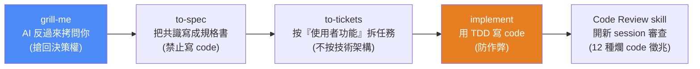
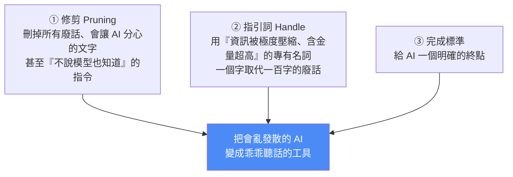

# Matt Pocock 的 AI 開發 skills 全拆解:最紅的 skill 只有五行字,強在哪?

> Gary Chen(@garytalksstuff)拆解 TypeScript 大神 **Matt Pocock** 開源的 AI 開發工作流(GitHub 16 萬+ 星、700 萬次下載)。核心洞察:**這套 skill 真正開源的不是幾個 prompt,而是「如何用你在專業領域積累的思維與語言,去駕馭 AI 這個黑盒子」。** 延伸自 [[building-claude-skills]]、[[top-skills-for-agents]]、[[ai-brownfield-codebase-five-steps]]。

---

## 一、命題:AI 開發真正難的不是寫 code 的速度,是「控制 AI 的隨機性」

Matt Pocock 這一年幾乎把重心整個搬到 AI。大量依賴 AI 開發後他發現:**比起寫 code 的速度,更難的是怎麼控制 AI**——因為 AI 本質是一個充滿隨機性的黑盒子。這套工具的終極目標,就是**控制這種隨機性**。

**與其他框架(Spec-Kit、Superpowers、Get Shit Done)的根本差異:** Matt 認為那些大框架的毛病是「想把你整個開發流程接管過去」——把寫規格、做計畫、實作全綁成**一條又重又硬的固定流程**,只要前面一步定歪,錯誤就順著整條線傳染到後面,想改往往整條重跑。

> **Matt 走完全相反的路:每個 skill 刻意做得很小、很好改、還能自由拼裝。這個「小 + 模組化」的理念,是他後面所有東西的底層邏輯。**

---

## 二、主生產線:五個 skill 怎麼接力

### ① grill-me —— 讓 AI 反過來拷問你(只有五行字)

被幾百萬人下載的 skill,打開來**只有五行字**:
1. 在對接下來的計畫**沒達成共識前,把我往死裡問**;
2. 像畫心智圖一樣**順著你的思路延伸**,把每個決定背後的連鎖反應一個個抓出來問到底;
3. **每次只能問一個問題,且必須附上建議答案**;
4. **共識達成前,絕對不准偷偷跑去寫程式**。

**為什麼大神要特地寫這五行?** 因為**寫程式的本質是連續做出幾百個微觀決定**(防呆怎麼做?斷線怎麼辦?極端資料怎麼處理?)。如果你把模糊想法直接丟給 AI 憑感覺做(Vibe Coding),等於**把這幾百個決策權全外包給黑盒子**;而 AI 為了討好你,通常會**瞎掰出一套最難維護的架構**——這是生產級軟體的噩夢。

> 🔑 **這五行字的唯一目的:把決策權搶回人類手裡。** Matt 知道要人類面對空白螢幕從零寫出涵蓋所有極端狀況的完美企劃書太痛苦,所以**用 AI 順著決策樹無情挖出你的盲點,但 AI 只負責給選項、拍板永遠是人類**——這樣人類才能穩坐架構師位置。

### ② to-spec —— 把共識寫成規格書(禁止寫 code)

一關掉對話 AI 就失憶,所以趕快用 to-spec 把共識存成規格書。**但 Matt 完全禁止 AI 在寫 spec 時引用或寫任何程式碼。**

> **為什麼這麼極端?** 因為軟體工程界最大的痛是「**文件永遠跟不上程式碼更新的速度**」。程式碼是最容易變動的;若讓 AI 把 code 寫進規格,未來 code 一改就跟規格對不上,下次請 AI 照規格改功能,它會被規格裡**過期錯誤的舊 code 搞混,越改越亂**。所以直接封殺——確保規格書永遠只專注在「**這功能到底要解決什麼問題**」。

### ③ to-tickets —— 按「使用者功能」拆任務(不按技術架構)

專治「AI 規劃任務總是很爛」。**AI 天生壞習慣:喜歡按技術架構分工。** 例如做電商,它會先把全部資料庫建好 → 再把後端邏輯全寫完 → 最後才畫前端。

> **最可怕的盲點:在最後一步畫面出來前,你完全沒辦法測試任何東西。** 第一步資料庫建錯,要等做前端時才發現,前面全毀。

to-tickets 強制改用**使用者功能**拆:同樣電商切成「①會員登入(含專屬登入的資料庫+邏輯+畫面)②加入購物車(同樣完整三層)」。好處:**第一個任務做完就能立刻打開瀏覽器測試**,不是蒙眼寫幾千行才開始審核。附帶還會排好任務順序,**互不干擾的任務可同時發包給多個 AI 平行處理**,速度翻倍。

### ④ implement —— 用 TDD 寫 code(防 AI 作弊)

下實作指令,它照任務清單寫 code、自動用 **TDD(測試驅動開發)** 引導、寫完自己呼叫 Code Review。

> **為什麼 TDD 對 AI 開發這麼重要?因為 AI 骨子裡是個作弊仔。** 若讓 AI 先寫算錢程式再補測試,萬一它把「滿 1000 扣 100」寫成扣 200,它為了交差**會直接生一個假測試**說「滿 1000 必須扣 200,檢查通過!」——拿自己寫錯的邏輯配一個絕對會過的測試,你根本抓不出 bug。

**TDD 防作弊的順序:** 寫任何一行程式前,AI 必須先把測試**定死**(「滿 1000 就是只能扣 100」)→ 這時程式還沒寫,測試一跑絕對失敗亮**紅燈** → 紅燈出現才准 AI 寫真正的算錢程式 → 直到紅燈變**綠燈**。用「先寫測試、再寫程式」徹底鎖死 AI 亂寫交差的空間。

### ⑤ Code Review skill —— 開新 session 審查(12 種爛 code 徵兆)

**開一個全新 session 做 Code Review**,讓 AI 在最乾淨、最聰明的狀態下檢查,避免被寫程式時的記憶干擾。它不是空泛地說「幫我看有沒有 bug」,而是**把軟體工程界幾十年公認的爛 code 症狀寫成具體檢查清單**(取自經典名著《Refactoring》的 12 種)。三個新手最容易踩的:

| 症狀(指引詞) | 白話 | Code Review 要求 |
|---|---|---|
| **Shotgun Surgery** | 改一個按鈕顏色卻要打開十幾個檔案改(散彈槍手術) | 把它們重新集中起來 |
| **Feature Envy** | 處理訂單的 code 老跑去管庫存的檔案拿資料算 | 這段邏輯放錯位置,搬去訂單那邊 |
| **Data Clumps** | 買家姓名/電話/地址總是同時出現、散著傳來傳去 | 打包成一個「聯絡人」物件 |

---

## 三、為什麼他的 skill 這麼短又這麼強?——`writing-great-skills`

Matt 每個 skill 都非常短、非常精鍊,秘密藏在 `writing-great-skills`。核心理念:**在 AI 面前,你多寫一句廢話,AI 就多一分分心的可能。** 三個原則:

- **修剪(pruning):** 這就是為什麼 grill-me 只用五行字——**確保每一句指令都有實際作用**。
- **指引詞:** 像 `Data Clumps` 這種**深植在 AI 訓練資料裡的經典專有名詞**——你對 AI 說這個字,等於說了「請檢查有沒有總是綁在一起出現的變數,有的話打包成獨立物件」。Matt 大量運用這種術語,**用一個字取代一百字的廢話解釋**。

> 🔑 **這正是本庫 [[gpt-5-6-prompting-guide-openai]] 講的「先做減法」與 [[defining-tasks-not-prompts]] 的實作典範**——精鍊不是省字,是把領域知識壓進 AI 聽得懂的術語。

---

## 四、隱形炸彈:淺模組 vs 深模組(整套系統最有料的一段)

即便把 AI 訓練成頂級工程師,專案仍有一顆隱形炸彈:**邏輯過度碎片化**。AI 寫 code 太快但**天生沒有大局觀**,每次只盯著眼前幾個檔案,為了方便交差最愛寫**淺模組**。

> 🔎 **房子比喻:** 淺模組像一棟房子,廚房/客廳/臥室分得很乾淨,**但這棟房子沒有大門**——進廚房要爬窗、進客廳要爬煙囪。溝通成本極高,你要進房子卻得記住五個房間的獨立密碼跟路線。

**AI 寫購物車結帳最愛蓋這種房子:** 切成 `計算折扣`/`驗證信用卡`/`建立訂單`/`扣除庫存`/`寄信` 五個小房間,**卻沒蓋統一大門隱藏細節** → 主程式必須親自處理五間房的資料傳遞。**對 AI 尤其致命**:因為 Context Window 有限,結帳出 bug 時 AI 要在五個房間瘋狂跳轉才能看懂流程,一旦超過記憶範圍就**開始瞎猜,把原本正常的 code 也改壞**。

**深模組才是能讓 AI 發揮全力的好架構:** 不是把一萬行塞同一個大房間,而是**蓋一扇極簡的大門、把複雜房間藏在裡面**。結帳對外只提供一個 `processCheckout` 大門,折扣怎麼算、信用卡怎麼驗全藏在背後,主程式敲一次門事情就辦妥。**深模組具備極強的局部性**——AI 修 bug 只要專注讀這一個模組,所有來龍去脈都在眼前視野裡,不需去別處找線索,能精準打擊。

> **一句話:淺模組讓 AI 迷路並瞎猜,深模組讓 AI 專注並精準打擊。**

### `improve-codebase-architecture` —— 用「刪除測試」揪出淺模組

對抗淺模組危機的大掃除 skill。它不看語法,而是對每個模組做**殘酷的刪除測試**——在腦中想像「如果把這個模組拔掉、讓主程式自己處理,會發生什麼事?」:

- 拔掉後**天下大亂**(隱藏的複雜邏輯全炸回主程式)→ 這是**有在做事的深模組**,留著;
- 拔掉後**程式碼反而變清爽**(原本要跳兩個檔案,現在集中在一處)→ 這模組**沒隱藏任何細節、是多餘空殼**,清掉。

**日常用法:** 每隔幾天在終端機叫 AI 跑一次,它會掃描整個專案、**在你電腦上生成一份 HTML 診斷報告**畫出前後架構對比圖。你連 code 都不用看,挑一個最急迫的建議說「就照這個方案重構」即可。

---

## 五、跟 Superpowers 比一比:你適合哪一種?

| | **Superpowers** | **Matt Pocock skills** |
|---|---|---|
| 哲學 | 完整定義工作流、**寫死九個步驟**逼你想清楚才動工 | **極簡 + 模組化**,一個 skill 只解決一個問題 |
| 比喻 | 已組好的**自動化生產線**(品質穩定) | 一盒**隨插即用的樂高積木** |
| 適合的模型 | 模型還笨、容易偏題時,保母級防呆非常管用 | GPT-5.6 / Fable 5 這種**理解力極強**的模型 |
| 彈性 | 希望你乖乖從頭走完,產出的文件為它下一步量身打造、**別人難接手** | 手上有份規格(自己寫/主管給/別的 AI 產),**直接丟給 to-tickets 拆**,從哪步開始/結束你決定 |

> **Gary 的判斷:** 過去模型笨時,Superpowers 的自動化生產線確保品質穩定;但**模型越來越聰明的現在,Superpowers 的死規矩反而變累贅**,Matt 這盒樂高積木**把工作主導權交還到我們手上**,更適合現在的生態。(呼應 [[bitter-lesson-cut-old-patterns]]:模型變強後,該砍掉為笨模型設計的重流程。)

---

## 六、應用案例

1. **設計前先被 AI 拷問:** 面對一個模糊需求,先跑 grill-me——不是叫 AI 做,而是叫它一題一題(附建議答案)把你沒想清楚的盲點挖出來,你只做「拍板」。這比直接 Vibe Coding 省下後面幾百個決策被亂做的重工。
2. **接手別人的規格直接拆任務:** 主管給你一份 spec,不必走完整流程,直接 `to-tickets` 按使用者功能拆成可獨立測試的 ticket,還能平行發包給多個 agent。
3. **用 TDD 綁死 AI 的算錢/計費邏輯:** 任何「有明確對錯」的功能(金額、權限、狀態機),先讓 AI 寫定測試看到紅燈,再讓它寫實作到綠燈——防止 AI 生假測試交差。
4. **每週跑一次架構大掃除:** 對 vibe code 出來、逐漸碎片化的專案跑 `improve-codebase-architecture`,看 HTML 診斷圖挑最急迫的深/淺模組問題重構——對抗 [[ai-brownfield-codebase-five-steps]] 講的「Greenfield 退化成 Brownfield」。
5. **把你的領域術語當 prompt:** 你若懂某個領域的專有名詞(不只軟體),直接把術語丟給 AI,勝過寫一百字白話解釋——前提是**你得真的是那個領域的專家**。

---

## 七、核心啟示:成為專家,才能真正控制 AI

Matt 靠深厚的軟體工程底子,把它用在兩個地方:
- **用在架構上:** 把幾十年證明有效的老方法(深模組、爛 code 徵兆)融入 skill 架構來規範 AI 行為;
- **用在與 AI 溝通上:** 把軟體工程專有名詞當 prompt 的一部分,「一位快退休的老教練給球員的一句話,聽起來簡單,裡面蘊含幾十年經驗」。

> **這打破一個迷思:很多人以為有了 AI 就不需要在自己領域精進了。但 Matt 證明——只有成為專業領域的專家,你才能真正控制好 AI。** 他真正開源給我們的從來不是幾個 skill,而是「在 AI 時代,該怎麼用你在專業領域積累的思維和語言,去駕馭 AI 這個黑盒子」。

---

## 八、重點回顧(TL;DR)

- Matt Pocock 開源 AI 開發工作流(16 萬星),核心是**控制 AI 的隨機性**,走「小 + 模組化」路線(反 Spec-Kit/Superpowers 的重流程)。
- **主生產線五 skill**:grill-me(AI 拷問你、搶回決策權)→ to-spec(禁寫 code 的規格書)→ to-tickets(按使用者功能拆、可即時測試 + 平行)→ implement(TDD 防作弊)→ Code Review(新 session、12 種爛 code 徵兆)。
- **skill 為何短又強**:`writing-great-skills` 三原則——修剪廢話、用「指引詞」(如 Data Clumps)壓縮領域知識、給明確完成標準。
- **深模組 vs 淺模組**:淺模組(沒大門的房子)讓 AI 迷路瞎猜、超出 context 就改壞;深模組(一扇簡單大門藏複雜細節)讓 AI 專注精準;用 `improve-codebase-architecture` 的「刪除測試」揪出淺模組。
- **vs Superpowers**:生產線 vs 樂高;模型越聰明,Matt 的模組化越適合。
- **終極啟示**:成為專家,才能真正控制 AI。
- (影片未盡:grill-me 進化版 `grill-with-docs`、三個 AI 寫作 skill——在 Matt 的 repo 與 Gary 的 Patreon。)

---

## 來源

- 影片:[17 萬星的 Matt Pocock skills,到底強在哪?skills 全拆解(Gary Chen @garytalksstuff,2026-07-22,官方 zh-TW 字幕)](https://www.youtube.com/watch?v=aR97E7aKEgg)
- 延伸(本庫):[Skill 實戰:從製作到維護](./building-claude-skills.md)、[4 組頂級 Agent Skill(含 Matt Pocock/Superpowers)](./top-skills-for-agents.md)、[AI 安全接手舊專案五步驟](../../ai-productivity/ai-brownfield-codebase-five-steps.md)、[OpenAI GPT-5.6 官方提示指南(先做減法)](../foundations/gpt-5-6-prompting-guide-openai.md)、[Bitter Lesson:模型變強後砍舊 prompt](../foundations/bitter-lesson-cut-old-patterns.md)
