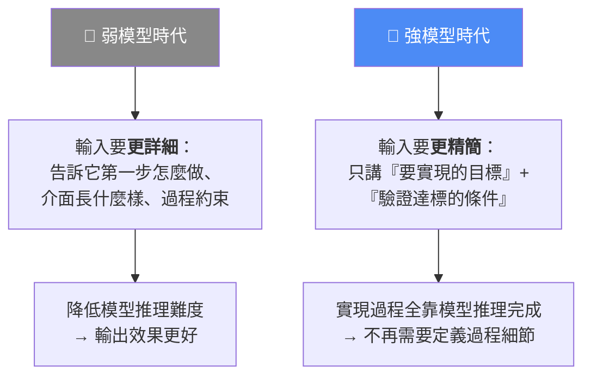
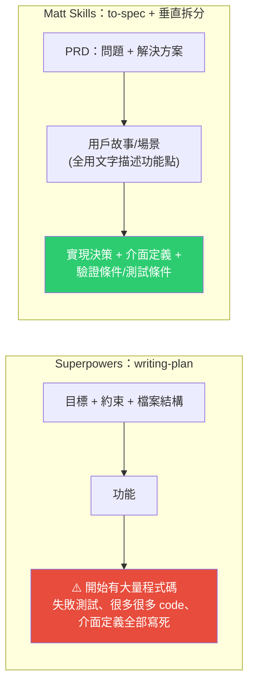
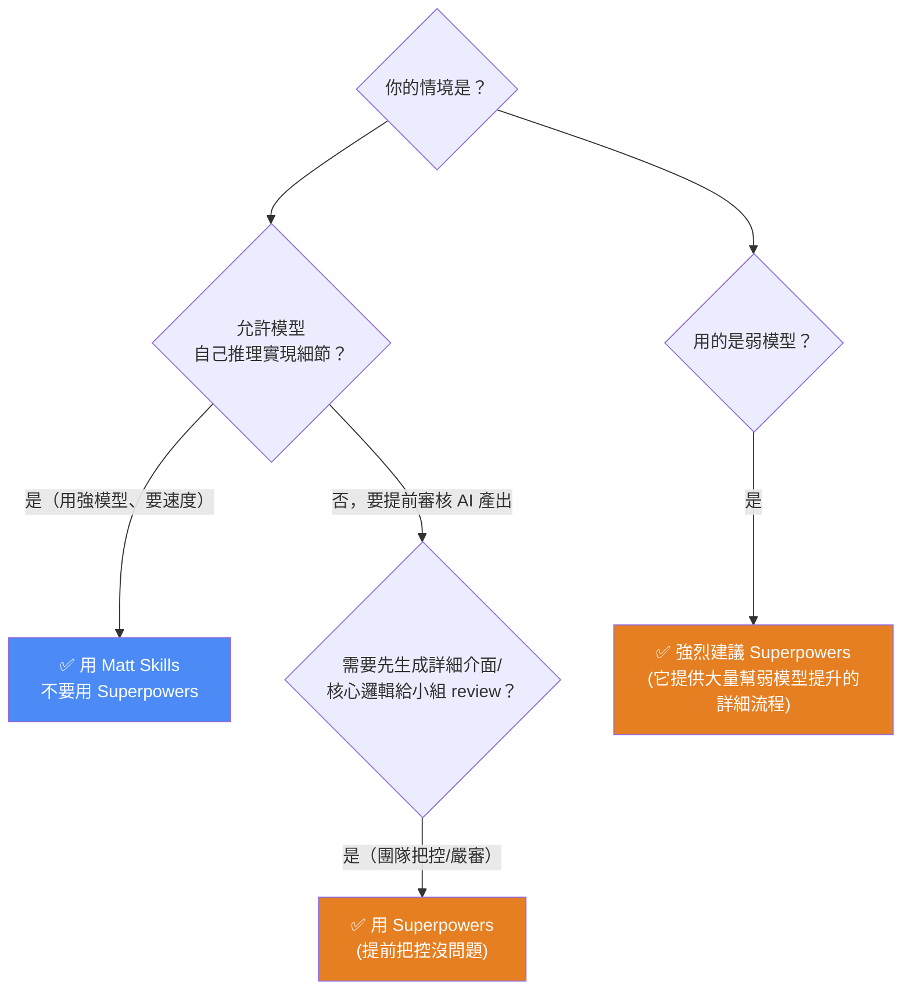

# 模型越強,Superpowers 和 Matt Skills 該刪掉誰?兩套 AI 編程工作流的選擇框架

> AI随风。兩套當紅的 AI 編程工作流——**Superpowers**(GitHub 熱度極高)與 **Matt Skills**(Matt Pocock,近期快速崛起)——有不少技能高度相似,到底該用哪個?本片的核心不是「哪個工具好」,而是一個更底層的判斷:**模型越來越強之後,過度詳細的流程到底是幫助 AI,還是限制 AI?** 這篇是 [[matt-pocock-skills-teardown]] 的延伸對照(那篇拆 Matt 五個 skill,本篇專講「模型變強該刪誰」)。

---

## 一、先理解:模型「發展」到底在發展什麼?

我們跟 AI 對話的本質是:**輸入需求 → 模型推理 → 輸出程式碼**。而模型每次版本迭代升級,提升的就是**推理能力 + 支援更長的任務(更長的推理)**。這件事會反過來改變「我們該怎麼輸入」:

**關鍵推論(對工作流/技能都成立):**
- 弱模型時 → 技能提供**詳細的過程約束**是幫助;
- 模型變強後 → 若你還提供一樣詳細的過程約束,**反而變成擁擠的上下文,限制了模型的推理效果**。

> 所以問題變成:**這兩套工作流,哪一個違反了「模型變強後提供過多細節」的原則?**

---

## 二、兩套工作流其實「骨架幾乎一樣」

先看兩者常用技能串起來的流程——**需求對齊 → 計畫 → 拆分 → 執行 → 驗收/發布**,非常相似:

| 階段 | **Matt Skills** | **Superpowers** |
|---|---|---|
| 需求對齊 | `grill-me`(拷問對齊) | 頭腦風暴(投碼風暴) |
| 生成文件 | `to-spec`(轉成 spec 文檔) | 風暴後生成文檔 |
| 寫計畫 / 拆分 | 對 spec 做**垂直拆分**成小需求 | `writing-plan`(寫計畫技能)細化 |
| 執行 | implement / TDD | TDD 或其他執行技能 |
| 收尾 | Code Review → 提交發布 | Review → 發布 |

**流程骨架相同,差別在每個技能「寫多細」。** 下面挑兩個核心技能細比。

---

## 三、核心技能對比一:需求對齊(差異小)

| | **Matt:`grill-me`** | **Superpowers:頭腦風暴** |
|---|---|---|
| 問法 | **像一棵樹**:先拆 4 個分支(主體是誰/狀態/售後…),一個分支問完再回下一個,全部問完形成**共享理解**(記下領域詞彙、奇異點、重大決策) | **蘇格拉底式**:針對當前程式碼上下文一層層追問(「什麼時候算下單成功?」→ 答支付完成 → 再往下追支付細節),幾輪問答後生成總文檔 |
| 適合 | 你只有一個**模糊想法**時,像樹一樣把需求補全再總結詞彙 | 你的需求**比較明確**時(追問層數沒 Matt 那麼全面) |
| 結論 | **兩者都高度依賴模型能力,產出結果差不多**;強弱模型都能用 | 同左 |

> 需求對齊這一步,兩套差異不大,不是勝負手。

---

## 四、核心技能對比二:寫計畫(**這才是最大差異、勝負手**)

同樣是「把對齊出的共識寫成計畫文檔」,兩者寫出來的東西**天差地別**:

- **Superpowers 的計畫文檔:非常非常細**——裡面直接**寫好大量程式碼、介面定義**。
- **Matt Skills 的計畫文檔(PRD):偏向「規格式」**——問題、解決方案、用戶故事/場景(**全用文字描述功能點,讓模型自己推理去完成**)、實現決策、介面定義、**驗證條件/測試條件**。這正是「循環工程」講的「文檔包含**你要做什麼 + 驗證它的條件**」。

> 🔑 **核心判斷:**
> - Matt 的規格式文檔**適合強模型**——功能點全靠模型推理完成。
> - Superpowers 把程式碼和介面全寫進計畫,**在強模型下是一種累贅**——模型本來就能自己推出來,你卻把它加進上下文,**只多消耗 token、還限制了模型推理**。
> - 而且 **Superpowers 後面的「執行計畫」技能會依賴前面的計畫**;一旦前面的計畫不適配強模型,**後面整條流程都走不下去**(骨牌效應)。

---

## 五、到底該「刪掉誰」?——分情況的決策框架

| 情境 | 選擇 | 理由 |
|---|---|---|
| **強模型**(GPT-5.6、Kimi K3、Fable-5)+ 要速度 | **Matt Skills** | 讓模型自己推理實現細節;過度細節反而拖累 |
| 要**提前審核** AI 產出(先生成詳細介面/核心邏輯,小組深度 review) | **Superpowers** | 需要提前把控、團隊審核時完全沒問題 |
| **弱模型** | **Superpowers** | 它提供大量「幫弱模型提升」的詳細流程 |
| 你有穩定的業務流程 | **自己寫一套**(最推薦) | 從需求對齊到提交的完整流程自訂,最利於自己控制與修改 |

---

## 六、更大的啟示:從「教 AI 每一步」進入「給 AI 目標」

> **AI 編程正在從「告訴 AI 每一步怎麼做」,進入「告訴 AI 目標,讓 AI 自己推理完成」的階段。理解這個變化,比學會某一個工具更重要。**

這與本庫多篇觀點同一條線:
- [[gpt-5-6-prompting-guide-openai]] 的「先做減法、outcome-first、絕對規則只留安全」——正是「給目標 + 驗證條件」而非「規定步驟」;
- [[bitter-lesson-cut-old-patterns]] 的「模型變強後,舊 prompt/舊流程正在拖垮新模型」——Superpowers 為弱模型設計的詳細流程,就是該砍的 model rule;
- [[matt-pocock-skills-teardown]] 裡 Gary Chen 的同一結論(Superpowers=自動化生產線、Matt=樂高積木;模型越聰明越適合模組化)——本片提供了**「寫計畫」這一步為什麼是勝負手**的技術細節。

---

## 七、應用案例

1. **手上是強模型 → 別再用「把 code 寫死進計畫」的工作流:** 若你用 GPT-5.6 / Fable-5,選 Matt Skills 的規格式 PRD(目標 + 場景 + 驗證條件),讓模型自己推實現;繼續用 Superpowers 把介面全寫死,只是多燒 token 又綁住推理。
2. **團隊要 code review 把關 → Superpowers 反而合適:** 若你的組織要求「AI 動手前先產出詳細介面/核心邏輯給人審」,Superpowers 把計畫寫得很細正好服務這個需求——這時「詳細」不是累贅而是功能。
3. **弱模型/本地小模型 → 保留詳細流程:** 跑較弱的模型時,Superpowers 的保母級步驟能顯著提升穩定度,不要盲目跟風換成極簡工作流。
4. **最佳解:照自己業務流程自訂一套:** 從需求對齊到提交,把你團隊真正需要的步驟寫成自己的 skill 集,最利於後續控制與修改——呼應 [[building-claude-skills]] 的「給心法不給死步驟」。
5. **判斷任何工作流的通用標準:** 拿到一套新工作流,先問「它在**寫計畫/執行**這步是把過程寫死,還是只給目標 + 驗證條件?」——前者適配弱模型、後者適配強模型。

---

## 八、重點回顧(TL;DR)

- 模型迭代提升的是**推理能力 + 更長任務**;因此**弱模型要詳細輸入、強模型要精簡輸入(給目標 + 驗證條件)**。
- Superpowers 與 Matt Skills **骨架幾乎相同**(需求對齊→計畫→拆分→執行→驗收),差別在「每個技能寫多細」。
- **需求對齊**差異小(grill-me 樹狀 vs 蘇格拉底式,都靠模型能力)。
- **寫計畫是勝負手**:Superpowers 把 **code/介面寫死**(強模型下是累贅、多燒 token、限制推理,且後續執行技能會被拖垮);Matt 的 **PRD 只給功能點文字 + 驗證條件**(適合強模型自己推理)。
- **決策**:強模型+要速度→Matt;要提前審核/團隊把關→Superpowers;弱模型→Superpowers;有穩定業務→自訂一套(最推薦)。
- **大方向**:從「教 AI 每一步」→「給 AI 目標讓它自己推理」;理解這個變化比學會某個工具更重要。

---

## 來源

- 影片:[模型越强,Superpowers 和 MattPocock-Skills 应该删除谁?(AI随风,2026-07-21)](https://www.youtube.com/watch?v=JPGo_5fczaA)
  - ⚠️ 該片無字幕,逐字稿以 **CPU 版 faster-whisper(small)** 轉錄取得、**非官方字幕**,可能有少量聽寫誤差(如 Superpowers/Matt Skills/Kimi K3 等專有名詞、star 數字)。
- 延伸(本庫):[Matt Pocock 的 AI 開發 skills 全拆解](./matt-pocock-skills-teardown.md)、[4 組頂級 Agent Skill(含 Superpowers)](./top-skills-for-agents.md)、[OpenAI GPT-5.6 官方提示指南](../foundations/gpt-5-6-prompting-guide-openai.md)、[Bitter Lesson:模型變強後砍舊 prompt](../foundations/bitter-lesson-cut-old-patterns.md)、[Skill 實戰:從製作到維護](./building-claude-skills.md)
