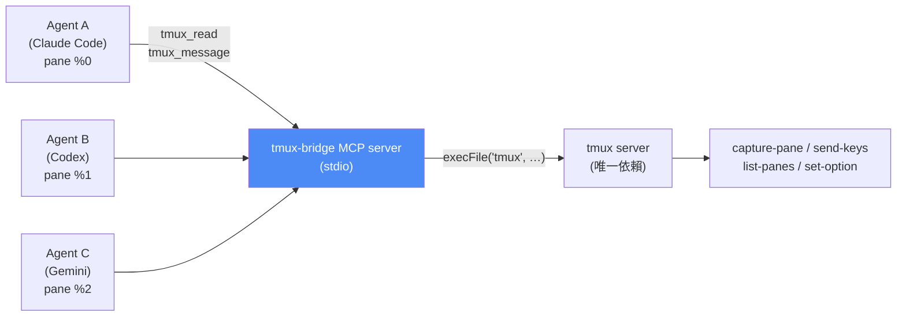
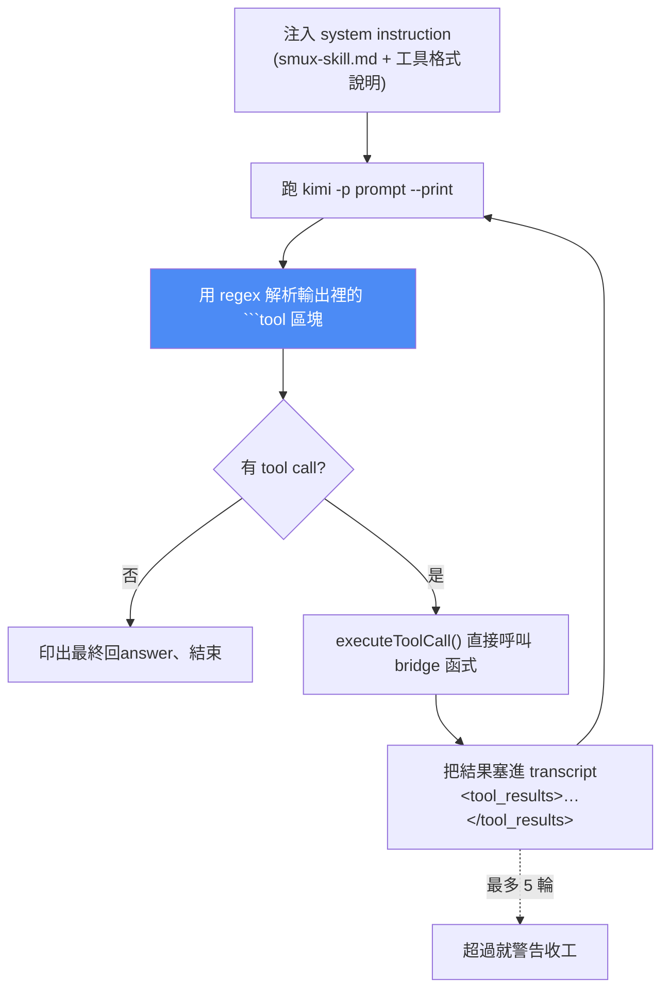

# tmux-bridge-mcp 原始碼深讀:讓多個 AI Agent 透過 tmux 分頁互相對話

> 一個獨立的 **MCP server**,讓跑在不同 tmux pane 裡的 AI agent(Claude Code、Gemini CLI、Codex、Kimi CLI)能**互相讀取、輸入、傳訊息**。整個實作只依賴 `tmux` 本身——直接用 `child_process` 呼叫 tmux 指令,沒有其他外部 CLI 依賴。
> 本筆記依 CLAUDE.md 慣例 **clone 原始碼讀完後整理**(v0.3.0,約 1,900 行 TypeScript)。

---

## 一、它解決什麼問題

**tmux** 是終端機多工器(terminal multiplexer),把一個終端機視窗切成多個 **pane**,每個 pane 跑自己的行程——像是「終端機的強化版分頁」。你可以同時開:

```
+-------------------------------+
|  Pane 1       |  Pane 2       |
|  Claude Code  |  Codex        |
|  寫程式        |  審查          |
+---------------+---------------+
|  Pane 3       |  Pane 4       |
|  Gemini CLI   |  tail -f logs |
|  做研究        |  監控          |
+-------------------------------+
```

**問題:這些 pane 彼此無法對話。** Pane 1 的 agent 完全不知道 Pane 2 在幹嘛。你只能**手動複製貼上上下文**、人肉轉達問答,或乾脆搞丟每個 agent 的進度。

**tmux-bridge 的解法:** 給每個 agent「讀取、輸入、傳訊息到任何其他 pane」的能力——全部透過**標準 MCP tool call**,agent 不需要學任何新語法,**只要支援 MCP over stdio 就能用**。



---

## 二、九個 MCP 工具(`src/index.ts`)

| 工具 | 用途 | 需先 read? |
|---|---|---|
| `tmux_list` | 列出所有 pane(target、process、label、cwd) | — |
| `tmux_read` | 讀取 pane 最後 N 行(預設 50)**並滿足 read guard** | — |
| `tmux_type` | 輸入文字**但不按 Enter** | ✅ |
| `tmux_message` | 傳訊息給另一個 agent,**自動加上寄件者資訊與 correlation ID** | ✅ |
| `tmux_keys` | 送特殊鍵(`Enter`、`Escape`、`C-c`…) | ✅ |
| `tmux_name` | 幫 pane 貼標籤(如 `claude`、`gemini`),標籤會顯示在 tmux 邊框 | — |
| `tmux_resolve` | 用標籤反查 pane ID | — |
| `tmux_id` | 印出自己的 pane ID(`$TMUX_PANE`),用於自我識別 | — |
| `tmux_doctor` | 診斷連線問題(socket、env、pane 可見性) | — |

---

## 三、設計亮點:四個真正值得學的機制

### 1️⃣ Read Guard —— 用檔案系統強制「先讀再動手」

這是整個專案最核心的安全設計:**agent 必須先讀過一個 pane,才能對它輸入**。實作在 `src/tmux-bridge.ts`:

```ts
const readGuardDir = join(tmpdir(), "tmux-bridge-guards");

function guardPath(paneId: string): string {
  return join(readGuardDir, paneId.replace(/%/g, "_"));
}

export function markRead(paneId: string): void { /* 寫一個空檔當旗標 */ }

export function requireRead(paneId: string): void {
  if (!existsSync(guardPath(paneId))) {
    throw new Error(
      `Must read pane ${paneId} before interacting. Call tmux_read first.`
    );
  }
}

export function clearRead(paneId: string): void { /* unlink */ }
```

搭配三個動作:
- `read()` 成功後 → `markRead(paneId)`
- `type()` / `message()` / `keys()` 開頭 → `requireRead(paneId)`,沒讀過就丟錯
- 動作**執行完立刻 `clearRead(paneId)`** → **旗標是一次性的**,下次要動手還得再讀一次

> 🔎 **為什麼用檔案系統而不是記憶體變數?** 因為每個 agent 各自 spawn 一個 MCP server 行程——**旗標必須跨行程共享**。用 `tmpdir()` 下的空檔案當鎖,是最便宜的跨行程狀態。而且 `markRead`/`clearRead` 都包在 try/catch 裡 best-effort,**guard 壞掉不會讓整個工具掛掉**。

### 2️⃣ Read-Act-Read 循環 + type 與 Enter 分離

注意 `tmux_type` 的設計:**它故意不按 Enter**。系統指令(`system-instruction/smux-skill.md`)規定的工作流是:

```
1. tmux_list()                          -> 探索有哪些 pane
2. tmux_read(target, 20)                -> 滿足 read guard、看目前狀態
3. tmux_message(target, "your message") -> 輸入訊息(自動帶寄件者資訊)
4. tmux_read(target, 5)                 -> 驗證文字確實落地
5. tmux_keys(target, ["Enter"])         -> 送出
   STOP -- 不要再讀 target 等回覆。回覆會來到「你自己的」pane。
```

> 🔎 **這個拆分很聰明:** 把「輸入」和「送出」拆成兩個工具,**中間強制插入一次驗證讀取**——確認文字真的打進去了(沒被 TUI 吃掉、沒有殘留字元)才按 Enter。這正是本庫 [[gpt-5-6-prompting-guide-openai]] 講的「**收尾前先驗證**」在工具層的落實。

### 3️⃣ 「絕不輪詢等回覆」—— 把等待變成事件

系統指令的核心規則第 3 條:

> **Never poll for replies**: 其他 agent 會透過 tmux-bridge **直接回覆到你自己的 pane**。不要迴圈或 sleep 等待回應。

這解掉了多 agent 協作最容易寫壞的地方——**A 送訊息給 B 後不斷讀 B 的畫面等結果**(浪費 token、卡住自己、還可能誤讀)。改成 **B 主動寫回 A 的 pane**,等待就變成了「你被喚醒」而不是「你一直問」。

為了讓這件事可行,`tmux_message` 會自動加上一個 header(`src/tmux-bridge.ts`):

```ts
const correlationId = randomUUID().slice(0, 8);
const header = `[tmux-bridge from:${from} pane:${senderPane} id:${correlationId}]`;
await tmux("send-keys", "-t", resolved, "-l", "--", `${header} ${text}`);
```

**寄件者標籤 + 寄件者 pane ID(回覆地址)+ 8 碼 correlation ID** —— 收件的 agent 一看就知道**是誰問的、要回到哪、對應哪一次請求**。這是把「非同步訊息協定」的最小必要欄位塞進一行純文字裡。

### 4️⃣ 迴圈防護(Loop Prevention)

```ts
function assertNotSelf(paneId: string, action: string): void {
  const self = process.env.TMUX_PANE;
  if (self && paneId === self) {
    if (action === "message") {
      throw new Error("Cannot send message to your own pane (loop prevention)");
    }
    throw new Error("Cannot interact with your own pane");
  }
}
```

**agent 不能對自己的 pane 動手**——否則它會把訊息打進自己的輸入框,觸發自己回應自己的無窮迴圈。一個五行的檢查,擋掉一整類災難。

---

## 四、其他實作細節

### Target 解析(四種寫法都吃)

```ts
async function resolveTarget(target: string): Promise<string> {
  if (/^%\d+$/.test(target)) return target;                  // pane ID: %0, %12
  if (target.includes(":") || target.includes(".")) return target; // session:win.pane
  if (/^\d+$/.test(target)) return target;                   // 純數字 = window index
  // 其餘當成 @name 標籤,掃 list-panes 反查
  ...
}
```

### Socket 偵測(三層 fallback)

`TMUX_BRIDGE_SOCKET` 環境變數覆寫 → `$TMUX` 環境變數(取 `split(",")[0]`)→ 預設 tmux server。這讓它能在巢狀/多 server 的 tmux 環境裡找到對的 socket。

### 開箱即用的預設值(`applyDefaults`)

MCP server 啟動時會套用三個設定,**用 runtime `set-option`、不寫任何檔案**,可重複執行:

| 設定 | 理由 |
|---|---|
| `mouse on` | 滑鼠捲動/點擊/拖曳,讓 tmux 用起來像正常終端機 |
| `history-limit 100000` | 長 scrollback,對話歷史不會被吃掉 |
| `mode-keys vi` | copy mode 用 vi 鍵位(k/j、Ctrl-u/d、g/G)高效捲動 |

> 🔎 這是很體貼的設計:**不改使用者的 `~/.tmux.conf`**(不留下副作用),但讓沒配置過 tmux 的人也不會一進來就覺得難用。

### 一鍵設定(`src/setup.ts`)

`npx tmux-bridge-mcp setup` 會自動偵測並設定四種 agent:

| Agent | 設定方式 |
|---|---|
| Claude Code | 合併 JSON 進 `~/.claude.json` |
| Gemini CLI | 合併 JSON 進 `~/.gemini/settings.json` |
| Codex CLI | `codex mcp add tmux-bridge -- npx tmux-bridge-mcp` |
| Kimi CLI | `kimi mcp add …`(**需 v1.26+**;更舊版本會提示改用 `kimi-tmux` wrapper) |

**寫檔前一定先備份**(`config.backup-<timestamp>`),而且 merge 邏輯抽成純函式 `mergeConfigJson()` 方便測試:

```ts
export function mergeConfigJson(existing: string | undefined, entry = MCP_ENTRY): string {
  let config: Record<string, unknown> = {};
  if (existing !== undefined && existing.trim() !== "") config = JSON.parse(existing);
  if (!config.mcpServers || typeof config.mcpServers !== "object") config.mcpServers = {};
  (config.mcpServers as Record<string, unknown>)["tmux-bridge"] = entry;
  return JSON.stringify(config, null, 2) + "\n";
}
```

---

## 五、最有意思的一段:給不支援 MCP 的 agent 做「土砲 MCP」

`src/kimi-adapter.ts`(359 行)是整個 repo 最值得單獨看的檔案。**Kimi CLI 舊版不支援 MCP**,作者的解法是用純文字模擬一整套 tool-calling 迴圈:



**解析器做了雙格式容錯**(`parseToolCalls`):

```ts
const TOOL_BLOCK_RE = /```tool\s*\n([\s\S]*?)```/g;
const FUNC_CALL_LINE_RE = /^(tmux_\w+)\((.*)?\)$/;
const JSON_LINE_RE = /^\s*[\[{]/;
```

1. **先試把整個區塊當 JSON 解**(支援單一物件或陣列);
2. 失敗就**逐行解**:先試 JSON,再試 function-call 風格 `tmux_read(target="codex", lines=20)`;
3. `parseFuncArgs()` 甚至會**先把 `key=value` 硬轉成 JSON 再 parse**,失敗才退回 regex:

```ts
const jsonAttempt = "{" + argsStr
  .replace(/(\w+)\s*=\s*/g, '"$1": ')
  .replace(/:\s*'([^']*)'/g, ': "$1"')
  + "}";
```

4. **看起來像 tool call 卻解不出來的行,會寫 warning 到 stderr**——不靜默吞掉。

> 🔎 **為什麼這段值得學:** 它示範了「**當底層平台還沒支援協定時,怎麼用 prompt + 解析器補上**」。這正是 [[function-calling-mcp-cli-tool-evolution]] 描述的演進史的活標本——MCP 出現前,大家就是這樣土砲 tool calling 的;而**約束解碼/原生 function calling 的價值,就是讓你不用寫這 359 行容錯**。

---

## 六、應用案例

1. **跨模型 code review pipeline:** Claude Code 在 pane 1 寫程式 → 用 `tmux_message` 請 pane 2 的 Codex 審查 → Codex 審完直接把結果寫回 pane 1。比人肉複製貼上快,也比單一模型自審更能抓到盲點。
   - 對照本庫 [[cross-model-review-claude-codex-harness]]:那篇是用 stop hook + skill + marker 做互審;**tmux-bridge 是另一條路——用終端機當共享匯流排**,好處是任何跑在 pane 裡的東西(甚至不是 agent)都能被讀。
2. **多模型分工推理:** 請 Gemini 做研究(多模態強)→ 把發現餵給 Claude 實作 → 讓 Codex 驗證。呼應 [[codex-2-record-replay-mobile-remote]] 裡 Record & Replay 的跨 AI 接力,只是這裡是**即時、雙向**的。
3. **監控非 agent 的行程:** 對跑 `tail -f logs`、build、測試的 pane 用 `tmux_read`——**對方完全不需要支援 MCP**,agent 就能看見 build 有沒有過、server 有沒有起來。這是「賣鏟子給所有人」的設計:讀取端不需要對方配合。
4. **給人類的觀察窗:** 因為一切都發生在真實的 tmux pane 裡,**你隨時 `tmux attach` 就能親眼看到每個 agent 在做什麼**——這比純 API 的多 agent 系統(黑箱)在除錯時友善太多。呼應 [[agent-trace-analysis-with-ai]] 的「人要把持品味」需要可觀測性。

---

## 七、限制與注意事項

- **只能在有 tmux 的環境跑**(macOS / Linux;Windows 需 WSL)。`tmux_doctor` 就是為了診斷這類環境問題而存在。
- **靠螢幕文字互動,不是結構化 API**:`capture-pane` 讀到的是**畫面上的字**。對方是 TUI(有動畫、有重繪)時,讀到的內容可能需要 agent 自己判讀——這也是為什麼要 read-act-read 驗證。
- **read guard 是 best-effort**:`tmpdir` 被清、多 agent 同時操作同一個 pane 時仍可能有 race。它防的是「agent 沒看就亂打」,不是嚴格的並行控制。
- **`tmux_message` 把訊息打進對方輸入框** —— 如果對方 agent 正在跑長任務,訊息會排隊等它回到輸入狀態。
- 版本 **v0.3.0**,MIT 授權;package 名 `tmux-bridge-mcp`,提供三個 bin:`tmux-bridge`、`tmux-bridge-mcp`(MCP server / setup / demo)、`kimi-tmux`(Kimi wrapper)。

---

## 八、重點回顧(TL;DR)

- **是什麼:** 獨立 MCP server,讓不同 tmux pane 裡的 AI agent 互相讀取/輸入/傳訊息;**唯一依賴是 tmux 本身**,直接 `execFile("tmux", …)`。
- **九個工具:** list / read / type / message / keys / name / resolve / id / doctor。
- **四個核心設計:**
  1. **Read Guard** —— 用 tmpdir 檔案當跨行程旗標,強制「先讀再動手」,且**用完即清**(一次性)。
  2. **type 與 Enter 分離** —— 中間強制插入驗證讀取,確認文字落地才送出。
  3. **絕不輪詢等回覆** —— 對方直接寫回你的 pane;`tmux_message` 自動帶**寄件者 + 回覆地址 + correlation ID**。
  4. **迴圈防護** —— 用 `$TMUX_PANE` 擋掉「對自己動手」的無窮迴圈。
- **最值得學的檔案:** `kimi-adapter.ts` —— 給不支援 MCP 的 CLI 用 prompt + 雙格式容錯解析器土砲出一整套 tool-calling 迴圈(最多 5 輪、transcript 回饋)。
- **設計品味:** 不改使用者的 `~/.tmux.conf`(runtime `set-option`)、寫設定前先備份、merge 邏輯抽成純函式方便測試、解不出來的 tool call 寫 warning 不靜默吞。

---

## 來源

- Repo:[howardpen9/tmux-bridge-mcp(GitHub)](https://github.com/howardpen9/tmux-bridge-mcp) —— 本筆記以 `git clone --depth 1` 取得 v0.3.0 原始碼閱讀後整理,整理完已刪除暫存 clone。
- 相關:[tmux(terminal multiplexer)](https://github.com/tmux/tmux)、[Model Context Protocol SDK](https://github.com/modelcontextprotocol)
- 延伸(本庫):[Cross-Model Review:Claude 跟 Codex 自動互審](./cross-model-review-claude-codex-harness.md)、[把 Hermes 爆改成主 Agent 中樞](./hermes-main-agent-orchestration.md)、[AI Agent 工具調用:ReAct → Function Calling → MCP → CLI](../foundations/function-calling-mcp-cli-tool-evolution.md)、[五大 Agent 模式](../foundations/five-agent-patterns.md)
