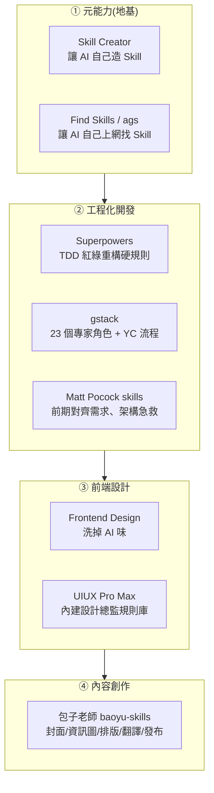

# 4 組頂級 Agent Skill:從「自我進化」到「工程／設計／內容」生產力套件

> 來源:白白说大模型〈別再亂裝 Skill 了!這 4 組 Skill 才是 Agent 的頂級生產力!〉(YouTube,2026-06-08)。本筆記把影片講的 8 個 Skill 全部**把對應 GitHub repo clone 下來讀過原始碼/SKILL.md** 再整理,補上影片沒講清楚的真實機制、檔案結構與安裝指令。整理後 clone 已刪除。

---

## 一句話總結

**決定 Agent 生產力上限的,往往不是「用 Codex 還是 Claude Code」,而是你手裡的 Skill 配置。** 影片把 Skill 分成 4 類、共 8 個——兩個「元能力」(讓 AI 自己造工具 / 自己找工具)當地基,再加工程開發、前端設計、內容創作三組場景型 Skill。它們的共同點是 **跨平台**(SKILL.md 是純 Markdown 約定,不綁特定 Agent),核心價值是「**把資深從業者的 SOP 寫成 AI 每次都會照做的硬規則**」,而不是多一個聊天提示詞。

> 補充:Skill 的本質與 Loop Engineering 裡的 `SKILL.md` 同源——把規則寫一次、Agent 每次都讀,見 [[loop-engineering]]、[[building-claude-skills]]。

---

## ① 元能力:讓 AI 自我進化的兩把鑰匙

### Skill Creator — 用大白話把流程說一遍,它幫你寫出標準 Skill

- **Repo**:`anthropics/skills`,路徑 `skills/skill-creator/`(Anthropic 官方)。
- **解決什麼**:以前自己做 Skill 要先研究複雜格式,寫錯就爆;現在你只要「像交代同事一樣」把流程講一遍,或把操作手冊丟給它,它就自動起草、測試、反覆迭代。
- **讀碼後的真實機制(影片沒講的)**:核心是一條 **eval-driven 迭代迴圈**——`run_loop.py` 會把你給的範例案例做 **60/40 train/test split**,用 train 集生成/修訂 Skill、用 test 集驗證,反覆直到通過。設計哲學是 **progressive disclosure**(漸進揭露):SKILL.md 只放精簡入口,細節拆到附屬檔案,Agent 需要時才載入,避免一次塞爆 context。
- **建議**:全域安裝,任何專案都能隨時調用。

### Find Skills(ags)— 不是搜尋插件,是「自己上網搬救兵」

- **Repo**:`agentskill-sh/ags`;npm 套件 `@agentskill.sh/cli`,Skill 名 `learn`(`/learn`)。
- **正確用法**:你**直接派任務**就好——例如叫它做 UI 設計,它若發現自己不會,會自動把需求拆成關鍵詞(如 `UI design`),到後台連接的 **agentskill.sh** 平台查「哪個 Skill 安裝量大、作者靠不靠譜」,挑最好的給你選,選好後一行命令幫你裝上。
- **讀碼後補充**:支援 **44 個 agent 平台**;安裝前若該 Skill 的 `securityScore < 30` 會要你二次確認,降低裝到惡意 Skill 的風險。
- **兩者分工**:Skill Creator = 讓 Agent **自己造工具**;Find Skills = 讓 Agent **去外面找現成的**。

---

## ② 工程化開發:終結「看似邏輯完備、實則無法落地」的代碼幻覺

### Superpowers — 把 TDD 變成 Agent 必守的硬規則

- **Repo**:`obra/superpowers`(作者 Jesse Vincent,~226K stars,16 個 skills)。
- **殺手鐧**:**TDD Iron Law —「NO PRODUCTION CODE WITHOUT A FAILING TEST」**(沒有一個正在失敗的測試,就不准寫任何生產代碼)。強制 Agent 走 **紅 → 綠 → 重構**:先寫必然失敗的測試證明功能未實現 → 寫最少量代碼讓它變綠 → 再優化。
- **為什麼省錢**:寫完之後自動開 **兩輪 subagent 內部審查**(慢思考),第一遍就把代碼寫到 80 分以上,省掉後面無數次反覆抓 bug、長期反而更省 token。
- **工作流**:brainstorming 是 **HARD-GATE**(硬性關卡)——先拉你做頭腦風暴把需求磨清、出設計文,再把大任務拆成「幾分鐘就能搞定、各有明確驗證標準」的小碎活,讓 subagent 自己寫自己查、嚴禁跳步,最後測試全綠時把「合併 / 留分支 / 丟掉」的選項丟給你。

### gstack — 在 Agent 裡內建 23 個專家角色(YC 總裁出品)

- **Repo**:`garrytan/gstack`(作者 Garry Tan,YC 總裁,~109K stars,23 個 slash-command)。
- **特點**:不是單一功能 Skill,而是內建 **23 個專家角色**(CEO、設計師、發布工程師…),用斜線命令直接調用,等於給 Agent 配齊一整支團隊交叉審計。
- **實戰流程(sprint:Think → Plan → Build → Review → Test → Ship → Reflect)**:
  - `office-hours`:YC 最出名的「靈魂考問」——AI 不立刻寫碼,而是像嚴厲導師反問 **6 個最尖銳的問題**,先掐死不靠譜的假設。
  - `plan` / CEO review:站在 CEO 高度審視計畫看有沒有更優解。
  - `review`:資深工程師視角,專盯「CI 能過、一上線就爆炸」的工程隱患。
  - `QA`:**真的會打開瀏覽器(Playwright)**像真人測試員去點擊驗證、抓 bug。
  - `/learn`:把學到的東西寫進記憶層持久化。
  - `ship`:自動同步、跑測試、推代碼、開 PR,一氣呵成。
- **理念**:「Boil the Ocean」——同樣需求,一個人現在能頂一支小團隊。

### Matt Pocock 的個人 Skill 套件 — 解決「人與 Agent 溝通對不齊」

- **Repo**:`mattpocock/skills`(作者 Matt Pocock,TypeScript 圈知名教育者,15 個 skills)。
- **核心邏輯**:寧可前期多花幾分鐘對齊需求,也不要後期花幾小時處理低品質代碼。針對三種困境:理解偏差、執行失敗(跑不通)、架構隱患(難維護)。
- **重點命令(讀碼後)**:
  - **grill-me / grill-with-docs**(考問模式):你提模糊需求(「想加個登入功能」)時不馬上動手,反覆考問細節,可能問完發現你真正要的是「SSO 環境下的多租戶登入」,把隱患消滅在開工前。
  - **triage**(狀態機):把所有任務過一遍分清輕重緩急,確保你不是在修細枝末節卻忽略真正卡進度的核心問題。
  - **improve-codebase-architecture**(架構急救包):每隔幾天跑一次,站在全局視角找出「以後會越來越難改」的地方;讀碼可見它用 **deep-module(深模組)** 與 **deletion-test(刪除測試)** 等原則來判斷重構建議。

---

## ③ 前端設計:洗掉「一眼 AI」的廉價感

> 痛點:早期編程 Agent 做 UI 永遠那幾套——固定字體、藍紫漸層背景、圓角卡片、特定按鈕。網上 AI 生成的界面「10 個有 12 個長一樣」。

### Frontend Design — Anthropic 官方,幫你洗掉 AI 味

- **Repo**:`anthropics/skills`,路徑 `skills/frontend-design/`。
- **機制(讀碼後)**:明確點名要**避開 3 種 AI 預設長相**——① 奶油色+襯線字(cream serif)、② 深色+霓虹點綴(dark neon-accent)、③ 報紙風(broadsheet)。不機械套組件,而是依產品調性推敲更有質感的紋理、嘗試更有呼吸感的非對稱布局。內建 **two-pass critique(兩遍自我批評)**:先產出、再以批判視角檢討字體比例與留白,讓 UI 從「能看」變「耐看」。

### UIUX Pro Max — 直接配一個「設計總監」

- **Repo**:`nextlevelbuilder/ui-ux-pro-max-skill`(~88K stars)。
- **特點**:不靠直覺畫圖,而是把專業設計的條條框框變成底層邏輯。做金融/醫療界面時會明確告訴你「什麼配色體現安全感、什麼字體更顯專業」,還給**避坑指南**(哪些設計在商業場景絕不能碰)。
- **讀碼後的真相**:後台是一個 **Python 搜尋引擎** + **161 條 reasoning rules / colors / products 的 CSV 規則庫**(影片說的「160 多個行業規則」即此)。可用 `--design-system` 生成一套**可持久化複用的設計系統**,下次新專案直接把文件丟給 Agent 就能用。命令列或插件都能跑,上手門檻低。
- **分工**:Frontend Design 負責**把畫面畫得出彩**;UIUX Pro Max 負責**把產品做得更專業**。

---

## ④ 內容創作:包子老師(寶玉)的全流程工具箱

- **Repo**:`JimLiu/baoyu-skills`(作者寶玉/Baoyu,21 個 skills)。打通「生產 → 排版 → 發布」全流程。
- **重點 Skill(讀碼後)**:
  - **cover-image**(封面圖):**6 維控制系統**(構圖類型、色調方案、渲染風格、文字排版、情緒基調…)× **77 種預設組合**,告別「開盲盒」的隨機感。
  - **infographic**(資訊圖):內建 **21 種版面 × 22 種風格**(魚骨圖、漏斗圖、金字塔圖…),能自動讀懂文案邏輯結構推薦最合適版面,幾秒產出出版級可視化。
  - **xhs**(小紅書):把長文自動拆成 **1–10 張**卡通風輪播卡片,內建多種視覺風格與排版模式(對比/清單/流程…)。
  - **markdown-to-html**(公眾號排版):解決「微信公眾號不支援 Markdown」的痛點,內建多套公眾號主題、自動處理代碼高亮與數學公式;最實用的是 **`--cite`**:把文中外鏈自動轉成文末底部引用,解決公眾號「鏈接打不開/被截斷」的尷尬。
  - **translate**(翻譯):出版級模式走 **分析 → 翻譯 → 校正 → 潤色 四步**;可指定「讀者是誰」(如告訴它讀者是資深開發者,就省略冗餘解釋,語氣像圈內人寫的)。
  - **post-to-wechat / post-to-weibo / post-to-x**:一鍵跨平台分發,區分長文模式與「幾張圖配摘要」的貼圖模式,把複雜後台操作變成 Agent 裡一行指令。

---

## 應用案例 / 怎麼搭配

- **第一天就打地基**:不管你要做什麼,先全域裝 **Skill Creator + Find Skills**——前者把你每天重複的工作流凝固成 Skill,後者讓 Agent 缺能力時自己上網找,兩者讓 Agent 能「自我進化」。
- **寫商業系統**:用 **Superpowers** 守住 TDD 底線(每個功能先有失敗測試),搭 **gstack** 的 `office-hours` 在動手前用 6 問掐死壞假設、用 `QA` 開瀏覽器真點;若你是前端/TS 重度,加 **Matt Pocock** 的 grill-me 對齊需求、每幾天跑 improve 做架構體檢。
- **做產品介面**:先用 **Frontend Design** 洗掉藍紫漸層的 AI 味,再用 **UIUX Pro Max --design-system** 沉澱一套公司級設計規範重複套用。
- **做內容/自媒體**:用 **baoyu-skills** 一條龍——infographic 把枯燥長文變高密度資訊圖、cover-image 出封面、markdown-to-html `--cite` 解決公眾號鏈接、translate 做出版級翻譯,最後 post-to-* 一鍵發到公眾號/微博/X。
- **心法**:今天這些只是起點,**最關鍵的是按自己的工作流打磨出真正適合自己的 Skill**(這時就回到 Skill Creator)。

---

## 8 個 Skill 速查表

| 類別 | Skill | Repo | 一句話 |
|---|---|---|---|
| 元能力 | Skill Creator | `anthropics/skills` (skill-creator) | 大白話講流程,eval 迭代寫出標準 Skill |
| 元能力 | Find Skills / ags | `agentskill-sh/ags` | 缺能力自己上 agentskill.sh 找並安裝 |
| 工程 | Superpowers | `obra/superpowers` | TDD 硬規則:沒失敗測試不准寫生產碼 |
| 工程 | gstack | `garrytan/gstack` | 23 個專家角色 + YC sprint 流程 |
| 工程 | Matt Pocock skills | `mattpocock/skills` | 前期 grill 對齊、triage、架構急救 |
| 前端 | Frontend Design | `anthropics/skills` (frontend-design) | 避開 3 種 AI 預設長相、兩遍自我批評 |
| 前端 | UIUX Pro Max | `nextlevelbuilder/ui-ux-pro-max-skill` | 161 條規則庫 + 可複用設計系統 |
| 內容 | 包子老師 baoyu-skills | `JimLiu/baoyu-skills` | 封面/資訊圖/小紅書/排版/翻譯/發布 |

---

## 來源

- 白白说大模型,〈別再亂裝 Skill 了!這 4 組 Skill 才是 Agent 的頂級生產力!〉,YouTube:<https://www.youtube.com/watch?v=diU-Nbb1P_c>(2026-06-08)
- 各 Skill 之 GitHub repo(本筆記已逐一 clone 讀過原始碼/SKILL.md):
  - Skill Creator / Frontend Design:<https://github.com/anthropics/skills>
  - Find Skills(ags):<https://github.com/agentskill-sh/ags>
  - Superpowers:<https://github.com/obra/superpowers>
  - gstack:<https://github.com/garrytan/gstack>
  - Matt Pocock skills:<https://github.com/mattpocock/skills>
  - UIUX Pro Max:<https://github.com/nextlevelbuilder/ui-ux-pro-max-skill>
  - 包子老師 baoyu-skills:<https://github.com/JimLiu/baoyu-skills>
