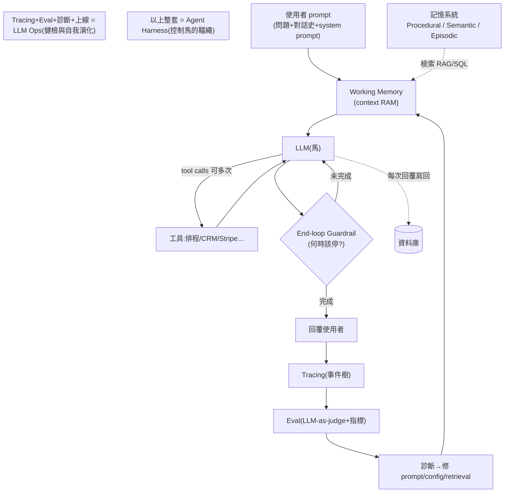
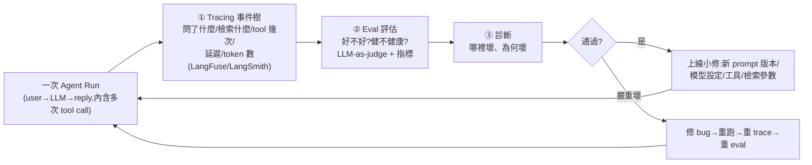

# 19 分鐘搞懂四個 AI Agent 熱詞:Harness、Loop、LLM Ops、Eval(一張圖串起記憶/RAG/Tracing)

> 整理自 YouTube「Sean's AI Stories」〈You Can Learn AI Agent Harness & Loop Engineering In 19 Min | LLM Ops, Eval, Tracing, RAG〉(2026-06-26,約 20 分鐘)。這支影片的價值在於**把一堆散落的熱詞用「一次 agent run」串成一張完整的系統圖**:agent harness、loop engineering、LLM Ops、eval,順帶把記憶系統(procedural / semantic / episodic)、RAG、tool calling、tracing 一起接上。技術或非技術背景都看得懂。
>
> 一句話貫穿全片:**LLM 是一顆「懂全人類、卻完全不懂你」的超強大腦;上面這四個詞,全都是為了把這顆生腦「馴服」成一個你能信任、會自我演化的系統。**

---

## 一句話總結

- **Agent Harness = 控制這匹「馬(LLM)」的整套韁繩**:馬很強、能到處跑,但沒有好韁繩你會受傷、會跑到隨機的地方。LLM 本質是**預測下一個字的機率**→帶隨機性,但解問題時我們不想要太多隨機 → 需要控制。
- **Loop Engineering = harness 的一部分**:讓 agent 自己 tool call、迭代,但**知道何時該停**(end-loop guardrail)。
- **LLM Ops + Eval = 另一個迴圈**:因為你「不知道 harness 跑得好不好」→ 用 tracing 收集事件、eval 評分診斷、修好再上線,讓整個系統**自我演化**。

---

## 1. 一次 Agent Run 與「為什麼需要 Harness」

一次 **agent run**:使用者 prompt(問題 + 當前對話史 + system prompt)→ 餵進 **working memory(context RAM)**→ LLM 當問答 agent → 回覆。**這是短暫的(ephemeral)、本身沒有記憶。**

> **為什麼需要 harness**:LLM 像一顆**知道全人類知識、卻完全不知道「你」**的超強大腦——它不知道你的軟體、不知道你要它怎麼表現。Harness 字面就是**騎馬時控制馬的那套韁繩工具**:把 LLM 想成一匹強壯的馬,沒有好韁繩就會受傷、亂跑。市面工具如 LangGraph、LangChain、Pydantic 都在做這件事。

---

## 2. 三種記憶(harness 的地基)

| 記憶 | 是什麼 | 對應熱詞/存法 |
|---|---|---|
| **Procedural(程序記憶)** | agent **該怎麼表現**、技能的指令(像叫馬跑快跑慢) | 就是 **Skills**——一段餵給 agent 的 markdown 文字 |
| **Semantic(語意/耐久事實)** | 關於你/情境、**公開資料查不到**的事實(Sean 是誰、做過什麼) | 事實文字,可自己輸入或自動演化 |
| **Episodic(情節記憶)** | 不在當前對話裡的**過去事件/對話史**,帶時間戳的 time series | 追蹤每件發生的事 → 一長串帶時間戳的清單 |

**記憶要更新,所以需要資料庫**(AWS / Supabase / GCP / Azure)。重點機制是**自動演化語意記憶**:若你是有百萬客戶的電商,客服對話有上百萬則,**不可能每則都存**——所以設一個**閘門**:每累積約 2000 則對話,就丟給一個 **summarizer agent**(另一個 LLM harness,因為要吃大量文字、可用較便宜的開源模型)把對話**蒸餾成事實**存進語意記憶。

---

## 3. 檢索(RAG):語意記憶 vs 情節記憶不一樣

- **語意記憶** → 就是 **RAG**(retrieval-augmented generation):都是事實/文字,做語意比對抓相關的。
- **情節記憶** → 看問題:
  - 「這個美國客戶最近 10 次對話?」→ **SQL query** 抓近期的 dated events 就好。
  - 「過去 20 次『客訴產品品質、且客服沒成功解決』的對話?」→ **SQL + 語意搜尋(RAG)** 一起用——你不要那 2000 則全部,只要**其中最相關的 20 則**,靠 RAG 在文字與 prompt 間比對語意抓出來。

---

## 4. Tool Calling 與 Loop Engineering:重點是「知道何時停」

agent 不只讀記憶,還會**呼叫工具**(排程會議、讀寫 CRM、從 Stripe/Alipay 抓付款),而且**可能呼叫很多次**。危險在於:**若給這匹馬全部權力,它可能永遠跑下去、不知道何時該停、該用哪個工具、該在哪收尾** → 所以需要 **end-loop guardrails**,這就是 **loop engineering**(它是 harness 的一部分,一樣是為了控制技術照我們要的方式跑)。

**範例**(「找出客訴、跟進挽回、查是否已退款、沒退就退」):LLM 決定用哪些工具 → 讀 CRM(Salesforce/HubSpot)→ 發現近兩月 30 筆客訴、12 筆已退款、8 筆未退 → 對這 8 人排會議,更進階甚至直接觸發 Stripe/Alipay 退款 → **一路 loop 到任務完成**。

> **loop 最關鍵的是「知道何時停」**:guardrail 可以就是「任務完成」;更好的是**agent 在規劃時先跟你確認收尾點**——「要我幫這 8 人都退款,還是只告訴你名單、你自己跟進?」你一選,就等於告訴 loop 有個明確結束情境。
>
> **另一個具體例子**(和實務高度相關):Claude Code 常跳權限確認視窗卡住。用 loop/**hook** 設定「只要你在等我授權,就發一則通知到我筆電」——否則你看 YouTube 30 分鐘回來,才發現它 25 分鐘前就卡在一個權限上,純浪費時間。

---

## 5. LLM Ops 與 Eval:因為「你不知道它跑得好不好」

Harness 蓋好後最大的問題:**不知道它表現如何**。所以需要一個**回饋迴圈**去評估、診斷、修復(換更好的 system prompt?換模型設定?改記憶檢索方式?)。這套就是 **LLM Ops**。它建立在三步上:

1. **Tracing(追蹤)**:每次 agent run 追蹤一棵**事件樹**——問了什麼、做了哪些檢索、LLM 呼叫工具幾次、工具用得如何、回應時間/延遲、用了多少 token。工具:**LangFuse、LangSmith**。這是**收集資料**的第一步。
2. **Eval(評估)**:資料用來回答「這次跑得好嗎?健康嗎?」可用 **LLM-as-a-judge** 打分(該觸發的會議有沒有觸發?延遲是 20 秒還是 2 毫秒?用了多少 token?),也可以寫成確定性程式碼。
3. **診斷 + 上線**:給出**儀表板指標**看哪裡出錯(會議沒觸發?延遲 20 秒可能某個 tool call 太慢、或 working memory 太大、或根本不是每個問題都需要檢索——像「OpenAI 何時成立」模型本來就知道)。閘門:eval 通過就上線小修並把改良後的 prompt/config **餵回 agent run**(一個 LLM Ops loop 完成);若深層壞掉就修 bug、重跑、重 trace、重 eval。

> **合起來**:agent run + 記憶檢索 + LLM 在 loop 裡 tool call 且知道何時停 = **harness**;外面再套 trace→observe→diagnose→fix→ship 的 **LLM Ops** = 一個會**自我演化、自我成長**的自主系統。

---

## 應用案例 / 怎麼用這張全景圖

- **當「熱詞翻譯機」**:下次看到 harness / loop / LLM Ops / eval / tracing / RAG / skills,回到這張圖對號入座——**skills = procedural memory 的文字檔;loop = harness 裡管「何時停」的部分;eval+tracing = 給 harness 做健檢的 LLM Ops**。全部是為了馴服同一匹馬。
- **設計記憶就想「三種記憶 + 一個蒸餾閘門」**:即時對話存 episodic(SQL 查近期)、耐久事實存 semantic(RAG 查語意);量大時用 **summarizer agent(可用便宜模型)** 定期把對話蒸餾成事實,別把全部塞進 context。呼應本庫 [[markdown-agent-memory]]、[[is-graphrag-needed-rag-variants-comparison]](檢索方式看任務、別一律 RAG)。
- **loop 一定要有「明確結束情境」**:讓 agent 規劃時先跟你確認收尾點(自動執行 vs 只回報名單);並善用 **hook/通知**(如 Claude Code 待授權就推播),避免 agent 卡住空耗——這正是 [[loop-engineering-when-and-how-gary-chen.md|Loop Engineering 實務]] 講的 hard stop + human-in-the-loop 的具體落地。
- **上生產前先接 tracing + eval**:用 LangFuse/LangSmith 追每次 run 的延遲/token/工具次數,拿 LLM-as-judge + 指標做健檢,再迭代 prompt/模型/檢索參數。對照 [[agent-trace-analysis-with-ai]](讓 agent 讀 trace、人把持品味)。
- **省成本的直覺**:不是每個問題都要大檢索(模型已知的常識就別 retrieve)、蒸餾用便宜模型、eval 抓出「延遲/token 異常」的 run——這些都是把帳單壓下來的實務點。

> 延伸對照:[[ai-harness-explained]](harness 的兩種意涵)、[[harness-engineering-evolution]](Prompt→Context→Harness 演進)、[[loop-engineering]] 與 [[loop-engineering-when-and-how-gary-chen]] 與 [[loop-engineering-buzzword-critique]](loop 三視角)、[[five-agent-patterns]]、[[mixture-of-agents-moa]](獨立 judge/verifier)。本篇的定位是**把這些主題用一次 agent run 串成一張可背下來的全景圖**。

---

## 來源

- Sean's AI Stories,〈You Can Learn AI Agent Harness & Loop Engineering In 19 Min | LLM Ops, Eval, Tracing, RAG〉,YouTube:<https://www.youtube.com/watch?v=GrNbuWWJYiI>(2026-06-26,約 20 分鐘)
- 本文依該片**英文自動字幕**整理(非官方人工字幕);提及工具:LangGraph / LangChain / Pydantic(harness)、LangFuse / LangSmith(tracing)、Salesforce / HubSpot / Stripe / Alipay(工具範例)、資料庫 AWS / Supabase / GCP / Azure。作者另有記憶系統與 RAG 的前作影片。
