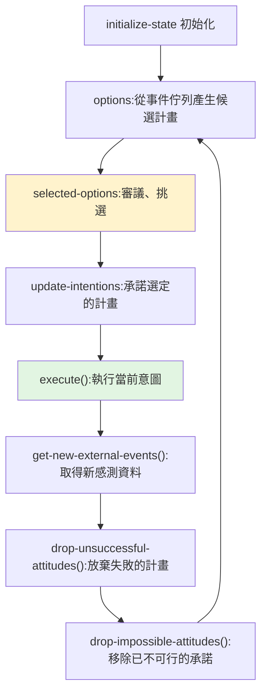

# BDI(信念–欲望–意圖):經典 agent 架構,與今天的 LLM agent 對照

> **BDI(Belief–Desire–Intention)** 是 1990 年代奠定、至今仍是 agent 理論基石的一套架構,
> 把「一個理性 agent 該怎麼思考與行動」拆成三種**心智態度**:**信念(Belief)、欲望(Desire)、意圖(Intention)**。
> 它源自哲學家 **Michael Bratman 的「人類實用推理(practical reasoning)」理論**,後來被做成可程式化的 agent 框架。
>
> 整理自維基百科「Belief–desire–intention software model」。本筆記也對照**今天的 LLM agent**——你會發現現代 agent loop
> 其實是 BDI 的迴響。

---

## 起源:為什麼要分「欲望」和「意圖」?

Bratman 的關鍵洞見是:**意圖 = 已經「承諾(commitment)」的欲望**。承諾帶來兩個效果:

1. **時間上的持續性(temporal persistence)**:一旦承諾一個計畫,就不會每一刻都重新動搖、反覆改主意。
2. **後續計畫以「已承諾的」為基礎**:新的規劃會建立在你已經決定要做的事情之上,而不是憑空重來。

> 直覺:你「想要」很多事(欲望),但你只「打算(意圖)」去做其中一部分,並為此投入、堅持、往下安排。
> 沒有這層承諾,agent 會像金魚一樣每秒重新考慮一切,既不穩定也無法協調。

---

## 三種心智態度 + 三個支援結構

### 核心三態度(BDI Triad)

| 態度 | 是什麼 | 對應現代 LLM agent |
|---|---|---|
| **Belief 信念** | agent 對世界(含自己與其他 agent)的**資訊狀態**。用「信念」而非「知識」,是承認它可能是**錯的或會變的**。存在 belief base,可做 forward chaining 推理 | context / memory / RAG 檢索到的事實(也可能過時或錯) |
| **Desire 欲望** | agent 的**動機狀態**:它想達成的目標或想促成的狀況 | 使用者給的目標、系統 prompt 裡的目的 |
| **Intention 意圖** | **已承諾、開始執行**的欲望(已經在跑某個計畫) | 當前正在執行的 plan / task |

### 三個支援結構

- **Goal 目標**:被 agent「**主動採納去追求**」的欲望;限制是**同時進行的目標必須彼此一致**(不能既要 A 又要與 A 矛盾的 B)。
- **Plan 計畫**:為達成意圖而執行的**動作序列(recipe / knowledge area)**;可**階層組合**(子計畫嵌在父計畫裡)。
- **Event 事件**:觸發 agent **反應**的訊號——可更新信念、觸發計畫、修改目標。來源可為**外部**(感測器)或**內部**(解耦的更新)。

---

## BDI 解釋器:推理迴圈(reasoning loop)

理想化的 BDI 解釋器(源自 SRI 的 **PRS** 血統)就是這個循環——**在「審議(deliberation,決定做什麼)」與「執行(execution,實際去做)」之間取得平衡**:

**架構元件**:`belief base`(信念庫)、`plan library`(計畫庫)、`intention stack`(意圖堆疊)、`event queue`(事件佇列)。

---

## 形式邏輯(理論層)

BDI 也有嚴謹的多模態邏輯版本:

- **BDI_CTL**(Rao & Georgeff):把代表信念/欲望/意圖的模態邏輯,結合時序邏輯 **CTL***。
- **LORA**(Michael Wooldridge):在 BDI_CTL 上再加**行動邏輯**,能推理單一 agent 與**多 agent 通訊**。
- 但這些邏輯**沒有完整的公理化、也無法有效計算**——理論優雅,實務上難直接拿來跑。

---

## 限制與批評(很多今天還在吵)

1. **不會學習**:架構內**沒有從過去行為學習、適應新情境的機制**。
2. **沒有前瞻規劃(no lookahead)**:不做向前推演,可能浪費資源、做出不可逆動作或產生副作用。
3. **多 agent 支援弱**:缺乏明確的 agent 互動/整合機制。
4. **目標常是隱含的**:多數實作沒有「顯式目標表示」。
5. **三態度是否剛好夠?** 決策論者質疑是否三個都需要;分散式 AI 研究者質疑是否足夠。
6. **最關鍵的範圍限制**:BDI 只解決「**選計畫 vs 執行計畫**」的分離問題——
   > **「生成計畫(planning 本身)不在模型範圍內」**,交給系統設計者/程式設計師預先寫好 plan library。
   > 所以 BDI 是「**從現成的計畫庫裡挑並執行**」,不是「**從零想出新計畫**」。

---

## 著名實作

- **純 BDI**:**PRS**(SRI 的開山之作)、**dMARS**、**JACK Intelligent Agents**、**Jadex**(開源)、
  **Jason / AgentSpeak(L)**(Java 解釋器)、**GOAL**、**2APL / 3APL**、**Gwendolen**(MCAPL 模型檢查框架)。
- **延伸/混合**:**JACK Teams**(多 agent)、**JaCaMo**(Jason+CArtAgO+Moise)、**Brahms**、
  **BOID**(在 BDI 上加 **Obligation 義務 / Norms 規範 / Commitments**,用於社會性環境)。

---

## 對照今天的 LLM agent(這篇最有用的部分)

BDI 不是過時的古董——**現代 agent loop 幾乎是 BDI 的重演**:

| BDI 概念 | LLM agent 的對應 |
|---|---|
| Belief base | context window / memory / 檔案系統記憶 / RAG |
| Desire / Goal | 使用者目標、`/goal` 指令、system prompt 的目的 |
| Intention(已承諾的計畫) | 當前正在執行的 task / plan;[[task-decomposition-agentic-workflow]] 的「拆好的子任務」 |
| Plan library | 預寫的 skills / tools / workflow(對照 [[building-claude-skills]]) |
| Event queue + reactive | 工具回傳、觀察結果觸發下一步(ReAct 的 observe→act) |
| reasoning loop | agent 的 think–act–observe 迴圈 |

而 BDI 的**老限制,正是今天 LLM agent 的新優勢與新難題**:

- **「不會學習」** → LLM 把「學習」搬到**權重訓練**或**反思/記憶**層(對照 [[grpo-vs-gepa]]:GEPA 用反思在語言層學習)。
- **「沒有前瞻規劃」** → 今天 agent 會做 lookahead / tree search / 自我反思,但也帶來「想太多、燒太多 token」的新問題。
- **「planning 不在範圍內,要人預先寫 plan」** → LLM 最大的躍進正是**能自己生成計畫**(而非只從固定 library 挑),
  這也是 [[task-decomposition-agentic-workflow]] 強調「讓 agent 自己拆任務」之所以新穎的原因。
- **「意圖=承諾」帶來穩定** → 對照 [[long-running-agents-goal-evaluation]]:長時間運行的 agent 之所以需要明確 goal 與 evaluation,
  正是為了維持「承諾的持續性」、不要每步漂移。

---

## 應用案例

- **理解一個 agent 框架在做什麼:** 拿 BDI 三態度當「拆解鏡」——它的「信念」存哪(context/DB)?「目標」怎麼表示(顯式還隱含)?
  「意圖」是怎麼承諾與放棄的(會不會每步重新動搖)?多數 agent bug 都出在這三者之一沒設計好。
- **設計穩定的長時間 agent:** 借用「意圖=承諾」的觀念——別讓 agent 每一步都重新質疑整個目標,
  而是承諾一個計畫、持續執行、只在「失敗或不可行」時才 drop(對應迴圈最後兩步)。
- **無人機/機器人/遊戲 NPC 等傳統 agent:** BDI 實作(JACK、Jason)至今仍用於需要**可預測、可審查行為**的場域——
  因為 plan library 是人寫死的,行為邊界清楚(代價是不會自己想新招)。
- **把 LLM 接進 BDI:** 用 LLM 補上 BDI 最弱的「planning(生成計畫)」與「學習」,用 BDI 的承諾/事件迴圈補上 LLM 最弱的「穩定性與可控性」——兩者互補。

---

## 一句話總結

> BDI 把理性 agent 拆成**信念(我知道什麼)、欲望(我想要什麼)、意圖(我承諾去做什麼)**,
> 並用一個「審議 ↔ 執行」的迴圈運轉;它的精髓是「**意圖=承諾**」帶來的穩定與協調,
> 它的盲點是「**不會學習、不會自己生成計畫**」。今天的 LLM agent 恰好把這兩個盲點補上了——
> 所以與其說 BDI 過時,不如說**現代 agent 是 BDI 的續集**:同樣的骨架,換上會自己規劃與學習的大腦。

---

## 來源

- [Belief–desire–intention software model(Wikipedia)](https://en.wikipedia.org/wiki/Belief%E2%80%93desire%E2%80%93intention_software_model)
- 理論源頭:Michael Bratman《Intention, Plans, and Practical Reason》;Rao & Georgeff(BDI_CTL / PRS);Michael Wooldridge(LORA)。
- 延伸:本庫 [[task-decomposition-agentic-workflow]]、[[building-claude-skills]]、[[long-running-agents-goal-evaluation]]、[[grpo-vs-gepa]]、[[ai-harness-explained]]。
