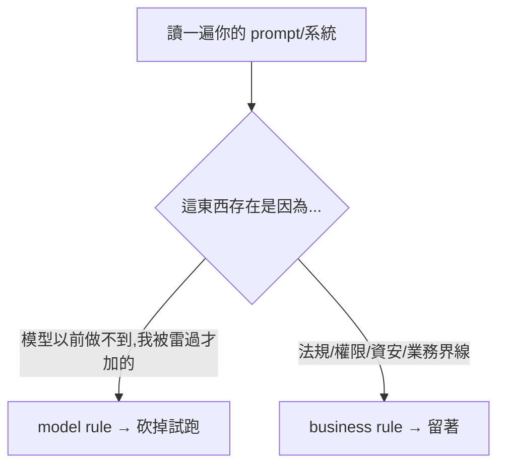

# Bitter Lesson:模型變強後,你的舊 prompt 正在拖垮新模型

**主題分類:** AI / 代理工程 — 基礎概念
**來源:** YouTube〈Mythos 要來了,你的舊提示詞正在拖垮新模型?〉(Gary Chen,2026-04-19,約 14 分;依繁中逐字稿整理)
**整理日期:** 2026-05-30

---

## 1. 反直覺的核心論點

隨著模型越來越強,**你的系統設計與提示詞如果不跟著迭代,不只沒用,還會反過來把更強的模型綁死、讓表現退步。**

> **實習生比喻:** 三年前請的實習生,你給他「新人手冊」逐步照做。三年後他升準管理層,該看的是「團隊 OKR」、怎麼做自己 figure out。但你還在叫他看三年前的 SOP——這就是你為舊模型寫的那堆 prompt / workflow / checkpoint。

---

## 2. Bitter Lesson(苦澀的教訓,Rich Sutton 2019)

> AI 發展這麼多年,**每一次人類想靠自己的專業知識手把手教 AI 怎麼做事,最後都輸給「丟更多算力、用更大模型、讓機器自己學、人少插手」。** 西洋棋、圍棋、影像辨識、LLM 都是這樣。

對 AI builder 的白話:**你塞給模型的每一個「how to」,都是在賭模型不會變聰明**;模型一變聰明,你塞的東西就從助力變阻力。Anthropic 的 context engineering guide、OpenAI 的 GPT-5 prompting guide **不約而同** 建議:模型能力進步,人為干預要越來越少、別再寫一長串風格規定。

**為什麼捨不得砍?是身份焦慮,不是技術問題。** 那份長到爆的 system prompt、客製 RAG pipeline、精密 CoT,被當成「我是 AI 高手」的證書(像父母享受被小孩需要的感覺)。

---

## 3. 應用案例:三個立刻可以自我檢查、該砍的方向

1. **保姆型提示詞**(先做 A 再做 B 最後檢查 C):為「會跳步驟的舊模型」寫的。新模型像跑了 20 年的老司機,**講清楚終點就好,別再規劃路線**。逐句自問「這條是模型做不到、還是我被雷過才加的?」是後者就拿掉。作者實測:100 行 research prompt 砍到 50 行,**輸出反而更有料**。
2. **檢索框架**(chunking/re-ranking/hybrid search/context 管理):一年前必要(context window 小、模型不會自己決定查什麼)。現在 context 到百萬 token、模型會自己判斷要不要查——Claude Code 就是 **只給輕量檔案引用、要查時自己用 glob/grep 翻**,比傳統「先 index 再 retrieve」的 RAG 更好(呼應 [[grep-vs-vector-agentic-search]])。但 **資料怎麼存、權限、成本、延遲這些系統層的事還是你要做**。每階段自問「這是模型無法判斷相關性、還是業務規則強制?」。
3. **寫死的規則**(40-80 條決策樹):真實商業世界你 **不可能列出所有 corner case**。模型夠強時,丟「最高指導原則」讓它臨機應變更穩。判準:**business rule(法規/權限/資安/退款上限)留著;model rule(檢查語氣、別亂編產品名、不確定要說不確定)砍掉**。問自己「寫這條時是怕被告,還是怕模型出包?」前者留、後者砍。

---

## 4. 砍完後:一個「可升級」的系統長什麼樣(四要素)

| 要素 | 內容 | 心態轉換 |
|---|---|---|
| **Outcome spec** | 定終點 + 怎麼知道到了,**不寫怎麼走** | 流程導向 → 結果導向 |
| **Guardrail** | 不能越的線(= business rule) | 人定的界線,跟模型能力無關 |
| **工具清單** | 給什麼工具就能做什麼;定義清楚每個工具做什麼、何時用 | **你從 orchestrator 變成「準備工具」;模型才是 orchestrator** |
| **協作模式** | 只 multi-agent 需要:定誰規劃/執行/評估 | 別把「該用什麼方法」寫進協作層 |

> 四要素裡 **都沒有「怎麼做」**。系統知道的「怎麼做」越少,越能吃新模型紅利:塞滿流程的系統是一次性的(新模型來要重寫),結果導向 + 工具導向的系統是 **無痛升級**。這正是 [[12-factor-agents]]、[[markdown-agent-memory]] 與 [[long-running-agents-goal-evaluation]] 的共同主線。

---

## 5. 真正該練的兩個能力(2026)

「會寫精密 prompt / 手調 RAG」是基本素養,但價值會被快速稀釋。真正讓你 **搭上模型升級便車** 的是:

1. **會定目標** —— 講得出要什麼、成功/失敗長什麼樣(跟模型溝通的能力)。
2. **會給 context** —— 知道模型需要什麼資訊才能做好決定,並準備好餵進去(例:客服 agent 你至少得給公司退換貨政策文件)。

兩者都不是 AI 才有的能力,而是 **通用工作能力,在 AI 時代被放大**。模型越強,它越需要 **清楚的方向 + 乾淨的資料**,而非詳細步驟。

---

## 來源

- [YouTube:Mythos 要來了,你的舊提示詞正在拖垮新模型?(Gary Chen)](https://youtu.be/MdZWB8eC83Q)
