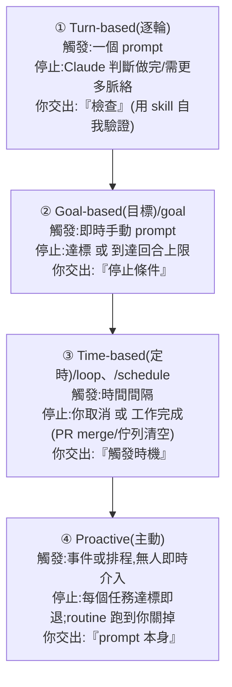

# Claude Code 官方定義的四種 Loop:Turn-based / Goal-based / Time-based / Proactive

> 整理自 Claude Code 團隊官方文章〈designing loops〉(作者 @delba_oliveira,發布於 @claudedevs,X:<https://x.com/claudedevs/status/2074208949205881033>)。近期 X 上一堆人在講「設計 loop 而不是寫 prompt」,但「loop 到底是什麼」各說各話。**這篇是 Claude Code 團隊的權威定義與分類**——正好替本庫既有的 loop 筆記([[loop-engineering]]、[[loop-engineering-when-and-how-gary-chen]]、[[loop-engineering-buzzword-critique]])定錨。
>
> **官方定義:loop = agent 反覆執行「工作循環」,直到滿足某個停止條件(stop condition)。** 不是所有任務都需要複雜 loop——**先從最簡單的解法開始,選擇性地用這些模式。**

---

## 一句話總結

Claude Code 團隊用四個維度給 loop 分類:**① 怎麼觸發、② 怎麼停止、③ 用哪個 Claude Code primitive、④ 適合哪種任務**。據此分成四種,你「交出去(hand off)」的東西逐級增加:



> 交得越多、自動化越深:**Turn-based 交出「檢查」→ Goal-based 交出「停止條件」→ Time-based 交出「觸發時機」→ Proactive 連「prompt 本身」都交出去。**

---

## ① Turn-based loops(逐輪循環 = agentic loop)

| | |
|---|---|
| **觸發** | 一個 user prompt |
| **停止** | Claude 判斷任務已完成、或需要更多脈絡 |
| **最適合** | 較短、非例行/非排程的任務 |
| **管控用量** | 寫具體的 prompt;用 skill 強化驗證以**減少回合數** |

**你送的每一個 prompt 都啟動一個由你主導每一輪的手動 loop**:Claude 收集脈絡 → 採取行動 → 檢查自己的工作 → 需要就重複 → 回覆你。這就叫 **agentic loop**。例如叫它做一個 like 按鈕:它讀你的 code、改、跑測試、交回它認為可行的成果;**然後你手動檢查、寫下一個 prompt**。

> **關鍵改進:把「你手動檢查的步驟」寫成 `SKILL.md`**,讓 Claude 能端到端自我驗證更多。重點是給它**能看/量測/互動結果的工具或連接器**;**檢查越量化,越容易自我驗證**。官方範例 `verify-frontend-change` skill:
> - 別只因「編輯成功」就回報 UI 改動完成;要像人類 reviewer 那樣驗證。
> - ① 起 dev server、在瀏覽器開改動頁 → ② 直接互動(點按鈕、確認狀態變化、截 before/after)→ ③ 檢查 console 零新錯誤/警告 → ④ 用 Chrome DevTools MCP 跑 performance trace、audit Core Web Vitals。
> - 任一步失敗就修好、從第 1 步重跑——**不交回「只驗證了一半」的工作**。

---

## ② Goal-based loop(/goal)

| | |
|---|---|
| **觸發** | 即時手動 prompt |
| **停止** | 目標達成 **或** 到達你設的最大回合數 |
| **最適合** | 有**可驗證退出條件**的任務 |
| **管控用量** | 設具體完成標準 + 明確回合上限(「試 5 次就停」) |

單一回合有時不夠,尤其複雜任務——agent 能迭代時表現更好。用 **`/goal` 定義「做完長什麼樣」**,延長 Claude 迭代的時間。**當你定義了成功標準,Claude 就不必自己判斷「夠好了沒」而提早結束**:每次 Claude 想停,一個 evaluator 模型會檢查你的條件,不符就送它回去繼續,直到達標或到達你定的回合數。這就是為什麼**確定性標準**(通過幾個測試、清過某個分數門檻)特別有效。

```bash
/goal get the homepage Lighthouse score to 90 or above, stop after 5 tries.
```

---

## ③ Time-based loop(/loop、/schedule)

| | |
|---|---|
| **觸發** | 指定的**時間間隔** |
| **停止** | 你取消,或工作完成(PR merge、佇列清空) |
| **最適合** | 例行工作,或與外部環境/系統對接 |
| **管控用量** | 設較長間隔,或**改成依事件反應**而非依時間 |

有些 agentic 工作是**例行的**:任務不變、只有輸入變(如每天早上摘要 Slack 訊息)。有些依賴外部系統,最簡單的對接就是**定時去檢查、對變化做反應**(如一個 PR 可能收到 review 或 CI 失敗)。

```bash
/loop 5m check my PR, address review comments, and fix failing CI
```

> **`/loop` 跑在你自己電腦上,關機就停。** 想搬到雲端,用 **`/schedule` 建立一個 routine**。

---

## ④ Proactive loops(主動循環)

| | |
|---|---|
| **觸發** | 一個事件或排程,**無人即時介入** |
| **停止** | 每個任務達標即退;**routine 本身跑到你關掉為止** |
| **最適合** | **定義良好、源源不絕的重複工作**:bug 回報、issue 分流、遷移、依賴升級等 |
| **管控用量** | 把 routine 路由到**更小更快的模型**,只在需要判斷時用最強模型 |

把上面的 primitive,加上 auto mode、dynamic workflows(research preview),**組合成長時運行的 loop**。例如處理進來的回饋:
- **`/schedule`** 跑一個檢查新回報的 routine;
- **`/goal`** 定義「做完」的樣子,用 skill 記錄如何驗證;
- **Dynamic workflows** 編排 agent 去分流每個回報、修好、review 修法;
- **Auto mode** 讓 routine 不停下來問權限。

```bash
/schedule every hour: check the project-feedback channel for bug reports.
/goal: don't stop until every report found this run is triaged, actioned, and responded to.
When fixing a bug, use a workflow to explore three solutions in parallel worktrees and have a judge adversarially review them.
```

---

## 維持程式碼品質(loop 的產出取決於「周邊系統」)

- **保持 codebase 本身乾淨**:Claude 會跟隨你 codebase 裡已存在的模式與慣例。
- **給 Claude 自我驗證的方法**:用 skill 把「你和團隊眼中的『好』」編碼下來。
- **讓文件容易取得**:框架/函式庫文件有最新的最佳實踐。
- **用第二個 agent 做 code review**:全新脈絡的 reviewer 偏見更少、不受主 agent 推理影響。可用內建的 `/code-review` skill 或 Code Review for GitHub。
- **別只修單一問題,要把它編碼進系統**:當某個結果不達標,不要只修那一個 issue——設法把它**沉澱成規則,改善所有未來的迭代**。

---

## 管控 token 用量(loop 要有清楚的邊界)

- **選對 primitive 與模型**:小任務不需要多 agent 或多 loop;有些任務用更便宜更快的模型即可。
- **定義清楚的成功與停止標準**:講清楚「做完」的樣子,讓 Claude 早點(但別太早)到達解答。
- **大規模跑之前先小規模試跑(pilot)**:dynamic workflows 可能 spawn 上百個 agent,先在一小片工作上估用量。
- **確定性工作用腳本**:跑腳本比逐步推理便宜(如 PDF skill 附一支填表腳本,每次直接跑,而非每次重新推導程式碼)。
- **routine 別跑得比需要的更頻繁**:間隔要匹配「你在盯的東西多久變一次」。
- **檢視用量**:`/usage` 按 skill / subagent / MCP 拆解近期用量;`/goal`(無參數)顯示目前回合數與 token;`/workflows` 顯示每個 agent 的 token 用量、且可隨時停掉某個 agent。

---

## 應用案例 / 怎麼開始(官方總表)

| Loop 類型 | 你交出 | 什麼時候用 | 用什麼 |
|---|---|---|---|
| **Turn-based** | 檢查 | 你在探索或做決定 | 自訂驗證 skill |
| **Goal-based** | 停止條件 | 你知道「做完」長什麼樣 | `/goal` |
| **Time-based** | 觸發時機 | 工作發生在專案外、按排程 | `/loop`、`/schedule` |
| **Proactive** | prompt 本身 | 工作是重複且定義良好的 | 以上全部 + dynamic workflows |

- **從你已經在做的工作找起**:挑一個「**你是瓶頸**」的任務,問自己能交出哪一塊——**你能寫出驗證檢查嗎?目標夠清楚嗎?工作是按排程來的嗎?**
- **有想法就跑一次 loop、觀察結果**(它在哪裡卡住、在哪裡過度發揮),然後**不怕地去迭代它**。
- **和本庫其他 loop 筆記的關係**:這篇是**官方權威定義**,回答了 [[loop-engineering-buzzword-critique]] 抱怨的「loop 各說各話」;實務怎麼設計(Trigger/Verifiable Goal/Rubric/失控三坑)見 [[loop-engineering-when-and-how-gary-chen]];概念與 Boris 三階段見 [[loop-engineering]];把 loop 放進 harness+ops+eval 全景見 [[agent-harness-loop-llmops-eval-explained]]。四種 loop 的「交出去越多、自動化越深」正好對應那些筆記反覆強調的「人從操作者變系統設計者」。
- **驗證 skill 是關鍵可複用資產**:把「做完/好」的判準寫成量化、可自我驗證的 SKILL.md(如 `verify-frontend-change`),是讓 Turn-based 少跑回合、讓 Goal/Proactive 能自動停的共同基礎——呼應 [[cross-model-review-claude-codex-harness]](stop hook + skill 自建 harness)與 [[building-claude-skills]]。

---

## 來源

- Claude Code 團隊,〈designing loops〉,作者 @delba_oliveira,發布於 @claudedevs(X):<https://x.com/claudedevs/status/2074208949205881033>
- 相關 Claude Code 官方文件:running agents in parallel、loop、schedule、goal、dynamic workflows。本文依使用者提供的文章全文整理;primitive 名稱(`/goal`、`/loop`、`/schedule`、auto mode、dynamic workflows〔research preview〕、`/usage`、`/workflows`、`/code-review`)與範例指令均取自原文。
