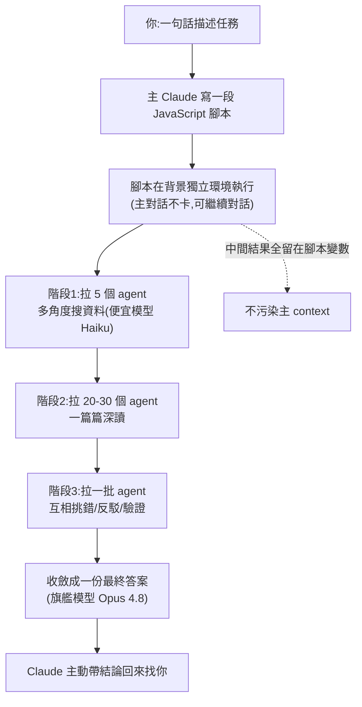
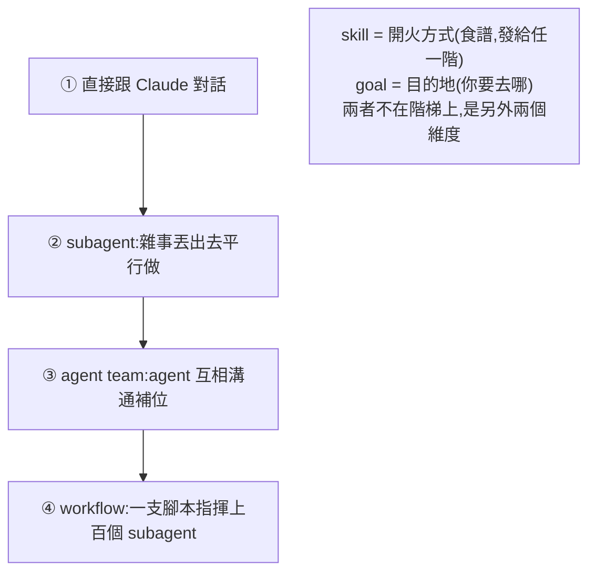

# Claude Dynamic Workflows 解析:什麼時候該用、什麼時候別用?

> 來源:Gary Chen(@garytalksstuff)〈Claude Dynamic Workflow 解析,什麼時候該用、什麼時候別用?〉。Anthropic 上個月幫 Claude Code 加的新功能 **Dynamic Workflows**:你一句話下去,Claude 會自己寫一段腳本、拉幾十到上百個 agent 平行開工,再派一批 agent 互相挑錯驗證,最後收斂成一份答案。本筆記講清楚它是什麼、跟 skill / subagent / agent team / goal 差在哪、優缺點與成本控制,以及最關鍵的——**什麼任務才適合用它**。

---

## 一句話總結

**Dynamic Workflow = Claude 幫你寫一段 JavaScript 腳本,用這個腳本去指揮上百個 subagent。** 本來要排一整季的大工程(或寫很長的 prompt),現在一句話、一天內搞定。但它很燒 token,**關鍵判準是:你的任務能不能切成一大堆「各自獨立、又能同時進行」的小塊?** 可以才用,不行(或只是小事)就是殺雞用牛刀。

---

## 它到底怎麼運作

- **是程式碼,不是臨場對話**:你說要做什麼,Claude 先寫出 JavaScript 腳本,這段腳本才是真正幹活的東西,跑在背景獨立環境 → **主對話完全不卡**,可以繼續叫主 session 做別的事,跑完 Claude 自己帶結論回來。
- **腳本的工作是「指揮」**:把大任務拆成一堆小子任務同時派發,一次拉幾十到上百個 subagent 平行幹活;每階段拉幾個、用什麼模型都不同,由主 agent 寫腳本時安排好。
- **關鍵設計:中間結果留在腳本變數裡**,不塞進主對話,主 context 只收到最終整理好的答案。**這是它和 subagent / agent team 最大的差異。**
- **內建品質把關**:可讓多個 agent 從不同角度切同一問題,再派另一批專門反駁、挑毛病,一路吵到收斂——「撐過攻擊還站得住的結論比較可信」。
- **分階段用不同模型**:撒網式搜尋用便宜的 **Haiku**,最後收斂推理才用旗艦 **Opus 4.8**,又快又省。
- 接續 [[task-decomposition-agentic-workflow]]:那篇講「拆解+編排是你要做的功課」,Dynamic Workflows 把這層**自己包了**(拆解、編排、寫腳本它全自動)——但交付什麼任務仍靠你判斷。

---

## 最多人搞混的:跟 skill / subagent / agent team / goal 差在哪

**只要問一個問題:下一步是由誰決定的?**
- **寫死在程式碼裡、由腳本決定 → workflow**
- **Claude 臨場看狀況自己決定 → 其他那幾個**(控制權在模型手裡)

| 功能 | 本質 | 與 workflow 的關鍵差別 |
|---|---|---|
| **skill** | 一份食譜/說明書(寫給 agent 看的指令) | 不是 agent、不在火力階梯上;是「事情**怎麼做**」(開火方式)。會佔主 context。**可疊在 workflow 裡**(底下 100 個工人都拿同一本食譜) |
| **subagent** | Claude 臨時派的小弟,跑完**結果直接塞回主對話** | 一兩件雜事夠用;但同時派一百個,資料全堆回主對話 → **桌子(context)爆掉**。workflow 把指揮+整理搬到桌外,只端結論上桌 |
| **agent team** | 作戰室:多個 agent **互相講話、討論、辯論**、共用任務清單、有角色(PM/工程師/QA) | workflow 的 agent **各走車道、彼此不講話**,像流水線,各自把結果交給最後收斂者 |
| **goal**(`/goal`) | **深度**:一個迴圈,一直跑、回頭確認達標沒,沒達標就繼續 | workflow 是**廣度**:橫向一次鋪開,做完彙整就結束。見 [[long-running-agents-goal-evaluation]] |

**火力階梯**(越往上火力越大、越燒 token):

> workflow 是這幾個裡**唯一把整個計畫交給程式碼、自己在背景跑完、不干擾主 session** 的那一個。

---

## 優點與缺點

**優點:**
1. **省主 session 的 context**(不是省 token):像雇傭兵軍團幫你的得力助手(主 Claude)幹髒活,過程多髒都不影響主對話,跑再大任務主對話也不會越跑越腫鈍。
2. **可重跑、可觀測、可驗證**(因為是程式碼):能存起來下次再跑、一階段階段看燒了多少、把品質檢查寫進去。例:每週對新分支做完整 review,存好 workflow 每週叫出來跑一次,不用重講。
3. **規模**:一口氣組織爆炸多 agent(10 個掃 code + 10 個驗證)。
4. **可信度**:自己派 agent 互相挑錯、多角度收斂,比叫 Claude 跑一遍更不容易出包。

**缺點:**
1. **貴**:每個 agent 都是一次完整 Claude call(各自讀一輪 context、各自燒 token),一次幾十幾百個,個人戶要特別注意。
2. **不適合日常小事**:改一兩行、問小問題、查普通資料用它=殺雞用牛刀。
3. 還在 **research preview** 階段,使用要小心。

**省成本三招:**
1. **便宜模型跑廣度、旗艦模型做收束**(Haiku 撒網 + Opus 4.8 收斂)。
2. **直接設預算上限**:下指令時告訴它這次最多燒多少 token。
3. **先拿一小塊試水溫**:別一上來掃整個 repo,先跑一個資料夾/窄問題,划算再放大。

---

## 應用案例:什麼任務適合?怎麼觸發?

**判準:** 這件事如果找十個人來,能不能拆給他們**同時**做?可以才輪到 workflow。

**作者實測產出不錯的 use case:**
- 掃整個代碼庫的 bug;
- 多維度的 code review;
- 一次改幾百個檔案的大遷移;
- 跨來源深度研究(同時翻官方文件/論文/社群討論,再互相印證驗證)。

> **Code review 範例指令:**「用便宜的模型派多個 subagent 去找 bug,每找到一個就再派一個 agent 去驗證、反駁、辯論確認是否為真,最後用強的模型把通過驗證的整理成報告。」——只要把**策略、廣度、驗證、收斂**四層交代清楚,Claude 就會照結構寫出腳本。

**三種觸發方式:**
1. **prompt 打 `workflow` 關鍵字**:「幫我建一個 workflow 來做…」。
2. **`/effort` 調到 ultracode**:讓它自己判斷每個任務值不值得開 workflow(整個 session 會變貴,因為推理拉滿+自動編排)。
3. **`/deep research`**(最快體驗):Claude Code 內建的現成 workflow,多角度搜尋、交叉查核、對每個說法投票、過濾掉驗證沒過的,給附出處報告——**不用擔心偷燒錢,第一次跑一定先停下來把計畫攤給你看、問你要不要跑**(還能先看它寫的腳本)。

**觀測與重用:** 打 `/workflows` 看進度(每階段拉幾個 agent、各燒多少 token、跑多久),不對勁隨時停;滿意的 workflow 存起來下次直接呼叫。

**腳本長相**(其實就是一段有頭有尾、分階段的 JavaScript):開頭一段 meta(叫什麼、做什麼)→ 分幾個階段,每階段派一批 agent → agent 關係主要兩種:**排隊接力(pipeline,前階段產出交給後階段)** 與 **一字排開(parallel,一次撒出跑完再收)**,大部分 workflow 就是這兩種搭出來的 → 最後回傳結果。

---

## 作者心得(值得內化的判斷)

- workflow 幫他**省去構思 agent team「誰負責什麼」的環節**——直接語音說「派幾個 agent 掃代碼庫、掃到的再派 agent 驗證、給我 audit 報告」,然後去買杯咖啡回來驗收。
- 但他**老實說:目前沒遇到「沒這功能會死」的 use case**。
- 核心觀念(反覆強調):**AI 工具一直推陳出新,重點從來不是哪個功能最強,而是你手上的任務適不適合它**。不要因為新、聽起來猛就什麼都塞給它——任務不對,再強的工具也只是幫你燒錢。

> 對照本庫 [[five-agent-patterns]](五大 agent 模式)、[[task-decomposition-agentic-workflow]](拆 SOP 成 workflow)、[[long-running-agents-goal-evaluation]](/goal 與深度迭代)——Dynamic Workflows 等於把「Orchestrator-Workers + Evaluator-Optimizer」模式做成 Claude Code 的內建、自動編排功能。

---

## 來源

- Gary Chen(@garytalksstuff),〈Claude Dynamic Workflow 解析,什麼時候該用、什麼時候別用?〉,YouTube:<https://youtu.be/4fpZhuJuIls>(2026-06-07)
