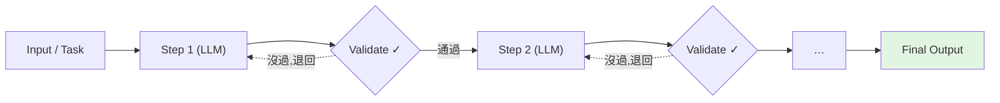
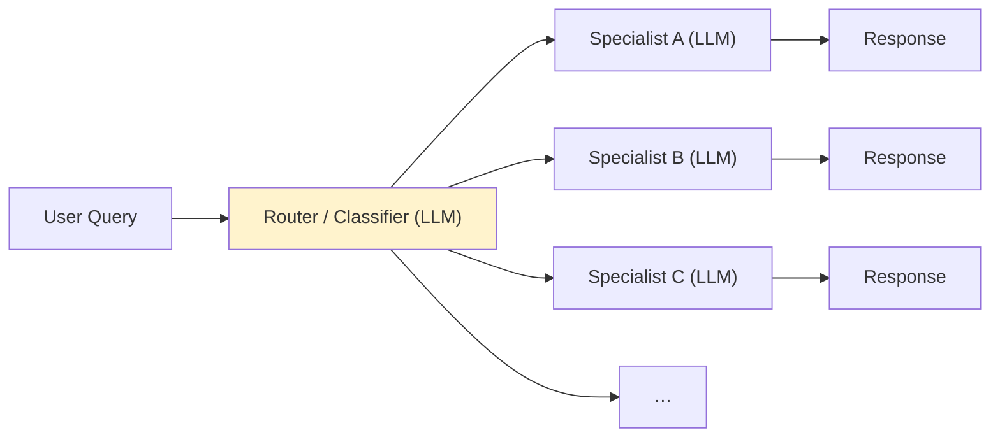
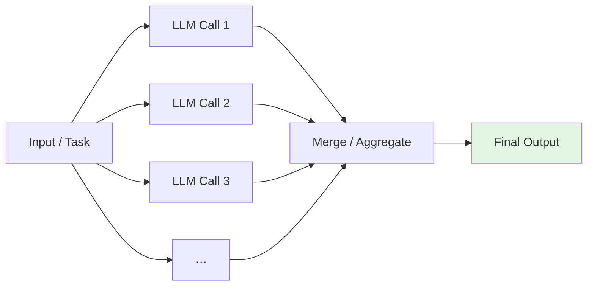
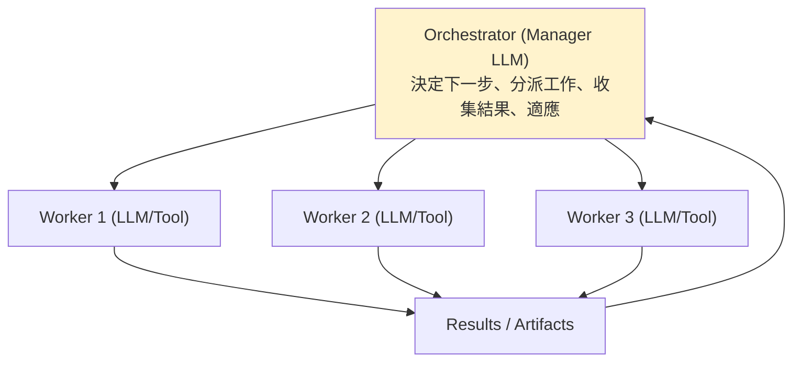
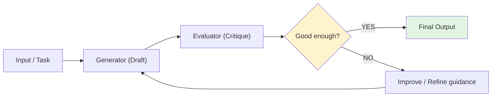

# 五大 Agent 模式:2026 年每個生產級 AI 系統至少用一個

> 五個建構代理系統的基礎工作流模式——**Prompt Chaining、Routing、Parallelization、Orchestrator-Workers、Evaluator-Optimizer**。
> 對應 Anthropic《Building Effective Agents》的工作流模式,是今天 production AI 系統的共同骨架。
>
> 起點是一張手繪「5 Agent Patterns」資訊圖;本筆記把每個模式重整成自己的 Mermaid + 適用情境並對照本庫(未轉存原圖)。
> **關鍵分界**:這些多半是**可預測的「工作流(workflow)」**(步驟由你寫死);只有第 4、5 開始有「**agent 自己決定步驟**」的味道。

---

## ① Prompt Chaining(提示鏈)
把一個大任務拆成數步,**每步之間做驗證**(validate),錯了就回去重做或補。

- **最適合**:能**乾淨拆解**的工作流(每步輸入輸出明確)。
- 對照本庫 [[task-decomposition-agentic-workflow]](把 SOP 拆成 pipeline、每步測試)。

## ② Routing(路由)
一個**分類器**把每個查詢分派給對的**專才(specialist)**。

- **最適合**:**輸入類型很多、但要一個乾淨的單一入口**(one clean front door)。
- 對照本庫 [[hermes-main-agent-orchestration]](主 agent 依專長把任務路由給子 agent/CLI)。

## ③ Parallelization(平行化)
**同時跑多個 LLM 呼叫,再合併**。兩種味道:切成子任務各做一塊(sectioning),或同一題多次投票/多角度(voting)。

- **最適合**:**速度、投票(voting)、或覆蓋多角度**。
- 對照本庫 [[grpo-vs-gepa]] 提到的「多個獨立評審投票」、以及多 agent 並行檢驗。

## ④ Orchestrator-Workers(協調者-工人)
一個 **manager LLM 在執行期(runtime)動態決定子任務**並委派給 workers,再彙整結果、視情況調整。

- **最適合**:**開放式問題、你無法事先預測步驟**。
- **與 Parallelization 的關鍵差別**:平行化的子任務是**你預先定好的**;Orchestrator 的子任務是**它依輸入當場決定的**。
- 對照本庫 [[hermes-main-agent-orchestration]]、[[task-decomposition-agentic-workflow]](sub-agent 階層)。

## ⑤ Evaluator-Optimizer(評估者-優化者)
一個 **generator 起草**,一個 **evaluator 批評**,**迴圈到夠好為止**。

- **最適合**:**要求高品質、且有清楚成功標準**的產出。
- 對照本庫 [[grpo-vs-gepa]](GEPA 正是「反思批評→改寫→再測」的迴圈)、[[agent-trace-analysis-with-ai]](讀 trace 找問題再修)。

---

## 一張表速查

| # | 模式 | 一句話 | 最適合 | 步驟誰決定 |
|---|---|---|---|---|
| 1 | Prompt Chaining | 拆步驟、步間驗證 | 能乾淨拆解的工作流 | 你(寫死) |
| 2 | Routing | 分類器分派給專才 | 輸入類型多、要單一入口 | 你(寫死) |
| 3 | Parallelization | 多呼叫並行再合併 | 速度/投票/多角度 | 你(寫死) |
| 4 | Orchestrator-Workers | manager 動態分派 | 開放式、步驟難預測 | **agent(runtime)** |
| 5 | Evaluator-Optimizer | 起草→批評→迴圈 | 高品質、標準清楚 | 迴圈(直到達標) |

> **工作流 vs agent**:1–3 是**可預測的工作流**(步驟固定);4 讓 agent 自己規劃步驟;5 用回饋迴圈逼近品質。
> 多數 production 系統是**組合**這些模式,而不是只用一個——也呼應 [[12-factor-agents]]「大量普通軟體 + 少量精心設計的 LLM 步驟」:能寫死的就寫死,只在必要處讓 LLM 自主。

---

## 應用案例

- **客服系統**:用 **Routing** 把問題分到 IT/HR/帳務專才;每條專才線內用 **Prompt Chaining**(分類→查資料→寫回覆→QC);高風險回覆用 **Evaluator-Optimizer** 把關。
- **深度研究/報告**:用 **Orchestrator-Workers**(manager 拆出「找資料/讀/寫」子任務動態分派),子任務間用 **Parallelization** 同時跑多來源。
- **要高品質產出(文案/程式)**:**Evaluator-Optimizer** 迴圈——generator 出稿、evaluator 依明確 rubric 批評,直到達標(成功標準要先定義清楚,否則迴圈不收斂)。
- **挑模式的順序**:先問「步驟可不可預測?」可以→用 1/2/3(工作流,穩定可控);不行→才上 4(orchestrator);要逼品質→疊 5。**別一開始就用最自由的 mega agent**(對照 [[task-decomposition-agentic-workflow]] 反 mega-agent 的論述)。

---

## 一句話總結

> 五個模式按「自由度」排:**Prompt Chaining(拆步驟+驗證)→ Routing(分派專才)→ Parallelization(並行合併)** 是**可預測的工作流**;
> **Orchestrator-Workers(manager runtime 動態分派)** 開始讓 agent 自己規劃;**Evaluator-Optimizer(起草→批評→迴圈)** 用回饋逼品質。
> 生產系統幾乎都是**組合**它們——**能寫死就寫死,只在真的需要的地方讓 LLM 自主**,才能可預測、可控、出錯可修。

---

## 來源

- 起點圖:手繪「5 Agent Patterns」資訊圖(本筆記重整其內容,未轉存原圖)。
- [Anthropic — Building Effective AI Agents](https://www.anthropic.com/research/building-effective-agents)(五模式原始出處);[Cloudflare agents — anthropic-patterns 實作](https://github.com/cloudflare/agents/blob/main/guides/anthropic-patterns/README.md)、[Spring AI — Effective Agents](https://docs.spring.io/spring-ai/reference/api/effective-agents.html)。
- 延伸:本庫 [[task-decomposition-agentic-workflow]]、[[harness-engineering-evolution]]、[[hermes-main-agent-orchestration]]、[[grpo-vs-gepa]]、[[12-factor-agents]]、[[agent-trace-analysis-with-ai]]。
