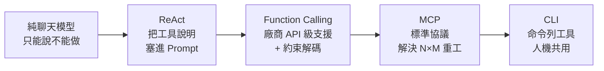
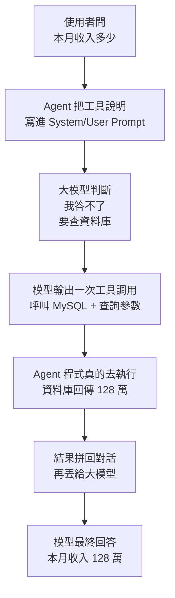
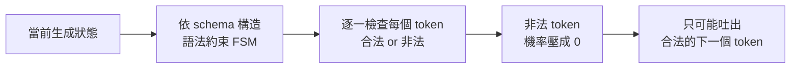
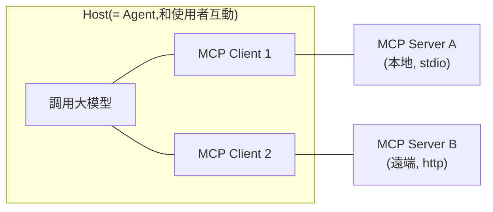
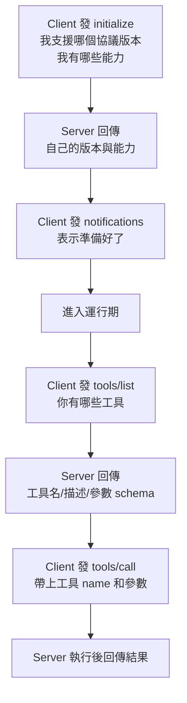

# AI Agent 工具調用一次講清:從 ReAct → Function Calling → MCP → CLI

> 整理自 YouTube「白白说大模型」〈AI Agent 工具调用一次讲清:Function Calling、MCP、CLI 到底差在哪?〉(2026-06-13,約 21.5 分鐘)。這支影片把「大模型怎麼從只會聊天,變成能真的去做事」的整條技術演化路徑串起來:**ReAct → Function Calling(約束解碼)→ MCP → CLI**,並回答四個開場問題:
>
> 1. 怎麼讓大模型輸出 **100% 符合你定義的 JSON 結構**?
> 2. MCP 除了調用工具,**還有什麼別的功能**?
> 3. 為什麼今年 Perplexity 的 CTO 宣布 **棄用 MCP、轉向 CLI**?
> 4. 為什麼以後的軟體設計,**不光要考慮人、也要考慮 AI Agent 來用**?

---

## 一句話總結

大模型本身「只能說、不能做」——像一個**只有腦、沒有手腳的大腦**。要讓它真的去查資料庫、搜網頁、跑程式,就得給它「工具」。整條演化史就是**把「模型想調用工具」這件事,一步步變得更標準、更可靠、更省成本**:



- **ReAct**:最土法的做法,把工具描述寫進 prompt,模型「想一步、做一步」。
- **Function Calling**:模型廠商從 API 層級正式支援,並用**約束解碼**保證輸出 100% 合法的 JSON。
- **MCP**:用標準協議解決「每家公司都各自為同一個工具寫一遍接口」的 N×M 重工。
- **CLI**:乾脆讓模型直接寫命令列指令——文本進、文本出,模型最擅長,而且人也能用同一套。

下面照這條路一段段拆。

---

## 1. 起點:大模型是「有腦無手腳」的大腦

剛出來的大模型雖然很聰明(能回答、寫程式、分析文本),但本質上是個**聊天工具**,有個大限制:**只能說、不能真的做**。

舉個會卡住的例子:使用者問「**我們公司這個月收入是多少?**」。如果 Agent 只是把問題包成 prompt 直接丟給大模型,模型**根本答不出來**——因為答案不在它腦子裡,而在**公司的資料庫**裡。

要讓模型「動手」,就出現了 **ReAct** 這種模式(Reason + Act,推理與行動交替)。

---

## 2. ReAct:想一步、做一步的循環

ReAct 的核心:**大模型負責判斷下一步該做什麼,工具負責真的去執行,執行結果再回到模型讓它繼續判斷**,直到能組織出最終答案。

以「這個月收入多少」為例,完整一圈:



關鍵在第二步:Agent 在 **System Prompt** 告訴模型「你現在可以用工具」,在 **User Prompt** 裡除了使用者問題,還**詳細說明資料庫存取工具的接口、參數**。模型看到後不會硬掰一個答案,而是**輸出一次「工具調用」**(工具名 = 呼叫 MySQL,參數 = 一段查本月收入的查詢)。外面的 Agent 程式拿到後**真的去跑** MySQL,拿到「128 萬」,再把這個結果**附加回對話記錄**重新丟給模型;模型這時看到了工具回傳的真實結果,才回答使用者。

**用 Python 想像這個 loop(只懂 Python 也能看懂骨架):**

```python
messages = [
    {"role": "system", "content": "你可以使用工具。工具清單:query_mysql(sql)→ 查公司資料庫"},
    {"role": "user",   "content": "我們公司這個月收入是多少?"},
]

while True:
    resp = llm(messages)              # 1. 模型判斷下一步
    if resp.tool_call:                # 2. 模型決定要調用工具
        result = run_tool(resp.tool_call)   # 3. Agent 程式真的去執行(跑 SQL)
        messages.append(resp)               # 把「模型的工具調用」記進對話
        messages.append({"role": "tool", "content": result})  # 把結果也記進去
        continue                      # 4. 回到迴圈,讓模型看到結果再判斷
    else:
        return resp.content           # 沒有要調工具了 → 這就是最終答案
```

這個 `while True` 迴圈就是 Agent 的心臟:**模型判斷 → 執行工具 → 結果回灌 → 再判斷**,直到模型不再要求調工具為止。

---

## 3. 早期的痛點:模型在「用自然語言模擬程式接口」

ReAct 雖然能跑,但有個本質問題。早期是把工具描述、工具回傳結果**全塞在使用者對話裡**,再用提示詞「勸」模型輸出標準的工具調用接口。問題是——**模型是用自然語言在「模擬」一個程式接口,但程式接口需要嚴格的契約**。

舉例:工具叫 `get_weather`,規定要查「指定城市、指定日期的天氣」,並要求模型輸出格式化的調用接口。使用者問「明天上海要不要帶傘?」,我們**理想**中希望模型輸出:

```json
{"name": "get_weather", "arguments": {"city": "上海", "date": "2026-06-14"}}
```

但**真實世界**裡,模型可能吐出這種東西:

```text
weather_api(City: 上海, tomorrow)
```

這有三個問題:① `weather_api` **不是你提供的工具名**;② `City: 上海` 不合法——`上海` 沒有雙引號;③ `tomorrow` 根本不是工具定義裡的參數。**這對人類很好理解,但對程式來說很難受**:程式只能吃格式化的輸入,格式錯了要嘛解析失敗、要嘛調用失敗。

> **一句話概括這階段的病灶:模型在用自然語言模擬程式接口,但程式接口需要嚴格的契約。**

---

## 4. Function Calling:廠商從 API 層級正式支援工具

隨著調用工具的需求暴增,模型廠商也注意到趨勢,做了兩件事:

1. **後訓練階段強化**了模型「選擇與使用工具」的能力;
2. **把 API 規範化**——以前大家把工具描述、工具回傳都塞在 user 對話裡;修改後,廠商從 **API 級別支援 Function Calling**,讓工具調用變成模型 API 的一部分:
   - API 裡多了一個專門模塊 **`functions`(後來叫 `tools`)**,用來放可給模型使用的方法 schema;
   - 對話角色除了原本的 `system` / `user` / `assistant`,**新增一個 `tool` 角色**,專門表示「這是工具執行的結果」。

從此開發者可以在 API 中**正式宣告工具**。而且像 OpenAI 的接口可以指定**嚴格約束模式**(`strict: true`),這樣模型輸出的工具調用**一定 100% 符合你要求的接口規範**。

> ⚠️ 注意一個細節:**模型輸出的工具名稱和參數,「一定符合接口規範」,但不一定符合業務邏輯**。約束解碼能保證格式對(JSON 結構合法),保證不了語意對(它仍可能選錯工具、填錯值)。

---

## 5. 約束解碼(Constrained Decoding):JSON 為何能 100% 合法?

這是回答開場第一個問題的核心技術。**大模型會有幻覺,憑什麼還能保證工具調用 100% 符合你定義的接口?**

普通文本生成時,模型每一步預測「下一個 token」,理論上**詞表裡任何 token 都可能被選中**,只是機率高低不同。**約束解碼**改變了這件事:

- 推理引擎會根據工具的 schema,**構造一套語法約束**(可以用**有限狀態機**、正則、或更複雜的自動機來實現);
- 在模型預測**每一個 token 之前**,先判斷「在當前狀態下,哪些 token 合法、哪些不合法」;
- 把**不合法 token 被輸出的機率直接降為 0**。



以「輸出必須是 JSON」為例:
- 第一步**只能**生成左大括號 `{`;
- 生成了 `"city"` 之後,下一步**必須**是冒號 `:`;
- 凡是違反 schema 的(JSON 語法錯誤、缺必填欄位、欄位型別不對)——這些 token 的輸出機率**全被壓成 0**。

> **關鍵心法**:模型不是「**盡量別犯錯**」,而是在**結構層面根本沒機會生成那些非法 token**。這一步非常關鍵,因為它把「模型說它想調用工具」這件軟綿綿的事,變成一個**可解析、可校驗、可執行**的事件。

不只廠商 API 支援約束解碼,像 **vLLM** 這類開源推理引擎也支援。

---

## 6. 從 Function 到 Tool:接口的統一

早期 OpenAI 把這能力叫 **Function Calling**——開發者預先定義函數,模型判斷是否調用並生成參數。後來模型要連接的外部能力越來越多(網頁搜索、文件檢索、代碼執行……),只說「function(函數)」已經不夠準確,於是接口**逐漸統一叫 `tool`**:

- **function 只是 tool 的一種**;
- 而且模型選擇的 `tools` 也變成了**陣列**——支援大模型**一次發起對多個工具的調用**。

---

## 7. MCP:為了解決「N×M 重工」而生

`tool use` 能跑之後,出現一個現實的工程痛點。想像公司 A 要給大模型集成 **Git** 當工具,得做四件事:

1. **學習 Git 的功能**:為每一種命令生成方法名、方法描述、參數描述、輸出描述;
2. 生成**符合模型 tool 接口的 JSON schema** 文本;
3. 模型若回傳「要調用 Git 命令」的 JSON,Agent 程式得**解析這個 JSON**;
4. Agent 用解析好的 JSON 去**命令列執行 Git**,再把 Git 輸出**包裝成模型接口要求的 JSON** 回傳給模型做下一步決策。

問題來了:如果公司 B 也要集成 Git,**這套事得原封不動再做一遍**。5 家公司 × 每家集成 10 個工具 = **5×10 = 50 次重複勞動(N×M)**。這裡有兩個荒謬點:① 這工具是**給大模型用的、人根本不會用**,但每家公司還是得派人去學懂每個命令;② 大家都想為大模型集成 Git,**能不能一個人做好、共享出來,其他人就不必再做了**?

**這就是 MCP(Model Context Protocol)的初衷。**

### 7.1 三個角色:Host / Client / Server



- **Server**:提供 `tools/list`(說明自己支援哪些 tool、每個 tool 的說明與輸入輸出參數約束,都是標準 JSON)與 `tools/call`(你只要給 tool 名字 + 輸入 JSON,它內部去調用並回傳輸出 JSON)。
- **Client**:負責和 Server 通信、建立連接、約定協議、做 session 管理。
- **Host**:就是和使用者互動的 **Agent**——它調用大模型,並透過 Client 與 Server 交互。

**每個 Client 對接一個 Server。** Server 可以跑在**本地**,也可以跑在**遠端伺服器**。

**這樣 N×M 就變成 N+M**:一個人開發好「Git MCP Server」就通用了,提供標準的 list/call;每個 Agent 只需開發**一個** Client(它能適配任意 Server,因為大家都遵循標準 MCP 協議)。5 家公司集成 10 個工具,從 5×10=50 變成 **5+10=15**。

### 7.2 兩種 Server 與完整調用流程

- **本地 Server**:和 Client 之間透過 **stdio(標準輸入輸出)** 通訊;
- **遠端 Server**:和 Client 之間透過 **HTTP** 通訊。

有了 MCP 後,Agent 調用工具的流程:

1. **Host 啟動**時檢查你配置了哪些 MCP Server。遠端的就啟動一個 Client 去連;本地的就**以子進程方式啟動 Server**,再啟動一個 Client 連它。
2. Host 透過**所有 Client** 去查詢所有 Server 的 `tools/list`(包含所有工具的說明、輸入輸出參數)。
3. Host 把**使用者問題 + tools/list** 一起傳給大模型。
4. 模型選了某個工具 → Host 找到負責它的 Client → Client 調用 Server → 回傳工具結果。
5. Host 把工具結果**拼接回對話**,讓模型做下一步判斷。

### 7.3 Client ↔ Server 的協議交互(握手 + 運行期)



### 7.4 MCP 不只工具調用(回答開場第二問)

很多人以為 MCP 就是調工具,其實 Server 還能提供:

- **Resources(資源)**:告訴 Client「我這端有哪些檔案可以被存取」。用 `resources/list` 發現、`resources/read` 讀取、`resources/subscribe` **訂閱某個資源的變化**。
- **Prompts(提示詞模板)**:可複用的提示詞模板,用 `prompts/list` 發現、`prompts/get` 獲取。你可能會問「每個工具的描述不是已經在工具自己的說明裡了嗎,這 prompt 幹嘛用?」——其實這裡的 prompt 更多是「**如何利用多個工具完成更複雜任務的流程指導**」,這就**很類似 Skill 裡的描述**了。
- 還有**日誌、參數補全、進度、取消**等通用能力。

而且要強調:**Server 不是只能被動等 Client 來問,它也能主動提醒 Client**——比如工具列表變了、資源列表變了,Server 可以發提醒;Client 收到後通常會**重新拉一次 list**,刷新自己看到的能力。

**反過來,Client 也能向 Server 暴露能力**,主要三類:

| 能力 | 方法 | 作用 |
|---|---|---|
| **Roots** | `roots/list` | 告訴 Server 當前工作目錄 / 可操作的**邊界** |
| **Sampling** | `sampling/createMessage` | 讓 **Server 反過來調用 Client 這側的大模型**能力 |
| **Elicitation** | `elicitation/create` | 讓 Server 透過 Client **向使用者補充提問** |

(Client 的 roots 變化時,也可發 `notifications/roots/list_changed`。)可以看到 **MCP 協議是雙向、面向連接的**:Client 和 Server 可以互相調用、互相通知。

### 7.5 MCP 的四個問題

正因為設計得「完整」,MCP 也背上四個包袱:

1. **上下文成本高**:Server 多時(例如 10 個 Server、100 個工具),每個工具的功能描述、參數描述加起來**佔用大量 token**。緩解法:**漸進式披露**(一開始只載入工具描述,模型選了某工具後再載入它的參數);或提供一個**全局的搜索工具**,讓模型自己去搜出想要的工具。
2. **Server 要一直開著**:不論遠端或本地,只要程式運行期間就得和 Client 保持連接。很可能一個本地 Server **從沒被調用過,但進程一直在跑**。
3. **協議太大太全**:我們主要用 `tools/list` 和 `tools/call`,但它還設計了 Prompts、Resources,還支援 Server 回調 Client 取得 Host 資訊、或調用大模型——**讓整個架構變得相當複雜**。
4. **必須配套 Client**:Server 一定要有對應的 Client 才能調用,整套設計純粹是**為大模型而生、協議複雜,人在日常生活中根本不會直接用 MCP Server**。

---

## 8. CLI 工具:乾脆讓模型直接寫命令列(回答開場第三問)

MCP 流行時,大家熱情地做了一堆 Server(文件操作 Server、Git 操作 Server)。Agent 集成這些,就得把功能描述、接口規範**全載入上下文,佔掉大量空間**。

但仔細想:**大模型其實完全可以自己在命令列裡寫命令**來完成文件操作和 Git 操作——而且**模型本來就知道這些命令、非常擅長寫**。於是有人提出 **CLI 工具**:就是透過命令列運行的工具。調用時你**只要告訴模型「你可以用 Git 工具」就行**,不必再詳細介紹 Git 有哪些命令、輸入輸出是什麼。

> 今年 **Perplexity 的 CTO 宣布:他們從 MCP 協議轉向傳統 API 和 CLI**;而且**飛書、釘釘、Google** 等也都推出了自己的 CLI 工具,方便和大模型集成。

### 8.1 為什麼 CLI 特別適合大模型?

一般工具軟體(如 Git)同時有**面向新手的桌面 GUI**(對人友好、但模型很難操作)和**面向專業開發者的命令列 CLI**(上手難、但高效)。而 CLI 對模型特別友好,原因有四:

1. **文本進、文本出**——大模型最擅長的就是文本;
2. **命令可組合**——Unix 世界有管道(pipe),可以把多個命令串成複雜任務;
3. **通常有自解釋能力**——即使模型訓練時**沒見過某個新命令**,它也可以跑 `--help` 或讀 schema 來**現學**,再構造下一步命令;
4. **對人類也友好**——人能在日常直接用。這點很重要:MCP 工具調用通常**藏在 Agent 內部**,要透過 Client、走專門協議才能訪問;而 **CLI 命令可以直接在命令列跑**,很容易進入開發者的工作流程(文檔、日誌、教程都有)。

所以現在一些工具開始把 **CLI 設計成「人和 AI Agent 共用」的接口**——飛書、釘釘、Google 的 CLI 在 README 裡都明說「**同時面向人類和 AI Agent**」。背後的信號是:

> **未來的軟體**——只提供 GUI,模型很難穩定操作;提供 API,開發者可以集成;**提供 CLI,模型和人都能直接用。**

### 8.2 CLI 的風險與護欄:強大不能裸奔

CLI 的強大來自「能操作真實系統」,**風險也來自這裡**——模型若生成 `rm -rf` 這種命令當然極危險。所以 CLI 給 Agent 用時**必須有護欄**:

- 預設**只有讀取權限**,寫操作需要確認;
- 高風險命令**強制人確認**(human-in-the-loop,人在迴路);
- 在**沙箱 / 容器**中運行;
- 對命令做 **AllowList(白名單)**,而不是讓模型隨便執行 shell。

> **一句話:CLI 是 Agent 的力氣,但不能裸奔。**

---

## 9. 到底怎麼選?API Function vs MCP vs CLI

Agent 面對「程式內置的 API/Function、MCP 工具、CLI 工具」三條路,該怎麼選?

| 方案 | 定位 | 優勢 | 劣勢 | 最適場景 |
|---|---|---|---|---|
| **API / Function(平台內置)** | 和 Agent 跑在**同一個進程**裡 | 效率最好、低延遲、可控、工程邊界清晰 | **複用性最差**,每個應用都要自己適配工具 | 產品後端**固定工作流**、高吞吐調用 |
| **MCP** | 標準協議、跨應用 | **通用性最強**、協議規範、一般更安全、可標準化發現與調用 | 工具多時**上下文成本高**、協議複雜 | 企業工具**跨應用複用**、全鏈審計 |
| **CLI** | 用文本直接操作軟體並串起來 | 文本友好、可組合、可調用、**人和模型共用** | 命令可能**危險**,需做好防護 | 開發者工具、本地環境、**文件 / Git / 雲端資源**操作 |

> **未來的工具生態,很可能不是單一路線,而是融合路線。**

---

## 10. 作者對未來的五個判斷

1. **模型廠家會在後訓練時不斷強化「模型選擇工具」的能力**。
2. **MCP 會繼續存在**,尤其在**企業級、跨應用、複雜全鏈**的場景——因為企業不只要「能調用」,還要知道:**誰調用了、為什麼調、調了什麼數據、能不能撤銷、能不能審計**。
3. **CLI 會變得更重要**——它天生適合模型學習、複用和組合;一個設計良好的 CLI 能**同時服務專業人類和 AI Agent**。
4. **以後的工具型產品開發,不光要考慮人,也要考慮 Agent**(回答開場第四問)——會**同時提供 GUI、CLI、MCP** 等多種使用方式。
5. **訓練數據會產生飛輪**:一個工具如果網上有大量 CLI 教程、命令示例、錯誤日誌、Q&A、腳本片段,未來模型就**更容易學會使用它**,連 prompt 都不必再提示它這方法的作用和參數——因為模型已經**內化**了。例如:飛書有好用的 CLI + 網上大量人類使用的文檔/討論/代碼,而釘釘沒有 → 大模型就更容易用飛書 → 飛書更容易被集成 → 更多人選飛書(贏者通吃的正回饋)。

---

## 應用案例 / 怎麼用這套思路

- **你在替自己的 Agent 接工具,該選哪條路?**
  - 工具是你**自己產品後端**、追求低延遲高吞吐 → 直接寫**內置 Function**(同進程最快)。
  - 工具要**給很多團隊/產品共用**、且需要審計治理(企業內部系統)→ 包成 **MCP Server**(一次開發、標準複用)。
  - 工具本來就有命令列、或操作本地檔案/Git/雲資源 → 直接給模型 **CLI** + 護欄(白名單、唯讀預設、危險命令人工確認)。
- **為什麼你的 Agent 上下文爆掉?** 很可能是掛了太多 MCP Server,把上百個工具描述全載入了。對策:**漸進式披露**(先給描述、選中再載入參數)或加一個**工具搜索工具**讓模型自己找。
- **設計產品時的新習慣**:如果你在做一個給開發者的工具,**除了 GUI,認真做一套 CLI**,並在 README 標明「同時面向人類與 AI Agent」——這會讓你的工具更容易被 Agent 採用,長期吃到「訓練數據飛輪」的紅利。
- **想保證模型輸出結構 100% 合法**(例如要它一定吐合法 JSON 給下游程式解析):用支援 **約束解碼 / `strict` 模式**的 API 或推理引擎(OpenAI strict、vLLM guided decoding),而不是靠 prompt「拜託它別出錯」。但記住——**約束解碼只保證格式對,不保證語意對**,業務正確性仍要自己校驗。

> 延伸對照:本庫 [[function-calling-mcp-a2a]](AI Agent 三大核心技:Function Calling、MCP、A2A)——同一作者光譜的另一軸(第三圈是 **A2A**,Agent 之間協作),本篇第三圈則換成 **CLI**(人機共用接口),兩篇互補;以及 [[agent-native-tooling-steinberger]](為 Agent 而生的工具設計)、[[top-skills-for-agents]](Agent 最該具備的幾種 Skill)、[[building-claude-skills]](打造 Claude Skill)——都呼應「Prompt / Skill 是給模型用的流程指導」這條線。

---

## 來源

- 白白说大模型,〈AI Agent 工具调用一次讲清:Function Calling、MCP、CLI 到底差在哪?〉,YouTube:<https://www.youtube.com/watch?v=hR5ephowvLM>(2026-06-13,約 21.5 分鐘)
- **該片無字幕,逐字稿以 CPU 版 faster-whisper(`vad_filter=True`、`condition_on_previous_text=False`,small 模型,zh)轉錄取得,非官方字幕**;專有名詞(ReAct、Function Calling、約束解碼、有限狀態機、MCP 的 initialize/tools-list/tools-call/Resources/Prompts/Roots/Sampling/Elicitation、CLI、AllowList)與案例數字(公司收入 128 萬、N×M=5×10、5+10)依語音還原,可能有少量聽寫誤差,實際以原片為準。
