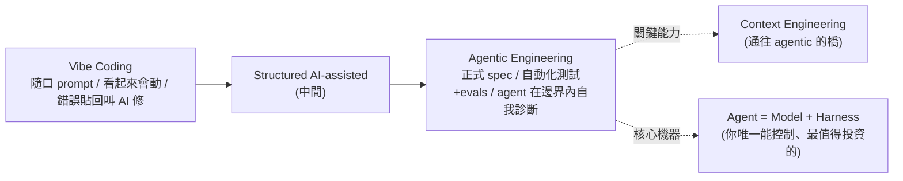

# Google 五天 AI 開發課程 Day 1:從 Vibe Coding 到 Agentic Engineering 的完整心智模型

> 整理自 YouTube「Gary Chen」〈Google Agentic Engineering 課程拆解 Day 1,從 Vibe Coding 到 Agentic Engineering〉(2026-07-10,約 16 分鐘)。Google 上線一套**五天的 AI 開發課程**,第一次把整個業界正在收斂的共識寫成正式框架(光 Day 1 講義就 51 頁)。這支影片濃縮 Day 1 的四大核心。
>
> 現況:**85% 專業開發者在用 AI coding agent、41% 新 code 是 AI 寫的**,但「vibe coding」「agentic engineering」十個人講有十種意思——這門課把它講清楚了。

---

## 一句話總結

**Vibe coding 和 Agentic engineering 不是二選一的開關,是一條光譜;分水嶺是「驗證」;而長期真正該投資的不是換 model,是打造你自己的 harness。** 講義最後一句話最精準:**"Generation is solved. Verification, judgment, and direction are the new craft."**(產出效率已被解決,驗證/判斷/方向才是新的手藝活。)

---

## ① Vibe Coding ↔ Agentic Engineering 是一條光譜

2025-02 Karpathy 提出 **vibe coding**(完全順著感覺、用自然語言描述、不看 code、錯誤貼回給 AI 修);2026 初他又補 **agentic engineering** 描述「有紀律的那一端」。Google 的第一個主張:這兩者是**一條光譜的三個位置**(vibe coding → structured AI-assisted coding → agentic engineering),**判斷標準不是你用不用 AI,而是「AI 的輸出周圍有多少結構、驗證、人類判斷」**。

| 面向 | Vibe Coding | Agentic Engineering |
|---|---|---|
| **意圖規格化** | 隨口的自然語言 prompt | 正式 spec、架構文件、memory files |
| **驗證** | 看起來會動 | 自動化測試 + CI/CD gates + LM judges |
| **錯誤處理** | 錯誤訊息貼回去叫 AI 修 | agent 在你定義好的邊界內自我診斷,人只處理架構層級 |

- **沒有對錯,看場景與出錯風險**:週末做 prototype 純 vibe 完全合理(跑壞重來、沒人受傷);但**處理金流的 production API 必須 agentic engineering**(「我們在 vibe coding 付款系統」會讓 CTO 臉綠)。
- **兩端最大分水嶺是「驗證」,而驗證有兩種**:**tests** 驗證確定性(給這輸入就該吐這輸出)、**evals** 驗證非確定性(agent 路徑對不對、工具選對不對、產出有沒有到品質標準)。**Google 講得很死:沒有這兩個,不管 prompt 多精緻,你做的都還是 vibe coding。**

---

## ② Context Engineering:比 prompt engineering 更重要的技能

要往 agentic 那端移動,練的不是「把 prompt 寫更漂亮」,而是 **context engineering**——**像幫新員工做入職簡報**:你不會只丟「幫我把功能做出來」,而會講任務、專案背景、公司規範。核心問題:「一個新加入的工程師需要知道什麼才能有效貢獻?我又怎麼把這些編成 AI 能用的形式?」

**六種 context**:instructions(角色/邊界)、knowledge(領域知識)、memory(短長期狀態)、examples(行為示範)、tools(工具定義)、guardrails(硬性約束)。又分兩類:

| | Static context | Dynamic context |
|---|---|---|
| 是什麼 | 每次一定載入(系統指令、rule files 如 **AGENTS.md/CLAUDE.md**) | 按需載入(skills、RAG 文件、工具結果) |
| 好處 | 可靠,agent 不用自己找 | 便宜、可擴展,需要才付錢 |
| 壞處 | **貴**(什麼問題都載入=每次燒 token) | agent 該去抓時沒去抓 |

> **這條 static/dynamic 邊界本身就是關鍵架構決策,要像 code 一樣被 review、被版控。**
>
> **管理 dynamic context 最強的 pattern = Agent Skills + progressive disclosure**:agent 平常保持通用,啟動時只看每個 skill 的一行 metadata,任務匹配才載入完整指令、需要深層才拉參考資料 → **一個 agent 帶幾十種專業能力,但只為正在用的那一個付 token**。skill 兩個提醒:① **有複利效應**(每天用的 skill 持續迭代、越用越好,別想一步到位)② **要 agent 友善、人類可維護**(別寫一萬行,產出走歪時要能找出是哪份「老鼠屎 skill」把 agent 帶歪)。

---

## ③ 工廠模型:你的產出不再是程式碼,而是「產出程式碼的系統」

**SDLC(需求→設計→實作→測試→部署→維護)被 AI 不均勻地壓縮**:implementation 從幾週→幾小時,但需求訪談/架構決策/驗證還是人的速度。所以**不是舊流程被加速,而是誕生了新流程**(階段邊界模糊、迭代週期週→分鐘、**spec 品質變成新瓶頸**)。

- **需求**:文件傳遞 → 人跟 AI 對話(訪談仍要人談,談完 AI 幾分鐘生 spec + 初版 prototype)。
- **架構**:最頑固的人類階段(架構決策本質是 trade-off,依賴商業脈絡、AI 抓不到全貌;AI 擅長的是架構定案「之後」的執行)。
- **實作**:業界調查生產力 +25–39%,但 **METR 研究發現資深工程師某些任務反而慢 19%**(時間花在驗證修正)。兩者不衝突——**AI 不是消滅實作,是把實作從「寫」變成「review、引導、驗證」**。
- **維護(最被低估)**:agent 可讀懂整個 codebase、在尊重既有架構下動手改;框架遷移、更新過時 API、現代化測試——以前風險太高沒人碰的,現在可以翻修了。

> **Factory model(工廠模型)**:把開發流程想成一座工廠,**你是工廠經理**——不親手組裝零件,而是設計產線、把關品質。所以**開發者的主要產出不再是程式碼,而是「產出程式碼的系統」**(含 spec + context、實作 agents、驗證測試/品質關卡、把失敗導回的 feedback loops、約束行為的 guardrails)。**你給 agent 的是 success criteria,不是 step-by-step 指令,讓它自己迭代。**

---

## ④ Agent = Model + Harness(全片最重要的公式)

很多人把 model 當系統本身(新 model 出來就覺得 agent 變聰明、舊 model 就變笨)——**這觀念是錯的,會讓你把時間投資在錯的地方**。正確公式:**Agent = Model + Harness**。一顆 raw model 不是 agent,要 harness 給它狀態、工具、feedback loop、可執行的約束,它才變成 agent。你用 Claude Code / Cursor / Codex 感受到的行為差異,**很大一部分是 harness 決定的,不只是底下那顆 model**。

> 若 context engineering 是「入職簡報」,**harness engineering 就是「整間公司的運作方式」**(IT 基礎設施、工作流程規範、門禁、績效評估)——入職簡報只是其中一環。

**Harness 六大件**:① **rule files**(agent 是誰、在乎什麼、絕對不能做)② **tools**(function/MCP servers + 何時用哪個)③ **sandbox**(code 在哪跑、能摸什麼摸不到什麼)④ **orchestration**(sub-agent 調度、model 路由、專家交接)⑤ **hooks**(生命週期固定點跑的確定性 code,如 commit 前擋掉硬編碼密碼——放「agent 不該忘卻常忘的事」)⑥ **observability**(logs/traces/evals/成本監控——沒這層你不知道 agent 是做得好還是在偷偷燒你的錢亂做)。

**兩個 case 證明 harness 比 model 重要**:
- **Terminal Bench 2.0**:有團隊**完全不換 model、只改 harness**,成績從 30 名外拉進前 5。
- **LangChain 實驗**:同一顆 model,只調 system prompt/tools/middleware,加了 13.7 分。

> **大部分 agent 失敗都是 configuration**(缺一個工具、一條規則太模糊、少一個 guardrail、context 塞滿雜訊),不是 model。agent 出包時第一反應別急著換 model——**多花五分鐘問「我的 rules/workflows/skills 哪裡可改讓這錯不再發生」,把答案寫回 harness**,錯誤就從成本變資產。**harness 是你/團隊的地盤,不是 model 廠商的;model 你控制不了,harness 是你唯一能控制、也最值得投資的地方。**

### 人的角色:Conductor ↔ Orchestrator(來回切換)
- **Conductor(指揮家)**:在 IDE 看 code 一行行出現、隨時下指令修正、每步在掌控。適合**複雜邏輯、棘手 debug、不熟的 codebase**。
- **Orchestrator(放牛吃草)**:定義目標後指派任務給 agents 背景平行跑,隔段時間回來 review 給方向。適合**定義明確的任務、bug fix、照既有 pattern 做的功能、codebase 遷移、測試生成**。需要四個技能:**specification**(定義到 agent 不誤解)、**decomposition**(拆成一個 session 能消化的大小)、**evaluation**(快速判斷過不過關)、**system design**(設計約束/測試/feedback loop)。

---

## ⑤ Token 經濟學:為什麼早期投資工作系統的人，後期反而更便宜

用 **CapEx(前期投資)vs OpEx(營運成本)** 來算:

- **Vibe coding 看似超便宜**(訂閱費 + 幾句 prompt,前期投資趨近零),但藏著**三個會複利成長的營運成本**:① **token 燃燒率**(沒整理的 context 整包倒進去、反覆叫 model 修它自己沒驗證過的錯,低成功率迴圈每輪都燒 API)② **維護稅**(沒結構一致性的 AI code,半年後出 bug,工程師花好幾天逆向工程那坨義大利麵)③ **資安補救**(生得快、漏洞多,production 修一個資安漏洞是設計階段抓到的好幾倍)。
- **Agentic engineering 把帳反過來**:前期投工程時間(設計 API schema、建測試套件、整理 context)**CapEx 高**,但**每個功能的邊際成本大幅下降**——因為 AI 在一座治理好的工廠裡跑,產出天生結構就對、預先測過、符合公司標準。

> **Context engineering 不只是技術,是財務槓桿**:LLM 按你送進去的每個 token 收費,把 10 萬 token 的 repo 整包塞進每個 prompt 很不划算;一份精準的 context 會直接拉高 **first-pass 成功率**,第一次就做對 = 省掉整條 trial-and-error 的錢。**你不能決定模型的費用,但可以用更少 token 完成一樣的任務——只要你管好 context。**

---

## 應用案例 / 行動建議(照 Google 給的分角色)

- **個人開發者**:① **建立並維護自己的 AGENTS.md / CLAUDE.md**(十行就能開始:技術棧、慣例、硬規則、workflow;agent 每做一次你不想再看到的事,就加一條規則)② **測試跟 evals 在生 code 之前寫**(它們是你跟 AI 之間的合約,好測試套件比任何自然語言 prompt 都更能精確傳達意圖)③ **要上線的 code 每一行都 review**(對「看起來很聰明」的東西保持懷疑,檢查 import 的套件是不是真的存在)④ **基本功不能忘**(debug 方法、系統設計原則——AI 是放大你的專業,不是替代)。
- **半路轉行的 vibe coder**:上述這些正是你需要花時間補的。
- **帶團隊 / 規劃 AI 轉型的主管**:① **把 AI 開發當工程投資,不是生產力功能**(導入 coding agent 卻不配套 evals/observability/架構標準,只會產出「有速度沒品質」的 code、技術債堆最快)② **把 harness 當團隊共用資產**(system prompt/skill 庫/eval 套件都像 code 被版控、review、有人維護——建一次、之後每個專案都在複利)③ **人+agent 混合團隊會是常態**(人訂方向、agent 實作;招募培養重心從「實作能力」移到「判斷力」——**會寫最多 code 的不再是最有價值的工程師,能把 agent 指揮得好的才是**)。

> **最該投資時間的地方**:model 每幾個月換一代、你永遠追不完;但你為自己工作流打造的 harness(rules/skills/evals)是**存在 version control 裡、會複利的資產**,model 越換越強、你的系統跟著水漲船高。
>
> 延伸對照:本庫 [[harness-engineering-evolution]]、[[ai-harness-explained]]、[[agent-harness-loop-llmops-eval-explained]](harness/eval/observability 全景)、[[claude-code-loop-types-official]] 與三篇 loop 筆記、[[building-claude-skills]] 與 [[top-skills-for-agents]](Skill + progressive disclosure)、[[defining-tasks-not-prompts]]/[[voice-input-ai-context-transformation]](spec/意圖)、[[ai-coding-three-illusions-opencode]]、[[context-engineering-processing-vs-thinking]]、[[model-agnostic-ai-workflow]]、[[ai-compute-token-economics]](token 經濟)。**這篇是把上述主題用 Google 官方框架一次串起來的權威版總覽。**

---

## 來源

- Gary Chen(@garytalksstuff),〈Google Agentic Engineering 課程拆解 Day 1,從 Vibe Coding 到 Agentic Engineering〉,YouTube:<https://youtu.be/GzHfE50N8x4>(2026-07-10,約 16 分鐘)
- 本文依該片**官方 zh-TW 字幕**整理。原始教材為 Google 五天 AI 開發課程 Day 1(51 頁講義);後續 Day 2(agent 工具/MCP/A2A)、Day 3(skills/記憶/context 優化)、Day 4(security/evaluation)、Day 5(spec-driven production 開發)作者表示有興趣會續做。數據(85% 用 agent、41% 新 code 為 AI、生產力 +25–39%、METR −19%、Terminal Bench 前 5、LangChain +13.7)依影片轉述。
