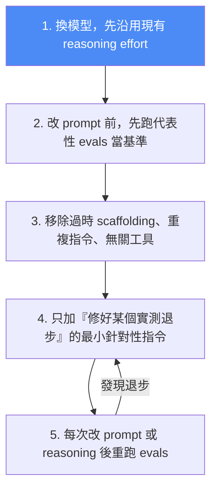

# OpenAI GPT-5.6 官方提示指南:從「規定步驟」轉向「描述終點 + 停止條件」

> 來源:OpenAI 官方開發者文件《Prompt guidance for GPT-5.6》。這是一份**給用 API 建 agent 的人**的提示遷移指南——重點不是「怎麼寫漂亮句子」,而是**在模型變強、變簡潔之後,你的 prompt 該砍掉什麼、補上什麼**。核心精神與本庫 [[bitter-lesson-cut-old-patterns]] 一脈相承:模型升級後,舊 prompt 常常在拖垮新模型。

---

## 一、一句話抓重點

GPT-5.6 更聰明、更簡潔、也更會自己做判斷。所以官方的建議反直覺地是:**先把 prompt 變短**——描述「要到哪裡(outcome)」而不是「每一步怎麼走(steps)」,再用**停止條件**告訴它何時該收手。官方內部 coding-agent 評測顯示:**把 system prompt 精簡後,評測分數反而提升約 10–15%,同時總 token 減少 41–66%、成本降 33–67%。**(結果因工作負載而異,須在自己的代表性任務上驗證。)


---

## 二、核心原則逐條拆解

### 1. 先做減法(Simplify first)
先刪掉:重複的陳述、冗餘的風格指令、不會改變行為的範例。**保留**:結果描述、成功標準、安全限制、工具路由規則、驗證要求。

### 2. Outcome-first + 絕對規則要節制
描述「目的地」而非「步驟」。`ALWAYS`／`NEVER` 這種絕對規則**只留給真正的不變量**(如安全);需要判斷的情境,改用**決策規則(decision rules)**。

```text
Resolve the customer's issue end to end.
Success means:
- make eligibility decision from available policy
- complete allowed actions before responding
- return completed_actions, customer_message, blockers
- if required evidence missing, ask for smallest missing field
```

### 3. 停止條件(Stopping conditions)—— 這份指南的靈魂
明確告訴模型「什麼時候算做完、該停」,否則它會過度呼叫工具或反覆打轉。

```text
Resolve in fewest useful tool loops without sacrificing correctness.
After each result, assess whether core request is answerable with
useful evidence. If yes, answer. If not, name missing facts.
```

> 🔎 **對照本庫:** 這正是 [[claude-code-loop-types-official]]、[[loop-engineering-when-and-how-gary-chen]] 反覆強調的「可驗證的完成定義 + hard stop」,只是換成 OpenAI 的語言。

### 4. 個性、協作風格、回應長度分開寫
GPT-5.6 天生比 5.5 更簡潔。用 **`text.verbosity`** 參數(`low`／`medium`／`high`)控制預設詳細度;個性(語氣、溫度、直接程度)與協作風格(何時發問、何時自行假設、何時解釋取捨)**分開、簡短**地定義。

```text
State the answer directly. If user reports problems, acknowledge
specific issues before next steps. Use reassurance only when relevant.
```

### 5. 自主與批准邊界(Autonomy & approval)
用一小段 policy 界定「什麼能自己做、什麼要先問」:

```text
For answer/explain/review requests: inspect materials, report results.
Don't implement changes unless asked.

For change/build/fix requests: make requested local changes and run
non-destructive validation without asking.

Require confirmation for: external writes, destructive actions,
purchases, or scope expansion.
```

### 6. 工具路由(Tool routing)
**只暴露與任務相關的工具**;每個工具說明:它做什麼、何時用、重要回傳欄位、出錯行為。並加一條「前置檢索規則」防止它跳過必要步驟:

```text
Before acting, resolve required discovery, retrieval, validation steps.
Don't skip prerequisites because intended end-state seems obvious.
```

### 7. 程式化工具呼叫(Programmatic Tool Calling, PTC)
| ✅ 適合用 PTC | ❌ 不適合 |
|---|---|
| 過濾、join、排序、排名、去重、聚合 | 單次呼叫、中間輸出很小 |
| 批次處理、重複驗證、壓縮大型結構化結果 | 呼叫間需要語意判斷 |
| | 需批准的動作、依賴引用來源的回答 |

```text
Use PTC only for record-reduction stage. Call only documented
read-only tools. Filter and deduplicate results, emit compact schema
with evidence fields. Retry transient failures twice max.
```

### 8. 接地、引用與檢索預算(Grounding & retrieval budgets)
- Q&A **先用一次廣泛搜尋**(用有鑑別力的關鍵字);只有在缺少必要事實／日期／ID／來源,或使用者要求窮盡覆蓋時,才追加檢索。
- 研究綜合:**只引用檢索到的來源**、把「推論」與「有直接來源支持的事實」分開標註、指出來源衝突、寧可縮小回答或報告證據不足,也不要猜。

> 🔎 對照 [[is-graphrag-needed-rag-variants-comparison]]:少而準的檢索常勝過無腦多輪。

### 9. 長流程與狀態(Long-running workflows)
- 第一次呼叫工具前給一段**簡短可見的前言**,之後只在**重大階段轉換**時給稀疏的、以結果為主的更新;**別逐一旁白例行的工具呼叫**。
- 每次更新:一個具體結果 + 下一步。重播歷史時保留 assistant 的 phase 值;在重大里程碑後才壓縮,不是每輪都壓。

### 10. 推理強度參數(Reasoning effort)
- **遷移時先沿用**目前 5.5/5.4 的 effort 當基準,再在代表性任務上測「同一檔」與「低一檔」。
- `low`:對延遲敏感、且品質不掉時;`medium`:平衡起點;`high`／`xhigh`:評測顯示有意義提升才用;`max`:留給最難的品質優先工作。
- **調高 effort 前先檢查**:是不是缺了成功標準、依賴規則、工具路由規則或驗證迴圈?(常常是 prompt 沒寫好而非模型不夠力。)

### 11. 前端與視覺任務
GPT-5.6 的版面/設計判斷更強。**沿用既有 design token、元件、樣式**;沒要求就別加額外功能;保留 RWD 行為;**定稿前先 render 出來檢查**。

### 12. 收尾前檢查(Check work before finishing)
提供驗證工具並說明「什麼才重要」:

```text
After changes, run most relevant validation:
- targeted tests for changed behavior
- type checks or lint checks
- build checks for affected packages
- minimal smoke test when full validation too expensive
```

視覺產物:定稿前 render,檢查版面、裁切、間距、缺漏內容、視覺一致性,改到「渲染輸出符合需求」為止。

---

## 三、官方建議的 Prompt 結構模板

```text
Role: [模型的功能與背景]

Personality: [語氣與協作風格]

Goal: [使用者可見的成果]

Success criteria: [給出最終答案前必須為真的條件]

Constraints: [政策、安全、商業、證據、副作用限制]

Tools: [用哪些工具、何時用、什麼別用]

Output: [分段、長度、格式、語氣]

Stop rules: [何時重試、退回、放棄、發問或停止]
```

> 🔎 **對照本庫:** 這與 [[defining-tasks-not-prompts]] 的「目標/背景/素材/邊界/完成定義」五欄位 brief 幾乎同構——**把任務定義清楚,遠比雕琢措辭重要**。

---

## 四、遷移工作流(換模型時照這個做,別一次全改)



**關鍵原則:不要同時重寫整套 prompt stack**——否則你無法判斷行為變化到底來自模型、reasoning 設定、prompt、工具還是 runtime。一次只動一個變數。

---

## 五、應用案例

1. **客服 agent 從「腳本」改「終點+停止條件」:** 舊 prompt 常寫成「第一步查訂單、第二步查政策、第三步……」;GPT-5.6 建議改成「成功=做出資格判斷+完成允許的動作+回傳 completed_actions/customer_message/blockers;缺證據就問最小的欄位」,再配 stopping condition「能答就答、不能就列出缺什麼」。→ 模型自己決定路徑,少繞圈、少燒 token。
2. **把冗長 system prompt 瘦身當成一次可量測的實驗:** 依官方數據,精簡後分數 +10~15%、token −41~66%、成本 −33~67%。做法照「遷移工作流」:先建 eval 基準 → 砍重複/無關工具 → 每次只補一條修 regression 的指令 → 重跑 eval。**這是可複製的降本增效手法,不是玄學。**
3. **資料密集任務用 PTC、判斷密集任務別用:** 要對 500 筆檢索結果過濾去重排序 → PTC(read-only 工具、compact schema、暫時性失敗最多重試兩次);但「這兩個候選方案哪個好」這種語意判斷、或需要人批准的動作 → 別交給 PTC。
4. **調高 reasoning effort 前先自我檢查 prompt:** 覺得模型「不夠聰明」想從 medium 拉到 high 前,先看是不是漏了成功標準、依賴規則、驗證迴圈——很多時候補齊 prompt 比加 effort 更省又更準。

---

## 六、重點回顧(TL;DR)

- **先做減法**:砍重複/風格贅語/無效範例,留成功標準、安全限制、工具路由、驗證要求。
- **Outcome-first**:描述終點不規定步驟;絕對規則只留給安全;判斷用 decision rules。
- **停止條件是靈魂**:明確定義「何時算完成、該停」。
- **GPT-5.6 更簡潔**:用 `text.verbosity` 控長度;個性與協作風格分開簡短寫。
- **自主邊界**:answer/review 只報告不動手;change/fix 可自行做+非破壞性驗證;外部寫入/破壞/購買/擴大範圍要先確認。
- **PTC** 用於過濾去重聚合等 record-reduction,不用於語意判斷/需批准/依賴引用。
- **檢索**:先一次廣搜,缺關鍵事實才追加;引用只引檢索到的、推論與事實分開標。
- **遷移**:沿用 effort→建 eval 基準→砍贅→只補最小 fix→逐次重跑;**一次只動一個變數**。
- 官方數據:精簡 prompt → 分數 +10~15%、token −41~66%、成本 −33~67%(需自行驗證)。

---

## 來源

- OpenAI 官方文件:[Prompt guidance for GPT-5.6(developers.openai.com)](https://developers.openai.com/api/docs/guides/prompt-guidance-gpt-5p6)
- 延伸(本庫):[Bitter Lesson:模型變強後舊 prompt 正在拖垮新模型](./bitter-lesson-cut-old-patterns.md)、[你不是不會寫 Prompt,是不會定義任務](../../ai-productivity/defining-tasks-not-prompts.md)、[Claude Code 官方四種 Loop](./claude-code-loop-types-official.md)、[Loop Engineering 實務(Gary Chen)](./loop-engineering-when-and-how-gary-chen.md)
