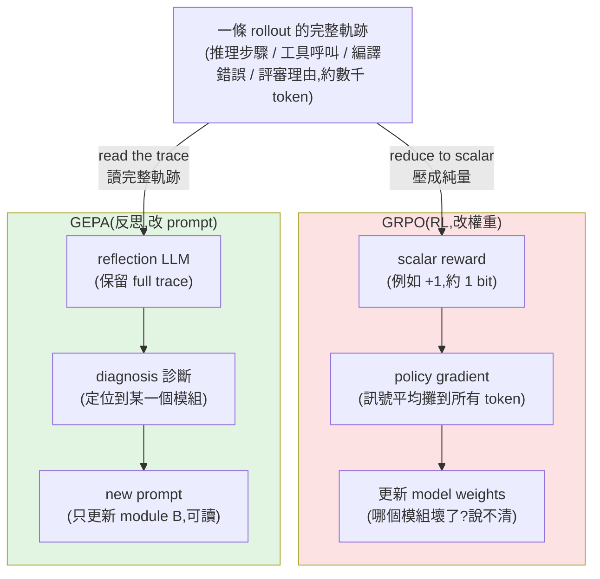

# GRPO vs GEPA:同一條 rollout,兩種完全不同的「學習訊號」

> 一句話:**GRPO 把整條執行軌跡壓成一個純量 reward(約 1 bit)去更新模型權重;GEPA 讓一個 reflection LLM
> 直接「讀」那條完整軌跡(數千 token 的語言訊號),反思出問題、改寫某個模組的 prompt。**
> 結果:GEPA 平均贏 GRPO 6%、最高 20%,而且 **rollout 最多省 35 倍**(例:678 次 vs 24,000 次)。
>
> 本筆記整理自 GEPA 論文(arXiv 2507.19457,DSPy 團隊)與 GRPO(DeepSeekMath, 2024)原始定義,
> 並對照那張「GRPO vs GEPA:Same rollout. Different signal.」資訊圖。

---

## 為什麼要比這兩個

它們想解決的是**同一個問題**:讓一個 LLM 系統在某個任務上變得更好。但「從一次嘗試中學到東西」的方式天差地遠:

- **GRPO** 是 **強化學習(RL)**:跑很多次、用獎勵訊號做 policy gradient,**改的是模型權重**。
- **GEPA** 是 **反思式 prompt 演化(reflective prompt evolution)**:讀懂軌跡、用自然語言反思,**改的是 prompt 文字**(模型權重不動)。

資訊圖的副標說穿了重點:**Same rollout, different signal**——同一條 rollout 裡藏著大量資訊
(reasoning steps、tool call、compiler error、judge rationale),GRPO 把它**丟掉**只留一個分數,GEPA 把它**讀進去**。

> 底線結論(資訊圖原文):**「GRPO discards the signal. GEPA reads it.」**

---

## GRPO 是什麼(Group Relative Policy Optimization)

出處:**DeepSeekMath(2024)**,後來用在 DeepSeek-R1。它是 PPO 的精簡版,**拿掉了 critic(value model)**。

運作方式:

1. 對同一個 prompt,**抽一組(group)** 多個回答 $o_1, ..., o_G$。
2. 每個回答拿到一個 **純量 reward** $r_i$(對錯、測試通過與否、judge 打分…)。
3. **用這組的平均當基準線**算優勢:$A_i = \dfrac{r_i - \text{mean}(r)}{\text{std}(r)}$——
   贏過組內平均的被加強、輸的被抑制。**這就是「group relative」**:不需要另一個價值網路去估 baseline。
4. 用 policy gradient 更新**模型權重**,並用 KL 把新策略拉住別離原模型太遠。

GRPO 的特性(也是它的痛點),對照資訊圖:

- **signal kept: 1 bit**——整條豐富軌跡最後只剩一個分數。
- **spread across all tokens**——這個分數的 credit 被攤到序列裡每個 token,**「到底哪個模組/哪一步壞了?」說不清楚**(credit assignment 模糊)。
- **needs ~24,000 rollouts**——訊號太稀疏,要靠海量取樣才學得動。
- **改權重、但 opaque**——學到的東西藏在參數裡,不可讀、不可審。

> 優點別忘了:改權重是「真的在改模型能力」,能學到 prompt 塞不進去的東西、上限更高;
> 對可大量取樣、reward 明確(數學、程式測試)的任務很有效。

---

## GEPA 是什麼(Genetic-Pareto)

出處:**GEPA: Reflective Prompt Evolution Can Outperform Reinforcement Learning(arXiv 2507.19457)**,
作者群來自 DSPy 圈(Lakshya Agrawal、Omar Khattab、Matei Zaharia、Christopher Potts、Ion Stoica 等 17 人)。
它是一個 **prompt optimizer**:給定任何「含一個以上 LLM prompt 的 AI 系統」,自動把這些 prompt 演化得更好。

三個關鍵動作:

1. **採樣完整軌跡 + 自然語言反思(reflective mutation):**
   跑系統、把 **reasoning、tool call、tool output、編譯錯誤、評審理由** 等整條 trace 餵給一個 **reflection LLM**,
   讓它用自然語言**診斷**「為什麼失敗 / 哪裡可以更好」,然後**提出一版新的 prompt**並回去測。
   —— 對照資訊圖:**signal kept: full trace**、**localized to one module**(只改 module B,其他不動)。

2. **Pareto 前緣的候選挑選(genetic-Pareto,最關鍵的設計):**
   它**不是**只盯著「目前最好的那版 prompt」一直爬(hill-climbing 容易卡在局部最優)。
   GEPA 維護一個候選池,從 **Pareto 前緣** 取樣——也就是「在至少某些訓練樣本上表現最好」的那些候選都保留下來。
   這樣能**保住多樣的解法策略**,避免被單一指標帶歪,讓有限的嘗試覆蓋更廣的可能性。

3. **互補經驗的合併(system-aware merge / crossover):**
   把 Pareto 前緣上**各擅勝場**的候選**合併**——A 版在某類題目強、B 版在另一類強,就嘗試把兩邊的「教訓」湊成更全面的一版。

GEPA 的特性,對照資訊圖:

- **needs 678 rollouts**(對上 GRPO 的 24,000,**≈35× 更少**)。
- **改 prompt、readable**——學到的是**人看得懂、可審、可改**的自然語言規則,而非黑箱權重。
- **weights frozen**——base model 完全不動,只動 prompt。

---

## 數據對照(論文 verified 數字)

| 比較對象 | 結果 |
|---|---|
| **vs GRPO(RL)** | 跨六個任務**平均 +6%、最高 +20%**,且 **最多省 35× rollouts**(圖中 678 vs 24,000 即此量級) |
| **vs MIPROv2(當時最強 prompt optimizer)** | **超過 +10%**;在 **AIME-2025** 上 **+12% 準確率** |
| **額外** | 在程式碼最佳化上,也展現了當作 **inference-time search(推論期搜尋)** 策略的潛力 |

論文核心論點一句話:**「語言這種可解讀的媒介,往往比稀疏的純量 reward 提供更豐富的學習訊號。」**

---

## 為什麼 GEPA 能用這麼少的 rollout 就學會

關鍵在**每次嘗試萃取出的資訊量**:

- GRPO 一次 rollout 的「可學訊號」≈ **1 個純量**(對/錯)。要從「對錯統計」反推出「該怎麼改」,只能靠**大數法則**慢慢逼近 → 需要上萬次。
- GEPA 一次 rollout 的「可學訊號」≈ **數千 token 的語言**(它**讀得到**編譯器吐的錯誤訊息、judge 寫的理由)。
  reflection LLM 可以**一步**就讀懂「喔,是因為日期格式沒處理」並直接改 prompt → 幾十次嘗試就有大幅進步。

換句話說:**GRPO 在「猜」哪裡錯(靠梯度統計),GEPA 直接「讀」哪裡錯(靠語言反思)。** 這是 rollout 數差一個數量級的根因。

---

## 取捨與適用場景(別當成 GEPA 全面取代 GRPO)

| 面向 | GRPO(RL 改權重) | GEPA(反思改 prompt) |
|---|---|---|
| 改的東西 | 模型權重 | prompt 文字(權重凍結) |
| 學習訊號 | 稀疏純量 reward | 完整軌跡的自然語言 |
| 取樣成本 | 高(上萬 rollouts) | 低(數百 rollouts) |
| 可解讀性 | 低(黑箱) | 高(可讀、可審、可手改) |
| 能力上限 | 高(能學進 prompt 塞不下的新能力) | 受 base model 既有能力與 prompt 容量限制 |
| credit assignment | 模糊(攤到所有 token,難定位模組) | 精準(反思可定位到單一模組) |
| 適合 | 海量可取樣、reward 明確(數學/程式測試)、要真的提升模型本體 | 多模組 compound AI 系統、rollout 昂貴、要可控可解釋、快速迭代 |

> 實務上兩者**不互斥**:可以先用 GEPA 便宜地把 prompt/pipeline 調到位(可讀、可維護),
> 真的需要把能力「燒進權重」時再上 RL。GEPA 尤其適合 **多模組的 agent/pipeline**——
> 因為它能把問題**定位到某一個模組**再改那一個的 prompt,正是 GRPO 純量梯度做不到的。

---

## 應用案例

- **多跳問答 / RAG pipeline(如 HotpotQA 類)**:系統有「查詢改寫 → 檢索 → 彙整作答」多個 LLM 模組。
  某題答錯時,GEPA 讀軌跡發現是「查詢改寫漏了實體」,就只改**查詢改寫模組**的 prompt,而不是盲調整條 pipeline。
- **會吐結構化錯誤的任務(寫程式、SQL、格式遵循 IFBench)**:編譯器/驗證器的錯誤訊息本身就是黃金訊號;
  GEPA 直接把 compiler error 餵進 reflection LLM,一兩輪就修正,GRPO 卻只會收到「測試沒過 = 0 分」。
- **rollout 很貴的場景**(每次要呼叫昂貴工具/真人/外部 API):用 GEPA 把同樣的進步壓在數百次嘗試內完成,而非數萬次。
- **需要可審計的產出**(企業合規):GEPA 產出的是人看得懂的 prompt 規則,團隊可以 review、版本控管、手動微調;
  RL 改出來的權重無法逐條解釋。
- **推論期搜尋(inference-time search)**:把 GEPA 的「反思—提案—測試」迴圈當成解題時的搜尋策略(論文在程式最佳化上已展示潛力)。

---

## 一句話總結

> 同一條 rollout,GRPO 看到的是「一個分數」,GEPA 看到的是「一整段可以讀的故事」。
> 當你的失敗裡其實寫著「為什麼失敗」(錯誤訊息、評審理由、推理步驟),
> **把它讀進去**(GEPA)往往比**把它壓成一個數字再猜**(GRPO)學得更快、更省、更可解釋——
> 這也呼應本庫一再出現的主題:把語言/結構當成學習與檢索的訊號,而不是丟掉它。
> (延伸對照:[[grep-vs-vector-agentic-search]] 的「結構化訊號 vs 壓縮表示」、[[long-running-agents-goal-evaluation]] 的評測訊號設計。)

---

## 來源

- [GEPA: Reflective Prompt Evolution Can Outperform Reinforcement Learning(arXiv 2507.19457)](https://arxiv.org/abs/2507.19457) — GEPA 方法、Pareto 反思演化、vs GRPO/MIPROv2 的數據。
- [GEPA 全文(arXiv HTML)](https://arxiv.org/html/2507.19457v1)
- [DeepSeekMath: Pushing the Limits of Mathematical Reasoning(arXiv 2402.03300)](https://arxiv.org/pdf/2402.03300) — GRPO 原始定義(group relative advantage、無 critic)。
- [Hugging Face LLM Course — GRPO in DeepSeekMath](https://huggingface.co/learn/llm-course/en/chapter12/3a) — GRPO 機制說明。
- 資訊圖:「GRPO vs GEPA — Same rollout. Different signal.」(社群整理,概念對照來源)。
