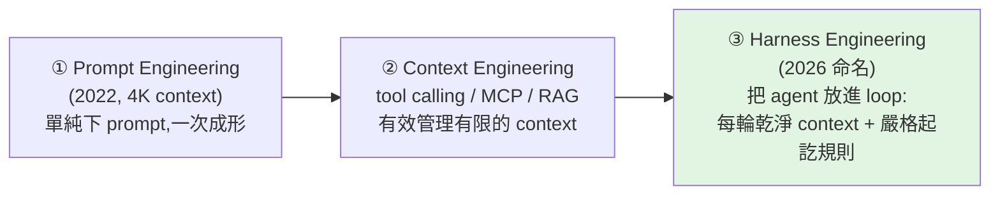

# Harness Engineering 的演進:從 Prompt → Context → Harness(與 loop 架構)

> 「Agent harness」這個詞很難懂,因為它**又廣又具體**。這支影片用一條清楚的**歷史演進線**把它講明白:
> **Prompt Engineering → Context Engineering → Harness Engineering**,並點出 harness 的精髓其實是
> **「把 agent 放進一個每輪都給乾淨 context 的迴圈(loop)」**。
>
> 整理自 Caleb Writes Code 影片(英文,8 分鐘)。本篇是 [[ai-harness-explained]] 的**演進史補充版**——
> 後者講「harness 是什麼(模型權重以外的一切)」,本篇講「**它怎麼一步步演化成今天這樣**」。

---

## 三個階段的演進

### ① Prompt Engineering(起點:4K context 的限制)
2022 ChatGPT 出來時 context 只有約 **4,000 token**,空間極小;單純把 prompt 下給模型「不夠好」。問題變成:**如何用很少的記憶空間做更多事?**

### ② Context Engineering(把有限 context 用好)
用幾種技術更有效率地管理 context window:
- **Tool calling**:探索 repo、只讀**與任務相關**的檔案、在外部產生動作。
- **MCP**:在模型上疊加 vendor 專屬功能。
- **RAG**:接自訂資料庫,隨時取用 on-demand 資料。

→ 催生了第一波 coding agent:**Cursor、Windsurf、Cline、Roo、Aider**。隨著底層模型進步、context 變長,coding agent 開始能做**更長時間、更大 scope** 的任務。

### ③ 為什麼 Context Engineering 撞牆
任務變長後出現症狀:叫 agent「複製整個網站」,結果**半成品**——按鈕沒作用、功能沒測完。根因是:
> **context 快滿時靠「摘要(summarization)」不斷壓縮自己的 context** → agent 被「**它自己摘要的能力**」綁住。
> 12 小時的任務跑到一半,context 一滿就摘要,然後**誤以為任務已完成**、或過度簡化、假設某些功能「已驗證」其實沒有。

所以這種「彈性自我管理 context」看似能做長任務,實際不太有效。於是大家開始實驗 **sub-agents(階層式 context 管理)** 與 **swarms(多個各有 context 的 agent)**——已經在往「harness(駕馭底層 agent)」收斂了。

---

## Harness Engineering = 環境的典範轉移(核心是 loop)

Harness 的三個要素:**更好的 orchestration 層 + 更好的執行環境 + 更好的 context 管理**。而最關鍵的改變是 **loop(迴圈)**:

> 退到 context engineering 的**上一層**,把 agent 放進一個迴圈——**每一輪都給它一份全新乾淨的 context**,
> 但在**嚴格規定「該怎麼開始、怎麼結束」**的規則下運作。

典型架構(也正是爆紅的 **Ralph** 與 Anthropic 簡易 harness demo 的做法,共同點是 **repo 都極小、極輕量**):

1. 先產生一份大的**需求文件(PRD)**,outline 成一個 **JSON** 檔。
2. **進入迴圈**:每一輪只**從文件挑「一個」任務**去完成,並**測試 + 記錄**每一步。
3. 一輪輪迭代,直到整份步驟完成;**每一輪都是全新的 prompt + 全新的 context**。

> 為什麼有效:每輪 context 乾淨,就不會被「越摘要越失真」拖垮;一次只做一件、做完測試記錄,進度才真實。
> 這和 [[task-decomposition-agentic-workflow]] 的「拆成獨立節點、一次一個」是同一精神,只是放進**外層迴圈**自動驅動。

---

## 重要澄清:harness 沒有取代 prompt / context engineering

**Harness 是「疊在上面」、同時善用兩者,不是取代。** 看開源 coding agent(如 Cline)的 system prompt,
**仍由一段精心寫的 prompt 驅動**——prompt engineering 仍在(提醒 agent「你是誰、你的 persona」),
只是**佔整個系統的比重變小**。三層關係:

| 層 | 角色 | 是否還在用 |
|---|---|---|
| Prompt Engineering | 給 agent persona、身分 | ✅ 仍在,但比重小 |
| Context Engineering | tool calling / MCP / RAG 管理 context | ✅ 仍在,被 harness 善用 |
| **Harness Engineering** | **外層環境:loop + 乾淨 context + 嚴格起訖** | ✅ 新增的最上層 |

現在很多 coding agent 已**把 harness 層直接做進產品**(各自實作方式不同),這就是為什麼「harnessing」最近被到處談——因為它真的有效。

---

## 應用案例

- **叫 agent 做超大任務(複製網站、跑數小時的 feature)總是半成品:** 別再靠單一長對話 + 自我摘要;改成 **harness loop**——先寫 PRD/JSON,每輪只挑一個任務、給乾淨 context、做完測試記錄,再進下一輪。
- **想自己搭一個簡單但有效的 coding harness:** 參考 Ralph / Anthropic demo 的極簡架構(PRD → JSON → loop one task → test+doc → repeat),不需要複雜框架。
- **理解市面上各家「harness 層」在賣什麼:** 它們賣的就是 orchestration + 執行環境 + context 管理這三件事的組合,以及把 agent 放進 loop 的方式。
- **別誤會 prompt engineering 過時了:** 它還在(system prompt 的 persona),只是被包進更大的 harness 裡——三層是疊加,不是替代。

---

## 一句話總結

> AI agent 的演進是 **Prompt → Context → Harness**:從「把話講好」到「把 context 管好」,再到「**把 agent 放進一個每輪乾淨 context、規則嚴格的迴圈**」。
> Context engineering 撞牆在「越摘要越失真」,harness 的解法是**用 loop 取代自我摘要**——
> 一次做一件、做完測試記錄、下一輪重新給乾淨 context。它不取代前兩者,而是疊在上面善用它們。
> (概念定義見 [[ai-harness-explained]];context 那層的細節見 [[context-engineering-processing-vs-thinking]]。)

---

## 來源

- YouTube:[Agent Harness explained in 8min..(Caleb Writes Code)](https://youtu.be/1a1VXDdIyrk)
- 影片提到:Ralph(極簡 harness 架構)、Anthropic 的簡易 harness demo;早期 coding agent Cursor / Windsurf / Cline / Roo / Aider。
- 延伸:本庫 [[ai-harness-explained]]、[[context-engineering-processing-vs-thinking]]、[[function-calling-mcp-a2a]]、[[task-decomposition-agentic-workflow]]、[[long-running-agents-goal-evaluation]]。
