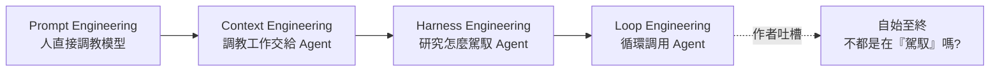

# 「Loop Engineering」是名詞詐騙嗎?一個反方吐槽視角

> 整理自 YouTube「飞天闪客」〈新名词诈骗!你管这破玩意叫 Loop Engineering?〉(2026-06-25,約 8 分鐘)。這是一支**批判/吐槽**影片,主張近期被熱炒的 **Loop Engineering(循環工程)** 是個「名詞詐騙」——由「三個男人 + 一群自媒體」硬造出來、對普通人毫無意義的新概念。
>
> 本篇刻意作為本庫 [[loop-engineering]](正方:介紹這個概念)與 [[harness-engineering-evolution]] 的**反方對照**,幫你在「新範式」的行銷話術前保持清醒。立場偏 skeptical,請與正方並讀。

---

## 一句話總結

作者的核心論點:**從 Prompt → Context → Harness → Loop,這一串「XX Engineering」其實一直在講同一件事——「想辦法讓 AI/Agent 自動把事情做完」。** 當一個詞的涵蓋範圍大到什麼都能塞,它就從「概念」退化成「廢話與干擾」。而 Loop Engineering 說穿了**就只是「循環調用 Agent」**,卻被冠上「下一代程式設計範式」,比 Harness 還空。

---

## 1. 先用大白話還原這串新詞是怎麼來的

作者認為這些詞每一個都是「**發現一個小技巧 → 造一個新名字**」的產物:

| 階段 | 發現了什麼 | 造出的詞 |
|---|---|---|
| 一開始 | 單純問 AI,常得不到想要的答案 | (無) |
| ① | 用某些**話術**能提升回答品質 | **Prompt Engineering(提示詞工程)** |
| ② | 在提示前**補上下文資訊**能進一步提升準確性 | **Context Engineering(上下文工程)** |
| ③ | 問題變複雜、需長時間多輪對話時,要在外圍做**管理與約束**防止 Agent 放飛自我 | **Harness Engineering(駕馭工程)** |
| ④ | 用一個程式**循環調用 Agent**去解更大、更持久的問題 | **Loop Engineering(循環工程)** |

> 作者對 Harness 的舊吐槽:這詞讓人困惑,因為**我們自始至終就是在「駕馭」大模型**——
> - 最初人直接駕馭模型 = Prompt Engineering;
> - 後來駕馭工作交給 Agent = Context Engineering;
> - 再後來研究怎麼駕馭 Agent(自己給自己訂規範、或用 OpenSpec 這類框架管理)= Harness Engineering。
>
> **「自始至終不都是在駕馭嗎?當一個詞的作用範圍過大,就成了廢話和干擾。」** 而 Loop 連概括作用都起不到,卻被冠以紅官(宏觀)概念,更費解。

---

## 2. 為什麼這詞會紅?「三個始作俑者」

作者把這波熱度歸因於三個有影響力的人(各有各的目的):

1. **Boris(Claude Code 創始人)**:訪談裡說自己「把 IDE 刪了、不寫一行程式、減少和 Agent 直接對話、更多用 loop」。但作者拆穿:**這背後就是 Claude Code 的「定時任務」功能**——輸入 `loop` → 給時間間隔(如每分鐘)→ 給指令(如「告訴我現在幾點」),Claude Code 就每分鐘把這個 prompt 發給自己、自動按 enter。**國內各大廠 Agent 工具早就標配定時任務了,只是 Claude Code 掌握了「技術名詞的定義權」。**
2. **Peter(OpenClaw / OpenCode 創始人)**:看 Claude Code 出新東西,發推蹭熱度,講得更激進:「**你不該再命令你的 Agent 了,你應該設計 Loops(循環)來命令你的 Agent。**」作者評:太標題黨——「人人都想當新趨勢的命名人」。
3. **Addy Osmani(Google,知名前端部落客)**:在前兩人把詞炒起來後,**專門寫了一篇 Loop Engineering 文章想拿下定義權**(作者說這是「吃了當年 Harness 沒搶到的虧」)。

---

## 3. 拆解那篇「定義文」:5 個組件站得住腳嗎?

作者讀那篇文章的觀感:開篇先來段「讓你焦慮的趨勢描述」,再提兩位大佬的發言,然後「**熱度你們來造,成果算我的**」——正式定義他倆沒說完的話;接著回顧歷史、順便宣傳自己之前寫的 Harness Engineering,再把 Loop Engineering 擺在它「之上」當下一代趨勢。

最核心是文章給 Loop 定義的 **5 個組件**:

| # | 組件 | 作者吐槽其實是 |
|---|---|---|
| 1 | **Automation(自動化機制)** | 不就是「分配定時任務」或「掛個 hook 自動觸發」 |
| 2 | **Worktree** | 其實就是 **git 分支** |
| 3 | **Skills(技能)** | 已知概念 |
| 4 | **Plugins / MCP** | 已知概念 |
| 5 | **Subagent(子智能體)** | 已知概念 |

> 作者批評:這 5 個詞「**既沒構成完整(窮舉)的要素,彼此又不夠正交(orthogonal),描述的 scope 還不在同一個維度**」;後面只是把這些大家早就熟知的概念像流水帳一樣描述一遍,舉的例子也是 Boris 早講過的老梗,**沒什麼新鮮的**。
>
> 最後文章還自我打圓場:「放手去設置你的循環吧,但也別忘了直接寫 prompt 同樣有效,關鍵在找到正確的平衡。」作者酸:「計算機領域很多事不都是 trade-off 嗎?你一開始那種『prompt 時代已死』的自信哪去了?」

---

## 4. 作者的平衡之見(自我打臉 + 真正有價值的部分)

作者也自我緩頰:這三位都是大佬,小老百姓沒資格評價;但**大佬的發言更容易被放大、被誤讀,進而炒熱某個名詞**——正如當年 Karpathy 隨手一說的「vibe coding」。而人都有自己的目的:Boris 要宣傳 Claude Code 功能、Peter 要在熱度退去後維持存在感(難免標題黨)、Addy 身為部落客要抓技術名詞熱點刷存在感。

> ⚠️ **事實校正**:影片提到「Karpathy 加入 Anthropic 之後發言帶點營銷味」——**這點與事實不符**:Andrej Karpathy 並未加入 Anthropic(他曾任職 OpenAI、Tesla,後創辦 Eureka Labs)。此處應為作者口誤,本筆記不採信該說法,僅保留「大佬發言難免帶行銷味」這個一般性觀察。

**真正值得展開的思考(作者認為這才是重點):**

- **「循環」思想其實 Agent 一出現就有了**:Agent 代替人類、透過多輪對話循環和模型溝通來完成任務;現在只是「再找一個程式去和 Agent 循環溝通」,解更大、更持久的問題。**我們一直在尋找自動化的方式。**
- **這在別的領域早就是常態**:分布式系統的 **Raft** 用循環完成選主(leader election);**Kubernetes** 用循環監控(control loop / reconciliation)確保副本數與各項指標穩定。
- **「循環」這層殼不重要,重要的是這套機制能持續跑起來、遇到問題能自動修復**,只要不出現極端情況就不需人類參與。要做到這點,靠的是**演算法與邊界條件的精巧設計 + 系統本身的各種(harness)配置**,而不是一個新名詞。
- **最後的現實打臉**:大部分人「別說建一個這樣的循環系統了,可能連一個程式碼倉庫都沒有,甚至還沒用簡單的提示詞寫過一個小程式——哪來什麼 Loop Engineering 新時代?」

---

## 應用案例 / 怎麼用這個視角

- **看到「XX Engineering / 下一代範式」先問三件事**:① 它**指涉的範圍是否大到變廢話**(什麼都能塞)?② 它和上一個詞**是否只是換皮**(Prompt→Context→Harness→Loop 都在講「自動化駕馭」)?③ 提出者**有沒有利益動機**(賣產品 / 蹭熱度 / 搶定義權)?
- **判斷一套「組件定義」好不好**:用作者的三把尺——**完整(窮舉)、正交(彼此不重疊)、同維度(scope 一致)**。Addy 的 5 組件正是三條都不太過關的反例。
- **抓本質而非名詞**:不論叫不叫 Loop Engineering,真正要學的是「**能持續自跑 + 自動修復 + 邊界條件設計**」的機制——這和 Raft、K8s control loop 是同一套工程智慧。對照本庫 [[harness-engineering-evolution]](Ralph 的 loop + 每輪乾淨 context)與 [[loop-engineering]](正方完整介紹),一起讀能看到「同一現象、樂觀派 vs 懷疑派」兩種敘事。
- **務實提醒**:在追逐「自治 Agent 循環」之前,先確認自己有沒有可被自動化的真實工作流(repo、可重複任務);否則新名詞對你只是噪音。呼應 [[bitter-lesson-cut-old-patterns]]——別被名詞綁架,模型/工具在進步,該砍的舊包裝就砍。

> ⚖️ **平衡看待**:這支影片是**犀利但偏 skeptical 的吐槽**,它對「行銷話術」的拆解很到位;但「定時任務 = Loop 的全部」可能低估了「循環 + worktree 隔離 + 自動修復 + 多 agent」組合起來在長時自治任務上的實際價值(參見 [[loop-engineering]] 與 [[claude-dynamic-workflows]])。**正反並讀**,別把「吐槽」也當成另一種非黑即白的範式。

---

## 來源

- 飞天闪客,〈新名词诈骗!你管这破玩意叫 Loop Engineering?〉,YouTube:<https://youtu.be/ll-OBB-iswM>(2026-06-25,約 8 分鐘)
- **該片無字幕,逐字稿以 CPU 版 faster-whisper(`vad_filter=True`、`condition_on_previous_text=False`,small 模型,zh)轉錄取得,非官方字幕**;人名(Boris / Peter / Addy Osmani)、產品名(Claude Code、OpenClaw/OpenCode、OpenSpec)、術語(Raft、Kubernetes、worktree、MCP、subagent)依語音+常識還原;影片中「Karpathy 加入 Anthropic」一句經查與事實不符,已於文中標註校正。實際以原片為準。
