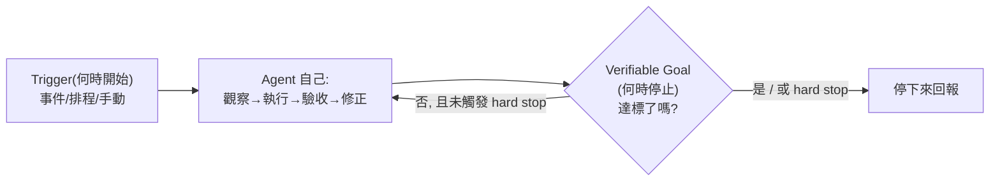
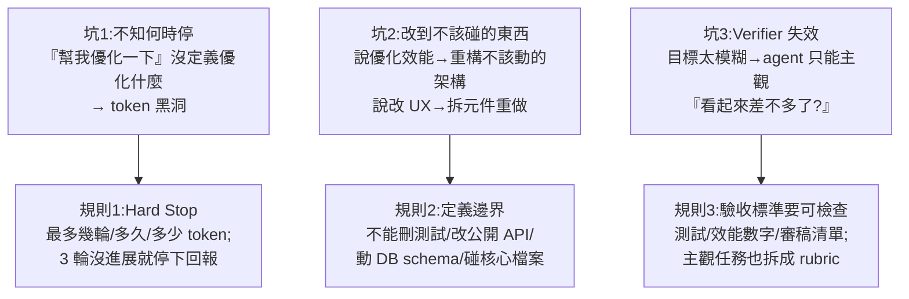

# Loop Engineering 實務:怎麼設計、什麼任務值得、失控的三個坑(Gary Chen)

> 整理自 YouTube「Gary Chen」〈Loop Engineering 解析,大神都不寫 prompt 了?〉(2026-07-01,約 13 分鐘)。這是繼概念介紹([[loop-engineering]])與反方吐槽([[loop-engineering-buzzword-critique]])之後的**第三個視角:一個平衡、實作導向的拆解**——不只講 Loop Engineering 是什麼,更給出**怎麼定義「完成」(Rubric / yes-no 清單)、什麼任務值得做成 loop、以及 loop 失控的三個坑與三條規則**。
>
> Gary 的立場很清楚:**做一個好 loop 的能力是 AI 工作者的必備條件,但多數人現在其實還不需要真的去跑 agentic loop——他自己更偏好 human-in-the-loop。**

---

## 一句話總結

**Loop Engineering 的核心不是「讓 AI 自己跑」,而是「你能不能把一個模糊意圖,翻譯成 AI 可以執行、可以驗收、可以停止、而且不會鑽漏洞的條件」。**

- **過去(human-in-the-loop)**:AI 修一版 → **你**審核給意見 → 它再修 → 你再看……品質靠人一輪輪從 60 分推到 100 分。
- **Loop Engineering(agent-in-the-loop)**:你**一開始就把目標、可用工具、驗證方式、完成/停止條件講清楚**,讓 agent 自己改、自己跑測試、自己讀錯誤、自己再改,直到達標或連續幾輪沒進展才停下回報。**審核的邏輯被你標準化、交給 AI 執行**,讓它第一次交到你手上的版本是**從 85 分開始**,而不是 60 分。
- **工作重心的位移**:你從「Loop 裡一輪輪打字的操作者」變成「**Loop 的系統設計者**」——定義目標、設計驗證、設定邊界、控制成本。**你用力的地方不一樣了。**

> 名詞演進定位:**Prompt**(把話說清楚)→ **Context**(在對的時機給不多不少的資訊)→ **Harness**(給 agent 辦公室/工具/流程/權限的規矩與邊界)→ **Loop**(把 human-in-the-loop 變成 agent-in-the-loop,**把「你提供 feedback 的邏輯」標準化**讓 agent 自行 review 並迭代)。同一批推手:Peter Steinberger(OpenClaw)、Boris Cherny(Claude Code)、Addy Osmani(Google,寫成框架)。

---

## 1. 一個 Loop 由兩個問題決定:Trigger 與 Verifiable Goal

| | 對應問題 | 內容 |
|---|---|---|
| **Trigger(觸發機制)** | 什麼時候**開始** | **事件**(GitHub 有人開 PR → agent 自動檢查)、**排程**(每天早上跑一次資料整理、每 30 分檢查任務狀態)、或**手動**啟動 |
| **Verifiable Goal(可驗證目標)** | 什麼時候**停止** | AI 做到什麼程度時,**系統能判斷它完成了**就把 loop 停掉 |

**Verifiable Goal 又拆成兩問**:① 什麼叫「完成」?② AI 要怎麼**檢查自己**完成了?
- **Coding 任務好辦**:所有測試通過、TypeScript 沒報錯、lint 沒違規、build 成功——機器能乾脆判斷。
- **多數任務不乾淨**:「寫一篇文章」怎樣叫寫好了?「改一個產品頁」怎樣叫改好了?**把抽象概念變成清楚標準,是實作時最常見的卡點。**

---

## 2. 怎麼定義「完成」?兩種方法(本片最實用的部分)

以「把文章改得更順」為例:

### 方法 A:Rubric 評分
先選幾個面向(如**風格人設 / 語法用詞 / 內容主題**),再為每個面向**寫出分級定義**。以「風格人設」為例:
- **5 分**=完全符合你設定的人設,用詞語氣一致;
- **3 分**=有點像但偶爾出戲;
- **1 分**=根本沒有你的風格。

> 關鍵:**每個分數都要定義清楚**,AI 才有依據可循、不是隨意給分。

### 方法 B:二元檢查清單(yes/no checklist)
把品質拆成一串 yes/no 問題:開頭三句有沒有抓住重點?有沒有冗詞贅字?專有名詞有沒有用錯?**比打分數更穩定、更容易判斷有沒有過關。**

> 不論哪種,最後都要**收斂成一個明確的完成條件**:例如「三個面向的 rubric 都 ≥4 分」或「檢查清單全部通過」才算真正完成。

---

## 3. 什麼任務值得做成 Loop?(三個檢查 + 一個例外)

> **別盲目跟風**:這些功能的設計者與需求來源,多半是 OpenAI/Anthropic 的頂尖工程師——**他們用得到的,你不一定用得到**。一半以上的新功能對一般人沒有用武之地。先懂底層邏輯,再想自己的工作流有沒有能套用的地方。

1. **它會不會重複發生?** 一次性任務(臨時查個錯誤訊息、改一段小文案)→ 直接寫普通 prompt 就好。Loop 對「**會反覆發生、每次流程差不多但細節又不完全一樣**」的任務才有價值。
2. **完成標準清不清楚?(最關鍵)** 你要能講出「什麼叫這件事做完了」——如「部署到指定網域且載入 <2 秒」「修復所有 CI 錯誤直到狀態變綠」;抽象/主觀的就用上面的 rubric 或 yes/no。
3. **Token 花費你扛不扛得住?** Loop 不是免費的:每輪要讀東西、想下一步、呼叫工具、可能還請 reviewer 檢查。「原本手動 prompt 三次能解決的事,做成 loop 跑二十輪還不停」——**這個帳單會非常有教育意義**。

**例外**:想快速做 **demo**、核心 feature 驗收標準很清楚(如「網站能搜到最新新聞」,其他細節先不追求完美)→ 用 loop 先把主功能跑出來,細節再由人接手。

---

## 4. Loop 失控的三個坑 + 三條規則

1. **不知道什麼時候該停** → 沒定義「優化」是前端視覺還是後端速度,它就不知道終點在哪,變成 **token 黑洞**。**規則一:一定要有 hard stop**(硬性停止條件:最多幾輪、多久、多少 token;三輪沒進展就停)。聽起來保守,但正是 loop 不失控的關鍵。
2. **把不該碰的東西也改掉** → 說優化效能它去重構架構、說修 bug 它為了讓測試過改掉旁邊一堆。**規則二:定義邊界**——不能只說「測試要過」,還要說不能刪測試、不能改公開 API、不能動資料庫 schema、不能碰某些核心檔案。
3. **Verifier 失效** → 目標模糊到不能用 Verifier,agent 只能主觀判斷「看起來差不多了嗎」,非常不可控。**規則三:驗收標準盡量變成可檢查的東西**(測試、效能數字、審稿清單);真的主觀就拆成 rubric。

> ⚠️ **但有分數 ≠ 客觀**:如果 AI 自己做任務又自己評分,就是**球員兼裁判**。較好的做法是**把產出跟檢查分開**——一個 agent 負責產出、另一個負責檢查;或在關鍵節點**保留 human-in-the-loop**。否則指標上「測試過了」,實際上產品沒變好、反而更糟。

---

## 5. 成本與 Gary 的務實建議

- **成本會不斷疊加**:Loop 很迷人(按一下按鈕事情就自己往前走),但每次往前都要讀 context、呼叫工具、跑測試、解讀錯誤、重試;再加 reviewer agent、subagent、多輪驗證,成本一路往上。**連 Addy Osmani 都說 Loop Engineering 還在早期、要非常注意 token 成本。**
- **多數人現在還不需要**:不是每個任務都值得用 loop 燒。Gary 坦言**自己更偏好 human-in-the-loop**——大多數人不需要 AI 不眠不休跑 27 小時,而且 human-in-the-loop 往往**更準、更有效率、也更便宜**(除非你像大廠工程師有接近無上限的 token 預算)。
- **要玩就從小任務開始**:範圍小、目標清楚、工具有限、停止條件明確——如「每天整理一次固定資料夾」「針對某個測試項目修復」「對一篇文章跑固定的品質檢查 checklist」。不會讓成本失控,又能體驗 loop 的精髓(怎麼定義目標、設計驗收、控制權限、讓 AI 在對的地方停)。
- **往更高階推 → Software Factory(軟體工廠)**:工程師不再只寫一段程式,而是設計一套能生產/測試/修正/部署軟體的系統。但對一般人「確實太遙遠」。

---

## 應用案例 / 怎麼用這套思路

- **把你「來回改 N 次」的重複任務,升級成 loop**:先問三件事(會重複?完成標準清楚?token 扛得住?)。適合的例子:每天固定資料整理、對文章跑固定品質 checklist、修某類 CI 錯誤到綠燈。一次性的事就別做 loop。
- **先解決「怎麼定義完成」再談自動化**:這是多數人的卡點。主觀任務用 **rubric(每個分數寫清定義)** 或 **yes/no 清單(更穩定)**,最後收斂成明確完成條件(如三面向皆 ≥4 分 / 清單全過)。
- **設計 loop 一定先寫死三件事**:① **hard stop**(最多幾輪/多少 token/幾輪無進展就停)、② **邊界**(哪些檔案/API/schema 不准動)、③ **可檢查的驗收**(測試/數字/清單,別讓它自評「看起來不錯」)。
- **避免球員兼裁判**:產出與檢查分開(產出 agent + 檢查 agent),或關鍵節點留 human-in-the-loop——呼應本庫 [[compilot-llm-guided-loop-optimization]](把驗證交給可信 oracle、別信 LLM 自我宣稱)與 [[mixture-of-agents-moa]](獨立的 aggregator/verifier)。
- **心態校準**:別因為大家在討論就逼自己用。**最新的方法不一定是最好的方法,能解決你問題的才是。** 但「做一個好 loop 的能力」(讓 AI 知道何時開始、什麼叫完成、什麼不能做、失敗時停下)確實是現在 AI 工作者的必備條件,值得練——即使你暫時只用在 human-in-the-loop。

> 延伸對照(同主題三視角):[[loop-engineering]](01Coder:概念、Boris 三階段、5 塊組件、`/goal` vs `/loop`)、[[loop-engineering-buzzword-critique]](飞天闪客:懷疑派,質疑是名詞詐騙)、本篇(Gary Chen:實務怎麼做 + 該不該用)。三者並讀,能同時拿到「概念 / 反方 / 落地」。以及 [[claude-dynamic-workflows]]、[[harness-engineering-evolution]]、[[five-agent-patterns]]。

---

## 來源

- Gary Chen(@garytalksstuff),〈Loop Engineering 解析,大神都不寫 prompt 了?〉,YouTube:<https://youtu.be/kGYFSDd-ZVY>(2026-07-01,約 13 分鐘)
- 本文依該片**官方 zh-TW 字幕**整理。影片提及來源:Peter Steinberger(OpenClaw)X 貼文、Boris Cherny(Claude Code)、Addy Osmani(Google Engineering Lead)的〈Loop Engineering〉長文;作者另有 Patreon 完整文章與提示詞模板(含 Trigger、Verifiable Goal 之外的「Loop 六大骨架」)。
