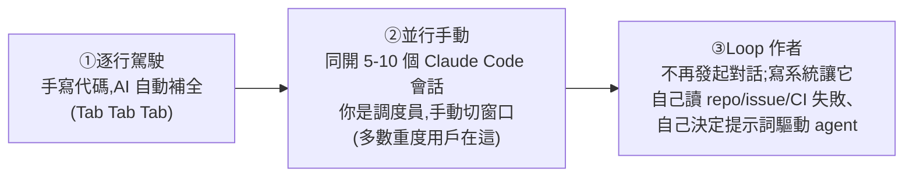

# Loop Engineering(循環工程):從「寫提示詞驅動 agent」到「設計驅動 agent 的循環」

> 來源:01Coder(小木頭)〈Loop Engineering 循環工程:從理論到實踐,它真的適合每個人嗎?〉,整理自 Addy Osmani〈loop-engineering〉一文與 Peter Steinberger、Boris Cherny(Anthropic 管 Claude Code)的說法。本筆記拆解:Loop Engineering 是什麼、Boris 的「三階段」、一個 loop 由哪 5 塊 + 1 根記憶脊柱搭成、`/goal` 與 `/loop` 的差別,以及最重要的——**多數人其實還不需要 loop**(附四條件測試)。

---

## 一句話總結

**Loop Engineering 不是又一個要追的新工具,是一個視角切換**:從「**我親手寫提示詞驅動 agent**」變成「**我設計那個用提示詞驅動 agent 的系統(循環)**」。Peter Steinberger:「你不該再用提示詞驅動 agent 為你編程,應該去設計那些循環來驅動 agent。」Boris Cherny 更直白:「我已不用提示詞驅動 Claude Code,有一堆 Loop 在跑、它們驅動 Claude Code 自己決定該幹什麼——**而我的工作只是寫 Loop**。」但**多數人現在還不該上 loop**——先挑一件每週重複、且結果能自動驗證的小事做起。

---

## Boris 的三階段(對號入座你在哪)

> **Loop Engineering 就是第三階段**:你不再親手寫每一條提示詞,而是去**設計那個替你寫提示詞的系統**——你從「Loop 裡打字的那個人」變成「**Loop 的作者**」。

---

## 一個 Loop 由什麼搭起來:5 塊 + 1 根脊柱(Addy Osmani)

| 組件 | 作用 |
|---|---|
| **① 心跳(heartbeat)** | 定時觸發:到點自己跑、自己發現有什麼活要幹,不需你手動驅動 |
| **② 工作樹(git work tree)** | 多個 agent 各待在隔離的分支目錄,互不踩踏對方檔案(像兩個工程師各開各的分支) |
| **③ Skill(`SKILL.md`)** | 把項目規則/規矩寫一次,每個 agent 每次都讀 |
| **④ 連接器(MCP)** | 接到真實工具(issue 系統/DB/Slack);有了它 agent 不只「吐建議」,能**自己去開 PR、更新 ticket、發通知** |
| **⑤ 子智能體(subagent)** | 把「寫代碼」和「審代碼」拆開——**寫代碼的模型給自己打分太寬容,需要另一個 agent 來挑刺** |
| **🦴 脊柱:記憶** | 一個 Markdown / Linear 看板,把「做過什麼、試過什麼、還差什麼」記在**對話之外**——agent 會忘,持久化系統幫它記住一切 |

**典型一圈循環**:早上定時觸發 → 分診 skill 讀昨晚 CI 失敗 + 最近提交 → 每個能處理的問題開獨立 work tree → 一個子 agent 修復、另一個子 agent 對照 skill/測試審查 → 連接器開 PR、更新 ticket → 搞不定的丟收件箱等你看 → 狀態文件實時記錄,**明天接著跑**。
> **「你只設計了一次,中間的每一步,一條提示詞都沒打。」**

---

## 實作:`/goal`(現在跑到達標) vs `/loop`(按時間表盲跑)

兩個 Claude Code 命令,**精神相反**:

| | **`/goal`** | **`/loop`** |
|---|---|---|
| 行為 | 給一個**可判定真假**的目標,自己一輪輪執行,每輪判斷「達標沒」,沒達標再來,**達標自動收工** | 按**時間表盲跑**:到點把你給的那段提示詞**再跑一遍**,**不判斷完成沒**,只負責準時執行 |
| 對應 | 「目標」(深度,跑到條件為真) | 「心跳 heartbeat」(廣度,定時重複) |
| 範例 | 「用 research 工具抓 Google/OpenAI/Anthropic 數據,**直到湊夠 5 條**」→ 不必每條都催它 | 「拉過去 24h 研究源+新聞 → 挑能寫深度文的 → 追加進 `inbox.md` → 用 `topic-scorer` 子 agent 評級寫回」,`--schedule` 設週一到五早 8 點 |

> 補充:`/loop` 在會話中註冊的定時任務 **7 天後自動過期**,要提前停用用 `CronDelete`;`--schedule` 可用自然語言描述(如「每分鐘執行一次」)。
> **這正好示範了「Loop 不只是程序員的事」**——作者的範例是「每天替我攢選題、用子 agent 打分」這種**非寫代碼的重複腦力活**。Loop 的本質是「**讓一個長期進程替你做重複的腦力活**」,寫代碼只是其中一部分。

---

## 潑冷水:多數人還不需要 Loop —— 四條件測試

**四條全中,做 Loop 才划算:**
1. **這活每週以上會重複**(一次性的活不值得搭這套)。
2. **驗證能自動化**(測試、類型檢查、Linter 能自己擋掉壞結果,不用你肉眼審)——**最重要**。
3. **token 預算扛得住、甚至扛得住浪費**(Loop 會反覆讀上下文、重試、來回試探,不管代碼最後用沒用上都花錢)。
4. **agent 手裡有「資深工程師那套工具」**(日誌、能浮現問題的環境、能把自己寫的代碼跑起來看哪裡崩)。

**重要警示:**
- **Loop 越快交付,你沒親手寫/看的代碼越多**——「repo 裡有的東西」和「你腦子真正搞懂的東西」差距就越大。
- **最危險的姿態:舒舒服服地接受 Loop 吐出來的一切。** AI 生成內容中,越多你不了解的,風險就越大。
- **失敗樣本:Ralph 循環的 over-baking(發酵過頭)**——Geoff 那個「鍥而不捨、永不放棄」的循環,著名失敗模式是:你讓它修個小 bug,它跑很久、**自作主張加一堆沒人要的功能、甚至把本來能編譯的代碼改壞**。「**無人盯著的 Loop,也是無人盯著地在犯錯**」。→ **驗證永遠在你手上**,即使任務定義成循環,你也要在適合的時間點具備自我驗證能力。(Ralph 背景見 [[harness-engineering-evolution]]。)

---

## 應用案例 / 怎麼開始

- **先挑一件「每週重複 + 結果能自動驗證」的小事**寫成 Loop(風險小),例如作者的「選題篩選」:每天自動翻 AI 圈新聞、挑能寫深度文的、用子 agent 評級進收件箱——你早上打開看到的不是一堆原始連結,而是**已分級、帶理由的候選**。
- **非工程師也適用**:任何「長期進程替你做重複腦力活」都行——情報彙整、週報、監控、內容流水線。
- **工具你其實都有了**:Claude Code 的 `/loop` `/goal`、git work tree、`SKILL.md`、子 agent、MCP 連接器——**別一上來就給所有事都套 Loop**。
- **核心心法**:「**當那個寫 Loop 的人,別當那個只會按啟動鍵的人**」;寫完 Loop 還要有能力**定期在必要環節驗證**。

> 這篇是近期一串筆記的「總綱」,把它們串起來:[[claude-dynamic-workflows]](Claude 寫腳本指揮上百 agent、`/goal`)、[[long-running-agents-goal-evaluation]](`/goal` 深度迭代與 Ralph)、[[agent-native-tooling-steinberger]](Peter Steinberger:為 AI 造工具、Vision.md 憲法)、[[task-decomposition-agentic-workflow]](把 SOP 拆成 workflow)、[[self-harness]](外部驗證守品質)、[[markdown-agent-memory]](對話外的記憶脊柱)、[[defining-tasks-not-prompts]](定義任務=管理)。Loop Engineering = 把這些組件(心跳/work tree/skill/MCP/子 agent/記憶)組裝成一個自走系統。

---

## 來源

- 01Coder(小木頭),〈Loop Engineering 循環工程:從理論到實踐,它真的適合每個人嗎?〉,YouTube:<https://www.youtube.com/watch?v=WuMlsfKeWHc>(2026-06-13)
- 參考:Addy Osmani〈loop-engineering〉(<https://addyosmani.com/blog/loop-engineering/>)、Peter Steinberger 推文、Boris Cherny(Anthropic, Claude Code)說法。
