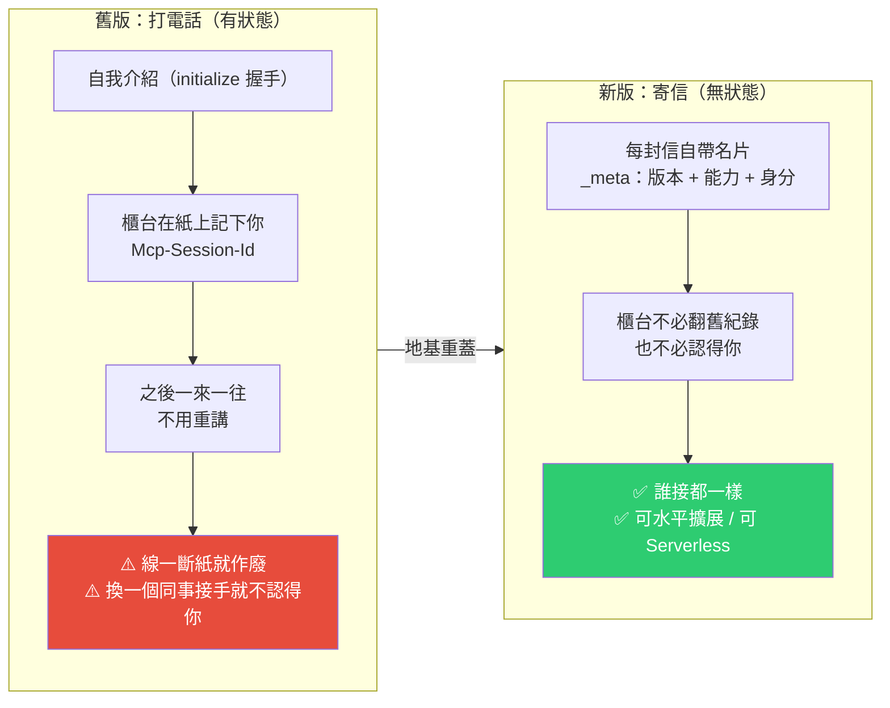
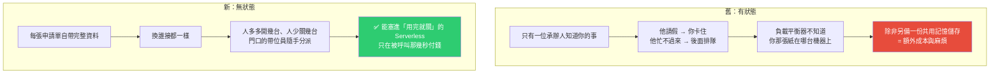
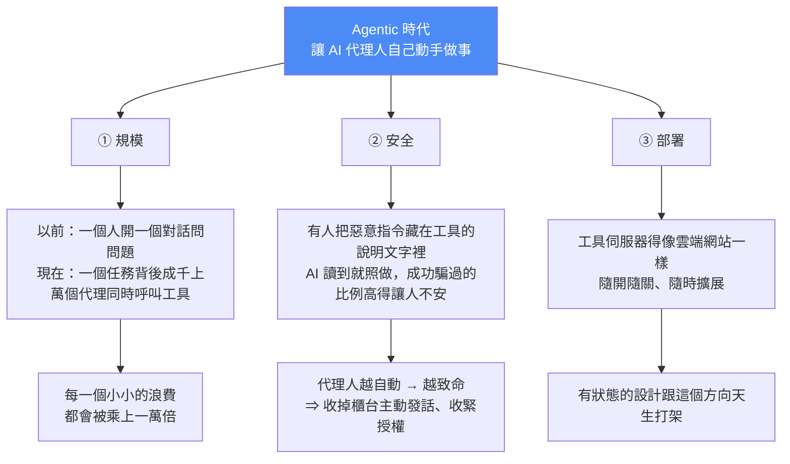

# MCP 史上最大改版(2026-07-28):從「打電話」變成「寄信」,以及三個功能的退場公告

> 整理自 YouTube 頻道 **Jim AI Notebook**〈MCP 史上最大改版:Agentic 世代的到來〉(2026-07-31,15:53)。本文的技術細節另**直接比對官方 changelog** 逐條核實(`modelcontextprotocol.io/specification/2026-07-28/changelog`)。
>
> 一句話:**這次改版沒有讓 MCP 變得更聰明,而是讓它變得「更無聊」——而無聊在這裡是好話。** 官方沒有加新功能,而是把最底層的運作方式整個重蓋(移除協定層 session、拿掉握手、改成無狀態),同時替 **Roots、Sampling、Logging** 三個核心功能貼上退場公告,並第一次給出**為期 12 個月的正式搬遷期**。

---

## 一句話總結



---

## 一、先弄清楚 MCP 是什麼:AI 世界的萬用轉接頭

MCP = **Model Context Protocol**(模型上下文協議),2024 年 11 月由 Anthropic 提出,解決的是一個很「土」的問題:

以前想讓某個模型讀你的行事曆,工程師就得為「這個模型 × 這個工具」寫一次接法;想讓它讀資料庫,再寫一遍;換一個模型,全部重來。**前面有幾百種工具,中間就要牽出幾百條各自不同的線。**

MCP 做的事是**把接頭統一**:工具那一端照著規格做一個接口,模型那一端只要會用這個規格,插上就能通。這就是「萬用轉接頭」比喻的由來——**你不需要為每一台電器準備一條專屬的線,只需要做好那個孔。**

> ⚠️ 這個比喻等一下會一直回來,因為這次改版動到的**不是接頭的形狀,而是插下去之後兩邊怎麼記住彼此**。

### 它到底多普及?

| 指標 | 數字 / 事實 |
|---|---|
| 官方 SDK 月下載量 | 將近 **5 億次**(每一次下載代表某個人或某台機器把它裝進自己的專案) |
| 支援的平台 | ChatGPT、Claude、Gemini、微軟 Copilot 與 VS Code、Cursor… |
| 活躍 server | 市面上已超過 **一萬個** |

這裡的 server **不是一台實體主機**,比較像**一個櫃台**——專門負責把某一個工具或某一份資料,用規格規定的方式端出來給 AI 用。

> 所以當這個櫃台的規矩改了,改的不是一家公司的產品,**是整個生態的共同語言。**

### 治理:2025-12-09 捐給 Linux 基金會

Anthropic 把 MCP 捐給 Linux 基金會底下新成立的 **Agentic AI Foundation**,共同發起者除 Anthropic 外還有 **OpenAI 與 Block**,Google、微軟、亞馬遜雲端也表態支持。

Jim 的類比很精準:**這跟插座規格很像**——如果插座形狀由某一家電器公司決定,其他人心裡總會有疙瘩;交給中立組織,大家才敢照著蓋。

> 但要講清楚:**捐出去的是治理,不是技術方向。** 規則怎麼改,還是由原本那批維護者加上一套公開的提案流程(SEP)決定。**這次大改版是社群自己走完流程通過的結果,不是誰空降的命令。**

---

## 二、為什麼非改不可?問題出在「舊規格記住你的方式」

### 舊版 = 打電話

你打去櫃台,接起來後先自我介紹、說明要辦什麼,對方**在紙上記下來**;接下來一來一往,你不用每次重講。方便,但有兩個前提:

1. **這條線不能斷** —— 一斷紙就作廢,你得從頭再來一次。
2. **只有接起這通電話的那一位記得你** —— 換一個同事接手,他完全不知道你是誰。

舊規格用一個叫 **`Mcp-Session-Id`** 的標籤代表那張紙,這一整段有記憶的通話期間就叫 **session**。標籤放在網路請求的 **header**(想成貼在信封外面的一小行註記)。

**這個設計在你自己電腦上跑完全沒問題,一旦搬到雲端,麻煩就開始了。**

### 新版 = 寄信

新規格**不再有那張紙,也不再用 `Mcp-Session-Id`**。取而代之的是:**每一個請求自己帶上身分**,放在請求裡一個叫 `_meta` 的欄位,固定帶三樣東西:

| # | 內容 | 官方欄位 |
|---|---|---|
| 1 | 我用的是哪一版規則 | `io.modelcontextprotocol/protocolVersion` |
| 2 | 我這一端會做什麼(能力清單) | `io.modelcontextprotocol/clientCapabilities` |
| 3 | 我是誰(客戶端身分) | `io.modelcontextprotocol/clientInfo` |

> **每次寄出去的申請單,都自己附上一張印好的名片跟一份說明。櫃台不需要翻舊紀錄,也不需要認得你,看完這封信就能辦事。**

這種設計在工程上叫**無狀態(stateless)**。聽起來只是換個寫法,實際上是**把「記憶」的責任從櫃台那邊搬回申請人身上**——而後面所有好處都是從這一般長出來的。

### 好處:水平擴展與 Serverless



**以前有狀態的設計跟 Serverless 環境天生不合,現在合了。**

---

## 三、官方 changelog 逐條核實:9 項 Major 改動

以下對照官方文件,並標出 Jim 在影片中解釋到的部分:

| # | 改動 | 白話 |
|---|---|---|
| 1 | 移除協定層 sessions 與 `Mcp-Session-Id`;`tools/list` 等清單端點不再隨連線而異。需要跨呼叫狀態的 server,改由**自己發放 handle、當成一般 tool 參數傳** | 那張紙沒了 |
| 2 | **移除 `initialize` / `notifications/initialized` 握手**,每個請求自帶版本與能力;版本不合回 `UnsupportedProtocolVersionError` | 見面寒暄取消,第一句話就能辦正事 |
| 3 | 新增 **`server/discover`**(server **必須**實作),用來宣告支援的協定版本、能力與身分 | 想知道業務範圍?直接問一句話 |
| 4 | HTTP GET endpoint 與 `resources/subscribe`/`unsubscribe` → 統一成 **`subscriptions/listen`** 單一長連線,client 自行選擇要訂閱哪幾類變更 | 從很多條各自的專線,變成一台一直開著的收音機 |
| 5 | **移除 `ping`、`logging/setLevel`、`notifications/roots/list_changed`**;log level 改成每請求用 `_meta` 指定 | — |
| 6 | 實驗性 **tasks 移出核心**,成為官方擴充 `io.modelcontextprotocol/tasks`;阻塞式 `tasks/result` 改為輪詢 `tasks/get`,新增 `tasks/update` | 跑很久的工作改成排隊等 |
| 7 | **MRTR(Multi Round-Trip Requests)** 取代 server 主動發起請求(`roots/list`、`sampling/createMessage`、`elicitation/create`);server 改回傳 `InputRequiredResult`,client 補齊後重試 | 見下節「最有意思的反轉」 |
| 8 | 所有結果都**必帶 `resultType`**(`"complete"` 或 `"input_required"`) | 程式一看就知道下一步該做什麼 |
| 9 | **移除 SSE 續傳與訊息重送**(`Last-Event-ID`、SSE event ID);連線斷了就是掉了,client 必須用新的 request ID 重發 | 因為「能續傳」就代表機器得記得你聽到哪 → 又回到有狀態 |

> 貫穿全部的取捨是同一句話:**用一點便利,換整個系統可以隨便長大。**

### 最有意思的反轉:誰主動?

舊規格裡,**櫃台是可以主動打電話回來的**——它可以要求你的 AI 幫它想一段內容(Sampling)、問你允許它看哪些資料夾(Roots)、中途跳出來問你要補什麼資料(Elicitation)。方便,但代價是:

- **兩邊都要能主動發話 → 連線複雜度直接翻倍。**
- **對方能主動打進來,這件事本身就是安全上要很小心的入口。**

新版把它整個倒過來:**櫃台不再主動聯絡你,而是把申請單退回來,上面註明「缺這一欄」(`input_required`)。你看到退件、補齊資料、再送一次。** 整個過程永遠是同一個方向:你送出去、它回給你。

> Jim 的比喻很到位:這很像這幾年政府櫃台的改變——**從打電話追著你問,變成在退件單上寫清楚,你補齊再來。**

### 一個很實際的小改動

清單類的回覆現在會附上 **`ttlMs`(這份清單多久之內不必重問)與 `cacheScope`**(公開 / 私有,決定中介是否可快取)。官方同時建議 `tools/list` **回傳順序要固定**,以提高 client 端與 LLM prompt 的快取命中率。

> 聽起來不起眼,但它省下的是**每一天、每一次呼叫**的成本。

---

## 四、三個功能的退場公告(爭議最大的部分)

| 功能 | 原本作用 | 官方建議的替代路徑 |
|---|---|---|
| **Roots** | 告訴櫃台你允許它看哪幾個資料夾 | 改用 **tool 參數、resource URI 或 server 設定**傳目錄 |
| **Sampling** | 讓櫃台反過來借用你的模型幫它想事情 | **請它自己去呼叫 LLM provider 的 API** |
| **Logging** | 把執行紀錄透過協議傳回來 | 改寫 **stderr**(stdio)或用 **OpenTelemetry** |

另外一併列入退場的還有:**HTTP+SSE 舊傳輸方式**、以及 **OAuth 2.0 動態註冊(DCR)** 這種授權作法(就是你按下「用 Google 帳號登入」時背後在跑的那一套),改推 Client ID Metadata Documents。

**重點在後面:這不是明天就斷你。** 官方同時立了 **feature lifecycle 與棄用政策**,給出**最短 12 個月的搬遷窗口**,並建立一份「已棄用功能登記表」。

> **這是 MCP 第一次有正式的棄用政策——以前的改動沒有這種明文緩衝期。** 一個東西開始講搬遷期程,通常代表它知道自己已經被很多人依賴了。

### 被移出核心的東西去哪了?變成「官方擴充」

核心變輕之後,原本在裡面的東西改成**官方維護的擴充模組**,而「擴充」這件事本身也被正式制度化(`ClientCapabilities`/`ServerCapabilities` 新增 `extensions` 欄位)。例子:

- **Tasks**(長時間工作排隊)——從核心移出成官方擴充。
- **MCP Apps**(讓工具帶自己的介面)。
- **管理式授權**(給企業統一管理員工存取權限)。

> 想成**主機板插槽**:核心只留下每一台機器都一定要有的東西,其他做成官方認證的外接卡,需要的人自己插上去。

---

## 五、代價:發明人自己出來提醒

MCP 共同發明人 **David Soria Parra**(2024 年做出第一版的人之一)對這次改版說了一句很實在的話:**那些沒有用現成 SDK、自己一行一行刻出實作的人,要把這次的改動改對,會是很大的工程。**

這句話點中核心:**前面說的每一個好處,都建立在「你手上的東西要跟著改」這個前提上。**

- 用官方 SDK 的人 → 升級一下版本就過去了。
- **自己刻的人 → 等於照著舊圖紙蓋好的房子,現在圖紙換了。**

> 發明人自己出來講這句話不是唱衰,是在提醒:**任何一次地基工程,好處都是未來的,成本都是現在的。**

### 成本具體長什麼樣?

| 事實 | 說明 |
|---|---|
| **新舊兩版互不相容** | 安全公司 Stacklok 特別提醒:**中間沒有自動轉換**。舊版 client 連不上新版 server,反過來也一樣 |
| 生態會有過渡期 | The New Stack 的形容更直白:這次改版**移除了許多 server 賴以建構的機制**。有些工具已經過橋,有些還在原地 |
| 好消息 | 官方 **TypeScript / Python / Go / C# 四套 SDK 都已更新**,GitHub 自己的 MCP server 也已支援新規格——**主幹道是通的** |
| 真正要花力氣的 | 那些**自己寫、自己維護**的那一批。如果公司內部有人接過 MCP,接下來這一年這會是他工作清單上很具體的一項 |

---

## 六、為什麼是現在?三股力量,同一件事:Agentic



三股力量指向同一個結論:**MCP 不是為了好看而改,是在為代理的時代改地基——它撐的重量已經超過當初設計時想像的樣子。**

### 節奏本身也是訊號

| 時間 | 事件 |
|---|---|
| 2024-11 | MCP 誕生 |
| 2025-11-25 | 上一個正式版本 |
| **2026-07-28** | 這一版 |

**中間只隔八個月,而這八個月做的不是加功能,是回頭改地基。**

這很像所有基礎設施的成長曲線:**早期大家搶著往上加東西,因為要先證明這件事有人要;等到真的有一大群人靠它吃飯了,重心就會從「加功能」轉向「穩定、可擴展、與明確的搬遷承諾」。** 網際網路早年的協議是這樣走過來的,資料庫是,容器也是。

> **MCP 開始講棄用政策、講水平擴展、講版本相容的那一刻,它其實是在宣布:它不再是一個實驗。**

### 結論:它變得「更無聊」,而無聊是好話

> 無聊代表**可預測**,代表你不用擔心它下個月又冒出什麼新花樣,代表**你可以把公司的流程掛在上面然後睡好覺**。
>
> 回頭想那個「萬用轉接頭」——真正好用的轉接頭,你買回家插上去之後,這輩子就不會再想起它。你不會研究它的規格,不會關心它換了幾版,它只是安靜地在那裡讓電流通過。
>
> **電力規則很無聊、網路協議很無聊、你家牆上的插座更無聊,可是整個現代生活就是蓋在這些無聊上面。**

---

## 應用案例:你現在到底該做什麼?(分三種人)

### 第一種|你只是平常在用 ChatGPT / Claude 這類工具

**什麼都不用做。** 這一層的改動離你很遠,你會在某一次更新之後自然拿到,頂多感覺到反應快了一點。

### 第二種|你會用這些工具串一些自動化(接筆記軟體、行事曆…)

**你只要看一件事:你接的那個 server 是誰在維護。**

- **官方或大公司維護的** → 會自動跟上,你不用管。
- **某個人假日寫的小專案** → 留意它後續有沒有人接手更新。**這是這次改版對一般使用者唯一的實質風險點。**

具體檢查法:去它的 repo 看最近一次 commit 日期、以及有沒有針對 `2026-07-28` 版本開 issue 或 PR。沒有動靜的,先想好替代方案。

### 第三種|你自己寫過或維護過 MCP server

**今天就可以做一件很具體的事:打開官方改動清單,確認你有沒有用到那三個要退場的功能。**

```
① 有用到 Roots / Sampling / Logging
   → 你有 12 個月可以搬,照官方建議的替代路徑改：
     Roots    → 改用 tool 參數 / resource URI / server 設定
     Sampling → 自己去接 LLM provider API
     Logging  → 改寫 stderr 或接 OpenTelemetry

② 沒用到
   → 你要處理的主要是「握手與連線」那一段：
     - 拿掉 initialize/initialized，改讓每個請求自帶 _meta
     - 實作 server/discover（必須）
     - subscribe/unsubscribe → subscriptions/listen
     - 別再依賴 SSE 續傳（Last-Event-ID）
     - 所有 result 補上 resultType
     - 清單類回覆補上 ttlMs / cacheScope

③ 用官方 SDK 的
   → TypeScript / Python / Go / C# 四套都已更新，升級版本即可
```

**早一點看,總比公告到期前才看好。**

### 第四種情境|你正在「評估要不要導入 MCP」

這次改版其實是**利多**:它證明維護者願意為了長期可擴展性承擔破壞性變更的代價,並且第一次給出明文的 12 個月棄用窗口。**對企業採購或架構決策來說,「有沒有正式棄用政策」比「功能有多豐富」更重要**——後者代表它還在實驗,前者代表它準備好被依賴。

導入時的具體建議:**一律用官方 SDK,不要自己刻協議層。** 這次的教訓已經很清楚了——刻的人現在要重蓋房子,用 SDK 的人升個版本就過去了。

### 第五種情境|安全審查角度

這次改版有兩個直接的安全收益,值得寫進你的威脅模型:

1. **收掉了「server 主動打進來」這個入口**(Sampling / Roots / Elicitation 都改成 MRTR 退件模式)。原本 server 能反過來要求你的模型做事,這是個很大的攻擊面。
2. **授權面收緊**:DCR 被棄用改推 Client ID Metadata Documents;授權回應要帶 `iss` 並由 client 驗證;client 憑證必須以 issuer 為 key 保存、不得跨授權伺服器重用。

但**工具說明文字裡藏惡意指令(tool poisoning)這個問題,協議層並沒有解決**——那仍然要靠你自己的 prompt injection 防線。

---

## 重點回顧(TL;DR)

- **改的不是接頭形狀,是插下去之後兩邊怎麼記住彼此。** 舊版「打電話」(有狀態,一斷線就重來、換台機器就不認得你),新版「寄信」(每封信自帶名片)。
- **9 項 Major 改動**:移除 session 與 `Mcp-Session-Id`、移除 `initialize` 握手、新增必須實作的 `server/discover`、訂閱統一走 `subscriptions/listen`、移除 `ping`/`logging/setLevel`、tasks 移出核心成擴充、**MRTR 取代 server 主動請求**、所有 result 必帶 `resultType`、**移除 SSE 續傳**。
- **三個退場**:**Roots / Sampling / Logging**(另加 HTTP+SSE 傳輸與 OAuth DCR),**12 個月搬遷期**,是 MCP 第一次有正式棄用政策。
- **代價**:新舊版**互不相容、沒有自動轉換**;官方四套 SDK 已更新,自己刻實作的人要重蓋。
- **為什麼是現在**:規模(浪費被乘上一萬倍)、安全(收掉 server 主動發話)、部署(有狀態跟 Serverless 天生打架)——三股力量都指向 **Agentic**。
- **心法**:這次改版**沒有讓 MCP 變聰明,是讓它變無聊**;而無聊 = 可預測 = 可以把公司流程掛上去然後睡好覺。**它不再是一個實驗。**

---

## 來源

- Jim AI Notebook(YouTube),〈MCP 史上最大改版:Agentic 世代的到來〉(2026-07-31,15:53):<https://youtu.be/2UYRqQvagrk>
  - ⚠️ 該片無官方字幕也無自動字幕,**逐字稿以 CPU 版 faster-whisper(small/int8,`vad_filter=True`)轉錄取得,非官方字幕**,可能有少量聽寫誤差(專有名詞如 `initialize`、Serverless、Stacklok、David Soria Parra、SDK 語言名稱等已依官方文件校正)。
- **MCP 規格 2026-07-28 版官方改動清單**(本文所有技術條目均逐條核實於此):<https://modelcontextprotocol.io/specification/2026-07-28/changelog>
- MCP 2026-07-28 正式版發布公告(官方部落格):<https://blog.modelcontextprotocol.io/posts/2026-07-28/>
- Model Context Protocol prepares to break with its stateful past — The Register:<https://www.theregister.com/devops/2026/07/23/model-context-protocol-prepares-to-break-with-its-stateful-past/5276722>
- MCP Release Candidate Rewrite — The New Stack:<https://thenewstack.io/mcp-release-candidate-rewrite/>
- MCP 加入 Agentic AI Foundation(官方公告,2025-12-09):<https://blog.modelcontextprotocol.io/posts/2025-12-09-mcp-joins-agentic-ai-foundation/>
- Linux Foundation Announces the Formation of the Agentic AI Foundation:<https://www.linuxfoundation.org/press/linux-foundation-announces-the-formation-of-the-agentic-ai-foundation>
- **➡️ 實務遷移篇已整理:[MCP 無狀態化怎麼遷移:十分鐘自查、三個危險點與責任轉移](./mcp-stateless-migration-guide.md)**(Why QQ,2026-08-02)——90% 的 server 升 SDK 即可、哪 3 類人要動架構、社群一手踩坑,以及「狀態在哪裡責任就在哪裡」的分析框架。
- 延伸(本庫):[Function Calling → MCP → A2A 的演進](./function-calling-mcp-a2a.md) · [工具調用:FC→MCP→CLI](./function-calling-mcp-cli-tool-evolution.md) · [Google 課程 Day 2+3:MCP/A2A/AP2 三協定](./google-agentic-engineering-day2-3.md) · [tmux-bridge-mcp 實例](../applications/tmux-bridge-mcp.md)
