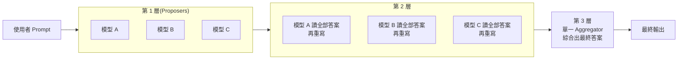
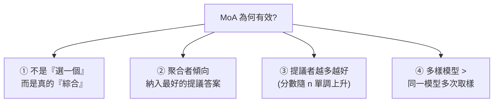

# Mixture-of-Agents(MoA):用「分層提議 + 聚合」讓多個 LLM 互相加成,純開源打贏 GPT-4o

> 整理自論文〈Mixture-of-Agents Enhances Large Language Model Capabilities〉(Junlin Wang、Jue Wang、Ben Athiwaratkun、Ce Zhang、James Zou,Together AI / Duke / Chicago / Stanford,2024-06-07,arXiv:2406.04692,程式碼 [togethercomputer/moa](https://github.com/togethercomputer/moa))。核心一句話:**不必再訓練更大的模型,只要把多個現成 LLM 分層串起來——每一層的模型都讀到上一層所有模型的答案再重寫——最終品質就能超過任何單一模型。純用開源模型的 MoA 在 AlpacaEval 2.0 拿到 65.1%,把 GPT-4o 的 57.5% 甩開一大截。**

---

## 一句話總結



每一層的每個模型,都把**上一層所有模型的輸出**當作輔助資訊,生成自己這一版更好的回答;一層一層精煉,最後一層用單一「聚合者」整合出最終答案。**整套方法不需要任何 fine-tuning,只靠 prompt 介面**,所以能套用在任何最新模型上、不管大小架構。

---

## 1. 出發點:LLM 越來越多,能不能集合眾人之力?

繼續把單一模型 scale up 極其昂貴(動輒幾兆 token 重訓)。同時,**不同 LLM 各有所長**:有的擅長複雜指令遵循、有的擅長寫程式。於是一個誘人的問題:**能不能把多個 LLM 的集體專長,組成一個更強、更穩的「模型」?**

作者的答案是「能」,而且來自一個他們命名的關鍵現象:

> **LLM 的協作性(collaborativeness of LLMs):當一個 LLM 看到其他模型生成的答案時,它傾向產生更好的回答——即使那些其他模型本身比它弱、提供的答案品質比它自己還差。**

論文 Figure 1 在 AlpacaEval 2.0 上對 6 個熱門 LLM 做實驗:把「其他模型獨立生成的答案」一併餵給它們後,**每一個模型的 LC win rate 都顯著提升**。這個現象在當今 LLM 中相當普遍——而且**即使輔助答案品質較低也成立**。MoA 就是建立在這個發現上。

---

## 2. 兩種角色:Proposer 與 Aggregator

要把協作效益榨到最大,先要理解模型在協作中扮演的兩種角色:

| 角色 | 中文 | 擅長什麼 | 特點 |
|---|---|---|---|
| **Proposer** | 提議者 | 生成有用的**參考答案**供其他模型使用 | 自己單獨的分數**不一定高**,但能提供更多脈絡、更多樣的視角 |
| **Aggregator** | 聚合者 | 把多個模型的答案**綜合成單一高品質輸出** | 即使整合的輸入比自己原本的答案還差,也能**維持甚至提升**品質 |

論文實證(§3.3、Table 4):**GPT-4o、Qwen1.5、LLaMA-3 是「全能型」**,當提議者和聚合者都行;而 **WizardLM 是優秀的提議者,卻不擅長聚合**別人的答案。這個角色分工是 MoA 設計的基礎——既然聚合者能靠別人的答案產出更好結果,那就**多放幾個聚合者、反覆聚合**,於是有了 MoA。

---

## 3. MoA 架構與那一段關鍵 Prompt

MoA 有 `l` 層,每層 `i` 有 `n` 個 LLM(`Aᵢ,₁ … Aᵢ,ₙ`)。**模型可以在同層或跨層重複使用**。第 `i` 層的輸出 `yᵢ`:

```
yᵢ = ⊕ⱼ[Aᵢ,ⱼ(xᵢ)] + x₁ ,   xᵢ₊₁ = yᵢ
```

- `+` 是文字串接(把原始 prompt `x₁` 也接回去);
- `⊕` 是套用下面這段 **Aggregate-and-Synthesize(聚合並綜合)** prompt,把該層所有模型的輸出整合。

> **聚合 prompt(論文 Table 1,精譯):**
> 「你收到一組來自不同開源模型對最新使用者查詢的回答。你的任務是把它們**綜合成單一、高品質的回答**。務必**批判性地評估**這些資訊,認知到其中部分可能有偏誤或錯誤。你的回答**不應只是複製**這些答案,而要提供一個精煉、準確、全面的回覆……確保結構良好、連貫,並符合最高的準確與可靠標準。
> 模型的回答:1. […] 2. […] … n. […]」

實務上最後一層只需要**一個** LLM 出最終答案,所以末層用 `Al,1(xl)` 的輸出作為結果。

**一個特例**:如果某層放的全是同一個模型(靠 temperature 取樣產生不同輸出),就退化成 **single-proposer**(單一提議者),只有稀疏子集被啟用——這正好用來和「多樣模型」做對照實驗(見下)。

---

## 4. 和 Mixture-of-Experts(MoE)的類比

MoA 的靈感來自經典的 **MoE**(混合專家)。MoE 一層由 `n` 個專家網路 + 一個 gating(門控)網路 + 殘差連接組成:`yᵢ = Σⱼ Gᵢ,ⱼ(xᵢ)·Eᵢ,ⱼ(xᵢ) + xᵢ`。

> **MoA 把 MoE 的概念從「激活層級(activation level)」提升到「模型層級(model level)」**:不是在單一模型內部放專門的子網路,而是**跨層用多個完整的 LLM**;而且**完全透過 prompt 介面運作**,不需要改內部激活或權重。更妙的是,MoA 用 **LLM 本身同時扮演 gating 和 expert**——因為 LLM 的內在能力足以靠「讀懂 prompt、生成連貫輸出」自己調控輸入,不需要外部協調機制。

好處:① **省掉 fine-tuning 的計算開銷**;② **彈性與可擴展**——任何最新 LLM 不論大小架構都能直接套用。

---

## 5. 結果:純開源打贏 GPT-4o

| 模型(AlpacaEval 2.0) | LC win rate |
|---|---|
| **MoA w/ GPT-4o(末層用 GPT-4o 聚合)** | **65.7%** |
| **MoA(純開源,6 提議者 × 3 層)** | **65.1%** |
| **MoA-Lite(純開源,2 層,更省)** | 59.3% |
| GPT-4 Omni(05/13) | 57.5% |
| GPT-4 Turbo(04/09) | 55.0% |
| WizardLM 8x22B | 51.3% |

- **純用開源模型**(Qwen1.5-110B/72B、WizardLM-8x22B、LLaMA-3-70B、Mixtral-8x22B、dbrx-instruct;末層聚合者 Qwen1.5-110B)的 MoA,就把 GPT-4o 從 57.5% 拉高到 **65.1%(絕對 +7.6%)**。
- **MoA-Lite**(只 2 層、末層用 Qwen1.5-72B)即使更輕量,仍勝 GPT-4o 約 1.8%,而且**成本與 GPT-4o 相當**。
- **MT-Bench** 上 MoA 也登頂(雖然提升幅度較小,因為單模型本就 >9 分接近天花板);**FLASK**(12 項細粒度技能)上 MoA 在 robustness、correctness、factuality、insightfulness、completeness 等顯著優於聚合者單模型,也在多項勝過 GPT-4o——唯一較弱的是 **conciseness(輸出偏囉嗦)**。

---

## 6. 為什麼 MoA 有效?(四個關鍵實證)



1. **MoA 顯著勝過「LLM 排序器」**:對照組讓聚合者**從提議答案中挑一個最好的**(而非重寫)。結果 MoA 大勝 ranker → 證明聚合者**不是單純選一個**,而是對所有提議做了精細的綜合。
2. **聚合者傾向納入最好的提議答案**:用 BLEU(n-gram 重疊)、Levenshtein、TF-IDF 算聚合答案和各提議答案的相似度,發現相似度與 GPT-4 評審的偏好分數呈**正相關**——聚合者確實在「採納」高品質提議的內容。
3. **提議者數量 n 越多越好**:n 從 1→6,分數**單調遞增**(更多輔助資訊有用)。拓寬 MoA 的寬度是有前景的方向。
4. **多樣性勝過數量**:同樣 n 個答案,「**multiple-proposer**(每個答案來自不同 LLM)」一致優於「**single-proposer**(同一模型 temperature=0.7 取樣 n 次)」。**異質模型帶來的多樣視角,貢獻遠大於同一模型的重複取樣。**

---

## 7. 成本與延遲:Pareto 前緣 + 一個真實代價

- **成本效益**:把 LC win rate 對「每題平均推理成本」作圖,MoA 系列落在 **Pareto 前緣**上。**MoA-Lite 能匹配 GPT-4o 的成本卻品質更高;比 GPT-4 Turbo 好約 4%,同時便宜 2 倍以上。**(多個提議者可**並行**跑,所以延遲代理量 tflops 是每層取提議者最大值再across層加總。)
- **限制(務必知道)**:MoA 要**逐層聚合**,意味著**要到最後一層才能決定第一個 token** → **TTFT(Time to First Token,首字延遲)很高**,傷害互動體驗。緩解方式:① **限制層數**(第一次聚合提升最大,後續邊際遞減);② 未來可探索 **chunk-wise 聚合**(分塊聚合而非整段),降 TTFT 又保品質。
- **附帶好處**:中間輸出都是**自然語言**,所以 MoA 同時**提升了可解釋性**——你看得到每一步在綜合什麼。

---

## 應用案例 / 怎麼用這套思路

- **不訓練、只靠 API 就提升品質**:手上有幾個模型(或同一模型多次呼叫)時,與其賭單一模型,不如「**並行提議 → 聚合綜合**」。直接用 Together 的 [moa repo](https://github.com/togethercomputer/moa) 或自己寫:第一層讓 3–6 個模型各答一遍,第二層丟那段 Aggregate-and-Synthesize prompt 讓一個強模型整合。**多數情境 2 層(MoA-Lite)就有大半效益,還省成本/延遲。**
- **這正是 Claude Code「Workflow / judge panel」模式的學術根據**:本庫多次出現的「**生成 N 個獨立答案 → 用評審/聚合綜合出最佳**」(judge panel、perspective-diverse verify),底層機制就是 MoA 的協作性 + 聚合勝過排序。對照 [[five-agent-patterns]] 的 **Parallelization** 與 **Orchestrator-Workers**、[[claude-dynamic-workflows]] 的多 agent 編排。
- **選角色比選模型重要**:要做提議者就挑**多樣、互補**的模型(別用同一個多次取樣);要做聚合者就挑**綜合能力強**的(GPT-4o/Qwen/LLaMA-3 類全能型,別用 WizardLM 這種「會提議不會聚合」的)。
- **可疊加在推理技巧上**:附錄 D 顯示 MoA 在 MATH 任務也穩定提升,且**和 CoT、Self-Consistency 互補**——不是二選一,可以一起用。
- **何時別用**:對**首字延遲**敏感的即時互動(聊天打字機效果)要謹慎,MoA 的 TTFT 天生高;此時減層或改用單模型。

> 延伸對照:本庫 [[grpo-vs-gepa]](同一條 trace 兩種學習訊號)、[[function-calling-mcp-a2a]](Agent 之間協作的 A2A)、[[task-decomposition-agentic-workflow]](把任務拆成可並行的工作流)。MoA 與它們的共同主題是:**用「多個視角 + 結構化整合」換取超越單體的品質。**

---

## 來源

- Junlin Wang, Jue Wang, Ben Athiwaratkun, Ce Zhang, James Zou,〈Mixture-of-Agents Enhances Large Language Model Capabilities〉,arXiv:2406.04692(2024-06-07,Together AI):<https://arxiv.org/abs/2406.04692>
- 程式碼:<https://github.com/togethercomputer/moa>
- 評測基準:AlpacaEval 2.0(Dubois et al., 2024,LC win rate)、MT-Bench(Zheng et al., 2023)、FLASK(Ye et al., 2023);本文依論文全文(含 §2 方法、§3 評測、附錄 case study / MATH)整理。
