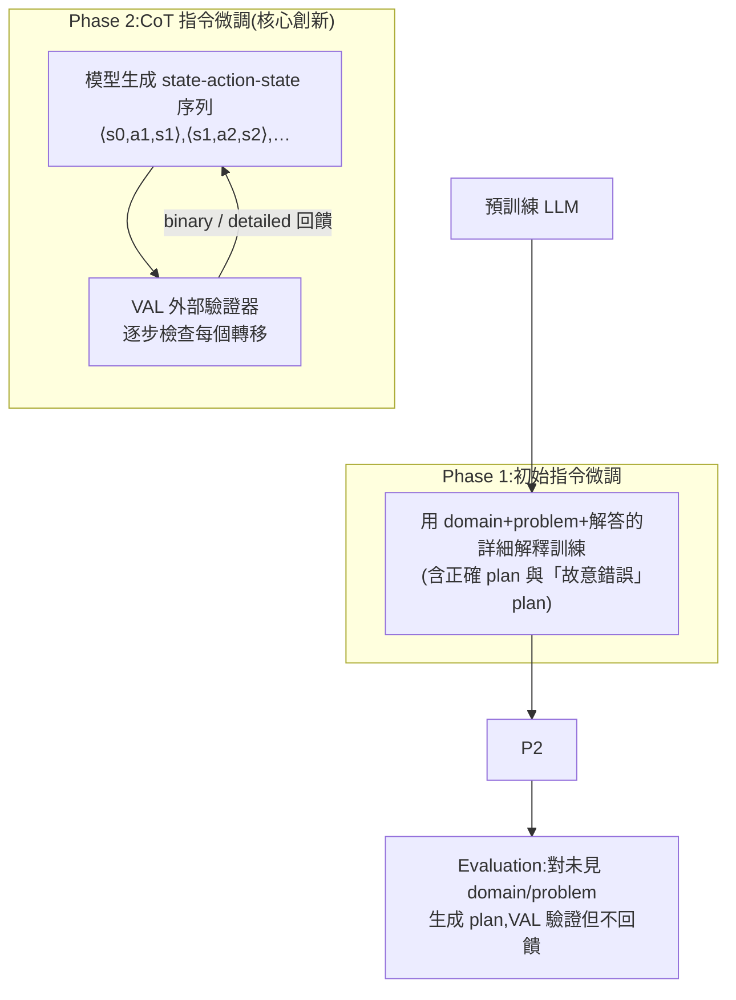

# PDDL-Instruct:用「邏輯式 CoT + 外部驗證」教 LLM 做真正的符號規劃

> 來源:Verma 等人(MIT CSAIL / Microsoft AI),〈Teaching LLMs to Plan: Logical Chain-of-Thought Instruction Tuning for Symbolic Planning〉(arXiv:2509.13351, 2025)。針對「LLM 一般推理很強,但**符號規劃(PDDL)很爛**」的痛點,提出 **PDDL-Instruct** 指令微調框架:把規劃拆成「逐步檢查前提、套用效果、驗證不變量」的邏輯推理鏈,再用外部驗證器 VAL 給回饋。Llama-3-8B 在 Blocksworld 的規劃正確率從 28% 拉到 **94%**,相對 baseline 平均 **+66 個百分點**。

---

## 一句話總結

**過去大家說「CoT 不適合 planning」**(LLM 生出來的 plan 常常 precondition 沒滿足、effect 算錯、到不了 goal)。這篇反駁:只要把 CoT 拆成**可被外部驗證**的原子邏輯步驟,再用真正的 plan validator(VAL)逐步給**具體錯誤回饋**去做指令微調,CoT 就能用於 planning——關鍵是**不靠 LLM 自我糾錯**(它做不好),而是引入外部 ground-truth 驗證。

---

## 背景:為什麼 LLM 不會「規劃」

**自動規劃(automated planning)** 形式化為 `⟨P, A, s₀, G⟩`:fluents(描述狀態的命題)、動作集合、初始狀態、目標。每個動作 `a = ⟨pre(a), add(a), del(a)⟩`:
- `pre(a)`:要執行此動作,當前狀態必須成立的前提;
- `add(a)` / `del(a)`:執行後變成真 / 變成假的 fluents。
- 狀態轉移:`sᵢ₊₁ = (sᵢ \ del(a)) ∪ add(a)`。一個 plan 是把 s₀ 變到滿足 G 的動作序列。

**PDDL**(Planning Domain Definition Language,基於 STRIPS)是描述這類問題的標準語言,分 domain(fluents + actions)與 problem(初始狀態 + 目標)。

> **問題所在:** 規劃是 PSPACE-complete,需要隨問題複雜度擴展推理。研究反覆證明 LLM 在多步規劃上表現差——**會忽略動作的前提與效果、隨規模惡化、且自我迭代回饋反而越改越糟**。CoT 被 Stechly 等人(2024)點名「不適合 planning」。本文要打破這個結論。

**和「混合派」的差別:** 另一條路線是讓 LLM 只負責**生成 PDDL 模型**,再丟給傳統符號 solver 求解(LLM+P 等)。本文不同——它**直接微調 LLM 自己學會逐步推理 action applicability、state transition、plan validity 來產生 plan**。

---

## PDDL-Instruct 三階段框架

### Phase 1|初始指令微調(打底:學會「解釋對錯」)

不只是把 plan 餵給模型看,而是明確要它**解釋每個動作為何有效**(前提是否滿足、效果如何套用)。關鍵是**故意混入錯誤的 plan**,涵蓋四類錯誤,教模型辨識並說明:
1. 動作前提未滿足;2. 效果套用錯誤;3. 違反 frame axiom(該不變的變了);4. 最終到不了目標。

> 這一步建立「邏輯驗證」的基礎,讓模型會用語言講出動作有效性的邏輯依據。

### Phase 2|CoT 指令微調(核心:外部驗證 + 兩種回饋)

初步微調後的模型,對 domain/problem 產生逐步的 `⟨sᵢ₋₁, aᵢ, sᵢ⟩` 序列(候選 plan),**送進 VAL**([Howey 2004] 的 plan validator)逐步檢查每個狀態轉移是否合法。兩種回饋:

| 回饋型態 | 內容 | 效果 |
|---|---|---|
| **Binary** | 只說這動作 valid / invalid | 較弱 |
| **Detailed** | 具體指出哪個 precondition 失敗、哪個 effect 套錯 | **全面較佳**(尤其在最難的 domain) |

- **為什麼用外部驗證而非自我反思?** 論文直接點明:研究顯示**現階段 LLM 的自我糾錯推理能力不足**(self-reflection 會生出「聽起來合理但內部矛盾」的推理鏈)。外部 VAL 提供 ground-truth,對抗 **unfaithful CoT**(不忠實的推理鏈)。
- **回饋迴圈上限 η**(超參):限制重生 CoT 的次數;實驗 η∈{10,15},η=15 一致更好。

**Phase 2 的兩階段優化**(本框架的特色):
- **Stage 1 — Reasoning Chain Optimization:** 優化推理鏈本身的品質(損失 `L_reasoning`),懲罰「前提沒滿足就套動作、效果沒傳播、違反 domain 約束」等邏輯錯誤。
- **Stage 2 — End-Task Performance Optimization:** 從推理改善後的參數再優化最終 plan 正確率(損失 `L_final`),確保「會推理」轉化成「真的產出對的 plan」。

> 設計取捨:框架保證 **logical coherence**(每步都從合法動作邏輯地推出下一狀態),但**不保證 progressive refinement**(不追求最短/最優),只求 **satisficing plan**(能到目標即可)——因為產生最優解對 planner 和 LLM 都難得多。

### Evaluation 階段

對**未見**的 domain/problem 直接生成完整 state-action-state 序列,用 VAL 驗證(僅評分、**不回饋**)。plan 有效 ⟺ 所有動作在各自狀態都可執行,且最終狀態滿足所有目標。

---

## 實驗結果(PlanBench 三 domain)

模型:**Llama-3-8B** 與 **GPT-4**。三個 domain:
- **Blocksworld**(經典堆積木,動作集小);
- **Mystery Blocksworld**(同結構但**謂詞名稱被語義混淆**,最難);
- **Logistics**(卡車/飛機運貨,測多步運輸與連通性推理)。

**Llama-3 主要結果(detailed feedback, η=15):**

| Domain | Baseline | 只 Phase 1 | **PDDL-Instruct(完整)** |
|---|---|---|---|
| Blocksworld | 28% | 78% | **94%** |
| Mystery BW | 1% | 32% | **64%**(64× 提升) |
| Logistics | 11% | 23% | **79%** |

- 相對 baseline 平均 **+66 個百分點**(絕對提升),相對「只做基本指令微調」平均 +35 個百分點。GPT-4 也有 +61 / +48 的同向提升 → **架構無關**。
- **Detailed > Binary**(在最難的 Mystery BW 差距最大,+15 個百分點),驗證「給具體錯誤原因」比「只說對錯」更能練出穩健的驗證能力。
- **baseline 越弱的 domain,相對提升越大**(Mystery BW 1%→64%),說明顯式邏輯推理對「無法靠 pattern matching 蒙混」的複雜場景特別有用。

---

## 應用案例:這套方法怎麼用、用在哪

- **機器人 / 自駕 / 災難應變的任務規劃:** 例如「把 A 房間的箱子搬到 B 房間」——讓微調後的 LLM 逐步輸出 `⟨狀態, 動作, 新狀態⟩`,每步用 VAL 確認「機器手臂有沒有空(precondition)、抓取後狀態怎麼變(effect)」,避免生出「手上已經有東西卻又去抓」這種違反前提的計畫。比起讓 LLM 一口氣吐出動作序列,可靠性大幅提高。
- **教自己的 agent「先驗證再行動」:** 核心可遷移的設計是「**把長程決策拆成可被外部工具逐步驗證的原子步驟**」。即使不微調,也能在 agent loop 裡套用:讓模型輸出 state-action-state、接一個確定性 checker(VAL、單元測試、型別檢查、DB 約束)逐步把關,而不是依賴模型自我反思。這與本庫 [[task-decomposition-agentic-workflow]](把流程拆成 agent 能跑的工作流)、[[five-agent-patterns]] 的 Evaluator-Optimizer 模式同源。
- **與 LLM-Modulo 結合:** 論文建議搭配 Kambhampati 的 LLM-Modulo(LLM 負責生成、外部工具負責驗證)能減少所需的驗證迴圈次數,讓規劃更快更可靠。
- **可延伸到 planning 以外:** 作者點名同樣的「CoT + 驗證回饋」範式可用於**定理證明、複雜解謎、多步邏輯推導**等長程推理任務。

---

## 侷限與重要觀念

- **只做 satisficing,不做 optimal**:找到「能到目標的計畫」,不保證最短/最省資源。
- **PDDL 特性受限**:目前不支援 conditional effects、durative actions、derived predicates、action costs 等複雜特性(為簡化推理鏈)。
- **仍依賴外部驗證器 VAL**:這既是優點(對抗 unfaithful CoT)也是依賴;未來方向是讓模型自我驗證更可靠。
- **不是 100% 正確**:最難的 Mystery BW 也只到 64%,安全關鍵領域仍需人工監督與外部驗證(論文 Broader Impact 自陳:過度依賴 LLM 生成的計畫在安全關鍵場景可能失敗)。
- **核心啟示**:LLM 的「自我糾錯」目前靠不住;**把外部 ground-truth 驗證接進訓練/推理迴圈**,比堆更多自我反思更有效。這呼應 [[bdi-belief-desire-intention]] 對「規劃需要顯式結構」的觀點。

---

## 來源

- Pulkit Verma, Ngoc La, Anthony Favier, Swaroop Mishra, Julie A. Shah, "Teaching LLMs to Plan: Logical Chain-of-Thought Instruction Tuning for Symbolic Planning", arXiv:2509.13351 (2025-09-14):<https://arxiv.org/abs/2509.13351>
- 驗證器:Howey et al., "VAL: Automatic Plan Validation"(ICTAI 2004);基準:PlanBench(Valmeekam et al., 2023)。
