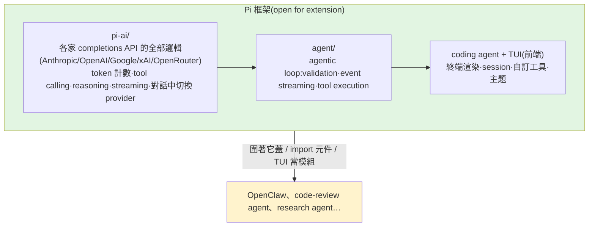

# Pi Agent:用「留白」的極簡 harness,對沖 agent 框架的易變

> 現在的 coding agent 多到像 Pepsi vs Coca-Cola——把 logo 遮掉,Antigravity、Codex、Cursor 幾乎分不出誰是誰。
> 但 **Pi**(驅動 **OpenClaw** 的「大腦」)很不一樣:它的獨特不在「**加了什麼**」,而在「**刻意不加什麼**」。
> 核心兩件事:**(1) 能用程式碼擴展自己的 harness;(2) 用「build less」對沖 agent harness 層的高度易變。**
>
> 整理自 Caleb Writes Code 影片(英文,6 分鐘)。是本庫 [[harness-engineering-evolution]] 的延伸案例。

---

## 一、Pi 的賣點是「負空間」:它刻意不內建什麼

像藝術裡的**負空間(negative space)**——focus 在主體周圍的留白,而非畫主體本身。Pi 出名的是它**留掉多少**,而不是塞進多少:

- **沒有 sub-agents**(開箱即用)
- **沒有 MCP**
- **沒有 background bash**
- **沒有 to-do list**

> 為什麼 OpenClaw 不用更「完整」的 Codex CLI / Gemini CLI / Claude Code 來驅動?因為那些開箱工具多,但**你動不了它們的 harness 本身**。

---

## 二、真正的能力:用程式碼「擴展自己的 harness」

一般 coding agent(Claude Code、Codex、Antigravity)你只能**設定 harness 周邊的選項**,**不能擴展 harness 本身**。Pi 可以。

**以 hook 為例**(hook = 在工具呼叫鏈的前/後攔截,做你要的動作;例如「每次刪資料夾就寫一筆 audit trail」= pre-tool-use hook):

| | 加 hook 的方式 |
|---|---|
| **Claude Code** | 在 `settings.json` 寫設定,讓**既定 harness** 去解析消費——你是在「預設 harness 之內」配置 |
| **Pi** | **直接寫一整段 TypeScript,當作自己 harness 的原生擴展**;`/reload` 後 Pi 就把這段新程式碼納入為 hook |

> 也就是 **Pi 一邊執行、一邊能改寫自己的 harness(self-aware)**。於是你能**圍著 Pi 蓋出 OpenClaw 這種應用**——在它外面加 scaffolding(MCP、訊息軟體整合、hosting gateway…);OpenClaw 可以**import Pi 的部分元件**,或**直接把 TUI 當模組**用。

---

## 三、架構:4 個元件,遵守 SOLID(關注點分離 + 開閉原則)

Pi 把自己拆成幾段,符合 **separation of concerns** 與 **open-closed principle**(對擴展開放、對修改封閉):

- **`pi-ai/`**:所有「跟各家 API 講話」的瑣事都關在這——含**對話中途切換 provider**。
- **`agent/`**:agentic 迴圈(驗證、事件串流、工具執行)。
- **TUI**:使用者互動的前端。

這種架構讓人**用 Pi 當框架蓋自己的應用**(OpenClaw),或**做專用 agent**(code-review agent、research agent)——精準高效,而不是去「引導一個臃腫的 Claude Code、靠 prompt 客製它附帶的 harness」。

---

## 四、為什麼要這麼極簡?——對沖 harness 的高度易變

「Pi 開箱什麼都沒有、要自己蓋,那用它幹嘛?」作者的答案:**Pi 是對「agent harness 一直被重寫」的終極對沖。**

- **harness 層極不穩定**:**LangChain 架構被重寫 4+ 次**、**Manus 被重寫 5 次**——agentic 層變動劇烈。
- **模型越來越強 → 需要的 harness 實作越來越少**:很多 harness 程式碼是為了**繞過模型在 tool calling 上的限制**而寫的;模型一進步,這些就沒用了 → **「build to delete」**(你今天蓋的,可能很快過時)。
- 所以 **build less、避免在 harness 層過度工程**,反而**長期最耐用**——這呼應 [[ai-coding-three-illusions-opencode]](Dax Raad 也是「**少做、別過度工程**、慢下來打地基」)。

---

## 應用案例

- **要蓋一個 agent 產品(像 OpenClaw):** 別拿臃腫的 Claude Code 來改,改用 Pi 當**框架**——import 它的 `pi-ai`/`agent` 元件或把 TUI 當模組,自己加 MCP/訊息整合/hosting。
- **要一個專用 agent(code review / research):** 用 Pi 寫一個精準小 agent,比「用 prompt 引導通用 agent」更可控、更省。
- **想要 harness 可程式化擴展:** 用 Pi 的「**寫 TypeScript 當原生 harness 擴展 + `/reload`**」加 hook(如刪檔寫 audit trail),而非被鎖在 `settings.json` 的既定 harness 內。
- **怕押錯 agent 框架:** 把「會被反覆重寫」的 harness 層做薄(Pi 哲學),減少 build-to-delete 的浪費——對照 [[harness-engineering-evolution]] 的 loop 架構也是「極簡 repo」。

---

## 一句話總結

> Pi 不是「功能更多的 coding agent」,而是一個**刻意留白的 harness 框架**:沒內建 sub-agent/MCP/背景 bash/to-do,
> 但**能用 TypeScript 原生擴展自己的 harness**(`/reload` 即生效),並用 SOLID 把「API 層 / agentic loop / TUI」拆乾淨,
> 讓 OpenClaw 之類的應用圍著它蓋。它的賭注是:**harness 層注定一直被重寫(LangChain 4 次、Manus 5 次),
> 所以 build less、把易變的那層做薄,才是長期最耐用的策略。**

---

## 來源

- YouTube:[Pi Agent explained in 6min..(Caleb Writes Code)](https://youtu.be/FJxgz5pN4wU)
- 涉及:Pi、OpenClaw、hooks(pre-tool-use)、SOLID(separation of concerns / open-closed)、`pi-ai`/`agent`/TUI 元件、LangChain/Manus 多次重寫、build-to-delete。
- 延伸:本庫 [[harness-engineering-evolution]]、[[ai-coding-three-illusions-opencode]]、[[hermes-main-agent-orchestration]]、[[function-calling-mcp-a2a]]、[[task-decomposition-agentic-workflow]]。
