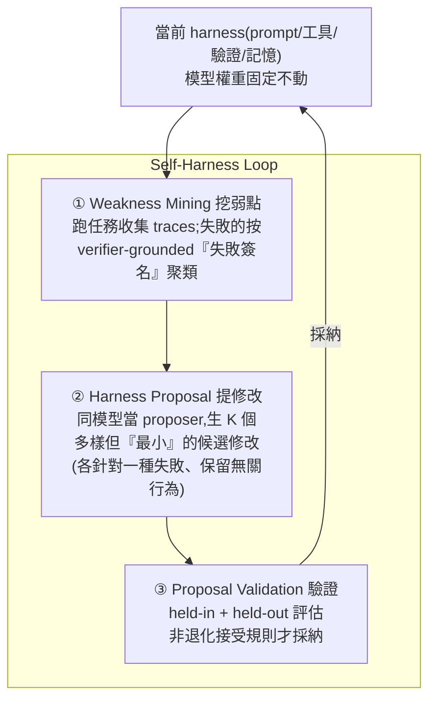

# Self-Harness:讓 Agent 自己改進「操作自己的那層 harness」

> 來源:Hangfan Zhang 等(上海人工智慧實驗室),〈Self-Harness: Harnesses That Improve Themselves〉(arXiv:2606.09498v1)。提出一個新範式——**讓 LLM agent 改進「它自己賴以運作的 harness」**(system prompt、工具、runtime 機制),**不需要人類工程師、也不需要更強的外部 agent**。模型權重全程不動,只改周邊的 harness。在 Terminal-Bench-2.0 上,三個模型的 held-out 成功率都大幅提升(最高 +60% 相對)。

---

## 一句話總結

harness(模型權重以外的一切——prompt、工具、驗證規則、記憶機制)過去都靠**人類專家手調**,但這跟不上 LLM 爆炸的多樣性:**不同模型行為與敏感點不同,一套 harness 通吃必然次優**。Self-Harness 把「改 harness」這件事**內化進 agent 自己**——用一個「挖弱點 → 提修改 → 驗證」的迴圈,讓同一個模型讀自己的失敗痕跡、提出**最小且針對性的** harness 修改,只在「不退化」時才採納。**這是 [[grpo-vs-gepa]] 那條「讀完整 trace 反思、改 prompt 不改權重」路線的自我改進版,但作用在整層 harness。**

---

## 問題:harness 工程不該每換一個模型就重請人

- 傳統 harness engineering 靠人類專家,**不隨 LLM 多樣性 scale**。
- 不同模型有不同的行為模式與敏感性(有的愛拖到最後才產出、有的錯誤後不會自我恢復、有的跨 shell session 會「失憶」),**one-size-fits-all 的 harness 對每個新模型都是次優**。
- 本文挑戰「每個新模型都要外部優化或人類重設計」的假設。

---

## 方法:Self-Harness 三階段迴圈

1. **Weakness Mining(挖弱點)**:用當前 harness 執行任務、收集 execution traces;把**失敗的 trace 按「verifier-grounded failure signature(驗證器佐證的失敗簽名)」聚類**——把失敗拆成**終端原因(terminal cause)/ agent 行為 / 底層機制**三層,而不是把每個失敗當孤立事件。→ 找出「共享同一因果機制」的失敗群。
2. **Harness Proposal(提修改)**:用**同一個模型(在當前 harness 下)當 proposer**,生成 **K 個多樣但最小(diverse yet minimal)**的候選 harness 修改。每個 edit **只針對一個特定失敗 pattern**,並被約束**保留無關行為**、**避免大刀闊斧改架構**。
3. **Proposal Validation(驗證)**:候選在 **held-in 與 held-out** 兩個任務切分上評估;只有滿足**非退化接受規則(non-regressive acceptance)**的才晉級——「**至少在一個切分上改善、且不損害另一個**」。

> **核心設計哲學**:把 harness 改進當成「**有依據的經驗性狀態轉移(empirical state transition)**」,而非無約束的優化——每個改動都綁定在記錄到的行為證據上,且保持**可解釋**(minimal edits 只動必要的 harness 表面)。

---

## 實驗與結果

**基準**:**Terminal-Bench-2.0**(64 個任務,容器化的終端互動)。**模型**:MiniMax M2.5、Qwen3.5-35B-A3B(A3B = active 3B 的 MoE)、GLM-5。權重全程固定,只改 harness。

| 模型 | held-out 成功率 | 相對提升 |
|---|---|---|
| **MiniMax M2.5** | 40.5% → **61.9%** | +53% |
| **Qwen3.5-35B-A3B** | 23.8% → **38.1%** | +60% |
| **GLM-5** | 42.9% → **57.1%** | +33% |

**所有提升在 held-in 與 held-out 上都成立 → 泛化到沒見過的失敗,不是過擬合觀察到的錯誤。**

**而且改的是「對症」而非「通用」的東西**(質化分析):
- **MiniMax**:更早建立 artifact、限制工具使用迴圈的長度。
- **Qwen3.5**:加入依賴項預檢、重試紀律、錯誤後的 artifact 恢復。
- **GLM-5**:跨 shell session 的環境持久化、從「探索」到「實作」的轉換。

> 同一套迴圈,對三個模型長出**三套不同的 harness 修補**——印證了「不同模型需要不同 harness」這個出發點。

---

## 核心洞見(為什麼這套有效)

- **Verifier-grounded clustering**:失敗按「共享的因果機制」分組,而非表面症狀 → 改的是病根不是症狀。
- **Evidence-based proposal**:候選綁定到具體聚類出的失敗,不是泛泛的「優化」。
- **Conservative validation**:非退化接受,防止「拆東牆補西牆」(改善一個指標卻犧牲另一個)。
- **Minimal edits**:每個提案只動必要的 harness 表面,維持可解釋性、避免破壞既有能力。

---

## 應用案例 / 啟示

- **每換一個模型,讓它自己「適配」harness**:你有一套 agent 系統,想換到新開源模型(或新版本),不必人工重調 prompt/工具——跑 Self-Harness 迴圈,讓新模型用自己的失敗 trace 把 harness 調到適合自己。這對「[[model-agnostic-ai-workflow]] 模型可替換」的工作流是天然補件。
- **把「讀 trace 找問題」自動化**:這正是 [[agent-trace-analysis-with-ai]](讓 agent 讀 trace、人把持品味)的進階——不只診斷,還**自動提出 + 驗證**修補。差別在它用「非退化 + 最小編輯 + held-out 驗證」守住品質,避免 agent 自我改進常見的「越改越歪」。
- **harness 演進的自動化**:對照 [[harness-engineering-evolution]](Prompt→Context→Harness,Ralph loop)與 [[ai-harness-explained]](harness=模型權重以外的一切)——Self-Harness 把「harness 工程」從人工活變成 agent 能自跑的閉環。
- **與 GEPA 同源、層級更高**:[[grpo-vs-gepa]] 的 GEPA 是「讀完整 trace 反思、改 prompt 省 rollout」;Self-Harness 把這套**推到整層 harness(prompt+工具+runtime+記憶)且自我驅動**,並加上 verifier 佐證的失敗聚類與非退化驗證。
- **務實提醒**:它**不改權重**——能力天花板仍由模型決定;Self-Harness 是把「現有模型在這個 harness 下沒發揮的部分」榨出來(Terminal-Bench 上等於把成功率拉高三到六成),而非讓模型變聰明。也呼應 [[bitter-lesson-cut-old-patterns]]:該被自動淘汰的是「為舊模型手寫、對新模型反而綁手綁腳的 harness 規則」。

---

## 來源

- Hangfan Zhang, Shao Zhang, Kangcong Li, Chen Zhang, Yang Chen, Yiqun Zhang, Lei Bai, Shuyue Hu(Shanghai AI Laboratory),〈Self-Harness: Harnesses That Improve Themselves〉,arXiv:2606.09498v1:<https://arxiv.org/abs/2606.09498>
- 基準:Terminal-Bench-2.0;受測模型:MiniMax M2.5、Qwen3.5-35B-A3B、GLM-5。(論文未提供開源程式碼連結。)
