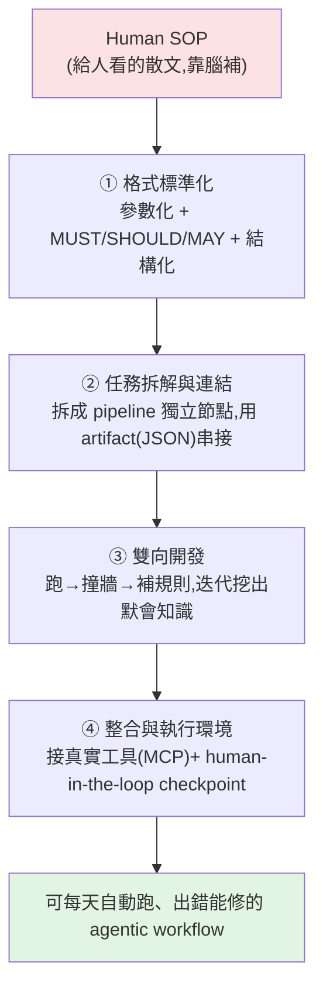

# Task Decomposition:把「給人看的 SOP」拆成「agent 跑得動的工作流」

> 前沿模型已經夠強,但很多人覺得 agent「產出不靠譜」,**問題通常不在模型、也不在 prompt,而在任務本身太大、太模糊**。
> 這支影片講 agentic workflow 裡最核心的觀念 **task decomposition(任務拆解)**:用四步把一份原本寫給人看的
> Human SOP,轉成 agent 能理解並穩定執行的生產線。
>
> 整理自 Gary Chen(@garytalksstuff)影片逐字稿。

---

## 先分清楚三個層級(很多人會混)

| 名詞 | 是什麼 | 給誰看 / 誰執行 |
|---|---|---|
| **Human SOP** | 傳統流程文件(簡報、Word)。寫第一步、第二步、例外處理 | **給人看**。人腦會自動補 context、判斷哪步能偷懶 |
| **Skill** | 把「方法論 + 判斷標準 + 踩過的坑」打包成資料夾交給 agent | **給 agent 的執行單位**,對應**單一任務** |
| **Agentic workflow** | 多個 agents / tools / skills / 資料源串成的一條生產線 | **一整條流程**,跑完任務就完成 |

> **Skill 資料夾的三件套**(對應 [[building-claude-skills]]):
> - `SKILL.md`:人類寫給 agent 的 SOP + 心法(核心文件)。
> - `references/`:額外參考(範例輸出、術語表、踩坑紀錄),agent 需要時自取。
> - `scripts/`:可直接執行的腳本,處理**確定性操作**(parsing、格式轉換)——傳統軟體工程就能做的事別丟給 LLM。
>
> Skill 命名要「看名字就知道做什麼、何時 trigger」:`weekly-report-drafting`、`pdf-processing`、`invoice-categorization`。
> **防守範圍**是關鍵:太大→樣樣通樣樣鬆;太小→每走一步都要讀 skill,把模型當小孩。

本影片的主軸:**怎麼把 Human SOP → agentic workflow。**

---

## 為什麼不能直接丟「mega agent」(就算 AGI 來了也一樣)

把整包任務丟給一個最強模型「從頭跑到尾」= **mega agent**。問題不是它夠不夠聰明,而是:

- **黑箱**:你不知道哪段推理對、哪個工具調錯、哪段是幻覺、哪段根本不該自動跑。想 review 也找不到下手點。
- **沒有讀心術**:你說「幫我打掃乾淨」,你心中的「乾淨」和它的「乾淨」定義不同 → 表面有掃、你在意的地方一個沒動。
  > 就算做出和真人一樣的 AI 幫手,你還是得**磨合**——它得透過日常相處累積你的偏好(你是極簡主義者、不沾鍋要用黃色菜瓜布…),
  > 這些**沒寫在任何說明書上**。不知道這些的機器人,再聰明都像笨蛋。

**解法是 divide and conquer(分而治之)**:把大任務拆成一串小 task,每個都有明確 input / output / 成功標準。

> 為什麼企業級框架都這樣做、不用 mega agent?因為要上 **production**,需要的是 **穩定性、可觀測性、可修復性**。
> 「一條真能上線的生產線乍看很無聊,但它**可預測、有邊界、出錯可以修**。」你不是在訓練一個超人 agent,而是在設計一條生產線。

---

## 四步:把 Human SOP 轉成 Agentic Workflow

### ① 格式標準化:把散文翻成 agent 讀得懂的規格

三個重點:

1. **參數化(parameterize)**:別在 SOP 裡寫死「一定用 normal 模式」。改成參數讓 SOP 變 **template**,呼叫時帶不同值。
   - 例:`mode` ∈ {quick, normal, delicate}、`temperature` ∈ {cold, warm, hot} → 同一份 SOP 涵蓋各種洗衣情境。
   - **SOP 一旦寫死就無法重用**;很多人把 skill 寫成「只 cover 一種特例的長文」,容錯率極低,分享給別人少個環境參數就報錯。
2. **MUST / SHOULD / MAY(RFC 2119 寫法)**:強制你把每條規則的**強度**想清楚。
   - **MUST**:硬性規定,絕不能跳過(例:先檢查洗標、白色深色分開)。
   - **SHOULD**:建議作法,有強烈理由可不做但要說明(例:依材質選洗衣模式)。
   - **MAY**:optional(例:濕度 >70% 才用烘乾,否則 MUST 改晾乾)。
   - agent 一看就知道**哪些不能討價還價、哪些可依 context 自己判斷**。
3. **結構化格式**:用 Markdown 把 `Parameters` / `Steps` / `Error Handling` 切清楚——人看得懂,也方便塞進 **MCP** 這類標準接口當行為規格。

### ② 任務拆解與連結:decompose 成 pipeline steps

把任務拆成 pipeline 的**獨立節點**,每個有自己的 input / output,**可獨立執行、獨立 debug、獨立替換**。

- 洗衣服 → 分類衣物 / 檢查口袋污漬 / 設定機器 / 決定晾或烘。
- **為什麼一直強調「獨立」**:分類那段把白色 polo 誤判成深色 → **只修那一段**,後面設定機器、晾烘邏輯完全不動。
  mega agent 全塞一個 prompt,一出錯只能整個重寫(因為不知道哪段壞)。
- 每節都能變成一個小 skill / 小 agent:「三個 agent 各做一件很笨但超明確的事,加起來就是完整 workflow」。
- **節點之間靠 artifacts 串接**:上一個 agent 的 output 變下一個的 input。
  - 例:分類 agent 吐一份 JSON(`whites/darks/delicates/unknowns` 各有哪幾件)→ 直接當「設定機器」agent 的 input。
  - **串接靠的不是模型間的心電感應,而是清楚定義的 input/output 與 artifact 格式。**

### ③ 雙向開發:第一版 SOP 一定會出包(最重要的一步)

關鍵概念 **默會知識(Tacit Knowledge / 內隱知識)**:那些難以用文字表達、存在你腦中與身體記憶裡的判斷。
**SOP 的本質就是把默會知識轉成明示規則**,而默會知識的特性是——**你自己不會發現它存在,直到它出錯**。

所以正確做法不是「關在房間裡想一份完美 SOP 再丟給 agent」,而是**跟 agent 一起跑、一起 debug、一起 iterate**:

1. 用自然語言跟 agent 說「我平常大概這樣這樣」→ 它寫第一版 SOP。
2. 照著實際跑一次 → 發現它把所有 t-shirt 丟高溫烘乾、縮水穿不下。
3. 回頭補一條規則:「含棉量 >80% 不可高溫烘乾」→ 下一輪不再犯。
4. 再跑又發現沒裝洗衣袋 → 再補一條……幾輪後 SOP 穩定到能 cover 大多數情境,剩 5% edge case 交給 human-in-the-loop。

> 案例:有客戶花兩個月寫「完美 SOP」,跑一次就垮(cover 的全是想像中的情境)。改用 **scrum 小步快跑**——
> 兩天寫粗糙版、一週跑 50 次 iteration、兩週上線。**速度的關鍵不是寫得多完美,而是迭代得多快。**

### ④ 整合與執行環境:接真實工具 + 人類把關

再漂亮的 SOP 沒接到真實工具就只是一份文件。

- **工具 = 公司內部系統**(資料庫、API、檔案系統、版本控制、ticketing)。但每家公司長得不一樣,A 公司的 agent 搬到 B 公司可能動不了。
- **MCP(Model Context Protocol)** 要解決的就是這個:一套開放協定,讓 LLM/agent 用**同一套標準**調用外部 tools / resources / prompts。
  > 比喻:**MCP 是 AI 世界的 USB-C**。以前每個設備插頭都不同、要一堆轉接線;USB-C 統一後一條線接所有。
  > 寫好一個 Slack MCP server,ChatGPT 跟 Claude 明天都能用,不必為每個 host 各寫一套整合。
  > (影片提到)Anthropic 已把 MCP 捐給 Linux Foundation 旗下的 Agentic AI Foundation,成為有基金會長期維護的開放標準。
- **Human-in-the-loop checkpoint**:在高風險決策、大規模變更前,agent **必須停下來等人按 OK**。
  因為再成熟的 workflow 總有 agent 無法判斷的 edge case——要嘛讓它亂猜(風險高)、要嘛停下來問人(風險可控)。
  這樣整條流程才不是失控黑箱,而是**人類掌舵、agent 執行**:你還是最後拍板的人,但重複機械的事不用自己做。

---

## 應用案例:公司內部請求分類系統(200 人公司)

每天有人透過表單 / Slack / Teams / Email 丟雜事進來(申請權限、報帳、新人 onboarding 要哪些工具…)。用四步:

- **Step 1 標準化**:寫成 SOP `INTERNAL REQUEST TRIAGE`。Parameters:ticket 來源、原始文字、員工編號。
  Steps 例:`MUST` 用員工編號驗證在職 → `MUST` 把請求分類成 IT/HR/Finance → `SHOULD` 依 SLA 與關鍵字判 priority(High/Medium/Low)
  → `MUST` 產出結構化輸出(category、priority…);若 `需要澄清=true`,`MUST` 再產 2–3 個釐清問題。
- **Step 2 拆解**:拆成兩個 skill。① `internal-request-triage`(input=ticket 文字,output=JSON:category/priority/assignee/要不要釐清);
  ② `internal-request-reply-drafting`(input=①的 JSON,output=給同事的回覆草稿)。靠 JSON artifact 串接,互不干擾。
- **Step 3 雙向開發**:跑第一版會發現「某類老被誤分成 Other」「priority 永遠判 Medium」「assignee 推薦給已離職的人」→ 補規則、再跑,三五輪後趨穩。
- **Step 4 整合**:加 script 把結果寫回追蹤系統(Notion/Jira/Google Sheet);涉及財務 >5000 或 admin 權限變更 → `MUST` 停下來等人按 OK。

> 串起來:讀 ticket → 自動分類 → 產回覆草稿 → 寫回追蹤系統 → 必要時請人確認。一份原本只能給人跑的 SOP,變成每天自動跑、出錯能即時知道怎麼修的 workflow。

---

## 這不是小眾興趣

- **MCP** 已被 ChatGPT、Claude、Cursor 等各種 IDE / agent 平台採用。
- **IBM、AWS、ServiceNow** 都在產品線裡跑 agentic workflow——ServiceNow 現在處理 IT ticket、HR 請求等內部流程,已用 agentic workflow 而非傳統規則引擎。

---

## 怎麼開始(個人版)

別想一次把公司所有流程都自動化(會把自己搞死)。**挑一份你手上最無聊、又一直重複做的 Human SOP**
(每週週報、release checklist、新人 onboarding),照四步走一遍。不用一開始完美、也不用完全自動化——
**先有一個能替你省 30% 時間、跑得起來的版本,再慢慢迭代。**

> **「你不是在學怎麼用 AI,而是在學怎麼設計給 AI 用的工作流。前者半年就過時,後者越來越值錢。」**
> 在 MCP、agentic workflow、multi-agent 越來越普及的世界,「能把流程拆好、設計成 agent 真能執行的 workflow」這種能力只會越來越值錢。

---

## 一句話總結

> 任務拆解的精髓是 **divide and conquer**:把大而模糊的任務,拆成一串「input/output/成功標準都明確」的小節點,
> 用 artifact 串接、用 MUST/SHOULD/MAY 定規則、靠跑起來迭代挖出默會知識、再接真實工具與人類 checkpoint。
> 這正是 [[12-factor-agents]]「大量普通軟體 + 少量精心設計的 LLM 步驟」與 [[grpo-vs-gepa]]「把問題定位到單一模組再改」的同一條工程哲學:
> **可預測、有邊界、出錯可修,才能真的上 production。**

---

## 來源

- Gary Chen(@garytalksstuff)YouTube:[一支影片帶你搞懂如何建立 agent 能跑的工作流,Task Decomposition 解析](https://www.youtube.com/watch?v=Yzpx4Xaigms)
- 延伸:[Model Context Protocol 官方文件](https://modelcontextprotocol.io)、本庫 [[building-claude-skills]]、[[function-calling-mcp-a2a]]、[[12-factor-agents]]。
