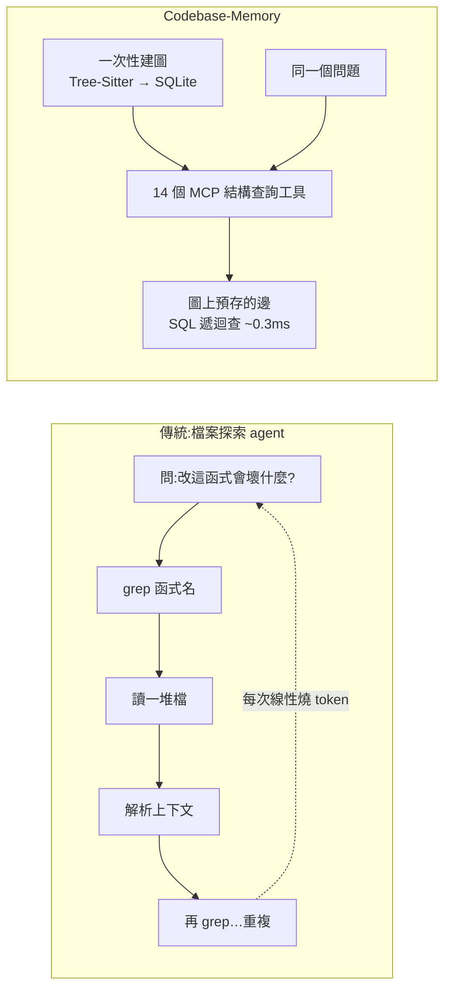
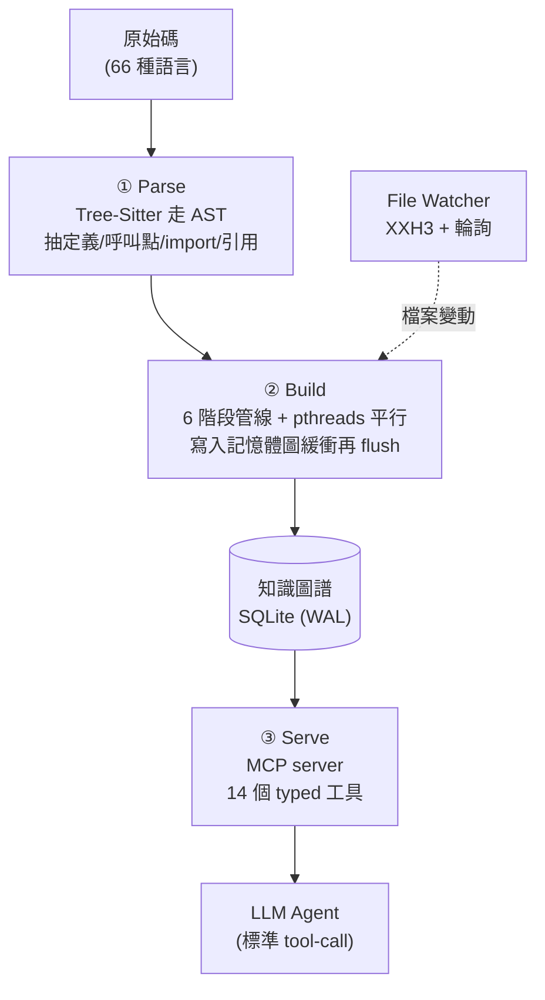

# Codebase-Memory:把程式碼變成「可查詢的知識圖譜」,讓 LLM 探索程式碼省 10 倍 token

> 整理自論文〈Codebase-Memory: Tree-Sitter-Based Knowledge Graphs for LLM Code Exploration via MCP〉(Martin Vogel、Falk Meyer-Eschenbach、Severin Kohler、Elias Grünewald、Felix Balzer,Charité 柏林醫學資訊所等,2026-03-28,arXiv:2603.27277,程式碼 [DeusData/codebase-memory-mcp](https://github.com/DeusData/codebase-memory-mcp),MIT)。核心一句話:**別讓 coding agent 靠「反覆讀檔 + grep」去理解程式碼(每次查詢燒掉上千到上萬 token、還沒結構觀),改成事先用 Tree-Sitter 把整個 codebase 解析成一張「持久的知識圖譜」存進 SQLite,透過 MCP 給 agent 14 個結構化查詢工具——同樣品質下省 10 倍 token、2.1 倍工具呼叫、查詢延遲從 10–30 秒降到 <1ms。**

---

## 一句話總結

- **問題的本質是「錯配」**:LLM agent 在**非結構化文字**上操作,但開發者的問題本質是**結構性**的——呼叫圖(call graph)、依賴鏈、模組邊界、影響分析(「改這個函式會連帶壞掉什麼?」)。純文字搜尋抓不到「遞移關係」,只能一層層追引用,每追一層就多燒 token、還容易丟失上下文。
- **解法**:把「程式碼結構」當成**一等公民的可查詢知識圖譜**,事先建好、增量維護,用輕量結構工具暴露給 agent,而不是丟原始檔內容。
- **成績(31 個真實 repo)**:答案品質 **83% vs 檔案探索 agent 的 92%**(達其 90%),但 **token 少 10 倍、工具呼叫少 2.1 倍、查詢快 100 倍以上**;在 hub 偵測、caller 排序這類「圖原生查詢」上,**19/31 種語言追平或超越**檔案探索。

---

## 1. 三階段架構:Parse → Build → Serve

整個系統是**單一靜態連結的 C 二進位檔、零執行期依賴**(把 66 個 Tree-Sitter 文法當 C source 一起編進去),所有狀態都在**一個 SQLite 檔**裡。

1. **Parse(解析)**:Tree-Sitter 跨 66 語言抽出**定義**(函式/方法/類別/介面/enum/型別,連簽名、回傳型別、receiver、decorator、複雜度、是否 export)、**呼叫點**、**import**(8 種語言專屬 parser + 通用 fallback)、**引用**、**trait 實作**。Go / C / C++ 額外用 **LSP 風格的型別解析**補強(處理 method receiver、指標間接、template),提升 call graph 準確度。
2. **Build(建圖)**:**6 階段管線**在單一 SQLite transaction 內執行,用 pthreads 工作池 + atomic work-stealing 平行抽取,先寫各 worker 的記憶體圖緩衝(hash map)、合併後再批次 flush 進 SQLite(延後建索引)。

   | 階段 | 產出 |
   |---|---|
   | 1. Structure | 檔案發現;Project/Package/Folder/File 節點 + 包含關係 |
   | 2. Extraction | 平行抽定義(Function/Method/Class/Interface/Enum/Type)、decorator、FunctionRegistry |
   | 3. Resolution | 平行解析呼叫/使用/語意;CALLS/IMPORTS/USAGES/USES_TYPE/IMPLEMENTS/INHERITS/DECORATES 邊 |
   | 4. Enrichment | TESTS 邊、HTTP 路由配對、config 連結、git 共同變更邊 |
   | 5. Flush | 批次 INSERT 進 SQLite(延後建索引) |
   | 6. Post-index | Louvain 社群偵測、XXH3 檔案雜湊 |
3. **Serve(服務)**:MCP server 暴露 14 個 typed 工具,agent 用標準 tool-call 語意呼叫,**子毫秒級延遲**。

---

## 2. 知識圖譜長什麼樣(property graph)

**節點**:Project / Package / Folder / File / Module / Function / Method / Class / Interface / Enum / Type / **Route**(框架偵測)。
**邊**(代表程式碼關係):

| 邊類型 | 語意 |
|---|---|
| CALLS / HTTP_CALLS / ASYNC_CALLS | 呼叫(含跨服務 HTTP) |
| IMPORTS | 模組引入 |
| CONTAINS_* / DEFINES / DEFINES_METHOD | 結構巢狀 |
| IMPLEMENTS / INHERITS / DECORATES | 介面實作 / OOP 階層 |
| HANDLES | 路由 → handler |
| USES_TYPE / USAGE | 符號引用 |
| THROWS / READS / WRITES | 副作用 |
| TESTS / FILE_CHANGES_WITH | 測試連結 / git 共同變更 |
| MEMBER_OF | 社群成員 |

> 亮點:**HTTP_CALLS / ASYNC_CALLS** 由 6 種框架專屬抽取器(Python、Go、Java/Spring、Kotlin/Ktor、Express.js、Laravel)做「跨服務路由↔呼叫點配對」並給信心分數(0–1),讓 **REST 端點也成為圖上的一等實體**——所以能表達**微服務這種跨語言的分散式 codebase**。

---

## 3. 核心難題:把 `pkg.Func` 對應到正確的節點(6 策略串接)

把原始呼叫名解析到圖上正確節點,是建圖的關鍵。系統用 **6 策略優先串接、各帶信心分數**:

1. **Import map**(0.95):用檔案的 import map 把前綴解析成模組全名,精確匹配。
2. **Import map 後綴**(0.85):上面失敗時的後綴 fallback。
3. **同模組**(0.90):用所在檔的模組全名當前綴,精確匹配。
4. **唯一名**(0.75):簡單名在反向索引中**全專案唯一**才接受。
5. **後綴匹配**(0.55):多候選時用 import 距離選最近模組。
6. **模糊**(0.30–0.40):最後手段,用字串相似度。

> 策略 1–3 在結構良好的 codebase 解析約 **80%** 的呼叫;4–6 處理跨模組與動態分派。Go/C/C++ 另有 **LSP 風格型別解析**:建 per-file TypeRegistry + Scope 追蹤變數綁定,bottom-up 評估 receiver 表達式的型別(欄位/方法查找、回傳型別沿呼叫鏈傳播、reference/pointer/alias 化簡),解析成功的呼叫直接帶全限定名、**繞過字串串接**,產生更高信心的邊。

---

## 4. 14 個 MCP 工具(四類)

| 類別 | 工具 |
|---|---|
| **Indexing** | `index_repository`(建/更新圖)、`index_status`、`list_projects`、`delete_project` |
| **Query** | `search_graph`(符號搜尋)、`trace_call_path`(呼叫鏈追蹤,可指定方向與深度)、`query_graph`(類 Cypher 查詢)、`ingest_traces`(匯入 runtime trace) |
| **Analysis** | `detect_changes`(git diff 影響分析)、`get_graph_schema`、`get_architecture`(架構摘要) |
| **Code** | `get_code_snippet`、`search_code`(全文)、`manage_adr`(架構決策紀錄) |

每個工具回傳結構化 JSON 給 agent 直接處理。**增量同步**:檔案變動時算 XXH3 雜湊(~30GB/s,非加密、夠快)與舊值比對,只重解析受影響的檔、並重算其 Louvain 社群。**社群偵測**用 Louvain 模組度最佳化把 call graph 切成功能社群,供 `get_architecture` 產出架構地圖。

---

## 5. 評測數字:省 10 倍 token、快 100 倍

12 類標準化問題(hub 偵測、caller 排序、依賴清單、完整呼叫鏈追蹤)× 31 語言 × 各一個真實 repo(78 節點的 Terraform 到 49,398 節點的 Django)。兩個 agent 都用 **Claude Opus 4.6** 當後端:

| 指標 | MCP Agent | 檔案探索 Agent | 差異 |
|---|---|---|---|
| 品質分數 | 0.83 | 0.92 | 達其 90% |
| 工具呼叫/題 | 2.3 | 4.8 | **少 2.1 倍** |
| token/題 | ~1,000 | ~10,000 | **少 10 倍** |
| 查詢延遲 | <1ms | 10–30s | **快 100 倍以上** |

- **圖贏的地方**:跨檔結構查詢、hub 偵測、caller 排序(19/31 語言追平或超越),函數式語言(Haskell/OCaml/Elixir)差距縮到 ~1%。原因:結構查詢走**預先物化的圖邊**(SQL 遞迴 CTE 做 BFS,~0.3ms),不必查詢時才線性地 grep→讀檔→解析→重複。
- **文字探索仍贏的地方**:需要**完整原始碼上下文**(16/31)或**窮舉式 grep**(10/31)——因為圖**刻意只存關係、不存原始碼行**。最弱是**巨集很多的 C**(0.58 vs 1.00),因為**巨集不出現在 AST 裡**。
- **結論:最佳架構是混合**——結構查詢走圖,原始碼層級任務 fallback 回檔案探索。

**效能**:Django(49K 節點/196K 邊)建圖 ~6s;**Linux kernel(2,800 萬行、2.1M 節點/4.9M 邊)~3 分鐘**;增量重建 ~1.2s(約 4 倍加速);Cypher 查詢 <1ms。**採用度**:首發四週 900+ stars、~100 forks,被 10 個 coding agent 自動偵測(Claude Code、Codex CLI、Gemini CLI、Zed、VS Code)。

### 與其他路線對照

| 特性 | Embedding/RAG | RepoMap | Graph+LLM | **本文** |
|---|---|---|---|---|
| 語言數 | 10–30 | ~100 | 8–14 | **66** |
| 結構查詢 | 否 | 否 | 是 | **是** |
| 基礎設施 | 向量 DB | 無 | Neo4j | **SQLite(無)** |
| 持久化 | 是 | 否 | 是 | **是** |
| 需 embedding 模型 | 是 | 否 | 部分 | **否** |
| token/查詢 | ~2–5K | ~1K | ~5K | **~1K** |
| 自動同步 | 視情況 | N/A | 手動 | **是** |
| 授權 | 商業 | Apache | 混合 | **MIT** |

---

## 6. 順帶解決的:MCP 工具的「供應鏈信任」問題

論文花很大篇幅談一個少被討論的問題:**MCP server 以 host agent 的完整權限執行,但使用者是從第三方 repo 安裝「不透明的二進位檔」**。在 agent 自動呼叫工具、無需逐次人工核准的情境下,**一個被汙染的 MCP server 可以悄悄竊取原始碼、植入後門、破壞開發環境**——這是真實的供應鏈資安問題(呼應本庫 [[prompt-injection-5-techniques-defenses]] 的「裝 skill/MCP 前先掃」)。

它的防禦是「**自動化、零容忍**」的發布管線:
- **8 層 CI 稽核**:危險 libc 呼叫白名單、二進位字串掃描(只准 GitHub API/localhost)、用 `strace` 監控網路出口、安裝路徑驗證(擋寫入 `~/.ssh` 等)、煙霧測試、前端資產掃描、**23 個對抗性 JSON-RPC payload**(SQL injection、shell injection、path traversal、ReDoS…)、vendored 依賴 SHA-256 完整性。
- **程式層**:shell 參數驗證、SQLite authorizer 擋 ATTACH/DETACH、`realpath()` 防 path traversal、ASan/UBSan。
- **發布驗證**:Sigstore cosign 簽章 + SLSA build provenance + GitHub CodeQL + **VirusTotal 70+ 防毒引擎零容忍** + Windows Defender + ClamAV + OpenSSF Scorecard + CycloneDX SBOM。作者主張這應成為「**任何索取高權限的 MCP server 的基本門檻**」。

---

## 應用案例 / 怎麼用這套思路

- **大型 repo 上想省 token / 加速 agent**:給你的 coding agent 掛上 Codebase-Memory(它被 Claude Code、Codex CLI、Gemini CLI、Zed、VS Code 自動偵測),問「改這函式會影響誰」「誰呼叫最多(hub)」「這條呼叫鏈怎麼走」這類**結構性問題**時,走圖查詢比讓 agent 反覆 grep 省 10 倍 token。
- **判斷「該用圖還是該用檔案探索」**:**關係型問題(call graph、依賴、影響分析、架構)→ 圖**;**需要逐行原始碼或窮舉比對 → 檔案/grep**。最佳是兩者混合(本文與 [[grep-vs-vector-agentic-search]] 結論一致:沒有單一最優,要看問題型態)。
- **零基礎設施落地**:不需向量 DB、不需 embedding 模型、不需 Neo4j——單一 C binary + 一個 SQLite 檔,還能增量同步(存檔即更新),很適合塞進 CI 或本機 agent 工作流。
- **微服務/跨語言系統的架構地圖**:靠 HTTP_CALLS/ASYNC_CALLS + Louvain 社群,可把跨服務的呼叫關係視覺化成「功能社群」,用 `get_architecture` 拿架構摘要。
- **裝任何 MCP server 前的資安自覺**:本文的供應鏈防禦清單(VirusTotal 多引擎、cosign/SLSA、`gh attestation verify`)可當你**評估或發布 MCP 工具的檢查表**。
- **侷限要知道**:只捕捉**靜態結構**,不含 runtime 行為、反射、動態分派;巨集重的 C 較弱(巨集不在 AST);評測只用單一 LLM(Opus 4.6)、每語言單一 repo,尚缺對 embedding RAG/ctags/LSP 的系統性比較。

> 延伸對照:本庫 [[grep-vs-vector-agentic-search]](grep vs 向量,agentic 檢索)、[[vectorless-rag-structure-navigation]](靠結構導航而非相似度)、[[llm-wiki-karpathy]](先讀 index 導航再鑽入)、[[markdown-agent-memory]](Markdown 當記憶)、[[prompt-injection-5-techniques-defenses]](MCP/skill 供應鏈資安)。本文把「結構檢索(structural retrieval)」確立為與 embedding 語意檢索互補的另一條路:**embedding 擅長語意相似,圖擅長關係查詢。**

---

## 來源

- Martin Vogel, Falk Meyer-Eschenbach, Severin Kohler, Elias Grünewald, Felix Balzer,〈Codebase-Memory: Tree-Sitter-Based Knowledge Graphs for LLM Code Exploration via MCP〉,arXiv:2603.27277(2026-03-28):<https://arxiv.org/abs/2603.27277>
- 程式碼(MIT,評測版本 v0.5.5):<https://github.com/DeusData/codebase-memory-mcp>
- 關鍵相依技術:Tree-Sitter(增量解析,>100 語言文法)、Model Context Protocol(MCP,Anthropic,2025-12 捐給 Linux Foundation)、Louvain 社群偵測(Blondel et al. 2008)、XXH3 雜湊、SQLite;本文依論文全文(§3 系統設計、§4 評測、§5 討論)整理。
