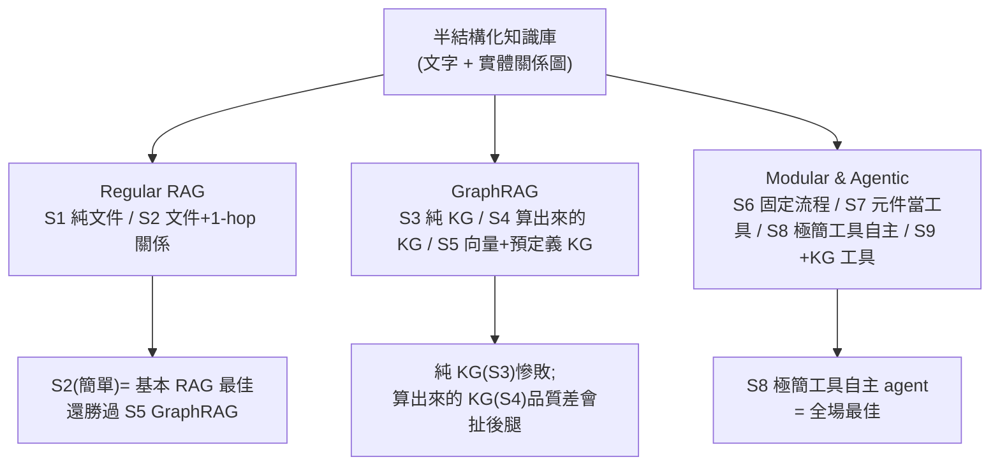
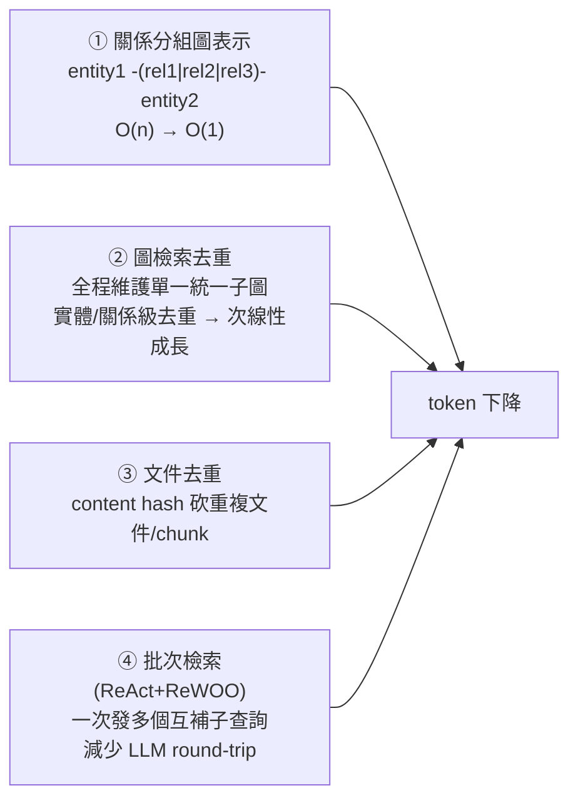

# 到底需不需要 GraphRAG?9 種 RAG 方案實測對照 + 脈絡優化省 19–53% token

> 整理自論文〈Is GraphRAG Needed? From Basic RAG to Graph-/Agentic Solutions with Context Optimization〉(Long Chen 等,**AWS Generative AI Innovation Center** + Cisco,2026-06-24,arXiv:2606.25656)。當 GraphRAG、Agentic RAG 這些進階變體紛紛出現,實務最大的問題是:**到底什麼時候該用、怎麼用?值不值得?** 這篇在「半結構化知識庫(文字 + 關係圖)」上,實作 **9 種標準化 RAG 方案**做 head-to-head 比較,並提出一套**脈絡工程(context engineering)** 方法把 token 砍 **19–53%**,還揭露一個對「怎麼評估 RAG」很關鍵的現象:**檢索–生成落差(retrieval-generation gap)**。
>
> 一句話結論先講:**「需不需要 GraphRAG」沒有絕對答案——簡單的 RAG(把 1-hop 關係併進文件)常常就打贏精心設計的 GraphRAG;而「給最少工具、讓 agent 自己想」的自主 Agentic RAG 反而全面最好。**

---

## 一句話總結

- **資料集**:STaRK-Prime(精準醫療,12.9 萬實體、810 萬關係,來自 PrimeKG)。**核心 LLM**:Claude 3.7 Sonnet。
- **關鍵差異**:評估的是**端到端生成品質**——看 LLM 最終「挑出來回答用的實體 ID」對不對(Hit@1/5、R@20、MRR),**而非原始檢索排名**。這個設計直接導出後面的「檢索–生成落差」。

---

## 1. 九種方案(三大類)

### Regular RAG
- **S1**:只索引實體描述文件,向量相似度檢索 → LLM 生成答案 + 實體 ID。最常見、但缺關係脈絡。
- **S2**:每份文件**附上 1-hop 鄰居、按關係類型分組**後再索引。**不做圖搜尋就把關係帶進來**,只是局限 1-hop。

### GraphRAG
- **S3**:**只用預定義知識圖譜**(LLM 抽實體 → k-hop 子圖 → 三元組序列化 → 生成)。完全不用文字描述。
- **S4**:**從文件自動算出 KG**(NER + 關係抽取 + 實體消解)+ 向量檢索混合。
- **S5**:**向量檢索 + 預定義 KG 遍歷**的混合(文件找候選實體 → 對每個實體做 h-hop 子圖 → 文件 + 子圖一起餵 LLM)。

### Modular & Agentic
- **S6**:**固定流程的 Modular RAG**(查詢改寫 → 向量檢索 → 重排 → 生成),確定性 baseline。
- **S7**:把 S6 的模組(查詢改寫器、檢索器、重排器)**變成 agent 的工具**,由 agent 自主決定怎麼用。
- **S8**:**只給一個檢索工具**的自主 agent——改寫/重排/挑實體全靠 agent 在 prompt 指引下**自己內化**。
- **S9**:S8 **再加一個 KG 檢索工具**(同 S3/S5 那個)。

---

## 2. 實測結果:幾個反直覺的發現

| 類別 | 最佳方案 | Hit@1 | MRR | 關鍵發現 |
|---|---|---|---|---|
| Regular | **S2**(文件+1-hop 關係) | **0.6972** | **0.7531** | 基本 RAG 最佳,**還勝過 S5 GraphRAG** |
| GraphRAG | S5(向量+預定義 KG) | 0.6514 | 0.7072 | GraphRAG 內最佳但**仍輸 S2** |
| Modular/Agentic | **S8**(極簡工具自主 agent) | **0.6881** | **0.7549** | **全場最佳** |

- **「簡單把 1-hop 關係併進文件」打贏精緻 GraphRAG(S2 > S5)**:因為 S5 的子圖用**三元組格式**容易很長,LLM 落入「lost in the middle」;S2 把 1-hop 按關係類型分組、更精簡。**精緻 ≠ 更好。**
- **純圖搜尋(S3)慘敗**(Hit@1 0.1376):沒有語意資訊、只靠圖遍歷不行。
- **自動算出來的 KG(S4)會扯後腿**:品質難比預定義 KG,低品質 KG 甚至讓表現**比 S1 還差**。
- **agent 自主性的價值**:S7(元件當工具)> S6(固定流程);而 **S8(只給檢索工具、其餘自己想)全場最佳**——顯示強模型能**內化複雜檢索推理**,不需預先特化的工具。**但 S9 加了 KG 工具或開 thinking 反而沒幫助。**
- **但 agent 會撞上下文牆**:trace 顯示幾次檢索後,**累積的對話歷史反覆觸發 context window overflow**,逼 agent 越搜越窄、最後回不完整 → 這正是下面脈絡優化要解的。

---

## 3. 脈絡優化:省 19–53% token(本文最實用的貢獻)

問題根源有二:① 三元組格式在「兩實體間多個關係」時**重複實體名**;② Strands Agents 這類框架**把整段 session 歷史塞進每次 LLM 呼叫**,多步後重疊子圖、重複文件不斷累積。對策是「三重去重 + 批次檢索」:

1. **關係分組圖表示**:三元組 → `entity1 -(rel1|rel2|rel3)- entity2`,n 個關係的 token 從 O(n) 降到 O(1)。
2. **圖檢索去重**:整個 agent session 維護**單一統一子圖**,新檢索做實體級+關係級去重 → 脈絡**次線性成長**。
3. **文件檢索去重**:用 content hash 在加進記憶前砍掉重複文件/chunk。
4. **批次 agentic 檢索(混合 ReAct + ReWOO)**:不再「一次工具呼叫一個查詢」(ReAct 預設),而是**一次擬多個互補子查詢、批次執行**(演算法 1)→ 減少 LLM 往返次數(每次往返都要重送整段歷史)。

**效果**:S5 省 **53%**(表現相當)、S9 省 **24–42%** 且 Hit@5/R@20 **更好**(優化效益隨檢索複雜度放大);批次檢索達**最高檢索覆蓋率 RoR 94.4%**。**省下的 token 還能再投資去擴大檢索**(更多 paths/子圖)。

---

## 4. 檢索–生成落差:擴大檢索≠答案更好(對評估 RAG 的重要警示)

把省下的 token 拿去擴大檢索後,作者發現**生成品質的提升遠低於預期**。深挖 S5-Opt(500 paths、20 子圖):**檢索覆蓋率 83.5%,但 LLM 實際抽出的只有 47.9%**。為什麼 LLM「看到了卻沒用」?

| 因素 | 證據 |
|---|---|
| **位置注意力衰減** | 被抽出的實體在脈絡中平均出現位置 **10.5%**,被漏掉的在 **36.8%**——靠後就被忽略(「lost in the middle」) |
| **偏好標準實體** | LLM 傾向挑「典型/標準」實體,不做窮舉列舉 |
| **查詢誘導的數量預期** | 查詢字面暗示的數量會**抑制多實體抽取** |

> **關鍵結論**:**以檢索為導向的指標(Hit@k、MRR)會高估「擴大檢索」的好處。** 評估 RAG 應該**分開衡量「檢索覆蓋率」與「生成利用率」**——檢索到不等於用得上。

---

## 應用案例 / 怎麼用這套發現

- **別預設 GraphRAG 一定比較強**:先試「**把 1-hop 關係按類型分組併進文件(S2)**」這種最簡單的關係增強——本文裡它就打贏精緻 GraphRAG,且成本低、無需圖基礎設施。**精緻方案要能贏過你「調好的簡單 baseline」才值得上。**
- **要上 GraphRAG 就用「向量+預定義 KG 混合(S5)」,別用純圖或自動算的 KG**:純圖搜尋(S3)沒語意會慘敗;自動抽出的 KG(S4)品質不穩**反而扯後腿**。預定義、高品質的 KG 才有價值。
- **Agentic RAG 給「最少工具 + 好的系統提示」常勝過堆一堆特化工具**:S8 全場最佳。讓強模型自己內化改寫/重排/挑實體,比硬塞 KG 工具(S9)更好。
- **agent 多步檢索一定要做脈絡優化**:否則 session 歷史累積會撞 context window。照搬本文四招——**關係分組表示、圖去重(單一統一子圖)、文件 content-hash 去重、批次檢索(ReAct+ReWOO 一次發多個子查詢)**——可省 19–53% token 還常常更準。
- **改你評估 RAG 的方式**:不要只看 Hit@k/MRR 這種**檢索排名**指標(會高估進階檢索);要**端到端看 LLM 最終用了哪些實體**,並**分開報「檢索覆蓋率 vs 生成利用率」**。
- **對抗「lost in the middle」**:把最關鍵的證據放在脈絡**前面**;用 prompt 鼓勵窮舉抽取、別讓查詢字面暗示壓低數量。控制脈絡長度比一味擴大檢索更重要。

> 延伸對照:本庫 [[codebase-memory-treesitter-knowledge-graph-mcp]](結構檢索 = 圖,與語意檢索互補)、[[vectorless-rag-structure-navigation]](靠結構導航而非相似度)、[[grep-vs-vector-agentic-search]](檢索方式沒有單一最優)、[[simplerag-pdf-rag]](本地 RAG 實作)、[[llm-wiki-karpathy]](先導航再鑽入)。本文補上一個冷靜的實證視角:**進階檢索架構未必划算,且要小心檢索指標的虛胖。**

---

## 來源

- Long Chen, Ryan Razkenari, Yuxuan Zhou, Yuan Tian, Rahul Ghosh, Venkatesh Pappakrishnan, Disha Ahuja, Vidya Sagar Ravipati,〈Is GraphRAG Needed? From Basic RAG to Graph-/Agentic Solutions with Context Optimization〉,arXiv:2606.25656(2026-06-24,AWS GenAI Innovation Center + Cisco):<https://arxiv.org/abs/2606.25656>
- 資料集 STaRK-Prime(Wu et al. 2024,基於 PrimeKG);實作技術:Amazon Bedrock Knowledge Bases、Neptune Analytics、Titan Text Embedding v2、OpenSearch Serverless、LlamaIndex、Strands Agents(ReAct);評估用 Claude 3.7 Sonnet;方法參考 ReAct(Yao 2023)與 ReWOO(Xu 2025)。本文依論文全文(§3 方法、§5 結果、附錄 case study)整理。
