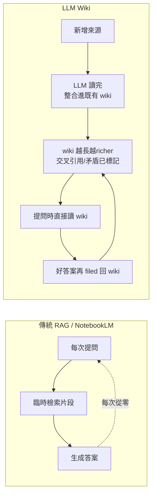
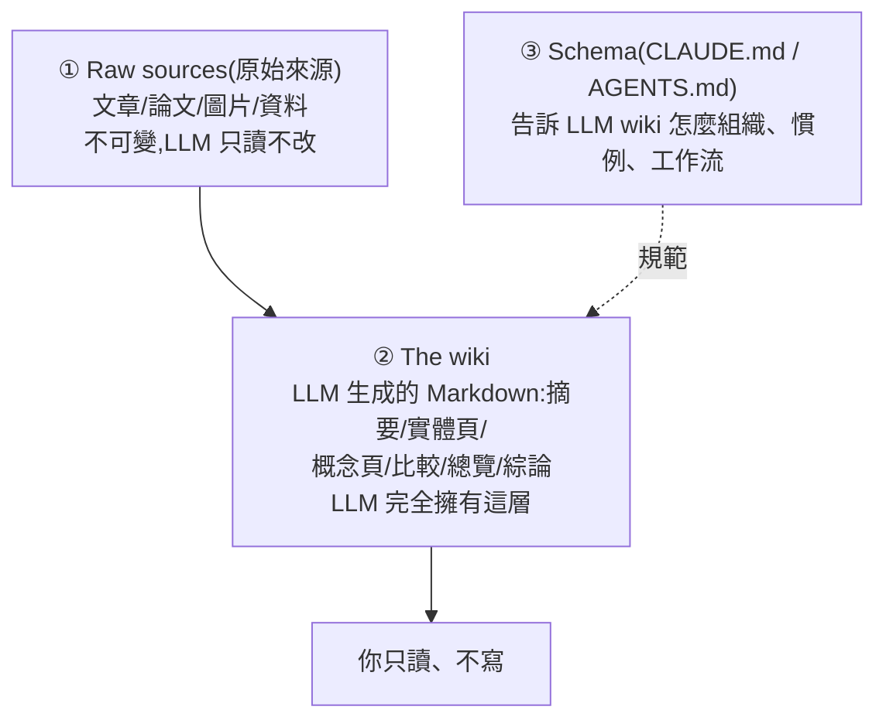

# LLM Wiki(Karpathy):讓 LLM 增量維護一座「會複利的」個人知識庫

> 整理自 Andrej Karpathy 的 idea 文件 [llm-wiki.md](https://gist.github.com/karpathy/442a6bf555914893e9891c11519de94f)。這份文件**刻意只講概念、不給實作**——它的設計用途是「**複製貼上給你自己的 LLM Agent(Claude Code / Codex / Pi…),讓 agent 跟你一起把細節長出來**」。核心主張一句話:**別再只用 RAG 在查詢時臨時拼湊答案,而是讓 LLM 增量建立並持續維護一座結構化、互相連結的 Markdown wiki,知識「編譯一次、之後保持更新」,而不是每次提問都從零重新推導。**
>
> 💡 **這份筆記本身就是一個現場示範**:你正在讀的這個 Knowledge 倉庫(三層分類、`[[檔名]]` 互連、README 索引、cron 自動 ingest)**就是 Karpathy 這個模式的一個實例**。下面會回頭點明對應關係。

---

## 一句話總結

- **RAG 的問題不是不能用,而是「沒有累積」**:每個問題都讓 LLM 重新發現知識。問一個需要綜合五份文件的微妙問題,它每次都得重新把碎片找出來拼一遍,**什麼都沒被建立起來**。
- **LLM Wiki 的差別**:wiki 是一個**持續存在、會複利的成品(persistent, compounding artifact)**。交叉引用已經在那、矛盾已經被標記、綜論已經反映你讀過的一切。**每加一個來源、每問一個問題,wiki 都更豐富。**

> 一個精準的比喻(Karpathy 原文):**Obsidian 是 IDE,LLM 是程式設計師,wiki 是 codebase。** 你幾乎從不親手寫 wiki——LLM 包辦所有的摘要、交叉引用、歸檔、簿記;你負責**找來源、探索、問對問題**。

---

## 三層架構

1. **Raw sources(原始來源)**:你精選的來源文件,**不可變**——LLM 只讀、永不修改,這是你的 single source of truth。
2. **The wiki**:一個放 LLM 生成 Markdown 的資料夾(摘要、實體頁、概念頁、比較、總覽、綜論)。**LLM 完全擁有這層**:建頁、新來源到時更新、維護交叉引用、保持一致。你讀它,LLM 寫它。
3. **The schema**:一份文件(Claude Code 的 `CLAUDE.md`、Codex 的 `AGENTS.md`),告訴 LLM **wiki 怎麼組織、有哪些慣例、ingest/查詢/維護時該走什麼工作流**。**這是讓 LLM 從「通用聊天機器人」變成「有紀律的 wiki 維護者」的關鍵設定檔**,你和 LLM 隨時間一起把它演化得更貼合你的領域。

---

## 三個核心操作

| 操作 | 在做什麼 | 細節 |
|---|---|---|
| **Ingest(攝入)** | 丟一個新來源進來,叫 LLM 處理 | LLM 讀來源 → 和你討論重點 → 寫一頁摘要 → 更新索引 → 更新整個 wiki 裡相關的實體頁/概念頁 → 在 log 追加一筆。**單一來源可能動到 10–15 頁**。可以一次一篇深度參與,也可以批次低監督攝入 |
| **Query(查詢)** | 對著 wiki 問問題 | LLM 找相關頁、讀、附引用綜合出答案。答案可以是 Markdown 頁、比較表、Marp 投影片、matplotlib 圖、canvas。**關鍵洞見:好答案要 filed 回 wiki 成為新頁**,別讓它消失在聊天紀錄裡——這樣你的探索也跟攝入的來源一樣會複利 |
| **Lint(健檢)** | 定期叫 LLM 體檢 wiki | 找:頁間矛盾、被新來源推翻的過時論點、沒有入站連結的孤兒頁、被提到卻沒有自己頁面的重要概念、缺失的交叉引用、可用網搜補上的資料缺口。LLM 也擅長建議「下一步該調查什麼、該找什麼新來源」 |

---

## 兩個導航檔案:index.md 與 log.md

wiki 長大後,兩個特殊檔案幫 LLM(和你)導航,目的不同:

- **`index.md`(內容導向)**:整個 wiki 的**目錄**——每頁一個連結 + 一行摘要 +(可選)日期/來源數等 metadata,按類別組織(實體/概念/來源…)。每次 ingest 都更新。**查詢時 LLM 先讀 index 找到相關頁,再鑽進去**。Karpathy 強調這招在中等規模(~100 來源、數百頁)**出奇地有效,而且免掉了 embedding-based RAG 那套基礎設施**。
- **`log.md`(時間導向)**:**只追加(append-only)** 的流水帳——什麼時候 ingest 了什麼、查了什麼、做了哪次 lint。小技巧:每筆用一致前綴開頭(如 `## [2026-04-02] ingest | 文章標題`),log 就能用 unix 工具解析:`grep "^## \[" log.md | tail -5` 拿最近 5 筆。給你一條 wiki 演化時間軸,也幫 LLM 理解最近做了什麼。

---

## 可選:CLI 搜尋工具

wiki 再長大,index 檔不夠時就想要**正經的搜尋**。Karpathy 推薦 [**qmd**](https://github.com/tobi/qmd)(Tobi Lütke 的專案):**本地的 Markdown 搜尋引擎,混合 BM25 + 向量搜尋 + LLM re-ranking,全部 on-device**;同時提供 **CLI**(LLM 可以 shell out 呼叫)和 **MCP server**(LLM 當原生工具用)。也可以自己 vibe-code 一個簡單搜尋腳本。

> 這呼應了本庫 [[grep-vs-vector-agentic-search]] 的發現:**在 agentic 場景,inline grep 常常打贏向量檢索**;以及 [[vectorless-rag-structure-navigation]]:**靠結構導航(在階層樹上推理)而非相似度**。LLM Wiki 的 `index.md` 先導航再鑽入,正是「結構導航」的樸素版。

---

## 為什麼這招行得通

> **維護知識庫最累的不是讀、也不是想,而是簿記(bookkeeping)。** 更新交叉引用、保持摘要最新、標記新資料與舊論點的矛盾、維持數十頁的一致性。**人類會放棄 wiki,是因為維護負擔成長得比價值更快。**

而 **LLM 不會無聊、不會忘記更新某個交叉引用、能一次動 15 個檔案**。wiki 之所以能保持被維護,是因為**維護成本趨近於零**。

- **人的工作**:精選來源、引導分析、問好問題、思考這一切意味著什麼。
- **LLM 的工作**:其他全部。

Karpathy 把這個想法上溯到 **Vannevar Bush 1945 年的 Memex** 願景——私人的、主動策展的知識庫,文件之間的**關聯軌跡(associative trails)和文件本身一樣有價值**。Bush 解不掉的那塊,是「**誰來做維護**」。**LLM 把這塊解了。**

---

## 應用案例 / 怎麼用這套思路

Karpathy 列的幾個情境,加上**對應到本 Knowledge 倉庫的現場示範**:

- **個人**:追蹤目標/健康/心理/自我成長——歸檔日記、文章、podcast 筆記,長出一張關於自己的結構化圖像。
- **研究**:幾週幾個月深挖一個主題,讀論文/報告,增量建一座有「演化中論點(evolving thesis)」的 wiki。
- **讀一本書**:邊讀邊把每章歸檔,長出角色/主題/情節線的頁面與彼此連結——像 Tolkien Gateway 那種 fan wiki,但個人版、LLM 包辦交叉引用。
- **企業/團隊**:LLM 維護的內部 wiki,餵 Slack 討論串、會議逐字稿、專案文件、客戶通話,humans-in-the-loop 審核;wiki 保持最新,因為 LLM 做了沒人想做的維護。
- **競品分析、盡職調查、行程規劃、課程筆記、興趣深挖**——任何「隨時間累積知識、想要有組織而非散落」的場景。

**↪ 本倉庫就是一個實例,對照 Karpathy 的三層:**

| Karpathy 的概念 | 本 Knowledge 倉庫的對應 |
|---|---|
| **Raw sources** | YouTube 影片 / 文章 / GitHub repo(clone 來讀的原始碼) |
| **The wiki** | `technology/` `investing/` 下的繁中 Markdown 筆記,`[[檔名slug]]` 互連 |
| **The schema** | `CLAUDE.md`(寫作規範、三層分類、commit 慣例、Whisper 流程) |
| **index.md** | `README.md`(依主題 + 依來源/作者雙重索引、筆記數 badge) |
| **Ingest** | 「把這支影片整理成筆記」→ 轉錄 → 寫筆記 → 更新 README → commit |
| **Query → filed back** | 像本篇這種「整理某專案」的請求,答案直接落地成新頁複利 |
| **git 版本史** | 兩個倉庫都是 git repo,白拿版本史/分支/協作 |
| **cron 自動化** | GitHub Weekly / 頻道訂閱 cron = 自動化的週期性 ingest |

**所以這份筆記的最佳用法**:把這套詞彙(ingest / query / lint / schema / index / log / 好答案 filed back)拿來**反思並升級你自己的知識流程**——例如「我有沒有定期 **lint**?有沒有孤兒頁?探索出來的好答案有沒有 **filed back**,還是爛在對話裡?」

---

## 重要提醒:這是「模式」不是「實作」

Karpathy 在結尾特別說明:**這份文件刻意抽象**,只描述 idea,不是具體實作。確切的目錄結構、schema 慣例、頁面格式、工具——全看你的領域、偏好、選的 LLM。**全部都是可選且模組化的**:來源若是純文字就不需要圖片處理;wiki 夠小就只用 index 不需搜尋引擎;不在乎投影片就只要 Markdown。**正確用法是把它分享給你的 LLM agent,一起實例化出貼合你需求的版本。** 文件唯一的工作是傳達模式,其餘交給 LLM。

> 延伸對照本庫:[[markdown-agent-memory]](有時候 Markdown 檔案就夠了——MEMORY.md + 日誌 + 漸進披露,和本文的 index/log 幾乎同構)、[[grep-vs-vector-agentic-search]](grep 常勝向量)、[[vectorless-rag-structure-navigation]](結構導航勝相似度)、[[simplerag-pdf-rag]](需要正經 RAG 時的本地方案)。

---

## 來源

- Andrej Karpathy,〈LLM Wiki〉(idea 文件,gist):<https://gist.github.com/karpathy/442a6bf555914893e9891c11519de94f>(本文依 `llm-wiki.md` 全文整理,clone 後已刪除暫存)
- 文中提及工具:[qmd](https://github.com/tobi/qmd)(本地 Markdown 混合搜尋 + MCP)、Obsidian(Web Clipper / 圖視圖 / Marp / Dataview)、Vannevar Bush《As We May Think》(1945,Memex)。
