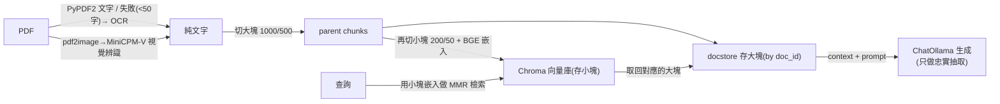

# SimpleRAG:給科學 PDF 的本地 RAG(OCR + 小-大多向量檢索 + Ollama)

**主題分類:** AI / 代理工程 — 記憶與檢索(RAG 實作)
**研究對象:** [BAMeScience/SimpleRAG](https://github.com/BAMeScience/SimpleRAG)(德國聯邦材料研究院 BAM)
**內容性質:** 已 `git clone` 讀完整原始碼(`Ragger.py` / `miniCPM.py` / `main.py`)後整理
**整理日期:** 2026-05-30

---

## 1. 它是什麼

一個 **小而務實的本地 RAG 框架**(整個專案約 330 行),專門從 **PDF / 文件** 抽取與檢索資訊——特別針對 **影像式/掃描、含表格的科學文件**(範例是 NIST 標準參考物質的分析證書)。整條管線都可在本地跑:**MiniCPM 視覺模型做 OCR + LangChain + 本地 Ollama 生成 + HuggingFace BGE 嵌入**。



---

## 2. 兩個檔案、兩段管線

### `miniCPM.py` — PDF → 文字(`Extract`)
- **`method='text'`:** 用 `PyPDF2` 直接抽文字(逐頁,加「new page」分隔)。
- **`method='ocr'`:** 用 **MiniCPM-Llama3-V-2.5**(HuggingFace 視覺模型)把每頁 `pdf2image` 轉成圖(**dpi=800**)後辨識,prompt 就是「Write down everything in the image as text.」(註解裡還有「把表格連單位一起寫下來」的版本)。
- **聰明的 fallback(在 `main.py`):** 先試 `text`;若抽出來 **少於 50 字**(代表是掃描/圖片型 PDF),自動改用 `ocr`。這對科學界大量「掃描的證書/報告」很實用。

### `Ragger.py` — 檢索與生成(`RAGRetriever`)
- **嵌入:** `HuggingFaceBgeEmbeddings`,模型 `BAAI/bge-large-en-v1.5`、normalize=True(可指定 `embed_device`)。
- **生成:** `ChatOllama`(本地 LLM,如 `llama3.2:3b` / `llama3:70b`),`temperature=0`(要忠實、不要發揮)。

---

## 3. 核心技巧:小-大(parent-child)多向量檢索

`createVecStore_multiVec` + `mRetriever` 是主路徑,實作了 RAG 常見的 **「small-to-big」** 模式:

```python
# 大塊(parent):1000 字、重疊 500 → 保留足夠上下文
docs = self.get_chunks(chunk_size, chunk_overlap)
retriever = MultiVectorRetriever(
    vectorstore=Chroma(...embedding_function...),  # 存「小塊」的向量
    byte_store=InMemoryByteStore(),                # 存「大塊」原文
    id_key="doc_id", search_kwargs={"k": 4}, search_type='mmr')

child = RecursiveCharacterTextSplitter(chunk_size=200, chunk_overlap=50)  # 小塊
for i, doc in enumerate(docs):
    _id = doc_ids[i]
    for _doc in child.split_documents([doc]):
        _doc.metadata["doc_id"] = _id          # 小塊指回它的大塊
        sub_docs.append(_doc)
retriever.vectorstore.add_documents(sub_docs)  # 嵌入&檢索用「小塊」(精準)
retriever.docstore.mset(zip(doc_ids, docs))    # 回傳「大塊」(上下文完整)
```

> **為什麼這樣設計:** 用 **小塊(200 字)嵌入做相似度搜尋** → 命中更精準(避免大塊語意被稀釋);但回傳 **對應的大塊(1000 字)** 給 LLM → 上下文更完整。搭配 **MMR**(最大邊際相關,降低重複)、`k=4`。這正是 [[grep-vs-vector-agentic-search]] 與 [[markdown-agent-memory]] 討論的「檢索精準度 vs 上下文完整」取捨的一種經典解法。

**抽取導向的 prompt(`mRetriever`):**
```
Answer the question based only on the following context, which can include text and tables.
... You are only a retriever and you should only output the text as requested (copy paste).
If the answer not found only write 'not found'.
```
外加可選 `hint`(只進生成、不進檢索),例如 `output the values as json`。**刻意把 LLM 當「忠實抄寫的檢索器」而非創作者**——適合抽「證書上的認證數值」這種不容杜撰的場景。

**其他可選件:** `createVecStore`+`retrieve`(更簡單的純 Chroma,k=2,用 hub 的 `rlm/rag-prompt`)、`semantic_split`(`SemanticChunker` 語意切塊)、`get_chunksLLM`(實驗性:叫 LLM 自己插「chunk_here」分隔)。程式也 import 了 `FAISS` 作為替代向量庫。

---

## 4. 應用案例

**情境:從 NIST/BAM 的標準參考物質(CRM)分析證書抽「認證數值」**(repo 內建範例 `NIST 1849b`)。這類證書常是 **掃描 PDF + 大量表格**,純文字抽取會失敗。

```python
# 1) 抽文字:text 失敗(掃描件)→ 自動 OCR(MiniCPM 視覺)
extractor = Extract(pdf_path, method='text')
docTXT = extractor.getText()
if len(docTXT) < 50:
    docTXT = Extract(pdf_path, device='cuda:2', method='ocr').getTextFromImg()

# 2) 建小-大多向量庫並檢索
CH = RAGRetriever(file_path, GeneratorModel='llama3.2:3b', temp=0)
CH.createVecStore_multiVec(chunk_size=1000, chunk_overlap=500)
answer = CH.mRetriever(Q='what are the certified values',
                       hint='output the values as json')   # 強制 JSON 格式
```
→ 輸出證書上的認證數值(JSON);查不到就回 `not found`,**不會幻覺出數字**。

**可遷移到:** 法規/合約條款查詢、論文數據抽取、財報/發票表格擷取、任何「文件問答且答案必須忠於原文」的場景。

---

## 5. 評析(讀碼後)

**優點**
- **全本地、可離線**(Ollama + 本地嵌入 + 本地 OCR),適合 **敏感/受規範資料**(政府研究機構的典型需求)。
- **OCR fallback** 直接解決科學界「掃描 PDF」痛點;dpi=800 + 視覺模型對表格友善。
- **小-大多向量** 是務實且有效的精準度/上下文平衡;**抽取導向 prompt + not found** 降低幻覺。

**限制 / 注意**
- 程式偏 **研究腳本**(寫死的 `cuda:1/2`、註解掉的實驗碼、`get_chunks_2` 對 `self.text` 用錯型別等小瑕疵);要當函式庫用需要整理。
- 主路徑用 **InMemory** docstore/bytestore → 重啟即失,未持久化(`createVecStore_multiVec` 沒落地)。
- OCR 走逐頁 LLM 推理,**大文件慢且吃 GPU**。
- 嵌入模型是英文 BGE,非英文文件要換模型。

> 一句話:**SimpleRAG = 給科學 PDF 的「本地、抗掃描、忠實抽取」RAG 範本**——程式不大但把 OCR fallback、小-大多向量、抽取導向 prompt 這幾個關鍵實務點都示範到了,很適合拿來當自建 RAG 的起手樣板。

---

## 來源

- [BAMeScience/SimpleRAG (GitHub)](https://github.com/BAMeScience/SimpleRAG)
- 模型:[MiniCPM-Llama3-V-2.5](https://huggingface.co/openbmb/MiniCPM-Llama3-V-2_5)、嵌入 BAAI/bge-large-en-v1.5、生成 [Ollama](https://ollama.com)、框架 [LangChain](https://www.langchain.com)
