# Vectorless RAG:不靠相似度,靠「結構導航」找對地方

> 傳統 RAG **靠相似度搜尋**(把文件切塊→嵌入→向量庫→相似度比對→取 Top-K);
> **Vectorless RAG 靠結構導航**——不做 embedding,而是讓 **LLM 在文件的「階層樹(目錄)」上推理**,像人翻目錄一樣找到答案在哪一節。
> 一句話對照(資訊圖原文):**「Vector RAG finds similar text. Vectorless RAG finds the right place.」**
>
> 起點是 Brij Kishore Pandey 的「Vectorless RAG Explained」資訊圖;本筆記把它的內容重整,並補上查證後的代表實作 **PageIndex** 與基準數據。
> (因尊重原圖著作權,未轉存原圖點陣檔,改以本人重畫的表/圖呈現並註明出處。)

---

## 核心命題:相似 ≠ 相關(similarity ≠ relevance)

向量 RAG 用**統計相似度**檢索;但對專業文件(財報、法律、法規)而言,**「相關」需要的是推理 + 理解文件怎麼組織**,而不只是「文字看起來像」。
而且**切塊(chunking)會破壞文件結構**——把報告切碎後就失去了讓它「可導航」的階層組織。Vectorless RAG 的賭注是:**把結構保留下來,讓 LLM 在結構上推理**。

---

## 兩條管線對照(重畫自原圖)

```mermaid
flowchart TB
    subgraph V["傳統 RAG(向量 / 相似度)"]
        VA["Document"] --> VB["Chunking 切塊"] --> VC["Embeddings 嵌入"] --> VD["Vector DB 向量庫"] --> VE["Similarity Search 相似度搜尋"] --> VF["Top-K Chunks"] --> VG["LLM Output"]
    end
    subgraph N["Vectorless RAG(結構 / 導航)"]
        NA["Document"] --> NB["Structured Index 結構化索引<br/>(階層樹 / 智慧目錄)"] --> NC["Query Routing 查詢路由"] --> ND["Hierarchical Navigation 階層導航"] --> NE["Precise Section Retrieval 精準取出該節"] --> NG["LLM Output"]
    end
    style N fill:#e2f5e2
    style V fill:#1e2a3a,color:#cde
```

| 面向 | 向量 RAG | Vectorless RAG |
|---|---|---|
| **檢索邏輯** | 語意相似(semantic similarity) | **結構導航**(structural navigation) |
| **資料準備** | chunk + embed | **建索引結構**(階層樹) |
| **最適合** | 非結構化、跨多文件搜尋 | **長篇、結構化的文件** |
| **風險** | 撈到不相關的片段 | **取決於結構品質**(結構抽不好就爛) |

---

## 代表實作:PageIndex(VectifyAI,開源)

Vectorless / reasoning-based RAG 的旗艦框架。**完全不用 embedding、不用向量庫**,改用「文件階層樹 + LLM 推理導航」。

### 兩個階段

1. **Ingestion(建索引,無 embedding)**:把文件丟給 LLM,請它**分析結構、生成一棵階層樹**——本質是一份「**智慧、語意豐富的目錄(Table of Contents)**」,**每個節點 = 文件的一個自然章節**。
2. **Retrieval(檢索,靠推理)**:把這棵樹的目錄**放進 LLM 的 context**,請它**挑出對這個問題最相關的節點** → 取出那些節點的**全文** → 生成答案。
   - 關鍵:LLM 像人一樣推理「**答案會在哪裡**」——例如「債務趨勢通常在財務摘要那節或附錄 G,去那裡找」——而不是只靠預先算好的相似度分數;**它能動態決定下一步看哪裡**。

### 基準
- **FinanceBench(複雜財報)**:向量 RAG 約 **50%**,PageIndex 的樹狀導航達 **98.7%**。
- 適用領域:財報、法律文件、法規申報等**長篇專業文件**——「相似不夠,相關需要推理」。

---

## 和本庫其他「結構化檢索」的關係

Vectorless RAG 是「**用結構/索引取代吞整包或盲比相似度**」這條主線在「**文件**」上的版本,和本庫幾篇同源:

- [[grep-vs-vector-agentic-search]]:agent 檢索「結構化訊號 vs 壓縮表示」的辯論——Vectorless 屬「結構化」那側。
- [[codegraph-code-and-tui]] / [[understand-anything-vs-graphify]] / [[tree-sitter]]:在**程式碼**上做同樣的事(把 codebase 變成可查的結構/圖譜),Vectorless 是在**散文文件**上做。
- [[context-engineering-processing-vs-thinking]]:「先建索引、查圖定位再讀局部」省 token 的同一理念。

---

## 何時用哪個(務實取捨)

- **用 Vectorless / PageIndex**:單一或少數**長篇、結構清楚**的文件(財報、合約、法規、技術手冊),需要**精準定位到某一節**且重視可解釋(「為什麼看這節」)。
- **用向量 RAG**:**大量非結構化、跨多文件**的語意搜尋(知識庫、客服 FAQ、海量網頁),文件本身沒有清楚階層可導航。
- **兩者可混用**:先用結構導航縮到「對的章節」,再在節內用相似度細找;或對「有結構的長文件」走 Vectorless、對「碎片化短文」走向量。
- **Vectorless 的最大風險**:**取決於結構抽取品質**——文件沒有清楚標題/章節、或 LLM 把樹建歪,導航就會失準(對照原圖「Risk: depends on structure quality」)。

---

## 應用案例

- **問財報裡的細節**(如「某季自由現金流」):向量 RAG 常撈到相似但不對的段落(~50%);Vectorless 讓 LLM 推理「這在財務摘要/附錄」直接導到該節,準確率高很多。
- **法律/法規長文件問答**:需要「定位到正確條款」而非「找相似句子」——結構導航天生適合,且可交代「依目錄走到哪一條」。
- **你已經有 Tree-sitter/CodeGraph 在 codebase 上做結構檢索**:把同樣思路搬到 PDF/報告——先讓 LLM 建「智慧目錄樹」,再導航取節,省 embedding 基礎設施。
- **省基礎設施**:不想維護向量庫/嵌入管線時,Vectorless 只需 LLM + 文件樹,部署更輕(代價是每次檢索要花 LLM 推理 token)。

---

## 一句話總結

> **向量 RAG 找「相似的文字」,Vectorless RAG 找「對的位置」。**
> 它不做 embedding,而是讓 LLM 在文件的**階層樹(智慧目錄)**上推理導航——像人翻目錄找答案;
> 因為**相似 ≠ 相關、切塊會毀掉結構**。代表作 PageIndex 在 FinanceBench 從向量 RAG 的 ~50% 拉到 **98.7%**。
> 最適合**長篇、結構化的專業文件**,最大罩門是**結構抽取的品質**;和「在程式碼上做結構化檢索」(Tree-sitter/CodeGraph)是同一條路線的文件版。

---

## 來源

- 起點圖:Brij Kishore Pandey「Vectorless RAG Explained」資訊圖(本筆記重整其內容,未轉存原圖)。
- [PageIndex(VectifyAI,GitHub)](https://github.com/VectifyAI/PageIndex) — 開源 vectorless、reasoning-based RAG。
- [Vectorless RAG: How PageIndex Works(buildfastwithai)](https://www.buildfastwithai.com/blogs/vectorless-rag-pageindex-guide)、[PageIndex 介紹](https://pageindex.ai/blog/pageindex-intro)、[Microsoft Community Hub:Vectorless Reasoning-Based RAG](https://techcommunity.microsoft.com/blog/azuredevcommunityblog/vectorless-reasoning-based-rag-a-new-approach-to-retrieval-augmented-generation/4502238)、[PageIndex Deep Dive(sjramblings)](https://sjramblings.io/pageindex-deep-dive-vectorless-rag/)。
- 延伸:本庫 [[grep-vs-vector-agentic-search]]、[[codegraph-code-and-tui]]、[[understand-anything-vs-graphify]]、[[tree-sitter]]、[[context-engineering-processing-vs-thinking]]。
