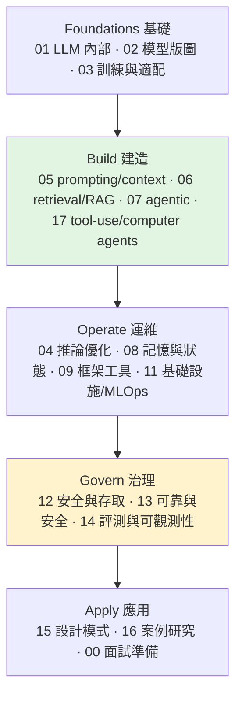

# AI System Design Guide(ombharatiya):生產級 AI 系統設計與面試的活字典

> 一份**持續更新**的開源指南(MIT 授權),把「設計生產級 AI 系統」需要的東西整理成 **18 個編號章節 + 案例研究 + 面試題庫 + Eval 深入指南**。
> 定位:**「會過時的紙本書」的反面**——新模型一發布、模式一演化就更新。涵蓋 RAG 架構、LLM 工程、agentic AI、MCP/A2A 協定、評測,以及 staff 級 AI 工程面試準備。
>
> 這是一篇**資源導覽**(reference),幫你知道「想學/想查 X 時,去翻哪一章」。原始 repo:[ombharatiya/ai-system-design-guide](https://github.com/ombharatiya/ai-system-design-guide)。

---

## 它是什麼 / 不是什麼

| 它**是** | 它**不是** |
|---|---|
| staff 級的「設計生產 AI 系統」參考(RAG、agents、MCP、eval pipeline、多租戶隔離) | Python / PyTorch / 基礎 ML 教學(那去上課) |
| 面試準備夥伴:110+ 真實題 + 答題框架 + 白板練習(更新到 2026-05) | vendor 中立的打高空——它**指名**具體模型/價格/框架,因為真系統要做真選擇 |
| 活文件:追蹤新模型發布、協定變更、新興模式 | 動手做的替代品(要邊讀邊做專案) |
| 對取捨**有立場**:延遲 vs 成本、準確 vs 忠實、單 agent vs 多 agent | 論文摘要集(只在「改變實務」時才引論文) |

---

## 18 章結構(依 AI 系統生命週期)

各章重點(對照本庫已有筆記):
- **01 Foundations**:transformer、attention、embeddings、推論管線。(對照本庫 [[deepseek-v4-engineering]]、[[kv-cache]])
- **02 Model Landscape**:Claude Opus 4.7、GPT-5.5、Gemini 3.1、DeepSeek V4、Llama 4、Kimi K2.6、Qwen 3.6… + **定價**(附 2026-05 驗證日期)+ 選型指南。
- **03 訓練/適配**:fine-tuning、LoRA、DPO、distillation。
- **04 推論優化**:KV cache、PagedAttention、vLLM。
- **05 Prompting/Context**:prompt engineering、CoT、Extended Thinking、DSPy、prompt injection。(對照 [[context-engineering-processing-vs-thinking]]、[[grpo-vs-gepa]])
- **06 Retrieval/RAG**:chunking、向量庫、reranking、GraphRAG、**Agentic RAG**、ColBERT、Contextual Retrieval、production RAG。(對照 [[grep-vs-vector-agentic-search]])
- **07 Agentic Systems**:**MCP 2.0、A2A 協定**、multi-agent、computer-use。(對照 [[function-calling-mcp-a2a]]、[[task-decomposition-agentic-workflow]]、[[harness-engineering-evolution]])
- **08 記憶與狀態**:L1–L3 記憶分層、Mem0、快取。
- **09 框架工具**:LangGraph、DSPy、LlamaIndex、Claude Code、OpenCoder。
- **10 文件處理**、**11 基礎設施/MLOps**、**12 安全/多租戶隔離(RBAC/ABAC)**、**13 可靠/安全(guardrails、red-teaming)**、**14 評測/可觀測(RAGAS、LangSmith、drift)**、**15 設計模式 + 反模式**、**17 tool-use/computer agents(OpenClaw、Computer Use、安全治理)**。

---

## 三個最值得挖的部分

1. **面試題庫(00-interview-prep)**:**110 題** staff 級真實題(到 2026-05)+ 答題框架 + 白板練習 + 2026 就業市場趨勢 + 角色轉職指南(後端/QA/PM/EM → AI)。題目像「設計一個競爭對手看不到彼此資料的多租戶 RAG」「agent 把 3 步任務做成 15 步,怎麼 debug」。
2. **案例研究(16-case-studies)**:**20 個**附圖的真實架構與取捨,例如——多租戶 SaaS(可口可樂與百事同基礎設施的縱深隔離)、自主 coding agent(沙箱+自我修正)、computer-use agent(Firecracker VM + action gate + 間接 prompt injection 防禦)、客戶蒸餾管線(把 $50K/月前沿花費砍到 $6K)、eval-gated CI/CD(用 golden set + LLM judge 擋住會回退品質的 PR)。
3. **Eval 深入指南(兩份各 3000+ 行)**:AI 評測 end-to-end(Phoenix+Langfuse / LangWatch+Langfuse)——LLM-as-a-Judge、RAG eval(faithfulness/context recall/answer relevance)、多輪評測、統計校正(`judgy`)、30 天學習路徑。

---

## 怎麼用(應用案例)

- **準備 AI 工程/系統設計面試:** 從 `00-interview-prep` 題庫 → 答題框架 → 白板練習;弱項對照 `16-case-studies` 補。
- **要落地一個 production RAG:** 走 RAG Fundamentals → chunking → 向量庫 → reranking → production RAG → 進階(Contextual Retrieval / ColBERT / 多模態 / Agentic RAG)。
- **要建 agent:** Agent Fundamentals → MCP & A2A → LangGraph,再看 computer-use 與安全治理章。
- **2026 選模型:** Model Taxonomy + Pricing(指南直接給 head-to-head:Opus 4.7 長 context/工具、GPT-5.5 通用、Gemini 3.1 多模態、**DeepSeek V4 便宜前沿級**、Llama 4 自架)。
- **當「活字典」常駐查閱:** GLOSSARY 查名詞、FAQ 查常見問題、COURSES 找課程;star + watch 追更新。

---

## 一句話總結

> 這份指南把「設計生產 AI 系統」拆成 **基礎 → 建造 → 運維 → 治理 → 應用** 五階段、18 章,
> 配上 110 題面試庫、20 個附圖案例、兩份 Eval 深入指南,且**持續追新模型與協定**——
> 是把本庫散落的 agent/RAG/eval/MCP 知識**串成一張完整系統設計地圖**的好對照;
> 適合「要面試、要落地、或想有張全景圖」時拿來按圖索驥。

---

## 來源

- GitHub:[ombharatiya/ai-system-design-guide](https://github.com/ombharatiya/ai-system-design-guide)(MIT,持續更新)。
- 延伸(本庫對應主題):[[function-calling-mcp-a2a]]、[[grep-vs-vector-agentic-search]]、[[task-decomposition-agentic-workflow]]、[[harness-engineering-evolution]]、[[deepseek-v4-engineering]]、[[kv-cache]]。
