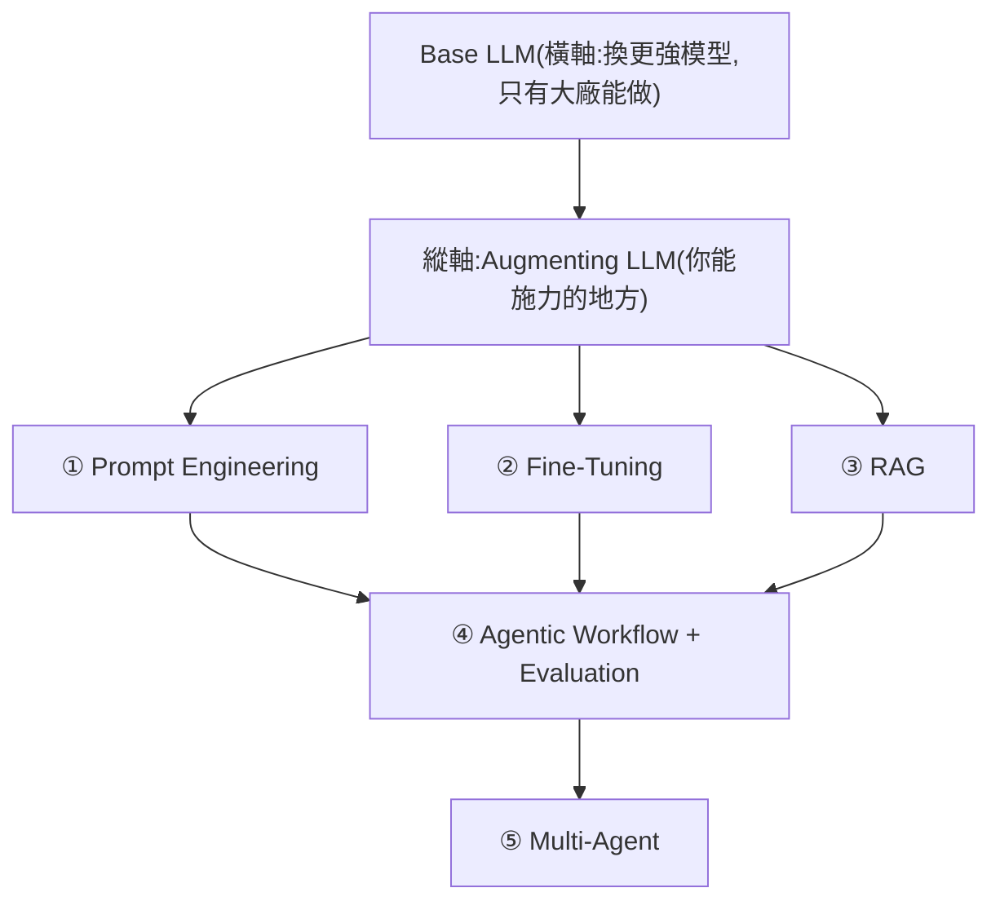

# 一支影片看完 Stanford「Beyond LLM」:從 LLM 到 Multi-Agent 的技術地圖

**主題分類:** AI / 代理工程 — 學習資源
**來源:** YouTube〈一部影片看完 Stanford AI 系統課程,從 LLM 到 Agentic Workflow〉(Gary Chen,2026-05-04,約 27 分;整理 Stanford 兩小時「Beyond LLM」課程,依繁中逐字稿)
**整理日期:** 2026-05-30

---

## 0. 這張地圖在解什麼

想當 AI Builder 但資源太破碎/太艱澀。這支把 Stanford「Beyond LLM」濃縮成一張 **完整技術地圖**:每個技術解什麼痛點、何時該用、怎麼組合。

> **核心心法:** 你沒錢訓練 base model(橫軸),能施力的是 **縱軸**——在現有 LLM 上疊工程技術。

---

## 1. Base LLM 的四個限制

1. **缺 domain knowledge**(你公司的內部文件/產品規格它不知道)。
2. **資訊落後**(不可能每幾個月重訓)。
3. **控制難**(機率性輸出,同 prompt 兩次可能不同——production 退費一下說可以一下說不行就完了)。
4. **長 context 退步**(百萬 token 仍有 lost in the middle)。

---

## 2. 三個強化單一 LLM 的工具

### ① Prompt Engineering(成本最低,人人該會)
- 好 prompt 三要素:**給誰看、產出格式、重點是什麼**。
- **最重要的技巧是 Prompt Chaining**(≠ Chain of Thought):把複雜 prompt 拆成多個獨立 prompt、前一個輸出餵下一個 → 每步可獨立測試/debug,得到 **observability**。
- BCG 實驗三發現:**Jagged Frontier**(AI 不是每個任務都好)、**Falling asleep at the wheel**(在 AI 不擅長處太信任它,比不用更慘)、**Centaurs vs Cyborgs**(委派型 vs 高頻來回型——重複流程用 centaur,需判斷/創意用 cyborg,有意識切換)。

### ② Fine-Tuning(能不做就不做)
四個理由:要大量優質標註資料(貴)、容易 overfit(失去廣度)、**時效性差**(花兩月調完,下月新 base model 直接打贏)、通常 prompt engineering 就能達到且 portable。例外:法律/科學等高精度重複領域。

### ③ RAG(補知識的標準解)
- 流程:文件 → embedding → 向量資料庫;query 同樣 embedding → 距離 metric 找最近文件 → 組進 prompt(prompt 鎖定「documents 裡沒有就說不知道」、可要求附頁碼/連結回溯)。
- 搭配 **chunking**(固定切段 → 進階多層次儲存:整篇/每章/每段,先找章節再鑽段落)。
- 「長 context 成熟後 RAG 就沒用」→ **理論對、實務錯**:latency(每次重讀整個 Drive 沒人等得了)、檢索效率、可即時更新仍有價值。

---

## 3. Agentic Workflow:從工具到系統

「Agentic Workflow」一詞來自吳恩達(避開被用爛的「agent」):把提示詞、外部工具、各元件 **組進有結構的工作流**。RAG 是工具,**Agent 是「使用 RAG 等工具」的系統**(會 tool call、memory、多步驟決策)。

**心態翻轉(傳統 vs agentic 四面向):** 資料(結構化 → 自由文本)、邏輯(deterministic → fuzzy)、**架構心態(精控每步 → think like a manager,給目標與邊界)**、測試(確定性 → 迭代探索)。

- **第一落地原則:能 deterministic 解的就 deterministic 解,剩下 fuzzy 的加護欄。** 例:選擇題確定性算分;語音題用 fuzzy scoring(LLM 判分)+ **Appeal feature**(真人介入糾正)當護欄——不是讓 AI 零錯誤,而是出錯時有人接得住。
- **三核心要素:** Prompts(角色/能做不能做)、**Context Management**(把對的資訊在對的時間給 agent;memory 分 working/archival)、Tools(做事的 + 查資料的)。
- **自主性三層:** hardcoded steps(全寫死,僵硬)→ **hardcoded tools 但 agent 自決步驟(最常見、教授推薦的起點)**→ fully autonomous(最強最危險,可能自己訂 100 張機票)。
- **MCP** = 通用插頭(agent 只跟 MCP server 溝通);更大想像是 **agent-to-agent**(把別人的 agent 當工具呼叫)。

---

## 4. Evaluation:production agent 的命脈(三維交叉)

- **End-to-end vs Component-based**(看整體 vs 拆每步)。
- **Objective vs Subjective**(可自動驗證 vs 靠人工/LLM-as-Judge)。
- **Quantitative vs Qualitative**(數字 vs 感覺)。
- **LLM-as-Judge 四玩法:** pairwise、single-answer grading、reference-guided pairwise、**rubric-based**(自定評分標準)。
- **跑 subjective eval 四步:** 先 error analysis(抽 20 個對話人工讀)→ 設計 eval(把問題翻成 rubric)→ A/B test 模型 → A/B test prompt。**一次只動一個變因。**

---

## 5. 應用案例:客服改地址 agent(把全部串起來)

「我要改 A127 訂單地址」→ 先 **task decomposition**(學生答「先去客服旁邊坐一兩天看人怎麼做」,教授激賞):
1. 抽關鍵資訊(intent/order ID/新地址)→ LLM one-shot
2. 查客戶紀錄 → custom tool / MCP
3. 查公司政策 → RAG
4. 起草回信 → LLM
5. 送 email → tool

每步先問「fuzzy 還 deterministic」再選工具,最後 build evals(三維全用)。**三步驟:拆任務 → 設計工作流 → 建評估系統。**(完整版見本 repo [[long-running-agents-goal-evaluation]] 的 evaluation 觀念。)

---

## 6. Multi-Agent(能簡單就簡單,別 over-design)

- **主因:平行處理**(訂機票時找航班/飯店/天氣同時跑);次因:reusability。
- 互動模式:**Hierarchical**(使用者只跟 orchestrator 講,推薦)vs **Flat**(agent 直接互通)。智慧家庭以 hierarchical 為主、後台特定 agent 可水平直連省成本。
- agent 互相溝通本質就是 **MCP**:每個 agent 對外暴露 tool-like 介面,像呼叫工具一樣呼叫彼此(對照 [[function-calling-mcp-a2a]])。

> **下一步建議:從實作中學——從生活/工作痛點出發,過程中自然發現需要學哪些技術。** 別看到別人做 multi-agent / fine-tuning 就盲目跟風。

---

## 來源

- [YouTube:一部影片看完 Stanford AI 系統課程(Gary Chen)](https://youtu.be/eKW9ITaltWw)
