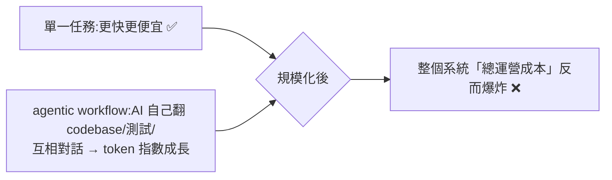

# AI 算力與 Token 經濟學:當「省錢神話」撞上天價帳單

**主題分類:** 科技 / AI 產業與算力經濟(觀點解讀)
**來源:** YouTube〈微軟瘋了?!內部緊急封殺 Claude Code…AI 省錢騙局徹底崩潰〉(獨特見解,2026-05-29,約 22 分;依繁中逐字稿整理)
**整理日期:** 2026-05-30

> ⚠️ **性質與可信度提醒:** 這是 **觀點/時事解讀** 頻道,標題聳動、部分敘述帶情緒與推測。下面 **明確區分「影片宣稱(未獨立查證)」與「可信的底層概念」**。引用具體數字/內幕請自行查證,別當定論;尤其「比特幣/杜拜避險」「微軟動機」屬作者推論。

---

## 1. 影片的宣稱(未獨立查證,當作「據稱」)

- **微軟內部限制 Claude Code:** 據稱根據內部流出文件,微軟「體驗與設備部門」上萬名工程師被要求在 **2026-06-30(財年最後一天)前** 把 Claude Code 從內部工作流移除、改回自家 **GitHub Copilot CLI**。諷刺的是 **不是因為難用**——反而工程師很愛、進度明顯變快;砍它是 **財年末削減算力開支 + 平台戰略**(用 Claude Code 等於拿錢給對手 Anthropic 輸血;用 Copilot 則 prompt/數據/消費都回流微軟自家資產池;微軟另持 OpenAI 約 27% 股份)。
- **Uber 燒穿預算:** 據稱 CTO 證實 2026 才過 4 個月就燒光 **全年 AI 預算**;約 6,500 名重度 AI 工程師,每人每月 **$500–2,000** 成本;CTO 自己做一個 2 小時 demo 就產生 **$1,200** 帳單。(此事在本 repo [[enterprise-ai-adoption-race]] 對照的 Gary Chen 內容也提過,較可信。)
- **NVIDIA 高管:** 據稱應用深度學習 VP 公開說「內部開發團隊的 **算力消耗成本已遠超員工人力薪資**」——賣算力的龍頭自己承認「養機器比養頂尖工程師還貴」。
- **Google 出便宜模型:** 據稱推出主打「**把 token 消耗砍約 45%**」的新版 Gemini Flash(降本模型),象徵戰場從「比誰更聰明」轉向「比誰更省」。

---

## 2. 可信的底層概念(這才是重點)

### 「降本增效」的悖論

- **微觀變便宜、宏觀失控:** 單點效率拉到極致,但 **規模化 + 智能體模式** 讓 token 消耗指數起飛 → 總成本創新高。
- **SaaS 訂閱制 vs Token 計費制:** 傳統 $20/席固定、好做預算;**token 計費把成本不確定性轉嫁給客戶**——同一個席位,自動補全兩行 vs 用 agent 對生產級 codebase 重構 10 小時,帳單天差地別(把財務部送進 ICU)。
- **Token Maxing(畸形企業文化):** 員工為了證明「我很努力擁抱 AI」,在後台狂跑 AI 任務刷 token 當工作量證明(據稱有人一個月跑出十幾萬美金帳單)。**「AI 在後台生成海量程式碼」≠「真的創造了商業利潤」**——前者只是燒算力,後者才是護城河(呼應 [[long-running-agents-goal-evaluation]]、[[enterprise-ai-adoption-race]])。

### 遊戲規則翻轉:從「最聰明」到「最划算」
> 模型再聰明,**月底帳單能讓財務總監當場崩潰,商業邏輯上就不成立**。2026 的核心問題從「AI 能不能完成任務(技術已驗證)」變成「**用 AI 完成這任務能不能帶來實質利潤**」。能用最低 token 穩定輸出商業價值的,才撐得過洗牌。

### 利潤漏斗:應用層在替硬體寡頭打工
- **供應鏈漏斗:** ASML(EUV 光刻機)→ TSMC(先進製程 + CoWoS 封裝)→ NVIDIA(生態壁壘算力霸權);記憶體牆另有 Samsung / SK Hynix 的 **HBM** 產能命脈。
- **關鍵洞見:** 工程師每燒一個 token,大部分錢 **沒留在軟體商手裡,而是流向台積電無塵室與 NVIDIA 財報**。只要底層定價權在寡頭手上,**短期「降算力成本」基本是偽命題;上層應用跑得越歡,越是替硬體廠打工**。
- **微軟的兩手:** 應用層打壓對手軟體(限制 Claude Code),底層卻想 **把自研 AI 晶片/算力賣給 Anthropic**——「掌控底層基礎設施的,永遠比做上層應用的更有定價權」。
- **能源:** 「星際之門」據稱砸 $1,000 億、需 **約 10 GW(1 萬兆瓦)** 電力(等同數個中型國家用電);能源成本最終轉嫁到每一次 API 計費。

### 出路:算力下放、端側 / 邊緣 AI
- 若每個 agent、每次自動化、(尤其)具身智能機器人每個動作都要連雲端按 token 付「過路費」,商業上拖不起。
- **唯一解:把高度壓縮的輕量模型部署在本地硬體、切斷對昂貴雲端算力的即時依賴。** 誰掌握端側入口、讓開發者「不燒雲端 token 就完成大部分工作」,誰在泡沫破裂後握話語權。(這也是影片詮釋微軟「逼回本地工具」的深層邏輯。)

---

## 3. 應用案例 / 對你的啟示

- **企業導入 AI 工具前先建「成本護欄」:** 設 token 預算/告警、區分「真產出 vs 刷量」、避免 agent 死循環暴衝(初創一個月不小心燒 $20 萬可能直接資金鏈斷裂)。呼應 [[zero-person-ai-company]] 的「招財務長審核節流」、[[opus-4-7-workflow-upgrades]] 的模型分工(便宜任務別燒貴模型)。
- **選模型看「單位價值」而非純 benchmark:** 同 [[opus-4-7-workflow-upgrades]] 的 model routing——web/terminal 給便宜模型、深度任務才用貴的。
- **省 token 的工程手段:** prompt caching / 穩定前綴(見 [[kv-cache]])、在 I/O 邊界壓縮工具輸出(見 [[rtk-rust-token-killer-report]]),都是直接對應這支影片喊的「token 經濟學」。
- **看產業:** 真正穩賺的是 **底層算力/封裝/HBM/雲基礎設施寡頭**(對照 [[enterprise-ai-adoption-race]] 的落地競賽與 [[karpathy-software-3-0]] 的 agentic engineering 效率放大)。

> **一句總結(去除聳動後的核心):** 2026 的 AI 競爭已從「比智商」轉向「比經濟效率」;能把每分算力鎖進自家生態、或用最少 token 產出穩定商業價值的玩家才活得下來,而上層應用在現有供應鏈下很大程度是在替硬體寡頭打工。

---

## 來源

- [YouTube:微軟瘋了?!內部緊急封殺 Claude Code(獨特見解)](https://youtu.be/FmzFqM-kf0A)(觀點解讀,含未證實宣稱)
