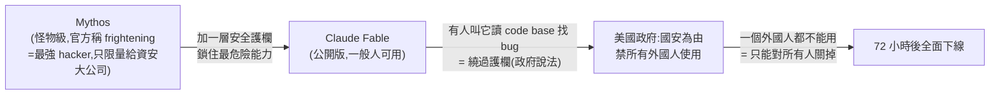

# 史上最強 AI 模型只活了 72 小時:Claude Fable 事件與「別把流程綁死在單一模型」

> 整理自 YouTube「Gary Chen」〈Claude Fable 5 使用心得,上線 72 小時就被政府緊急停用?〉(2026-06-18,約 14.8 分鐘)。影片講一起罕見事件:Anthropic 於 2026-06-09 發布 **Claude Fable**,三天後(06-12 週五下午)美國政府以**國家安全**為由禁止所有外國人使用,Anthropic 為合規幾乎整個關掉——**史上第一次商用 AI 模型因政府一道命令被迫下線**。除了事件始末,更重要的是三個「用超強模型的技巧」與一個給所有 AI 使用者的功課。
>
> ⚠️ 內含模型名稱與 benchmark 數字均為**影片(2026-06)所述**,依作者說法整理。

---

## 一句話總結

**再強的工具,你都不能「只有它」。** Fable 強到能一天做完團隊估兩個月的工程,卻可能因為太貴用不起、或政府一道命令一夜被拿走——而且完全不是因為你做錯什麼。**別讓你的工作流死在任何單一模型身上,手邊永遠留好能隨時替換的方案。**

---

## 1. Fable 是什麼、有多強、多偏科

- **身世**:Fable 骨子裡就是 **Mythos**——Anthropic 訓練的怪物級模型,官方文件直接用 **frightening(令人害怕)** 形容,因為它**太會找程式漏洞**(等於全世界最強 hacker),原本只限量開放給少數資安防禦大公司關起來用。Fable = **Mythos 加一層安全護欄、鎖住最危險能力**做成的公開版。
- **有多強**:
  - **Stripe** 拿它做一個 **5000 萬行程式碼**的系統遷移,團隊估兩個月,**Fable 一天做完**。
  - 丟 5 張 Apple 健身 App 截圖、不給程式碼,**7 分鐘**出一個能跑的 App;一個指令做出可玩的遊戲。
  - **SWE-bench Pro 80.3%**,而 GPT 5.5 是 58.6%(碾壓級差距)。
- **但很偏科**:在 **Automation Bench**(模擬真實商業流程、完全放手、跨多工具、無人盯)只有 **17% 成功率**——但那是**全場最高分**(所有模型都很慘)。意思是它**還沒辦法自己一個人從頭到尾把複雜的事漂亮獨立完成,你還是得在旁邊把關**。
- **而且貴**:很多任務效果只好一點點,成本卻是 Gemini 3.5 Flash 的好幾倍;Automation Bench 第二名 Gemini 3.5 Flash 只差 3 分、價格卻只要 1/4,某些真實工具/金融測驗 Fable 甚至直接輸。**拿 Fable 做雞毛蒜皮的小事,像請外科醫生幫你剪指甲。** 最猛 ≠ 每件事都該用它。

---

## 2. 用「能力大跳躍模型」的三個技巧(最實用的部分)

1. **把為舊模型寫的補丁指令通通拿掉,直接給目標**。以前會寫一大串細指示(第一步做什麼、這裡注意、那裡別踩雷),像手把手教實習生;**Fable 你越寫細節它反而越綁手綁腳**。只要把「我要的結果長什麼樣」講清楚,剩下判斷它自己做、常做得比你想的更好。**那些辛苦累積的補丁,現在反而是包袱。**
2. **先跟它一起把任務定義清楚,再動手**。不要一上來就叫它執行;先餵 context、來回討論,把「這件事到底要做成什麼樣」想透,確認方向才放它做。**一個任務最貴、最容易出錯的環節不是執行,是搞清楚到底要做什麼。**
3. **別什麼都開最高檔,把它當指揮官用**。大部分任務開中等就綽綽有餘、又快又省;真正聰明的用法是**讓 Fable 當發號施令的指揮官**(規劃、拆解任務),瑣碎雜活丟給便宜模型做——**既拿到它最值錢的判斷力,又不會每件小事都燒大錢**。

> 作者三天實測最有感的是**視覺編排能力**(用 Remotion/Hyperframe 做影片,以前排版跑掉、元素打架、間距怪、動畫卡,Fable 幾乎一次到位不用修)。他一天燒掉一週 70% 額度仍覺得划算——**因為真正最貴的成本,是你花了 token、花了時間,做出來還是不滿意得重來;Fable 常一次到位,省掉大量來回。** 但它不是丟著不管就自動辦好的機器人,而是**能力爆表的夥伴,你才是給方向、做決定的人**。

---

## 3. 為什麼被下架:鎖匠悖論與三種猜測

政府動用國家安全權力,**禁止所有外國國民使用 Fable 與 Mythos**(連 Anthropic 外籍員工都不准)。Anthropic 是全球生意,員工/客戶/雲端到處是外國人,要做到「一個外國人都不能用」,唯一辦法就是**對所有人關掉**——表面限制外國人,實際把整個模型從全世界拔走。

**鎖匠悖論**:世界最強的鎖匠因為太懂鎖的結構,同時是最強的開鎖高手——**會修鎖=會開鎖,同一個能力**。AI 與程式碼一樣:強到能讀懂、找出並修好 bug,反過來**找出漏洞(=資安破口)的能力也頂尖**。Mythos 曾在被全世界工程師盯了十幾年的開源程式庫裡,挖出**藏了 16 年沒人發現的漏洞**。政府說有人找到繞過護欄的方法——**其實就是叫 Fable 讀一個 code base、把問題找出來修一修**(普通到全世界工程師每天在做)。護欄最尷尬處:**它根本分不出你是想修好自己的程式、還是想挖別人的漏洞,因為這是同一個動作**。政府的緊張點:一個強到能輕鬆挖漏洞的模型成了幾億人的公開工具、每月 20 美金就能用,等於**把高階網路攻擊武器發到每個人手上**。

**Anthropic 公開反駁**:①政府證據只是口頭、沒公開技術依據;②漏洞範圍很窄,而「讀程式找 bug」是每個 coding 模型都會做的(點名 OpenAI 的 GPT 也做得到),是全世界資安人員每天的工作,不是 Fable 獨有。為這麼薄弱又普遍的理由拔掉幾億人用的商用模型並不合理。但命令就是命令,收到當下就關、同時表示不同意、積極爭取重新上線並退款。

**三種主流猜測**:

| 猜測 | 論點 | 作者判斷 |
|---|---|---|
| **① 資安問題**(官方說法) | 找漏洞能力真的可怕 | 有道理,但處理太粗糙、證據薄、範圍窄、週五下午說拔就拔 → 很多人不信是全部真相 |
| **② Anthropic 算力不夠** | Fable 又貴又吃資源,塞幾億人燒不起;之前光 Opus 就常算力不足降智。政府命令給了「體面台階」先收回,不用承認算力吃緊 | 算力吃緊大概率是真的 |
| **③ 純行銷** | 沒有比「強到被美國政府查禁」更好的廣告;Fable 從模型變傳說,重新上線大家更瘋想用 | — |

> 作者結論:**這幾件事可以同時成立**——一個又貴、又敏感、又是政治焦點的模型被收回,背後本來就不會只有一個原因。

---

## 應用案例 / 怎麼用這個事件的教訓

- **別把流程綁死在單一模型上**:這是全片最大的功課。你最強的工具可能因為太貴用不起、或政府/廠商一道決定一夜被拿走,**完全不是你做錯什麼**。手邊永遠留好可隨時替換的方案(不同廠商、不同價位、甚至開源)。作者認為這反而是**開源模型的機會**——與其把命脈交給一家公司隨時可能被收回的模型,不如留一個**自己完全掌控、誰都拿不走**的選項。
- **升級到新一代強模型時,先「減法」**:把為舊模型寫的細節補丁指令拿掉、改成直接給目標;強模型越被細節綁越綁手綁腳。呼應本庫 [[bitter-lesson-cut-old-patterns]](模型變強後舊 prompt 會拖垮新模型)。
- **把最強(最貴)的模型當指揮官,雜活外包便宜模型**:拿它最值錢的判斷力去規劃拆解,執行瑣碎任務丟便宜快的——這正是 [[mixture-of-agents-moa]]/[[cross-model-review-claude-codex-harness]] 的「分工」思路在成本面的應用。
- **先定義任務再執行**:最貴的環節是「搞清楚要做什麼」,不是執行;先來回討論想透方向再放手。呼應 [[loop-engineering-when-and-how-gary-chen]](先把 Verifiable Goal 定清楚)。
- **雙用能力 = 監管張力**:能修 bug 就能找漏洞,這種「同一能力兩種用途」會讓前沿模型持續踩在監管紅線上——理解這點,對判斷 AI 產業與政策走向有幫助。對照 [[rsi-recursive-self-improvement-anthropic]]、[[safety-evaluation-crisis]]。

> 延伸對照:[[nvidia-n1x-vs-x86]]、[[ai-compute-token-economics]](算力/成本經濟)、[[bitter-lesson-cut-old-patterns]](別被舊 prompt 綁住)、[[rsi-recursive-self-improvement-anthropic]](前沿模型的安全張力)。

---

## 來源

- Gary Chen(@garytalksstuff),〈Claude Fable 5 使用心得,上線 72 小時就被政府緊急停用?〉,YouTube:<https://youtu.be/L5LLzXrKFIY>(2026-06-18,約 14.8 分鐘)
- 本文依該片**官方 zh-TW 字幕**整理。事件與數字(Claude Fable / Mythos、發布與下架時間、SWE-bench Pro 80.3% vs GPT 5.5 58.6%、Automation Bench 17%、Stripe 5000 萬行一天、Gemini 3.5 Flash 對比、每月 20 美金)均為影片所述,實際以官方公告為準。
