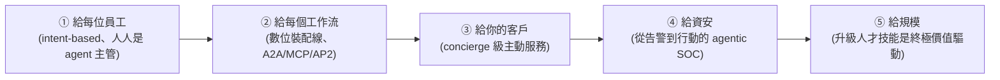

# Google Cloud:AI Agent 趨勢 2026(五大轉變)

**主題分類:** 科技 / AI 產業趨勢報告
**來源:** Google Cloud《AI agent trends 2026 — Five shifts that will redefine roles, workflows, and business value》(官方互動式報告,49 頁;數據主要引自 Google Cloud《The ROI of AI 2025》全球 3,466 位企業決策者調查 + Google Cloud/DeepMind 內部訪談)
**整理日期:** 2026-05-30

> 📌 這是 **Google Cloud 的官方趨勢報告**,自然會帶自家產品(Gemini Enterprise、ADK、A2A/MCP/AP2、Security Operations)的行銷視角;但其框架與客戶數據對「企業導入 agent」很有參考價值。客戶成效數字為廠商引用,請當「案例」看。

---

## 0. 核心命題:從 add-on 到 AI-first

> Agentic AI = AI 從「回答問題」進化到「**理解目標 → 制定計畫 → 跨應用採取行動**」(在人類大量引導與監督下)。這不是加個工具,而是 **工作流與企業文化的根本轉變**。

**數據:** 52% 使用生成式 AI 的企業 **已有 agent 在生產環境**;用途分布——客服 49%、行銷/資安維運 46%、技術支援 45%、產品創新/生產力研究 43%;**88% 的 agentic 早期採用者** 已在至少一個用例看到正 ROI。

---

## 1. 趨勢一:Agents for every employee(給每位員工)

- **意圖式運算(intent-based computing):** 從「指令式」(自己分析試算表/寫程式)轉為 **「說出想要的結果,電腦用 LLM+agent 決定怎麼做」**。
- **每位員工都變成「agent 的人類主管」**,核心職責四件事:**委派**(挑出適合交給 agent 的任務)、**設目標**(明確定義產出)、**訂策略**(用人類判斷做 AI 做不了的細膩決策)、**驗品質**(當最後的品質/語氣把關)。
- **Grounding(接地):** 把 AI 回應 **錨定在企業自己的「ground truth」(內部系統/知識庫/客戶資料/過往工作)**——這才是差異化關鍵,不是模型本身。

**應用案例:**
- **「10x 行銷經理」** 指揮 5 個專職 agent:**Data**(從海量結構/非結構資料找市場型態)、**Analyst**(24/7 監看競品/輿情,每早送一頁洞察)、**Content**(依週主題用品牌語氣草擬貼文/部落格)、**Creative**(依策略生成配圖/影片)、**Reporting**(每週五拉活動數據出一頁摘要)。
- **Suzano**(全球最大紙漿廠):Gemini Pro 把自然語言轉 SQL 查 BigQuery 上的 SAP 物料資料,**5 萬名員工查詢時間減少 95%**。
- **TELUS:** 5.7 萬名員工常用 AI,**每次互動省約 40 分鐘**。

---

## 2. 趨勢二:Agents for every workflow(給每個工作流)

> **Agentic system = 數位裝配線**——人類引導、多步驟、編排多個 agent 端到端跑完一個業務流程。

**三個關鍵開放協定(對照 [[function-calling-mcp-a2a]]):**
- **A2A(Agent2Agent):** 讓 **不同開發者/框架/組織** 的 agent 互通協作(跨組織邊界的編排)。
- **MCP(Model Context Protocol):** 解決 LLM 兩大限制(知識凍結在訓練時、無法與真實世界互動)——標準化雙向連到資料源/工具(Cloud SQL、Spanner、BigQuery)。
- **AP2(Agent Payments Protocol):** 解決「**非人類(agent)在人類預授權下做最後交易決定**」的支付難題(如何證明授權、商家如何確認非幻覺、出錯誰負責)。

**應用案例:**
- **AP2 電商:** 「等這件外套出黑色再買,但價格超過 $100 就別買」→ agent 監看價格/庫存,在預授權下一出現就安全下單,抓住原本會流失的高意圖訂單(PayPal 採用 AP2)。
- **Salesforce** 用 A2A 跨平台協作;**Elanco** 用 Gemini 自動整理每廠 2,500+ 份非結構政策文件,降低過時/衝突資訊(大廠可能造成 130 萬美元生產力損失)。
- 願景:金融業多步驟 **agentic 合規系統**(監看法規變化→找出受影響政策→更新流程→產生完整稽核鏈)。

---

## 3. 趨勢三:Agents for your customers(concierge 級體驗)

- 過去十年客服自動化 = 預編腳本 chatbot 答簡單問題;2026 = **concierge 級 agent**(記住偏好與過往對話、grounded 在 CRM/物流資料 → 真正一對一)。
- **客戶不必再報訂單號/重講問題**:「Elizaveta 你好,看到你上週買的藍毛衣剛送達,要退貨還是換貨?」
- **主動式服務(不等客訴):** 物流 agent 3PM 標記「配送失敗」→ 查到貨車故障 → 重排明早時段 → 帳務系統補 $10 抵用 → 簡訊通知客戶;複雜/情緒化的案子做 **「smart handoff」附完整摘要轉真人**。
- **語音回歸:** 1–3 年內客服從「按腳本選單、狂喊 operator」回到 **自然口語對話**。

**應用案例:** Home Depot「**Magic Apron**」(24/7 居家裝修指導);**Danfoss** 用 AI agent 自動化 email 訂單,**80% 交易決策自動化、回應時間 42 小時→近即時、5 系統整併成 1**。

---

## 4. 趨勢四:Agents for security(從告警到行動)

- **告警疲勞:** 82% 分析師擔心因告警/資料量太大而 **漏掉真實威脅**;「攻擊者只要對一次,防守方要每次都對」。傳統 SOAR 只是漸進式自動化;AI agent 能 **推理→行動→觀察→調整**。
- **半自動 agentic SOC 循環:** 偵測(AI)→ 分流調查 → 威脅獵捕 → 惡意程式分析 → 回應;**升級(escalation)由人類管理**;靠 A2A/MCP 共用安全資料與 context。
- **人類分析師升級** 為:威脅獵捕(用直覺引導 agent)、監督 agent(調校交戰規則、考核自動回應)、長期防禦架構。
- **CodeMender(DeepMind):** 自動改善程式安全、已能 **找出實測軟體的新零日漏洞**;搭配 **SAIF 2.0** 應對自主 agent 的新風險。

**應用案例:** **Torq「Socrates」** AI SOC 分析師協調專職 agent:**Tier-1 任務 90% 自動修復、手動任務減 95%、回應快 10 倍**;Specular 用 Gemini 2.5 Pro 自動化攻擊面管理與滲透測試。

> ⚠️ 報告也提醒:AI 基礎設施(模型/資料/agent)**大幅擴大企業攻擊面**;資安人員必須「**同時精通 AI 與資安**」(對照 [[safety-evaluation-crisis]])。

---

## 5. 趨勢五:Agents for scale(升級人才技能才是終極價值)

- **別只看技術(模型/平台/prompt),最關鍵是「人」。** 技能半衰期已縮到 **4 年(科技業僅 2 年)**;新角色「**agent orchestrator / Chief of Staff for AI**」市場上 **還不存在** → 技能斷層。
- **AI 學習的五大支柱:**
  1. **訂目標**(可衡量,如「100% AI 工具採用率」)。
  2. **取得高層支持**(三角色:executive sponsor 出錢背書、groundswell lead 當「AI 大聲公」收集草根點子、AI accelerator 技術落地)。
  3. **維持動能並獎勵創新**(遊戲化點子交換 + 排行榜、每週高層信、季度頒獎)。
  4. **把 AI 融入日常工作流**(內部 hackathon、Field Days 實戰演練)。
  5. **用可信框架備好風險**(SAIF、訓練員工「哪些資料能/不能餵 AI」、辨識 AI 社交工程)。
- **數據:** 84% 決策者希望組織更聚焦 AI;已導入 AI 的組織中 61% 員工每天用 AI(其餘每週至少一次);TELUS 訓練後 96% 員工更有信心用 AI。

---

## 6. 一句話總結與啟示

> **2026 的機會看似技術、本質是「人」:** 把團隊從低價值重複工作解放出來,專注只有人能做的創造、策略與同理。員工角色轉為 **策略編排者**,企業靠 **數位裝配線 + concierge 客服 + agentic 資安 + 全員升級** 把價值規模化。**今天就動手實驗的公司,不只是在建工具,而是在累積「管理/治理/擴展 agent」的內部專業。**

- 與本 repo 呼應:三協定見 [[function-calling-mcp-a2a]];企業落地與責任邊界見 [[enterprise-ai-adoption-race]];「人是 agent 主管、調度力」見 [[three-valuable-ai-skills]]、[[multi-tool-ai-workflow]];資安評測風險見 [[safety-evaluation-crisis]]。

---

## 來源

- [Google Cloud:AI agent trends 2026(官方報告 PDF)](https://services.google.com/fh/files/misc/google_cloud_ai_agent_trends_2026_report.pdf)
- 數據:Google Cloud《The ROI of AI 2025》(n=3,466 企業決策者);Forrester / Google-Ipsos 等調查
